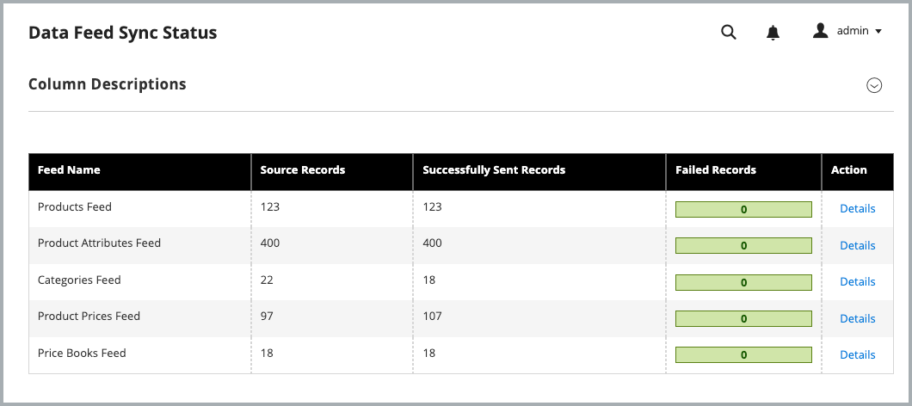

# Overview

The Adobe Commerce Connector is the integration bridge that synchronizes catalog and pricing data between an existing Adobe Commerce Cloud on cloud or on-premises deployment and Adobe Commerce Optimizer composable catalog data model. This enables features such as dynamic AI search, recommendations, fast-loading headless storefronts, including Adobe Commerce storefronts on Edge Delivery Services, and real-time performance analytics.

## Architecture and experience

The Adobe Commerce Connector operates by mapping Commerce's `website/store/storeview` catalog hierarchy to Adobe Commerce Optimizer `channel/policy/source` data model.

Instead of configuring and managing Commerce Services (Live Search and Product Recommendations) from the Commerce Admin, you use [Adobe Commerce Optimizer Merchandising tools](../optimizer/merchandising/overview.md) to manage product discovery (Live Search) and recommendations (Product Recommendations) rule configuration.  The Adobe Commerce instance becomes the data-origin for catalog and price data. When the data is updated in Commerce, the updates are synced to the Adobe Commerce Optimizer instance.

## Workflows

The Connector enables several key workflows:

* Export Commerce catalog data to Adobe Commerce Optimizer—price and price book data is exported at the `website` level. Product and product attribute data is exported at the `store view` level. By default, catalog data sync is enabled for all Commerce scopes (websites and store views).

  To enable this workflow, use Composer to install the `adobe-commerce/commerce-data-export-aco-adapter` PHP extension, and then provide the IMS credentials to authenticate the connection between the Commerce project.

* Map the Commerce `website/store/storeview` data to export to Adobe Commerce Optimizer

  You have the option to customize the Adobe Commerce Optimizer exporter settings to export data only for specific scopes by updating the exporter configuration from the Store grid in Admin (**[!UICONTROL Stores]** -> [!UICONTROL Settings] -> **[!UICONTROL All Stores]**).

  * At the `website` level, disabling the exporter setting stops the export of prices and price book data to Adobe Commerce Optimizer.

  * At the `storeview` level, disabling the exporter setting stops the export of products and product attributes to Adobe Commerce Optimizer.

  When the configuration is changed, the corresponding indexes are invalidated to trigger re-export of the affected entities.

* Merchandising rule configuration and management

  When the Connector is enabled, merchandising rules for product discovery and recommendations are defined and managed from Adobe Commerce Optimizer UI, not from the [!UICONTROL Live Search] and [!UICONTROL Product Recommendations] pages in the Commerce Admin.

## Requirements to use the integration

* Adobe Commerce 2.4.5+

  * PHP 8.1, 8.2, 8.3, or 8.4
  * Composer 2.x

* Adobe Commerce Optimizer license with a provisioned sandbox instance.

* Access to [repo.magento.com](https://repo.magento.com) to download the Commerce Connector metapackage using Composer.

* Admin access to an [Adobe Commerce Optimizer sandbox instance](https://experienceleague.adobe.com/en/docs/commerce-learn/tutorials/adobe-commerce-optimizer/create-first-instance).


The Adobe Commerce user configuring the integration must have:

  * Administrator access to the Adobe Commerce Admin.

  * [Command line access to the Adobe Commerce application server](https://experienceleague.adobe.com/en/docs/commerce-on-cloud/user-guide/project/user-access).

  * Developer access to the [IMS Organization](https://experienceleague.adobe.com/en/docs/core-services/interface/administration/organizations?) where the Adobe Commerce Optimizer project is provisioned.

## Get started

1. Set up an Adobe Commerce Developer project from the [Adobe Developer Console](https://developer.adobe.com/console)


## Set up an Adobe Commerce Developer project

>[!NOTE]
>
>If you already have an Adobe Commerce Optimizer Developer project, you can get the required  IMS credentials required to connect your Adobe Commerce project to your Adobe Commerce Optimizer instance.

## Install the Commerce Connector package

The Adobe Commerce Connector Composer metapackage is available to all Commerce merchants with an active license for Adobe Commerce Optimizer.

### Installation steps

1. Add the `adobe-commerce/commerce-data-export-aco-adapter` module using Composer:

  ```shell
   composer require adobe-commerce/commerce-data-export-aco-adapter
  ```

1. Deploy the changes to your Adobe Commerce staging environment.

  After your changes are deployed, the Commerce Optimizer Optimizer option is available in the Commerce Admin menu.


>[!NOTE]
>
>For detailed extension installation instructions, see the following guides:
>
>[Install extension on Adobe Commerce on Cloud Infrastructure](https://experienceleague.adobe.com/en/docs/commerce-on-cloud/user-guide/configure-store/extensions)
>
>[Install extension Adobe Commerce on-premises](https://experienceleague.adobe.com/en/docs/commerce-operations/installation-guide/tutorials/extensions)


### Get required values for configuring the Commerce Optimizer connection

#### Get API credentials

Create a new developer project in Adobe Developer console to get API credentials to configure the integration between Commerce and Commerce Optimizer instances. For instructions, see [Create an App Builder project](https://developer.adobe.com/commerce/extensibility/events/project-setup/) in the developer documentation.

After you create the project, save the following values to configure the Commerce Optimizer integration:

* Organization ID (`org_id`)

* OAUTH Server-to-Server `client_id` and `client_secret` credentials

#### Get Adobe Commerce Optimizer instance details

You need the following values from your Adobe Commerce Optimizer instance details.

* **Instance ID—**The unique identifier for your Adobe Commerce Optimizer instance. Also known as the tenant ID.

  You can find the instance ID in the URL to access your Adobe Commerce Optimizer instance. For example, in the URL `https://na1-sandbox.admin.commerce.adobe.com/1234567890abcdef`, the instance ID is `1234567890abcdef`.

* **Region—**The region where your Adobe Commerce Optimizer sandbox instance is hosted. For example, `na1` for North America. The region is also included in the URL to access your Adobe Commerce Optimizer instance. For example, in the URL `https://na1-sandbox.admin.commerce.adobe.com/1234567890abcdef`, the region is `na1`.

## Configure the Adobe Commerce Optimizer integration

Using the API credentials and instance details you gathered in the previous steps, you can now configure the integration between your Commerce and Adobe Commerce Optimizer instances.

1. From the Commerce Admin, select **[!UICONTROL Adobe Commerce Optimizer]** to display the configuration page with instructions.

   

1. From the command line, [use SSH](https://experienceleague.adobe.com/en/docs/commerce-on-cloud/user-guide/develop/secure-connections) to connect to the Commerce staging environment.

1. Run the following Commerce CLI command to configure the integration, replacing the placeholder values with the values for your Commerce Optimizer project:

  ```terminal
  bin/magento aco:config:init --org_id=<<your_org_id>> --tenant_id=<<your_tenant_id>> --client_id=<<your_client_id>> --client_secret=<<your_client_secret>> --region=<<na1>> --type=sandbox
  ```

1. Verify the connection by returning to the Commerce Admin and selecting the [!UICONTROL Adobe Commerce Optimizer] option.

   When you click the option, it opens the Adobe Commerce Optimizer UI in a new tab.

## Verify that the data sync is working

You can check the data sync from both the Commerce Admin and Commerce Optimizer.

* The **[Data Feed Sync Status page](https://experienceleague.adobe.com/en/docs/commerce-admin/systems/data-transfer/data-sync/data-feed-sync-status.md)** shows the progress of the catalog data synchronization from Commerce to Adobe Commerce Optimizer.

* The **[[!UICONTROL Data Sync] page](https://experienceleague.adobe.com/en/docs/commerce/optimizer/setup/data-sync)** in Adobe Commerce Optimizer shows the catalog data transferred from your Commerce instance.

1. Verify that catalog data is flowing from Commerce to Commerce Optimizer:

   From the Commerce Admin, open the [!UICONTROL Data Feed Sync Status] page by selecting [!UICONTROL System]** > [!UICONTROL Data Transfer] > **[!UICONTROL Data Feed Sync Status]**.

    

    If the data sync has started, the feed data shows successfully sent records. You can also view and troubleshoot sync issues by viewing the details for each feed.

1. Verify that Adobe Commerce Optimizer is receiving the catalog data:

   From the Commerce Optimizer menu, select **[!UICONTROL Data Sync]** to open the Data Sync page.

   


   When the initial sync is complete, the status displays as **Healthy**.

### Troubleshooting

If the data sync has not started, ensure that the catalog indexes are valid. If the indexes are invalid, run the following command from the Commerce CLI to reindex the catalog data:

```terminal
bin/magento indexer:reindex" catalog indexer re-index CLI command to start PaaS to ACO catalog data synchronization.
```

After the reindexing is complete, return to the Data Feed Sync Status page to verify that the data sync has started.