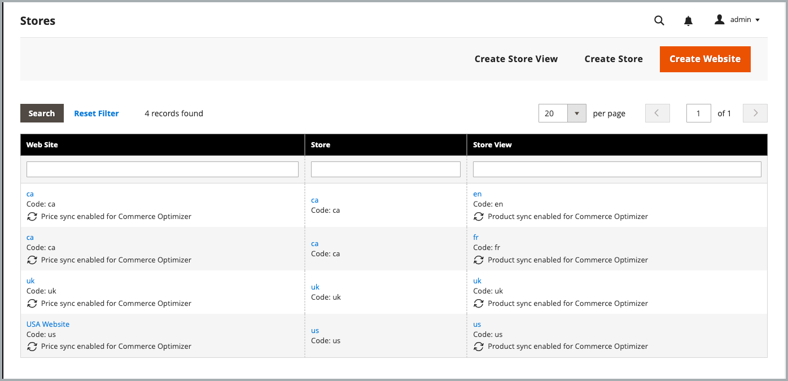
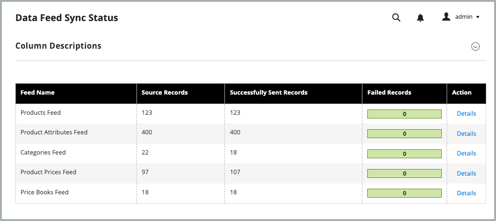

# Get started

Install and configure the Commerce Optimizer Connector to sync your Adobe Commerce catalog data with [!DNL Adobe Commerce Optimizer], then monitor the data sync status to ensure your storefront is up to date.

## Requirements to use the integration

* Adobe Commerce 2.4.7+

  * PHP 8.2, 8.3, or 8.4
  * Composer 2.x

* [!DNL Adobe Commerce Optimizer] license with a provisioned sandbox instance.

* [Authentication keys](https://experienceleague.adobe.com/en/docs/commerce-operations/installation-guide/prerequisites/authentication-keys) to download the Commerce Connector metapackage using Composer.

* Admin access to an [Adobe Commerce Optimizer sandbox instance](../optimizer/get-started.md).

The Adobe Commerce user configuring the integration must have:

* Administrator access to the Adobe Commerce Admin.

* [Command line access to the Adobe Commerce application server](https://experienceleague.adobe.com/en/docs/commerce-on-cloud/user-guide/project/user-access).

* Developer access to the [IMS Organization](https://experienceleague.adobe.com/en/docs/core-services/interface/administration/organizations?) where the [!DNL Adobe Commerce Optimizer] project is provisioned.

>[!BEGINSHADEBOX]

## Prerequisites

If you have any of the following extensions installed, uninstall them before installing the Commerce Optimizer Connector:

* Adobe Commerce Live Search (`magento/live-search`)
* Adobe Commerce Product Recommendations (`magento/product-recommendations`)
* Adobe Commerce Catalog Service (`magento/catalog-service`, `magento/catalog-service-installer`)
* Data Management Dashboard (`magento-catalog-sync-admin`)

Data associated with these extensions is still available in the Commerce database. However, it is not exported to [!DNL Adobe Commerce Optimizer] when the Connector is enabled. To implement the search and merchandising capabilities provided by these extensions after enabling the Connector, configure them from the [[!DNL Adobe Commerce Optimizer] Admin UI](https://experienceleague.adobe.com/en/docs/commerce/optimizer/overview#quick-tour).

>[!IMPORTANT]
>
>If these extensions are not removed before enabling the Connector, you may see broken configuration screens, duplicate data in [!DNL Adobe Commerce Optimizer] because the same data is exported from both the Connector and the existing extensions, and 401 or 403 errors in the logs due to conflicts in the way the extensions and the Connector authenticate with the connected services.

>[!ENDSHADEBOX]

## Configuration steps

Follow these steps to enable the connector and begin synchronizing data from Commerce to your Adobe Commerce Optimizer instance.

1. **[Install the Commerce Optimizer Connector package](#install-the-commerce-connector-package)** using Composer to connect your Commerce instance to [!DNL Adobe Commerce Optimizer].

1. **[Review and customize the data export configuration](#customize-commerce-data-export-configuration)** from the Admin.

1. **[Get API credentials required to establish the connection between Commerce and Commerce Optimizer](#get-required-values-for-configuring-the-commerce-optimizer-connection)**.

1. **[Enable the [!DNL Adobe Commerce Optimizer] integration](#enable-the-adobe-commerce-optimizer-integration)**.

1. **[Verify that the data sync is working](#verify-that-the-data-sync-is-working)**.


## Install the Commerce Optimizer Connector package

The Adobe Commerce Optimizer Connector is delivered as a Composer metapackage available to all Commerce merchants with an active license for [!DNL Adobe Commerce Optimizer].

### Installation steps

1. Add the `adobe-commerce/commerce-data-export-aco-adapter` module using Composer:

   ```shell
   composer require adobe-commerce/commerce-data-export-aco-adapter
   ```

1. Deploy the changes to your Adobe Commerce staging environment.

  After deployment completes, the Commerce Optimizer option is available from the Commerce Admin menu. Click **[!UICONTROL Commerce Optimizer]** to open your Commerce Optimizer instance directly from the Commerce Admin.

>[!NOTE]
>
>For detailed extension installation instructions, see the following guides:
>
>[Install extension on Adobe Commerce on Cloud Infrastructure](https://experienceleague.adobe.com/en/docs/commerce-on-cloud/user-guide/configure-store/extensions)
>
>[Install extension on Adobe Commerce on-premises](https://experienceleague.adobe.com/en/docs/commerce-operations/installation-guide/tutorials/extensions)

### Get required connection details

From the Adobe Developer Console, create a developer project enabled for the [!DNL Adobe Commerce Optimizer] Ingestion service and generate OAuth Server-to-Server credentials. For detailed instructions, see [Obtain IMS Credentials](https://developer.adobe.com/commerce/services/optimizer/data-ingestion/authentication/#obtain-ims-credentials) in the *Merchandising Developer Guide*.

>[!TIP]
>
>If you already have a developer project configured with the Data Ingestion API in the same IMS organization as your Commerce Optimizer instance, you can reuse the existing OAuth Server-to-Server credentials.

Save the following values from the credentials page:

* **Organization ID** (`org_id`)
* **Client ID** (`client_id`)
* **Client secret** (`client_secret`)

### Get [!DNL Adobe Commerce Optimizer] instance details

Save the instance ID (also called the tenant ID) from your [!DNL Adobe Commerce Optimizer] instance. You can find it in the URL used to access the instance. For example, in `https://experience.adobe.com/#/@<project-id>/in:TToyu73daQRn66KAYaq8YZ/commerce-optimizer-studio/home`, the instance ID is `TToyu73daQRn66KAYaq8YZ`.

## Customize the Commerce data export configuration

By default, catalog data sync is enabled for all Commerce scopes (websites and store views). You can customize the export settings to sync data only for specific scopes based on your business needs. For example, if you have multiple store views but only want to export data for one of them, you can disable the exporter for the other store views.

>[!IMPORTANT]
>
>Changing export settings triggers a full re-indexation, which can take significant time depending on your catalog size. Plan these changes during low-traffic periods to minimize performance impact.

### Data export by scope

The following table describes what data is exported at each scope level:

| Scope | Data exported | Notes |
| ------- | --------------- | ------- |
| Website | Prices and price books | Each set of prices is exported as a [price book](../optimizer/setup/pricebooks.md) using the naming convention `website::customergroupcode`. All customer groups for the website are included. |
| Store view | Products and product attributes | Each store view creates a separate catalog source in [!DNL Adobe Commerce Optimizer]. |

### Enable and disable behavior

| Action | Result |
| -------- | -------- |
| Disable a store view | The catalog source remains in [!DNL Adobe Commerce Optimizer], but all data is removed. |
| Disable then re-enable a store view | The same catalog source is repopulated with a full data resynchronization. |

### Update the export configuration

After you install the Connector package, the Store grid in the Admin now shows the export configuration settings for Commerce Optimizer.

{width="600" zoomable="yes"}

**To change the settings for a website or store view:**

1. In the Commerce Admin, navigate to **[!UICONTROL Stores]** > [!UICONTROL Settings] > **[!UICONTROL All Stores]**.

1. Select the website or store view you want to configure.

1. In the **[!DNL Adobe Commerce Optimizer] exporter settings**, use the checkbox to enable or disable the data sync as needed.

   {width="500" zoomable="yes"}

1. Save your changes.

## Enable the [!DNL Adobe Commerce Optimizer] integration

>[!IMPORTANT]
>
>Data sync processing starts as soon as you run the configuration command. By default, catalog data sync is enabled for all Commerce scopes (websites and store views). Depending on the size of your catalog, the data sync process can take from a few minutes to several hours.

Using the API credentials and instance details you gathered in the previous steps, you can now configure the integration between your Commerce and [!DNL Adobe Commerce Optimizer] instances.

1. From the Commerce Admin, select **[!UICONTROL Adobe Commerce Optimizer]** to display the configuration page with instructions.

   ![[!DNL Adobe Commerce Optimizer] configuration page](/help/aco-connector/assets/aco-connector-admin-installation.png){width="500" zoomable="yes"}

1. From the command line, [use SSH](https://experienceleague.adobe.com/en/docs/commerce-on-cloud/user-guide/develop/secure-connections) to connect to the Commerce staging environment.

1. Run the following Commerce CLI command to configure the integration, replacing the placeholder values with the values for your Commerce Optimizer project:

  ```terminal
  bin/magento aco:config:init --org_id=your-org --tenant_id=your-tenant --client_id=your-client-id --client_secret=your-secret
  ```

1. Verify the connection by returning to the Commerce Admin and selecting the [!UICONTROL Adobe Commerce Optimizer] option.

   When you click the option, it opens the [!DNL Adobe Commerce Optimizer] UI in a new tab.

## Verify that the data sync is working

After you enable the integration, data sync begins automatically. Depending on catalog size, the initial sync can take from a few minutes to several hours.
You can monitor and verify that the sync is working from the [Data Feed Sync Status](https://experienceleague.adobe.com/en/docs/commerce-admin/systems/data-transfer/data-sync/data-feed-sync-status) dashboard available in the Admin. 

1. **Check sync status in the Commerce Admin:**

   Go to **[!UICONTROL System]** > [!UICONTROL Data Transfer] > **[!UICONTROL Data Feed Sync Status]**.

   {width="500" zoomable="yes"}

   When the sync is running, the feed data shows successfully sent records. Select a feed to view details or troubleshoot sync issues.

1. **Confirm data arrived in Commerce Optimizer:**

   From the [!DNL Adobe Commerce Optimizer] menu, select **[!UICONTROL Data Sync]**.

   {width="500" zoomable="yes"}

   Verify that the expected products, prices, and attributes appear.

>[!TIP]
>
>If you have any issues with the data sync, see the [Troubleshooting](/help/data-export/troubleshooting-logging.md) section in the *SaaS Data Export* documentation.

## Next Steps

1. **[Configure [!DNL Adobe Commerce Optimizer] catalog views and policies](#configure-adobe-commerce-optimizer-stores)**

   Create catalog views and policies in the [!DNL Adobe Commerce Optimizer] Guide. Note that price books are created automatically from Adobe Commerce customer groups.

1. **[Set up a Commerce Storefront on Edge Delivery Services](#set-up-a-commerce-storefront-on-edge-delivery-services)**

   Follow the [Storefront setup documentation](https://experienceleague.adobe.com/developer/commerce/storefront/setup/) to connect your storefront to the [!DNL Adobe Commerce Optimizer] instance and start delivering personalized commerce experiences.


