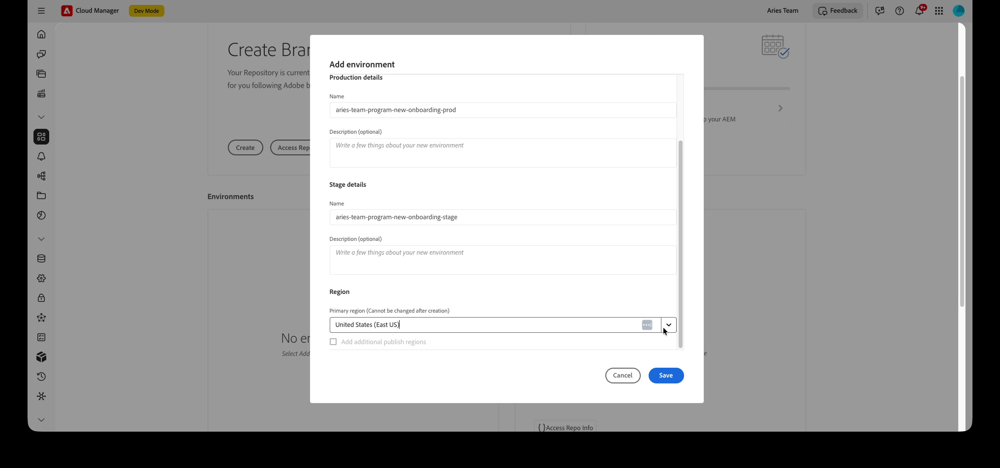
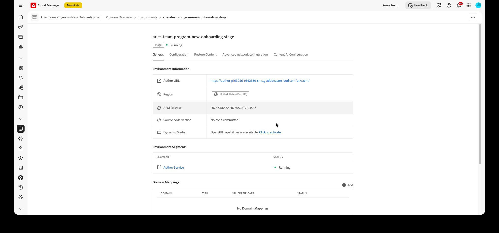
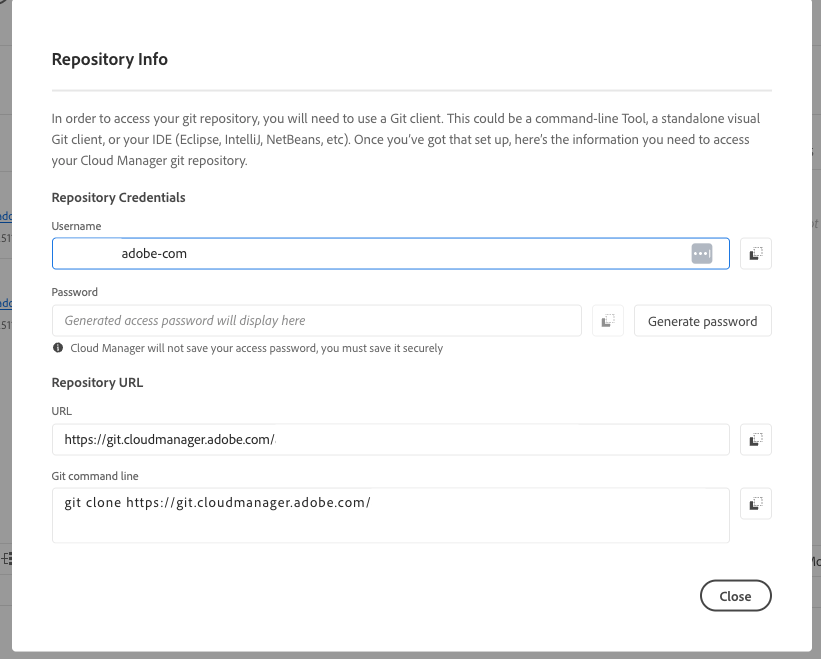

# Configure the AEM Assets project

This topic describes how to configure your AEM Assets project so that the Commerce namespace, metadata schema, and **[!UICONTROL Commerce]** tab are available in the AEM authoring environment. For background on these resources, see [Commerce metadata in AEM Assets](../metadata.md).

This topic describes how to configure your AEM Assets project so that the Commerce namespace, metadata schema, and [!UICONTROL Commerce] tab are available in the AEM authoring environment. For background on these resources, see Commerce metadata in AEM Assets.

You have two options to configure the AEM Assets project:

* [!BADGE Recommended]{type=Positive} **Self-service onboarding** — On AEM releases `2026.5.26309` and later, enable the integration directly from Cloud Manager by setting an environment variable and activating Dynamic Media with OpenAPI capabilities. No custom code deployment is required. See [Enable the Commerce integration (self-service)](#enable-aem-commerce-self-service).

* **Manual configuration** — Deploy the `assets-commerce` package through a Cloud Manager pipeline. Use these manual steps when you must deploy custom package code, or on AEM releases earlier than `2026.5.26309`. See [Install the assets-commerce package manually](#install-the-assets-commerce-package-manually).

## Enable the Commerce integration (self-service) {#enable-aem-commerce-self-service}

[!BADGE Supported]{type=Informative tooltip="Supported"} AEM release `2026.5.26309` and later.

On supported AEM releases, you enable the Commerce integration from Cloud Manager without deploying any custom code. The Commerce namespace, metadata schema, and **[!UICONTROL Commerce]** tab are provisioned automatically when you enable the integration on the Author service.

### Self-service prerequisites

* [Access to the AEM Cloud Manager Program and environments](https://experienceleague.adobe.com/en/docs/experience-manager-cloud-service/content/onboarding/journey/cloud-manager#access-sysadmin-bo) with the Program and Deployment Manager roles.

* An AEM program on release `2026.5.26309` or later.

* The **IMS Org ID** for your Commerce instance. Both your Commerce instance and AEM Assets authoring environment must be in the same IMS organization.

### Step 1: Create the program and environments

1. In Cloud Manager, select **[!UICONTROL Add Program]**, then choose **[!UICONTROL Set up for production]** and name the program.

1. On the **[!UICONTROL Solutions & Add-ons]** step, select the solutions and add-ons that your project requires, including **[!UICONTROL Dynamic Media]**. Continue and create the program.

   {width="600" zoomable="yes"}

1. After the program is configured, select **[!UICONTROL Add Environment]**, choose **[!UICONTROL Production + Stage]**, set the region, and select **[!UICONTROL Save]**.

   {width="600" zoomable="yes"}

### Step 2: Enable the Commerce integration variable

1. Open the environment and select the **[!UICONTROL Configuration]** tab.

1. Add an environment variable with the following values, then select **[!UICONTROL Add]** and **[!UICONTROL Save]**:

   | Field | Value |
   |---|---|
   | Name | `COMMERCE_INTEGRATION_ENABLED` |
   | Value | `true` |
   | Service applied | Author |
   | Type | Variable |

   {width="600" zoomable="yes"}

   The environment updates to apply the configuration. Wait until the environment status returns to **[!UICONTROL Running]**.

### Step 3: Activate Dynamic Media with OpenAPI capabilities

1. On the environment **[!UICONTROL General]** tab, locate **[!UICONTROL Dynamic Media]**.

1. Next to *OpenAPI capabilities are available*, select **[!UICONTROL Click to activate]**.

   {width="600" zoomable="yes"}

   Activation runs in the background. When it completes, the environment is ready for the Commerce integration.

   >[!NOTE]
   >
   > If **[!UICONTROL Click to activate]** is not available, open a support ticket to enable Dynamic Media with OpenAPI capabilities.

### Step 4: Validate the configuration

Go to any asset and edit its properties. Confirm that the default metadata schema includes the **[!UICONTROL Commerce]** tab and that the **[!UICONTROL Product Data]** and **[!UICONTROL Eligible for Commerce]** fields are visible.

## Install the assets-commerce package manually

>[!NOTE]
>
> Use this manual method to deploy custom package code or if you are on AEM releases earlier than `2026.5.26309`. On supported releases, use [Enable the Commerce integration (self-service)](#enable-aem-commerce-self-service) instead.

### Prerequisites

You need the following resources and permissions to deploy the `assets-commerce` package code to the AEM Assets as a Cloud Service AEM environment:

* [Access to the AEM Assets Cloud Manager Program and environments](https://experienceleague.adobe.com/en/docs/experience-manager-cloud-service/content/onboarding/journey/cloud-manager#access-sysadmin-bo) with the Program and Deployment Manager roles.

* A [local AEM development environment](https://experienceleague.adobe.com/en/docs/experience-manager-learn/cloud-service/local-development-environment-set-up/overview) and familiarity with the AEM local development process.

* Understand [AEM project structure](https://experienceleague.adobe.com/en/docs/experience-manager-cloud-service/content/implementing/developing/aem-project-content-package-structure) and how to deploy custom content packages using Cloud Manager.

* The **IMS Org ID** for your Commerce instance. Both your Commerce instance and AEM Assets Authoring environment must be in the same IMS organization.

* To enable [Dynamic Media with OpenAPI capabilities](https://experienceleague.adobe.com/en/docs/experience-manager-cloud-service/content/assets/dynamicmedia/dynamic-media-open-apis/dynamic-media-open-apis-overview#enable-dynamic-media-open-apis):

>[!BEGINTABS]

>[!TAB Product Visuals]

[!BADGE SaaS only]{type=Positive url="https://experienceleague.adobe.com/en/docs/commerce/user-guides/product-solutions" tooltip="Applies to Adobe Commerce as a Cloud Service and Adobe Commerce Optimizer projects only (Adobe-managed SaaS infrastructure)."}  Dynamic Media with OpenAPI capabilities is self-service for Product Visuals powered by AEM Assets.

1. Navigate to your Cloud Manager.

1. Select the desired environment.

1. Enable **Dynamic Media with OpenAPI capabilities**.

   If the **Dynamic Media with OpenAPI capabilities** button is not active, open a support ticket.

>[!TAB AEM Assets]

[!BADGE PaaS only]{type=Informative tooltip="Applies to Adobe Commerce on Cloud projects only (Adobe-managed PaaS infrastructure)."} On AEM as a Cloud Service, submit an Adobe support ticket with the following information:

* Title: Enable Dynamic Media OpenAPI to fully integrate Adobe Commerce with AEM Assets

  * Content of the support ticket:

    * **[!UICONTROL AEM Program ID]**
    * **[!UICONTROL Adobe Commerce URL]**
    * **[!UICONTROL AEM Environment ID]**
    * **[!UICONTROL IMS Org ID]**

Once you submit the support ticket, Adobe enables Dynamic Media with OpenAPI capabilities on your Cloud Services environment and share the details, such as IMS Client ID, for you to proceed with the integration.

>[!ENDTABS]

### Installation steps

1. Navigate to the AEM Cloud Manager, select a program, and [create production and staging environments](https://experienceleague.adobe.com/en/docs/experience-manager-cloud-service/content/onboarding/journey/create-environments#creating-environments) that you want to integrate with Adobe Commerce.

1. [Clone the Adobe managed git repository](https://experienceleague.adobe.com/en/docs/experience-manager-cloud-service/content/sites/administering/site-creation/quick-site/retrieve-access#repo-access) for the selected program.

   {width="600" zoomable="yes"}

   In Cloud Manager **Pipelines**, select **[!UICONTROL Access Repo Info]** to open **[!UICONTROL Repository Info]**. Copy the **[!UICONTROL URL]** or **[!UICONTROL Git command line]** value, generate an access password if needed, then clone locally with your Git client.

1. From GitHub, download the package code from the [AEM Assets Commerce repository](https://github.com/ankumalh/assets-commerce).

1. From your [local AEM development environment](https://experienceleague.adobe.com/en/docs/experience-manager-learn/cloud-service/local-development-environment-set-up/overview), manually copy the downloaded code into the existing Adobe managed repository.

1. In all `filter.xml` and `pom.xml` files for your project, replace all occurrences of &lt;my-app&gt; with your app name.

   >[!NOTE]
   >
   > Alternatively, you can install the custom code into your AEM Assets project configuration as a **Maven** package.

1. Commit the changes and push your local development branch to the Cloud Manager Git repository.

1. Configure a [deployment pipeline](https://experienceleague.adobe.com/en/docs/experience-manager-cloud-service/content/sites/administering/site-creation/quick-site/pipeline-setup#create-front-end-pipeline), or verify that your pipeline can deploy changes to the selected environment.

   {width="600" zoomable="yes"}

   When the pipeline exists, open the actions menu (**...**) to **[!UICONTROL Run]**, **[!UICONTROL Edit]**, **[!UICONTROL View/Edit variables]**, or other actions—see the Cloud Manager pipeline documentation linked above.

1. From AEM Cloud Manager, [update the AEM environment by using the pipeline to deploy your code](https://experienceleague.adobe.com/en/docs/experience-manager-cloud-service/content/implementing/using-cloud-manager/deploy-code#deploying-code-with-cloud-manager).

1. Go to any asset and edit its properties to validate the changes:

   * The default Metadata Schema includes the **Commerce** tab.

   * Product SKUs and the `Eligible for Commerce` fields are visible.

### Commerce tab is not visible in properties

If the **Commerce** tab does not appear in properties, you must manually complete the following steps in the metadata schema editor:

1. Navigate to the metadata schema editor.

1. Select **Edit** to modify the default metadata schema form.

1. Create a **Commerce** tab, and select it.

1. Drag and drop the **Product** component into the **Commerce** tab, and map it to the property `commerce:skus`.

1. Select the checkbox for **show roles** and **show order**.

1. Drag and drop a **checkbox** component into the **Commerce** tab, and map it to the property `commerce:isCommerce`. Define **Yes** and **No** as the options.

If you encounter any other issues, create a [support ticket](https://experienceleague.adobe.com/docs/commerce-knowledge-base/kb/help-center-guide/magento-help-center-user-guide.html#submit-ticket) or contact your AEM Assets Integration sales representative for help.

## Configure a metadata profile (optional)

In the AEM Assets author environment, set default values for Commerce asset metadata by creating a metadata profile. Then, apply the new profile to AEM Asset folders to automatically use these defaults. This configuration streamlines asset processing by reducing manual steps.

When you configure the metadata profile, you only have to configure the following components:

* Add a Commerce tab. This tab enables Commerce specific configuration settings added by the template.

* Add the `Eligible for Commerce` field to the Commerce tab.

The Product Data UI component is added automatically based on the template.

### Define the metadata profile

1. Log in to the Adobe Experience Manager author environment.

1. From the Adobe Experience Manager workspace, go to the Author Content Administration workspace for AEM Assets by clicking the Adobe Experience Manager icon.

   {width="600" zoomable="yes"}

1. Open the Administrator tools by selecting the hammer icon.

   {width="600" zoomable="yes"}

1. Open the profile configuration page by clicking **[!UICONTROL Metadata Profiles]**.

1. **[!UICONTROL Create]** a metadata profile for the Commerce integration.

   {width="600" zoomable="yes"}

1. Add a tab for Commerce metadata.

   1. On the left, click **[!UICONTROL Settings]**.

   1. Click  **[!UICONTROL +]** in the tab section, and then specify the **[!UICONTROL Tab Name]**, `Commerce`.

1. Add the `Eligible for Commerce` field to the form.

   {width="600" zoomable="yes"}

   * Click **[!UICONTROL Build form]**.

   * Drag the `Single Line text` field to the form.

   * Add the `Eligible for Commerce` text for the label by clicking **[!UICONTROL Field Label]**.

   * On the Settings tab, add the label text to **Field Label**.

   * Set the placeholder text to `yes`.

   * In the **[!UICONTROL Map to Property]** field, copy and paste the following value

     ```terminal
     ./jcr:content/metadata/commerce:isCommerce
     ```

1. Optional. To automatically synchronize approved Commerce assets as they are uploaded to the AEM Assets environment, set the default value for the _[!UICONTROL Review Status]_ field on the `Basic` tab to `approved`.

1. Save the update.

### Apply the metadata profile to the Commerce assets source folder

   1. From the **[!UICONTROL Metadata Profiles]** page, select the Commerce integration profile.

   1. From the action menu, select **[!UICONTROL Apply Metadata Profiles to Folders]**.

   1. Select the folder containing Commerce assets.

      Create a Commerce folder if it does not exist.

   1. Select **[!UICONTROL Apply]**.

## Next steps

* [!BADGE PaaS only]{type=Informative tooltip="Applies to Adobe Commerce on Cloud projects only (Adobe-managed PaaS infrastructure)."} [Install Adobe Commerce packages](configure-commerce.md).

* [!BADGE SaaS only]{type=Positive url="https://experienceleague.adobe.com/en/docs/commerce/user-guides/product-solutions" tooltip="Applies to Adobe Commerce as a Cloud Service and Adobe Commerce Optimizer projects only (Adobe-managed SaaS infrastructure)."} [Configure the integration from the Admin](setup-synchronization.md).
