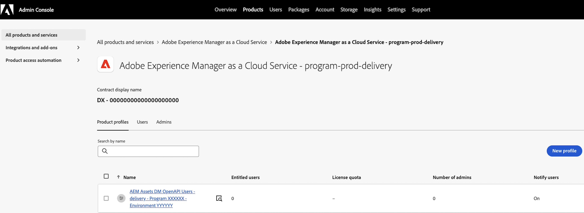

# User permissions and IMS

**IMS** (Adobe Identity Management System) is the authentication layer. For Adobe Commerce as a Cloud Service, IMS authentication is enabled by default in the Admin. For Adobe Commerce on cloud or on-premises, IMS is optional;[Enabling IMS for Commerce](https://experienceleague.adobe.com/docs/commerce-admin/start/admin/ims/adobe-ims-config.html){target=_blank} provides an enhanced configuration UI (Asset Selector, auto-populated dropdowns), but you can configure the integration without IMS by manually entering **Program ID**, and **Environment ID**.

The AEM Assets Integration also requires specific **Adobe Admin Console product profiles** when using IMS. Users who configure the integration in Commerce Admin need the **AEM Assets DM OpenAPI Users - delivery** product profile, or the **author** product profile as a fallback. This is controlled through Admin Console product profiles in the user’s IMS organization, and enables:

* **Asset Selector** allows to select images from AEM Assets when managing category images or Page Builder content.
* **Auto-populated configuration fields** such as **Program ID**, **Environment ID**, and **Domain mapping** dropdowns that pull values from the user's IMS session based on their Admin Console product profiles (delivery or author).

Without the correct permissions, the Asset Selector is unavailable, and these fields appear empty or require manual entry.
>[!BEGINSHADEBOX]

**How IMS and permissions work together**

Adobe IMS provides the user identity and organization context, while the Adobe Admin Console defines which **product profiles**(permissions) it has. The AEM Assets Integration uses the IMS details plus the assigned profile to determine whether it can auto-populate configuration fields and enable the Asset Selector.

>[!ENDSHADEBOX]

## Why product profiles are required

The integration can only load domains that are mapped to a profile. Therefore, users can have the following product profiles:

* **AEM delivery product profile**. Required for the Asset Selector and Configuration UI when the user has both author and delivery profiles. The integration uses the AEM delivery product profile when available.

* **Author product profile**. Required to access the AEM Assets UI. Also serves as the fallback for the Asset Selector and Configuration UI when the user does not have the AEM delivery product profile in their Admin Console.

Domains (including Program ID, Environment ID, and Domain mapping) are assigned to the AEM delivery product profile. The integration loads domains from the **AEM delivery product profile** when available, or falls back to the **author product profile** when the AEM delivery product profile is not in the user's Admin Console. Users need one of these profiles to:

* Populate the **Program ID**, **Environment ID**, and **Domain mapping** dropdowns in the Commerce Admin configuration.
* Use the Asset Selector to browse and select assets from AEM Assets.

If neither profile is configured, users can manually enter **Program ID** and **Environment ID**, but the Asset Selector will not be available.

## Grant permissions by deployment type

>[!BEGINTABS]

>[!TAB Adobe Commerce as a Cloud Service]

[!BADGE SaaS only]{type=Positive tooltip="Applies to Adobe Commerce as a Cloud Service and Adobe Commerce Optimizer projects only (Adobe-managed SaaS infrastructure)."}

IMS authentication is enabled by default. Add the user to the **AEM Assets DM OpenAPI Users - delivery** product profile in the [Adobe Admin Console](https://adminconsole.adobe.com/), or to the **author** product profile (for example, `<environment-name> - author - <program-id> - <environment-id>`) as a fallback when the user does not have the AEM delivery product profile in their Admin Console.

>[!NOTE]
>
> Users must also be added to Commerce and AEM Assets. See [Add a user to AEM Assets or Product Visuals](https://experienceleague.adobe.com/en/docs/commerce/cloud-service/user-management#add-a-user-to-aem-assets-or-product-visuals){target=_blank} in the _User and Identity Management_ guide for the full setup.

{width="600" zoomable="yes"}

>[!TAB Adobe Commerce on cloud or on-premises]

[!BADGE PaaS only]{type=Informative tooltip="Applies to Adobe Commerce on Cloud projects only (Adobe-managed PaaS infrastructure)."}

The **IMS Client ID** is required for PaaS to enable the Asset Selector. See [Configure the AEM Assets project](configure-aem.md#prerequisites) for prerequisites, including how to obtain the IMS Client ID when enabling Dynamic Media with OpenAPI.

To use the Asset Selector and auto-populated configuration fields (Program ID, Environment ID, Domain mapping):

1. [Enable Adobe IMS for Commerce](https://experienceleague.adobe.com/docs/commerce-admin/start/admin/ims/adobe-ims-config.html){target=_blank} so that Commerce Admin uses IMS authentication and can read the user’s Admin Console product profiles.

1. [Open a Support ticket](https://experienceleague.adobe.com/en/docs/commerce-knowledge-base/kb/help-center-guide/magento-help-center-user-guide#support-cases) to request a custom IMS Client ID for the Asset Selector.

1. From the [Adobe Admin Console](https://adminconsole.adobe.com/), add the user to the **AEM Assets DM OpenAPI Users - delivery** product profile, or to the **author** product profile (for example, `<environment-name> - author - <program-id> - <environment-id>`) as a fallback when the user does not have the AEM delivery product profile in their Admin Console.

Without IMS, you can still configure the integration by manually entering Program ID and Environment ID in the Commerce Admin.

>[!ENDTABS]

## Related documentation

* [Configure IMS user permissions for the AEM Assets Integration](setup-synchronization.md)—Connect Commerce to AEM Assets and configure matching rules.
* [Manual asset selection](../synchronize/asset-selector-integration.md)—Use the Asset Selector for category images and Page Builder.
* [Add a user to AEM Assets or Product Visuals](https://experienceleague.adobe.com/en/docs/commerce/cloud-service/user-management#add-a-user-to-aem-assets-or-product-visuals){target=_blank}—For ACCS, add users to Commerce and AEM Cloud Manager (Business Owner, Deployment Manager) first. The **AEM Assets DM OpenAPI Users - delivery** profile (or **author** profile as fallback) is an additional requirement for the Asset Selector and auto-populate features.
* [Assign team members to AEM delivery layer](https://experienceleague.adobe.com/en/docs/experience-manager-cloud-service/content/onboarding/journey/assign-profiles-aem#add-team-members){target=_blank}. AEM documentation for delivery access.
