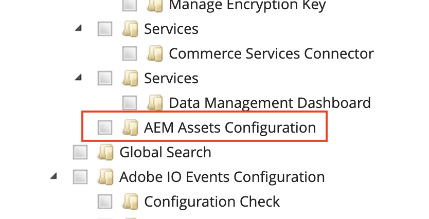

# View AEM Assets sync status

The **[!UICONTROL Sync Status]** view provides an asset-centric list of assets synchronized through the AEM Assets integration. Use it to find, review, and troubleshoot assets by their own attributes instead of navigating product-by-product in the catalog.

{width="700" zoomable="yes"}

>[!NOTE]
>
> [!UICONTROL Sync Status] is available in the Adobe Commerce Admin for Adobe Commerce as a Cloud Service and Adobe Commerce on Cloud infrastructure projects. It is not available for [!DNL Adobe Commerce Optimizer].

## Open Sync Status

On the _Admin_ sidebar, navigate to **[!UICONTROL System]** > **[!UICONTROL AEM Assets]** > **[!UICONTROL Sync Status]**.

{width="600" zoomable="yes"}

## Asset list

The grid lists synchronized assets from AEM Assets. Each row represents one asset and its sync state in Commerce.

## Integration sync health

At the top of the page, the **AEM Sync Status** banner summarizes pipeline health and how many events are waiting to process. Select **[!UICONTROL Refresh]** to update the banner and grid.

## Asset list

The grid lists synchronized assets from AEM Assets. Each row represents one asset and its sync state in Commerce—not a product record.

| Column | Description |
|--------|-------------|
| **Asset ID** | AEM asset identifier (for example, `urn:aaid:aem:…`). |
| **Status** | Result of the latest sync attempt for the asset (for example, **Success** or **Failed**). |
| **Processing** | Date and time processing started for the asset. |
| **Dispatched** | Date and time the sync event was dispatched. |
| **Error** | Error message when **Status** indicates a failure; empty when the sync succeeded. |

### Filter assets

1. Select **[!UICONTROL Filters]** to expand the filter panel.

1. Enter an **Asset ID** or choose a **Status** value.

1. Select **[!UICONTROL Apply Filters]** to update the grid, or **[!UICONTROL Cancel]** to close the panel without applying changes.

Filters apply to asset-level data so you can isolate failed syncs or trace a specific asset without opening individual products.

## Failed synchronizations

When **Status** shows a failure, review the **Error** column in the grid for the message returned by the sync pipeline.

For additional troubleshooting, see [Default automatic matching](../synchronize/default-match.md). Integration log files are available at `/var/log/aem-assets-integration.log` and `/var/log/aem-assets-integration-errors.log` on your Commerce instance.

Review the full error message and last sync attempt details to diagnose the failure.

For additional troubleshooting, see [Default automatic matching](../synchronize/default-match.md). Integration log files are available at `/var/log/aem-assets-integration.log` and `/var/log/aem-assets-integration-errors.log` on your Commerce instance.
