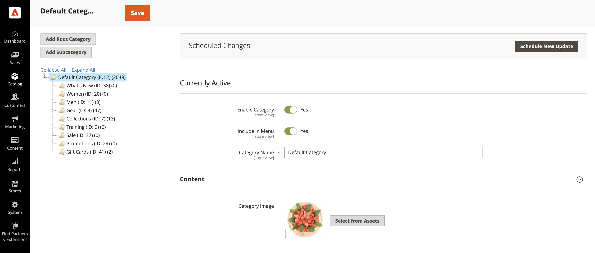

# Manage Commerce media assets

<!--In ACAP-844, this topic was linked to from the Commerce Admin products images and videos when the Assets integration is enabled. If the URL to the topic changes, be sure to add a redirect.-->

You can manage the following media types after the AEM Assets integration for Commerce is enabled:

* Product images
* Content images
* Product videos
* Category images

## Product images

When the integration is enabled, image management is centralized within the Digital Asset Management system (DAM). Adobe Commerce then functions as a key engagement channel, ensuring that only approved, high-quality images are used across storefronts. This setup enhances brand consistency, minimizes manual effort, and streamlines content updates—eliminating the need for merchants to manually upload or manage images within Adobe Commerce.

### View product images in Adobe Commerce

Product images are automatically pulled from AEM Assets based on pre-configured matching rules:

1. On the _Admin_ sidebar, navigate to **[!UICONTROL Catalog]** > **[!UICONTROL Products]**.

1. Select a product.

1. Open the **Images And Videos** section.

   {width="600" zoomable="yes"}

   >[!NOTE]
   >
   > A message indicates that the integration is enabled, making this a **read-only** section as image management is centralized in the DAM.

### Manage product images in AEM Assets

To manage product-related images, all changes must be made directly in **AEM Assets**. This process is fully automated, ensuring that any changes are synchronized to Adobe Commerce without requiring manual intervention.

### Synchronization SLAs

Check [Synchronization SLA ](get-started/setup-synchronization.md#synchronization-sla)for more information on this topic. 

## Content images

Adobe Commerce provides Page Builder as a **content management system (CMS)** for merchants who are not using the Adobe Experience Manager (AEM) toolset. To enhance content creation, our integration leverages [AEM Asset Selector](synchronize/asset-selector-integration.md), allowing marketers to seamlessly access and embed images directly from the **DAM**. This ensures that only approved and high-quality images are used in content creation, eliminating the need for redundant storage in Adobe Commerce.

### Using AEM Asset Selector in Page Builder

To use the **AEM Asset Selector** for embedding images:

1. Navigate to any section in the **Adobe Commerce Admin** that supports `content enrichment` using **Page Builder**.

1. Open [Page Builder](https://developer.adobe.com/commerce/frontend-core/page-builder/){target=_blank}.

   A new Media Type called **AEM Asset** will be available.

1. Drag and drop the AEM Asset media type into a content block.

1. When prompted, provide the credentials to access the DAM.

1. Select an image from the DAM and insert it directly into the content.

The association to the selected image will be stored in Adobe Commerce as a direct URL pointing to **Dynamic Media**, ensuring that:

* Image files do not need to be stored in Adobe Commerce.

* Marketers work exclusively with approved assets from the DAM.

* Content remains consistent and up-to-date across all customer touchpoints.

## Product videos

Adobe Commerce serves as a key engagement channel for digital assets. After the AEM Assets integration is enabled, video management is centralized within the **DAM**, ensuring consistency, compliance, and optimized delivery across commerce storefronts.

### Manage product videos

1. On the _Admin_ sidebar, navigate to **[!UICONTROL Catalog]** > **[!UICONTROL Products]**.

1. Select a product.

1. Open the **Images And Videos** section.

   {width="600" zoomable="yes"}

   >[!NOTE]
   >
   > A message indicates that the integration is enabled, making this section **read-only**, as videos are controlled in AEM Assets.

### Associate videos in AEM Assets

1. In AEM Assets, navigate to the video you want to associate with a product.

1. Link the video to one or more products in Adobe Commerce.

1. The integration automatically syncs the association, displaying the Dynamic Media video player directly on the storefront. This eliminates the need for merchants to manage video playback configurations.

### API-First video support only

Currently, the integration supports videos via API, allowing partners to retrieve videos programmatically. 

>[!WARNING]
>
> Videos are not yet integrated into existing Adobe Commerce storefront solutions by default.

This integration ensures that merchants can effortlessly manage product videos in a scalable and optimized way, leveraging AEM Assets and Dynamic Media for seamless delivery.

### Synchronization SLAs

Check [Synchronization SLA ](get-started/setup-synchronization.md#synchronization-sla)for more information on this topic. 

## Category images

Adobe Commerce enables merchants to associate images with product categories, helping create a visually engaging storefront. The AEM Assets integration leverages the AEM Asset Selector, enabling marketers to seamlessly select assets directly from the **Digital Asset Management system (DAM)**. This ensures that only approved images are used and eliminates the need to store them in Adobe Commerce, maintaining consistency and efficiency across all engagement channels. 

### Use AEM Asset Selector for category images

After you configure the [AEM Asset Selector](synchronize/asset-selector-integration.md), you can use it to add assets into your catalog categories content.

1. On the _Admin_ sidebar, navigate to **[!UICONTROL Catalog]** > **[!UICONTROL Categories]**.

1. Select a category you want to update.

1. Expand the  in the **[!UICONTROL Content]** section.

1. In the **[!UICONTROL Content]** section, locate the *Image field* associated with the category.

   {width="600" zoomable="yes"}

1. Click **[!UICONTROL Select from Assets]** to change the category image.

   {width="600" zoomable="yes"}

1. Choose an image from the AEM Asset Selector.

   {width="600" zoomable="yes"}

1. Click **[!UICONTROL Save]** and continue.

   For more information about creating a category, see [Complete the category content](https://experienceleague.adobe.com/en/docs/commerce-admin/catalog/categories/create/category-create#step-3-complete-the-category-content) in the **Commerce Catalog Management Guide**.

## Update an asset

After you update and approve an asset in AEM Assets, the updates are automatically sent to Adobe Commerce using the automated matching capability. This process is triggered upon asset approval. To ensure all final changes and metadata updates are included, make sure to reprocess the asset before approving it.

For details, see the following AEM Assets documentation.

* [Reprocessing digital assets](https://experienceleague.adobe.com/en/docs/experience-manager-cloud-service/content/assets/manage/reprocessing)

* [Approve an asset](https://experienceleague.adobe.com/en/docs/experience-manager-cloud-service/content/assets/dynamicmedia/dynamic-media-open-apis/approve-assets)
