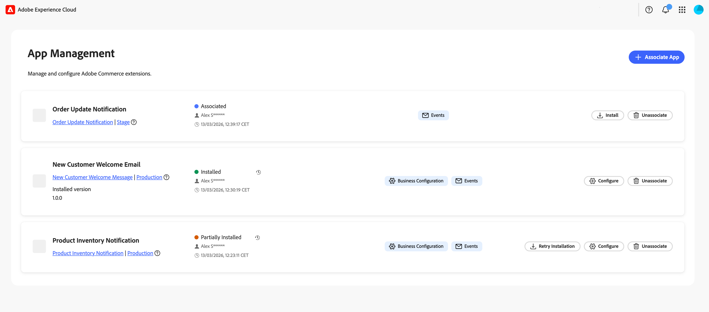

# Manage your app

An App Manager associates an App Builder application with their Commerce instance. Configuration forms are rendered dynamically based on the app's schema, so no custom Admin UI development is required. App manager configures settings through forms that Commerce generates automatically.

{width="500" zoomable="yes"}

## Prerequisites

Before associating an app, ensure you have the following:

| Requirement | Description |
|-------------|-------------|
| **Admin access** | Commerce Admin with [!DNL App Management] permissions |
| **Deployed app** | App Builder application deployed to your organization and ready to connect |
| **Organization access** | Access to the Adobe organization where the app is deployed |

## Tutorial

Watch this video to learn how to associate an app with a Commerce instance and configure settings.

>[!VIDEO](https://video.tv.adobe.com/v/3478944)

## Associate an app

The association process imports websites, stores, and store views from Commerce and creates the link between the app and your Commerce instance.

To link your App Builder application to a Commerce instance:

1. Navigate to **[!UICONTROL Apps]** > **[!UICONTROL App Management]**.

1. Click **[!UICONTROL Associate App]**.

    {width="500" zoomable="yes"}

1. Select a **[!UICONTROL Project]** from the list.

1. Select the **[!UICONTROL Workspace]**.

1. Click **[!UICONTROL Associate]**.

    {width="500" zoomable="yes"}

>[!WARNING]
>
>If scope sync fails, association still completes. You can sync the scopes manually later from the **[!UICONTROL Manage Scopes]** view in the configuration of the associated app.

## Configure settings

After associating an app in the [!DNL App Management] view, configure its settings through the form:

1. Click **[!UICONTROL Configure]** on the associated app.

1. The form displays the app's configurable settings.

1. Modify values as needed.

1. Click **[!UICONTROL Save]**.

### Scope-specific configuration

Use scope-specific configuration when different websites, stores, or store views need unique settings. For example, enable a feature only for a specific region or store view, or use different settings per brand. Settings at a lower scope override those from higher scopes.

To override global values at a specific scope level:

1. Click **[!UICONTROL Change Scope]**.

1. Select a scope from the list.

1. Modify values for this scope.

1. Click **[!UICONTROL Save]**.

## Manage scopes

Access **[!UICONTROL Manage Scopes]** from the app details screen to manage scope hierarchy for your app.

{width="500" zoomable="yes"}

| Action | Description |
|--------|-------------|
| **[!UICONTROL Add root scope]** | Add a scope that applies only to the app. |
| **[!UICONTROL Sync Commerce scopes]** | Refresh the list of websites, stores, and store views from Commerce after you add or change them. |
| **[!UICONTROL Import scopes]** | Import scopes in bulk from a file. |

## Unassociate an app

Unassociate an app when you no longer need it connected to your Commerce instance. For example, you might need to retire an integration, switch to a different workspace, or clean up test configurations.

>[!WARNING]
>
> Unassociating removes all configuration values for this instance. This cannot be undone.

To remove an app from a Commerce instance:

1. Navigate to **[!UICONTROL Apps]** > **[!UICONTROL App Management]**.

1. Click **[!UICONTROL Unassociate]** on the app.

1. Confirm the action.

## Related documentation

* [Troubleshooting [!DNL App Management]](troubleshooting.md)—Resolve common issues with app association and configuration.
