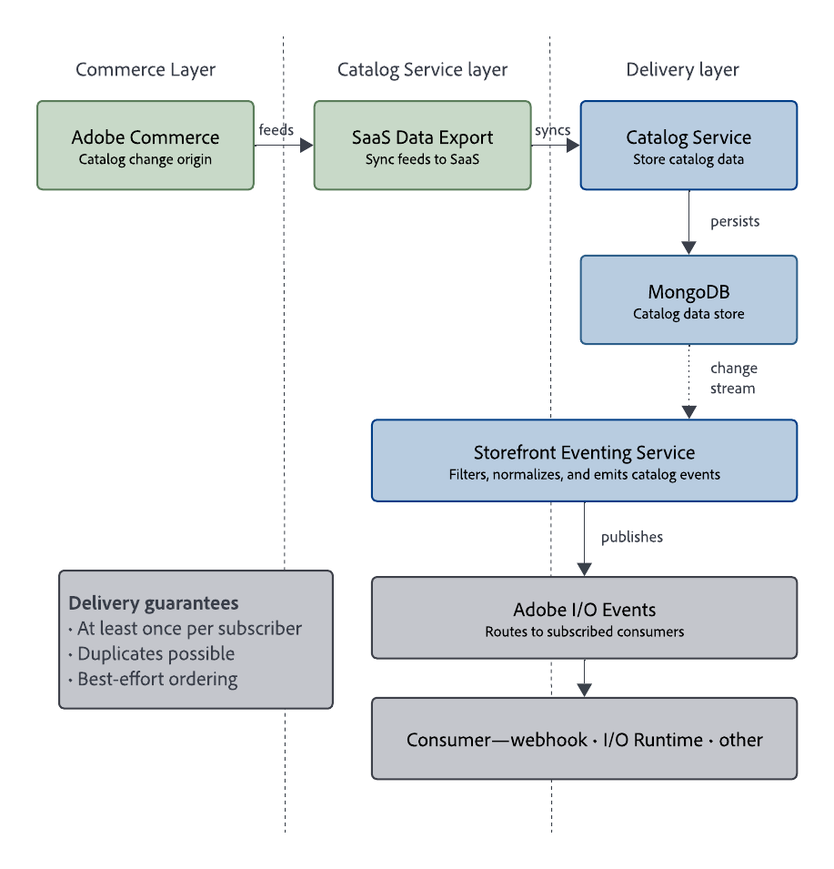
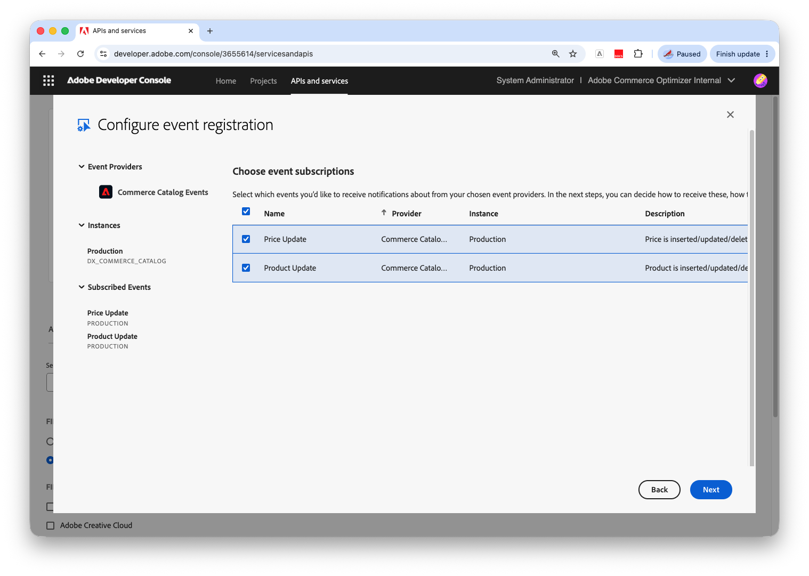

# Enable and Configure Catalog Events with Adobe I/O

Catalog events are machine-generated notifications that describe supported catalog changes made available through [!DNL Catalog Service]. They enable event-driven workflows such as:

* Keeping external caches or services in sync with catalog updates.
* Triggering downstream processes when products, variants, prices, or categories change.
* Powering Experience Edge and [!DNL Edge Delivery Services] use cases that require near real-time catalog updates.

For the end-to-end path from [!DNL Adobe Commerce] to your event consumers, see [Event delivery through [!DNL Adobe I/O Events]](#event-delivery-through-adobe-io-events).

## Supported event types {#supported-event-types}

Catalog events focus on storefront-relevant changes exposed through [!DNL Adobe Developer Console]. The following subscriptions are currently supported.

| Subscription | Events |
| --- | --- |
| Product Update | Product create, update, and delete changes for products available through [!DNL Catalog Service] |
| Price Update | Price create, update, and delete changes that affect storefront catalog data |

Each event includes:

* An event identifier that describes the change type.
* Entity and environment context, such as instance ID and SKU.
* A payload that describes the changed entity and relevant scope information.


## Example event payloads

**ProductUpdated event**

```json
{
  "imsOrgId": "aaa-0",
  "instanceId": "instance-9",
  "eventCode": "productUpdated",
  "sku": "1234",
  "links": [
    {"type":  "variantOf", "sku": "5678"}
   ],
  "scope": [
    { "storeViewCode": "US-us" },
    { "storeViewCode": "FR-fr" },
    { "storeViewCode": "DE-de" }
  ]
}
```

**PriceUpdated event**

```json
{
  "imsOrgId": "aaa-0",
  "instanceId": "instance-9",
  "eventCode": "priceUpdated",
  "sku": "1234",
  "scope": [
    {
      "websiteCode": "website1",
      "customerGroupCode": "customer-group-code1"
    },
    {
      "websiteCode": "website2",
      "customerGroupCode": "customer-group-code2"
    }
  ]
}
```

## Event delivery through [!DNL Adobe I/O Events] {#event-delivery-through-adobe-io-events}

[!DNL Adobe I/O Events] delivers catalog events to your integrations. The following diagram shows the high-level flow of catalog changes from [!DNL Adobe Commerce] through [!DNL Catalog Service] and [!DNL Adobe I/O Events] to subscribed consumers:



The following steps explain each handoff in more detail:

 1. **Adobe Commerce → Catalog Service**

   [!DNL Adobe Commerce] exports catalog data to [!DNL Catalog Service] using the supported SaaS Data Export extensions.

1. **Catalog Service processing**

   * [!DNL Catalog Service] processes supported catalog changes and prepares them for event delivery.

1. **Catalog Service → Adobe I/O Events**

  * Catalog events are published to [!DNL Adobe I/O Events].
  * Consumers subscribe using Journaling, webhooks, [!DNL Adobe I/O Runtime], Amazon EventBridge, or other supported delivery mechanisms.

[!DNL Adobe I/O Events] provides:

* *At-least-once delivery* per subscriber (duplicate events are possible).
* No ordering guarantees across deliveries.

Your consumers must handle duplicate events and out-of-order delivery. See [Idempotency](#idempotency) for implementation guidance.

## Use cases {#use-cases}

You can use Catalog events in multiple scenarios.

### Static site and edge delivery

* Regenerate or invalidate catalog pages and storefront fragments when catalog data changes.
* Avoid frequent polling of [!DNL Catalog Service] APIs.

### Search indexing and caching

* Trigger incremental updates in downstream search indexes.
* Update cache layers or external views of the catalog when product or category data changes.

### Integration with external systems

* Forward catalog changes to external systems such as PIM, pricing engines, or other line-of-business systems.
* Keep downstream applications synchronized without direct database access.

### Monitoring and observability

Combine Catalog events with existing monitoring (for example, [!DNL Grafana] and [!DNL Prometheus]) to:

* Monitor event throughput.
* Detect anomalies in catalog update volume.

## Enable catalog events {#enable-catalog-events}

To enable catalog events end to end, follow these steps.

>[!PREREQUISITES]
>
>Before you enable catalog events, ensure that you have the following:
>
>* A supported Adobe Commerce environment with [!DNL Catalog Service] enabled.
>* [The [!DNL Adobe I/O] connection is configured for Adobe Commerce](https://developer.adobe.com/commerce/extensibility/events/configure-commerce).
>* Access to [!DNL Adobe Developer Console] in the same IMS organization where the Commerce environment is provisioned.
>* To verify sync to Commerce SaaS services, use the **[!UICONTROL Data Management Dashboard]** in the Admin.
>* Product Recommendations v6.0, [!DNL Live Search] v4.1.0+, or [!DNL Catalog Service] v1.17+ is required for dashboard verification. Adobe recommends updating your Commerce project to the latest supported versions of these services. For earlier service versions, use [Catalog Sync](https://experienceleague.adobe.com/en/docs/commerce/user-guides/data-services/catalog-sync) for sync verification.


>[!NOTE]
>
>To use catalog events, first configure the Commerce environment for [!DNL Adobe I/O Events], then register an event subscription in [!DNL Adobe Developer Console].
>
>If your environment does not appear in [!DNL Adobe Developer Console] after configuration, verify that you are signed in to the correct IMS organization and that your account has the required access. If the environment still does not appear, contact Adobe Support.

### Verify catalog data {#verify-catalog-data}

Verify that [!DNL Catalog Service] has current catalog data from your [!DNL Commerce] instance before you configure. Catalog events depend on [!DNL SaaS Data Export] completing two stages—confirm **both**:

1. Confirm successful **feed export from Commerce**.

   From the [!DNL Adobe Commerce] Admin, open the [Data Feed Sync Status](https://experienceleague.adobe.com/en/docs/commerce-admin/systems/data-transfer/data-sync/data-feed-sync-status) page (**[!UICONTROL System]** > **[!UICONTROL Data Transfer]** > **[!UICONTROL Data Feed Sync Status]**) and confirm that the last export status is successful for each [!DNL Catalog Service] feed.

1. Confirm successful **sync to connected Commerce services** from the [!DNL Adobe Commerce] Admin.

   From the [!DNL Adobe Commerce] Admin, open the [Data Management Dashboard](https://experienceleague.adobe.com/en/docs/commerce-admin/systems/data-transfer/data-sync/data-dashboard) (**[!UICONTROL System]** > **[!UICONTROL Data Transfer]** > **[!UICONTROL Data Management Dashboard]**) and verify that the synced products data includes the expected products.

### Register and subscribe to [!DNL Adobe I/O Events] {#register-events}

Define which Commerce events to subscribe to, then register them in the project.

If your instance is not in the selection list, then it is not connected to [!DNL Adobe I/O]. For instructions to fix the issue, see [Configure the [!DNL Adobe I/O] connection](https://developer.adobe.com/commerce/extensibility/events/configure-commerce#configure-the-adobe-io-connection) in the *Adobe Commerce Developer* documentation.

1. From the [!DNL Adobe Developer Console], sign in to the same IMS organization used for the Commerce project.

1. Create a project for Commerce Catalog Events, or add the events API to an existing project.

   * Select **[!UICONTROL APIs and services]** in the top navigation.

   * On the **[!UICONTROL Browse APIs and services]** page, select the **[!UICONTROL Events]** tab.

   * Quickly find Commerce Catalog Events APIs. Type _Catalog_ in the search box, or filter by the **[!UICONTROL Commerce]** product.

   * On the **[!UICONTROL Commerce Catalog Events]** card, select **[!UICONTROL Project]**.

   {width="600" zoomable="yes"}

1. Configure event registration.

   Select the Commerce instance to receive event notifications from. Then, select **[!UICONTROL Next]**.

   {width="600" zoomable="yes"}

1. Choose the events to subscribe to.

   Select the supported event subscriptions that you want to receive, such as **[!UICONTROL Product Update]** or **[!UICONTROL Price Update]**. Then, select **[!UICONTROL Next]**.

   {width="600" zoomable="yes"}

1. Add OAuth server-to-server credentials.

   Enter a **[!UICONTROL Credential name]**. Then, select **[!UICONTROL Next]**.

1. Enter an **[!UICONTROL Event registration name]** and an **[!UICONTROL Event registration description]**. Then, select **[!UICONTROL Next]**.

1. On the final registration screen, accept the default consumer, the Journaling API.

   The default Journaling API consumer lets you test event registration and confirm that events are delivered. If you already configured a webhook or [!DNL Adobe I/O Runtime] action consumer, select it here. Otherwise, edit the event registration later when your consumer is ready.

   {width="600" zoomable="yes"}

1. Select **[!UICONTROL Complete registration]**.

### Configure event consumer {#configure-consumer}

1. Configure a consumer, such as:

   * A webhook endpoint
   * An [!DNL Adobe I/O Runtime] action
   * Another supported destination

1. If you did not select a consumer during registration, edit the event registration to add the consumer details.

   * From the [!DNL Adobe Developer Console], edit your project. Then, select the event registration you created.

   * On the event registration details page, select **[!UICONTROL Edit Events Registration]**.

   * Select **[!UICONTROL Next]** until you reach the consumer selection screen. Then, select the consumer that you configured.

   * Update the consumer to your configured destination. Then, select **[!UICONTROL Save configured events]**.

### Validate the event flow {#validate-event-flow}

Catalog events are enabled for your environment. When catalog data changes in [!DNL Commerce], updates flow through [!DNL Catalog Service] to [!DNL Adobe I/O Events], and your subscribed consumer receives the corresponding catalog event. Review [Limits and best practices](#limits-and-best-practices) before you build production integrations.
1. Make a simple supported catalog change, such as updating a product name or changing a price.

1. Confirm the following outcomes:

   * The change is visible through [!DNL Catalog Service] APIs.
   * Your [!DNL Adobe I/O Events] consumer receives the corresponding product or price event.


## Limits and best practices {#limits-and-best-practices}

When building on Catalog events, follow these best practices.

### Idempotency {#idempotency}

[!DNL Adobe I/O Events] can deliver the same catalog event more than once, and events for a single product can arrive out of order. Design consumers to be idempotent by:

* Using entity IDs with a version or timestamp field.
* Safely ignoring duplicate notifications for the same change.

### Throughput and backpressure

Large catalogs with high update rates can generate significant event volume. Ensure that:

* Consumers can process events at peak throughput.
* You use buffering, batching, or queues where necessary.

### Security and isolation

* [!DNL Adobe I/O Events] enforces *tenant isolation*.
* Your organization receives events only for its own environments and entitlements.

### Schema evolution

Catalog event payloads follow the same conceptual model as [!DNL Catalog Service] APIs. To remain forward-compatible:

* Avoid strict schema enforcement where possible.
* Ignore unknown fields instead of failing.

## Troubleshoot catalog events {#troubleshoot-catalog-events}

If catalog events are missing or delayed, work through these steps.

1. **Check Catalog Service data**

   [Use the [!DNL Catalog Service] API](https://developer.adobe.com/commerce/webapi/graphql/schema/catalog-service/queries/) to confirm that the catalog change is stored successfully.

1. **Verify [!DNL SaaS Data Export]**

   Catalog events require current data in [!DNL Catalog Service]. Confirm both stages of the export path:

   * **Feed export from Commerce** — On the [Data Feed Sync Status](https://experienceleague.adobe.com/en/docs/commerce-admin/systems/data-transfer/data-sync/data-feed-sync-status) page or in `var/log/saas-export.log`, confirm that [!DNL Catalog Service] feeds exported successfully from [!DNL Commerce].

   * **Sync to connected Commerce SaaS services** — On the [Data Management Dashboard](https://experienceleague.adobe.com/en/docs/commerce-admin/systems/data-transfer/data-sync/data-dashboard), [Catalog Sync](https://experienceleague.adobe.com/en/docs/commerce/user-guides/data-services/catalog-sync), or in export logs, confirm that data synced successfully to [!DNL Catalog Service].

   For troubleshooting export and sync jobs, see [Synchronize data with SaaS Data Export](../data-export/data-sync-manage.md) and [Logging and troubleshooting](../data-export/troubleshooting/logging.md).

1. **Validate [!DNL Adobe I/O Events] configuration**

   Confirm that:

   * You are signed in to the correct IMS organization in [!DNL Adobe Developer Console].
   * The **[!UICONTROL Commerce Catalog Events]** provider is enabled.
   * The expected **[!UICONTROL Commerce Catalog Events]** provider and environment are visible.
   * The subscription is active.
   * Your endpoint, action, or journal consumer can receive and process test events.

1. **Contact Adobe Support**

   When opening a support ticket, select the issue reason that corresponds to **Adobe Commerce application** and include the following information:

   * Catalog Service details (environment, region).
   * [!DNL Adobe I/O Events] Subscription details.
   * Approximate time and description of missing events.

   For additional help, see [Support tickets](https://experienceleague.adobe.com/en/docs/support-resources/adobe-support-tools-guide/adobe-commerce-support/adobe-commerce-help-center-user-guide#support-case).

>[!MORELIKETHIS]
>
>
>* [Onboarding and installation](installation.md)
>* [Get started with the Catalog Service](get-started.md)
>* [Synchronize data with SaaS Data Export](../data-export/data-sync-manage.md)
>* [Retrieve catalog data with the GraphQL API](https://developer.adobe.com/commerce/webapi/graphql/schema/catalog-service/queries/){target="_blank"}
>* [[!DNL Catalog Service] and API Mesh](mesh.md)
>* [Configure the [!DNL Adobe I/O] connection](https://developer.adobe.com/commerce/extensibility/events/configure-commerce#configure-the-adobe-io-connection){target="_blank"}
>* [[!DNL Adobe I/O Events]](https://developer.adobe.com/events/docs/guides/){target="_blank"}
