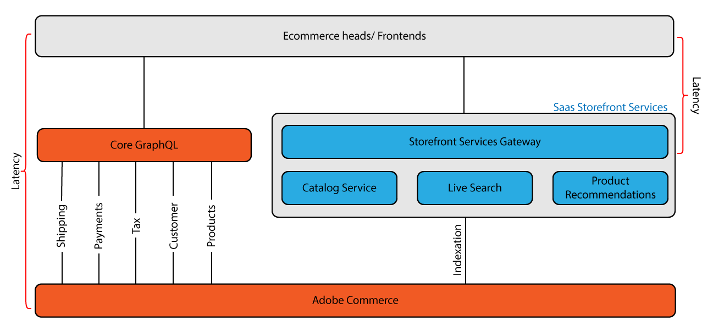

# [!DNL Catalog Service] for Adobe Commerce

[!DNL Catalog Service] for Adobe Commerce extension improves storefront loading times by providing optimized, read-only catalog data through a dedicated GraphQL API. This service is specifically designed to enhance product-related page experiences, resulting in faster page loads and improved conversion rates.

The rich view-model data provided by the [!DNL Catalog Service] includes product details, attributes, inventory, and prices, enabling quick rendering of product-related storefront experiences such as:

- Product detail pages
- Product list and category pages
- Search result pages
- Product carousels
- Product comparison pages
- Any other pages that render product data, such as cart, order, and wish list pages

## Key benefits and features

- **Faster page loads**: Optimized queries for up to 10X faster catalog data retrieval compared to the core GraphQL system
- **Improved conversion rates**: Faster loading times lead to better user experience
- **Simplified product types**: Unified schema based on simple and complex product types reduces complexity for developers
- **Enhanced price precision**: Support for 16-digit values with 4 decimal places
- **Decoupled architecture**: Separate GraphQL system for catalog data ensures high performance without impacting the core Commerce operations
- **Real-time data synchronization**: The Catalog Service is kept in sync with the Adobe Commerce application through the SaaS Data Export extension, ensuring that queries return the most current catalog data
- **Data Management Dashboard**: Monitor and manage data synchronization operations from the Adobe Commerce Admin interface
- **API Mesh integration**: Optionally integrate with [API Mesh for Adobe Developer App Builder](https://developer.adobe.com/graphql-mesh-gateway/) to combine the Adobe Commerce GraphQL systems with other internal and third-party APIs to extend the Catalog Service GraphQL schema and add custom data or functionality

## Architecture

The [!DNL Catalog Service] uses [GraphQL](https://graphql.org/) to request and receive catalog data including products, product attributes, inventory, and prices. GraphQL is a query language that a frontend client uses to communicate with the application programming interface (API) defined on a backend such as Adobe Commerce. GraphQL is a popular method of communication because it is lightweight and allows a system integrator to specify the contents and order of each response.

Adobe Commerce provides two GraphQL systems that serve different purposes:

### Core GraphQL System

- **Purpose**: Full-featured API for all Commerce operations
- **Capabilities**: Queries (read) and mutations (write) for products, customers, cart, checkout, and more
- **Limitation**: Product queries are not optimized for speed
- **Use case**: General Commerce operations and write operations

### Catalog Service GraphQL System

- **Purpose**: High-performance product catalog queries only
- **Capabilities**: Read-only queries for products, attributes, inventory, and prices
- **Advantage**: Significantly faster than core system for product data
- **Use case**: Storefront product experiences where speed is critical

The data available to the Catalog Service is delivered by the SaaS Data Export extension. This extension synchronizes data between the Commerce application and connected Commerce Services to ensure that queries to the services GraphQL API endpoints return the most current catalog data. For information about managing and troubleshooting SaaS data export operations, see the [SaaS Data Export Guide](../data-export/overview.md).

[!DNL Catalog Service] customers can use the [SaaS price indexer](../price-index/price-indexing.md), which provides faster price updates and synchronization time.

## Architecture Overview

The following diagram illustrates the architectural differences between the core GraphQL system and Catalog Service GraphQL system, showing how they work together to optimize storefront performance:

### How the systems work

**Core GraphQL System (Traditional Approach):**
The Progressive Web App (PWA) sends requests directly to the Commerce application, which processes each request through multiple subsystems before returning a response. This multi-step round trip can cause slow page load times, potentially leading to lower conversion rates.

**Catalog Service (Optimized Approach):**
Catalog Service acts as a Storefront Services Gateway that accesses a dedicated, optimized database containing product details, attributes, variants, prices, and categories. The service maintains synchronization with Adobe Commerce through automated indexing, bypassing the traditional request-response cycle to dramatically reduce latency.

The core and service GraphQL systems do not directly communicate with each other. You access each system from a different URL, and calls require different header information. The two GraphQL systems are designed to be used together. The [!DNL Catalog Service] GraphQL system augments the core system to make product storefront experiences faster.

You can optionally implement [API Mesh for Adobe Developer App Builder](https://developer.adobe.com/graphql-mesh-gateway/) to integrate the two Adobe Commerce GraphQL systems with private and third-party APIs and other software interfaces using Adobe Developer. The mesh can be configured to ensure calls routed to each endpoint contain the correct authorization information in the headers.

## Architectural details

The following sections describe some of the differences between the two GraphQL systems.

### Schema management

Since Catalog Service operates as a service, integrators do not need to be concerned about the underlying version of Commerce. The syntax of the queries is the same for all versions. In addition, the schema is consistent for all merchants. This consistency makes it easier to establish best practices, and increase reuse of storefront widgets significantly.

### Simplification of product types

The schema reduces the diversity of product types to two use cases:

- **Simple products**—The Catalog Service maps the Adobe Commerce simple, virtual, downloadable, and gift card product types to `simpleProductViews`. This type has:
  - A single, fixed price and quantity
  - A regular price (before discounts) and final price (after discounts)
  - Support for product attributes, such as color, size, and other characteristics

- **Complex products**—The Catalog Service maps the Adobe Commerce configurable, bundle, and grouped product types to `complexProductViews`. Complex products are collections of multiple simple products that can be configured or bundled together.
  - Each component simple product can have its own price.
  - Shoppers can specify quantities for individual component products.
  - Product options (like size, color, material) are unified and work the same way regardless of product type. Each option selection points to a specific simple product with its own attributes and price. The final product remains undefined until the shopper selects all required options.

#### Product view attributes

Both simple and complex products have customer-defined attributes that can be displayed on the storefront. These attributes are returned as [ProductViewAttributes](https://developer.adobe.com/commerce/webapi/graphql/schema/catalog-service/queries/products/#productviewattribute-type). In Adobe Commerce, the available attributes are defined when the product is created. You can add additional attributes from the Adobe Commerce backend or programmatically. See [Extend and customize SaaS data export feed data](../data-export/extensibility-and-customizations.md).

>[!TIP]
>
>Instead of adding data types to the Commerce backend, you can use [API Mesh with the Catalog Service](mesh.md) to extend the Catalog Service GraphQL schema to add data or configure existing catalog data to enable new functionality.

### Prices

Simple products represent the base selling unit that has a price. [!DNL Catalog Service] calculates the regular price before discounts as well as the final price after discounts. Pricing calculations can include fixed product taxes. They exclude personalized promotions.

A complex product does not have a set price. Instead, Catalog Service returns the prices of linked simples. As an example, a merchant can initially assign the same prices to all the variants of a configurable product. If certain sizes or colors are unpopular, the merchant can reduce the prices of those variants. Thus, the price of the complex (configurable) product at first shows a price range, reflecting the price of both standard and unpopular variants. After the shopper has selected a value for all the available options, the storefront displays a single price.

The Catalog Service ensures accurate price updates and calculations by supporting prices with large values (up to 16 digits) and high decimal precision (up to 4 decimal places).

>[!NOTE]
>
> Commerce customers with [!DNL Catalog Service] can take advantage of faster price changes updates and synchronization time on their websites with the [SaaS price indexer](../price-index/price-indexing.md).

## Implementation

The implementation process involves:

1. [!BADGE PaaS only]{type=Informative url="https://experienceleague.adobe.com/en/docs/commerce/user-guides/product-solutions" tooltip="Applies to Adobe Commerce on Cloud projects (Adobe-managed PaaS infrastructure) and on-premises projects only."} **[Install and configure the Catalog Service](../installation.md)**—Install and configure the Catalog Service extension and set up the SaaS connection using the [!DNL Commerce Services Connector].
2. **Update storefront code**: Integrate Catalog Service GraphQL queries into your frontend.
3. **Route queries**: All Catalog Service queries go through the GraphQL gateway (URL provided during onboarding)
4. **Monitor and troubleshoot data synchronization**: Verify improved performance and monitor results

