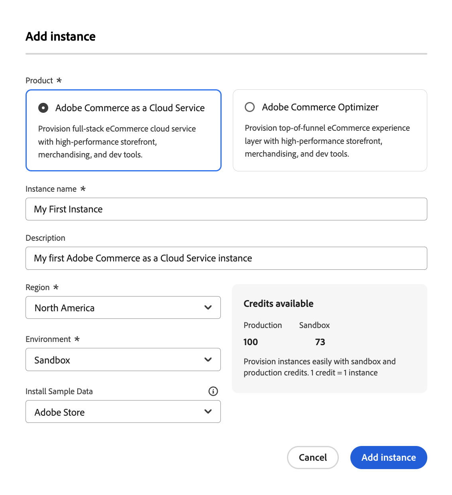

# Getting started

[!DNL Adobe Commerce as a Cloud Service] provides most configuration out of the box. After completing a few basic setup processes, your store will be up and running in no time. This guide walks you through creating and working with an instance. This guide also helps you set up your organization for success by ensuring your teams have proper access to [!DNL Adobe Commerce as a Cloud Service] and the tools you need to get started.

[!DNL Adobe Commerce as a Cloud Service] is a cloud-native commerce platform that provides flexibility, scalability, and efficiency for delivering digital commerce experiences. This SaaS offering is a fully managed, versionless platform that provides a seamless upgrade experience without the need for manual intervention.

## Key elements

[!DNL Adobe Commerce as a Cloud Service] consists of the following key elements:

* **[Adobe Experience Cloud](https://experience.adobe.com/)** - Your central entry point to all [!DNL Adobe Commerce] products at [experience.adobe.com](https://experience.adobe.com/)
  * Click [!UICONTROL **Commerce**] under [!UICONTROL **Quick Access**] to open the Commerce Cloud Manager
* **[Commerce Cloud Manager](https://experience.adobe.com/#/commerce/cloud-service)** - Create and manage instances, access API URLs, and your Commerce Admin
* **Commerce Admin** - Manage products, orders, customers, and store configuration
* **[Storefront powered by Edge Delivery Services](./storefront.md)** - Create and customize customer-facing storefront using a composable, high-performance system that delivers exceptional speed, SEO, and user experience for merchants and developers
* **[Adobe Developer App Builder](https://developer.adobe.com/app-builder/)** - Build custom integrations using App Builder, along with other extensibility tools like the [integration starter kit](https://developer.adobe.com/commerce/extensibility/starter-kit/integration/) and [API Mesh](https://developer.adobe.com/graphql-mesh-gateway/)

## Onboarding

Onboarding is the process where your system administrator, merchants, and developers, set up [!DNL Adobe Commerce as a Cloud Service] for your organization, including provisioning cloud resources and assigning users to appropriate roles based on their responsibilities.

### Onboarding workflow

As a combined group, the system administrator, merchant, and developer need to follow these essential steps (in order)to get your Commerce instance up and running:

1. **All Users**: [Create an instance](#create-an-instance) (start with sandbox)
1. **System Administrator**: [Add users and assign roles](user-management.md#add-users-and-admins)
1. **Merchants**: [Access the Commerce Admin](#access-an-instance) and [import your catalog](#import-your-catalog)
1. **Developers**: [Set up your storefront](storefront.md) and explore the [developer platform](overview.md#developer-platform)

### Role-based onboarding tasks

Select a tab below to see high-level workflow graphics for the corresponding role:

>[!BEGINTABS]

>[!TAB Administrator and merchant workflow]

This diagram provides a high-level overview of how administrators and merchants access and manage [!DNL Adobe Commerce as a Cloud Service] instances. See the [Adobe Admin Console Guide](https://helpx.adobe.com/enterprise/admin-guide.html) for more information about administrator workflows.

![[!DNL Adobe Commerce as a Cloud Service] merchant flow diagram](./assets/merchant-flow.svg){zoomable="yes"}

>[!TAB Developer workflow]

This diagram provides a high-level overview of how developers create integrations for [!DNL Adobe Commerce as a Cloud Service] using App Builder. See the [API documentation](https://developer.adobe.com/commerce/webapi/rest/) for more information.

![[!DNL Adobe Commerce as a Cloud Service] developer flow diagram](./assets/developer-flow.svg){zoomable="yes"}

>[!ENDTABS]

Select your role to find resources to get started with your onboarding process:

>[!BEGINTABS]

>[!TAB System administrator]

As a system administrator, you are responsible for setting up the organization and managing user access.

| Task | Description | Resource |
|------|-------------|----------|
| Understand the platform | Learn about Adobe Commerce as a Cloud Service architecture and benefits | [Overview](overview.md) |
| Compare features | Understand differences between Cloud Service and other Adobe Commerce offerings | [Feature comparison](feature-comparison.md) |
| Create an instance | Provision sandbox and production environments | [Create an instance](#create-an-instance) |
| Set up user management | Add users, assign roles, and manage permissions | [User Management](user-management.md) |

>[!TAB Merchant]

As a merchant, you will focus on managing products, orders, and storefront content.

| Task | Description | Resource |
|------|-------------|----------|
| Access your instance | Log into the Commerce Admin to manage your store | [Access an instance](#access-an-instance) |
| Explore use cases | Learn practical business scenarios and workflows | [Use Cases](./use-cases.md) |
| Import catalog | Learn about how to import your product data to the platform | [Import your catalog](#import-your-catalog) |

>[!TAB Developer]

As a developer, you will need to know how to build custom integrations and extend platform functionality.

| Task | Description | Resource |
|------|-------------|----------|
| Understand architecture | Learn about the platform's extensibility and APIs | [Overview - Developer platform](overview.md#developer-platform) |
| Set up a development environment | Create a sandbox instance for development and testing | [Create an instance](#create-an-instance) |
| Build storefront | Learn how to set up and customize the Commerce Storefront | [Storefront setup](./storefront.md) |
| Configure your storefront | Learn about how to set up your storefront | [Storefront setup](./storefront.md) |
| Explore integration options | Learn about App Builder, API Mesh, and other extensibility tools you have access to | [Overview - Developer platform](overview.md#developer-platform) |

>[!ENDTABS]

### What is next

After completing your role-specific onboarding tasks:

* **System Administrators**: Review [shared responsibility](shared-responsibility.md) guidelines
* **Merchants**: Explore [use cases](use-cases.md) for common business scenarios
* **Developers**: Check out the [Adobe Commerce developer documentation](https://developer.adobe.com/commerce/docs)

## Adobe Commerce as a Cloud Service basics

The following sections describe the basic processes you need to complete to get your Commerce instance up and running.

### Create an instance

>[!NOTE]
>
>Before you can create an instance, your organization's product admin or system admin must add you as a user of the [!DNL Adobe Commerce as a Cloud Service] product. See [Add users and admins](./user-management.md#add-users-and-admins) for more information.

[!DNL Adobe Commerce as a Cloud Service] instances use a credit-based system. You can create multiple instances, but each instance requires a relative amount of credits. The amount of credits you have initially depends on your subscription.

1. Log in to your [Adobe Experience Cloud](https://experience.adobe.com/) account.

1. Under [!UICONTROL Quick access], click [!UICONTROL **Commerce**] to open the [!UICONTROL Commerce Cloud Manager]. 

   The [!UICONTROL Commerce Cloud Manager] displays a list of [!DNL Adobe Commerce as a Cloud Service] instances that are available in your Adobe IMS organization.

1. Click [!UICONTROL **Add Instance**] in the top-right corner of the screen.

    {width="50%" align="center" zoomable="yes"}

1. Select [!UICONTROL **Commerce as a Cloud Service**].

1. Enter a **Name** and **Description** for your instance.
 
1. Choose the [!UICONTROL **Environment Type**] for your instance. You can choose between the following options:

   * [!UICONTROL **Sandbox**] - Ideal for design and testing purposes. You should begin your [!DNL Adobe Commerce as a Cloud Service] journey by using the sandbox environment.
   * [!UICONTROL **Production**] - For live stores and customer-facing sites.

   >[!NOTE]
   >
   >* Sandbox instances are limited to the North America region.
   >* The option to install sample data is currently unavailable.

1. Select the region where you want your instance hosted.

   >[!NOTE]
   >
   >Once you have created your instance, you will not be able to modify the region.

1. Click [!UICONTROL **Add Instance**].

### Access an instance

After you create an instance, you can access it from the [!UICONTROL Commerce Cloud Manager].

1. Log in to your [Adobe Experience Cloud](https://experience.adobe.com/) account.

1. Under [!UICONTROL Quick access], click [!UICONTROL **Commerce**] to open the [!UICONTROL Commerce Cloud Manager]. 

   The [!UICONTROL Commerce Cloud Manager] displays a list of instances that are available in your Adobe IMS organization.

1. To open the [!UICONTROL Commerce Admin] for an instance, click the instance name.

>[!TIP]
>
>To see information about your instance, including the REST and GraphQL endpoints and the Admin URL, click the information icon next to the instance name.

The base URLs for your Admin and endpoints differ based on region and environment, using the following pattern:

* Admin
  * North America production Admin: `https://na1.admin.commerce.adobe.com`
  * North America sandbox Admin: `https://na1-sandbox.admin.commerce.adobe.com` 
  * Europe production Admin: `https://eu1.admin.commerce.adobe.com`
* REST and GraphQL
  * North America production GraphQL: `https://na1.api.commerce.adobe.com`
  * North America sandbox GraphQL: `https://na1-sandbox.api.commerce.adobe.com`
  * Europe production GraphQL: `https://eu1.api.commerce.adobe.com`

### Import your catalog

By default, [!DNL Adobe Commerce as a Cloud Service] instances do not include any product data. You have an option to include sample product data when you create an instance for testing and learning purposes before importing your own catalog.

There are two ways to import your catalog into [!DNL Adobe Commerce as a Cloud Service]:

* [**Commerce Admin**](https://experienceleague.adobe.com/en/docs/commerce-admin/systems/data-transfer/import/data-import) - A user-friendly interface that allows you to import your catalog data in a few clicks.
* [**Import JSON API**](https://developer.adobe.com/commerce/webapi/rest/modules/import/#import-json-api) - A REST API that allows you to import your catalog data programmatically.

### Set up the storefront

Now that you have created an instance, you are ready to [set up your storefront](storefront.md) powered by Edge Delivery Services.

## Additional resources

* [Release notes](release-notes.md)
* [Migration guide](migration/overview.md)
* [Commerce Storefront documentation](https://experienceleague.adobe.com/developer/commerce/storefront/)
