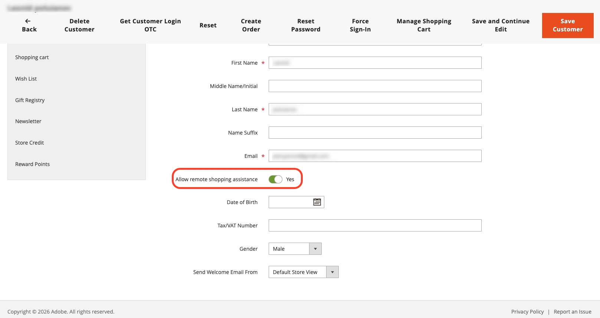
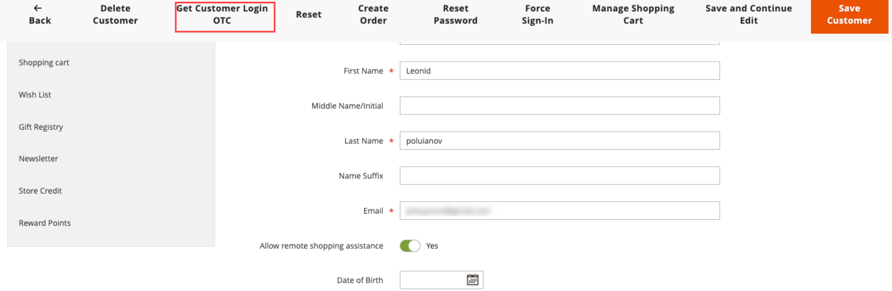

# Login as a Customer

{{accs-sandbox-experimental}}

The Login as Customer OTC (One-Time Code) feature allows admin users to generate a short-lived, single-use code for a customer. This code can be exchanged for a customer access token through GraphQL, enabling passwordless **Login as Customer** workflows for seller-assisted shopping scenarios.

Login as a customer is comprised of the following components:

* **Admin UI** - On the customer edit page, administrators can request a one-time code (OTC) instead of directly logging in as a customer.
* **REST API** - A programmatic endpoint for OTC generation, useful for admin scripts and third-party integrations.
* **GraphQL API** - Mutations that exchange an OTC for a customer access token for storefront or headless commerce flows.

## Generate a one-time code from the Admin

The Login as Customer OTC replaces the standard login as customer button on the customer edit page with a [!UICONTROL **Get Customer Login OTC**] button. The generated one-time code can then be used with the storefront or GraphQL for seller-assisted shopping.

>[!NOTE]
>
>The **Login as Customer** button is not available on the Order, Invoice, Shipment, and Credit Memo pages.

### Prerequisites

You must meet the following requirements before using the login as a customer feature:

* **Admin permission** - The admin user must have the `Magento_LoginAsCustomer::login` Access Control List (ACL) permission enabled in their admin role.

* **Customer consent** - The customer must have the `login_as_customer_assistance_allowed` extension attribute set to **2**. This can be configured on the **Edit Customer** page in the Admin or through GraphQL when creating or editing a customer.

  {width="600" zoomable="yes"}

* **Login as Customer extension enabled** - The login as customer functionality is unavailable when the login as customer extension is disabled. To verify the extension is enabled, navigate to [!UICONTROL **Stores**] > [!UICONTROL **Configuration**] > [!UICONTROL **Customers**] > [!UICONTROL **Login as Customer**] > [!UICONTROL **Enable Extension**].

### Request a One-Time Code (OTC)

1. Navigate to [!UICONTROL **Customers**] and select a customer to open the edit page.

1. On the Edit Customer page, click [!UICONTROL **Get Customer Login OTC**].

   {width="600" zoomable="yes"}

1. Enter a [!UICONTROL **Reason**] (required) and click [!UICONTROL **Request**].

   {width="600" zoomable="yes"}

   >[!NOTE]
   >
   >The **Reason** field is required. It is passed to the OTP generation flow and is reserved for use in upcoming audit and event logging features.

1. The generated OTC is displayed in the modal. Use this code with the `generateCustomerToken` or `exchangeOtpForCustomerToken` GraphQL mutation for customer authorization.

   {width="300" zoomable="yes"}

>[!IMPORTANT]
>
>The generated OTC is valid for 30 seconds by default and is invalidated after a single use. The TTL can be configured through CPS using the `customer/otp/ttl_seconds` setting.

## Generate a one-time code using the REST API

The REST API provides a programmatic way to generate an OTC for a customer. This is useful for admin UIs, scripts, or third-party integrations that need to trigger OTC issuance consistently. 

### REST contract

|Item|Value|
|---|---|
|**Method**|POST|
|**URL**|`/rest/V1/customer/:customerId/otp`|
|**Authentication**|Admin token (Bearer). Required ACL: `Magento_LoginAsCustomer::login`.|
|**Request body**|JSON with optional `reason` field. Used for auditing and logging.|
|**Success response**|HTTP 200, JSON with `otp` (32-character hex string).|
|**Error responses**|Standard Web API errors (for example, 401, 403). If Login as Customer assistance is disabled for the customer, may surface as 500 or a mapped exception.|

### Request example

```bash
POST /rest/V1/customer/:customerId/otp
Content-Type: application/json
```

```json
{"reason": "Support session"}
```

### Response example

```json
{"otp": "a1b2c3d4e5f6789012345678abcdef01"}
```

## Exchange a one-time code for a customer token using GraphQL

After generating an OTC (from the Admin UI or REST API), use one of the following GraphQL mutations to exchange it for a customer access token.

### `generateCustomerToken` mutation

The `generateCustomerToken(email, password)` mutation returns a customer token. The `password` argument is evaluated in the following order:

1. **Customer password (default)** - The customer's account password.
1. **Customer Reset Password Token (one-time use)** - A valid token from **Forgot password** (for example, the `requestPasswordResetEmail` mutation). Consumed on first use.
1. **Admin-generated OTC (one-time code)** - A code generated by an admin for the customer through the REST API or Admin UI. One-time use, short-lived (30 seconds by default).

**Schema:**

```graphql
type Mutation {
  generateCustomerToken(email: String!, password: String!): CustomerToken
}

type CustomerToken {
  token: String!
}
```

**Example: login with admin OTC**

```graphql
mutation GenerateCustomerToken($email: String!, $password: String!) {
  generateCustomerToken(email: $email, password: $password) {
    token
  }
}
```

Variables (use the OTC as `password`):

```json
{
  "email": "customer@example.com",
  "password": "<admin-generated-OTC>"
}
```

**Example: login with password**

```graphql
mutation GenerateCustomerToken($email: String!, $password: String!) {
  generateCustomerToken(email: $email, password: $password) {
    token
  }
}
```

Variables:

```json
{
  "email": "customer@example.com",
  "password": "CustomerPassword123"
}
```

**Example: login with password reset token**

After the customer requests a password reset (for example, `requestPasswordResetEmail`), the reset token received through the email link can be used as `password` in `generateCustomerToken` (one-time use).

```graphql
mutation GenerateCustomerToken($email: String!, $password: String!) {
  generateCustomerToken(email: $email, password: $password) {
    token
  }
}
```

Variables (use the reset token as `password`):

```json
{
  "email": "customer@example.com",
  "password": "<reset-password-token-from-email-link>"
}
```

**Example response:**

```json
{
  "data": {
    "generateCustomerToken": {
      "token": "<customer-access-token>"
    }
  }
}
```

### `exchangeOtpForCustomerToken` mutation

The `exchangeOtpForCustomerToken` mutation exchanges a password reset token or OTP generated by an admin for a customer access token. The OTP is invalidated after successful exchange (one-time use). This endpoint respects reCAPTCHA configuration.

**Schema:**

```graphql
type Mutation {
  exchangeOtpForCustomerToken(
    email: String!
    otp: String!
  ): CustomerToken
}

type CustomerToken {
  token: String!
}
```

**Example request:**

```graphql
mutation ExchangeOtpForCustomerToken($email: String!, $otp: String!) {
  exchangeOtpForCustomerToken(email: $email, otp: $otp) {
    token
  }
}
```

Variables:

```json
{
  "email": "customer@example.com",
  "otp": "<one-time-password>"
}
```

**Example response:**

```json
{
  "data": {
    "exchangeOtpForCustomerToken": {
      "token": "<customer-access-token>"
    }
  }
}
```

### Mutation summary

|Mutation|Use case|
|---|---|
|`generateCustomerToken(email, password)`|Single entry point: customer password, Password Reset Token, Admin OTC, or OTP (tried after password/reset).|
|`exchangeOtpForCustomerToken(email, otp)`|OTP or Reset Password Token exchange. OTP (or Reset Password Token) is consumed after use.|

Password Reset Token and Admin OTC are both passed as the `password` argument to `generateCustomerToken`. The resolver detects the token type and validates accordingly.
