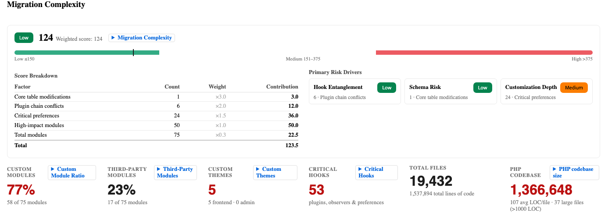
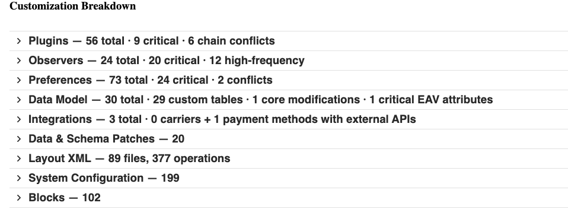
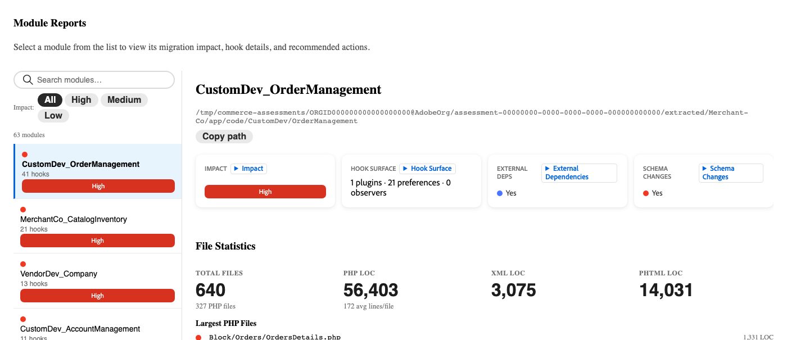

# Migration Assessment

>[!IMPORTANT]
>
> The Migration Assessment is only available when migrating [!DNL Adobe Commerce on Cloud Infrastructure] or [!DNL Adobe Commerce on-premises] projects to [!DNL Adobe Commerce as a Cloud Service].

A Commerce migration assessment is an automated analysis of your existing Adobe Commerce implementation. Adobe's tooling scans your Commerce codebase and produces a structured report that inventories everything built, customized, or modified. The report then indicates how the customizations made to your codebase impact your migration to [!DNL Adobe Commerce as a Cloud Service].

Processed migration assessment reports are accessible at `https://experience.adobe.com/@<ims-org-name>/commerce-migration-assessment/shared-assessments`. No access to your production environment is required, except initially sharing your project codebase.

**The assessment provides:**

- A complete inventory of every custom module in your store, organized by type and impact level
- A migration complexity rating (High, Medium, or Low) computed from risk-predictive metrics
- A prioritized view of the highest-impact backend and storefront areas requiring migration planning
- A description of each custom module, that you can use as direct input for Adobe's AI developer tools

## Understanding the migration assessment report

The report is organized into three tabs: **[!UICONTROL Summary]**, **[!UICONTROL Module Reports]**, and **[!UICONTROL Report Reliability]**.

>[!NOTE]
>
>Not all sections of the report apply to every store. The assessment is designed to be comprehensive across all possible customization types and complexity drivers, but your store has only a subset of the sections listed here.

## Summary tab

The **[!UICONTROL Summary]** tab provides an overview of key signals organized into these areas: 

- Migration Complexity
- File Type Breakdown
- Highest-Impact Modules
- Migration Drivers
- Customization Breakdown

### Migration complexity

The Migration Complexity section contains the assessment rating for your store overall. It explains how the score was calculated and highlights your primary risk drivers.

**Migration Complexity and Complexity Score**

{width="600" zoomable="yes"}

The Complexity Score weights each input by how difficult it is to migrate. The score maps to a Migration Complexity rating using fixed thresholds:

| Rating | Score range | Typical migration approach |
| --- | --- | --- |
| Low | 150 or below | Standard migration - direct migration with payment provider coordination and data migration as parallel workstreams. |
| Medium | 151–375 | Modular migration - migrated in segments, triaging high-impact custom modules. |
| High | Above 375 | A phased migration, likely lasting 12–24 months. |

**Custom Module Ratio**

{width="600" zoomable="yes"}

The percentage of your modules that were built specifically for your implementation. A higher ratio means more custom code must be audited and migrated. The average customer's Custom Module Ratio is approximately 62%.

>[!TIP]
>
>Custom Module Ratio is a scope signal, not a complexity signal. A store with 80% custom modules that are isolated and low-risk could be easier to migrate than a store with 40% higher risk custom modules. Use the Complexity Score and the number of chain conflicts to assess difficulty. Use the Custom Module Ratio to estimate volume.

**File Type Breakdown**

{width="600" zoomable="yes"}

A list of the number of files in your codebase, organized by type.

**Highest-Impact Modules**

{width="600" zoomable="yes"}

A curated list of the specific modules in your store requiring the most migration attention. These modules are often modules that interact with checkout, payments, or order management. Each high-impact module needs its own migration plan. This list is the best starting point for conversations with your technical team.

### Storefront complexity

{width="600" zoomable="yes"}

The Storefront Complexity section surfaces the effort required to migrate your store's front-end presentation layer. This workstream is a distinct workstream from backend code migration, addressed by front-end developers and typically requiring separate planning conversations.

>[!NOTE]
>
>A store can have low backend complexity and high storefront complexity. Always review both sections before scoping migration effort.

- Custom theme - The namespace of your store's custom theme (for example, BrandName_Theme). The presence of a custom theme means a full theme rebuild is required for [!DNL Adobe Commerce as a Cloud Service]. Every assessed store with a custom theme namespace must plan a dedicated front-end migration workstream.

- Total blocks - The number of block and template (.phtml) files in your store. Blocks are the primary server-side rendering artifacts, each one represents a discrete migration task.

| Block count | Effort |
| --- | --- |
| Under 100 | Baseline - standard effort |
| 100–300 | Medium - plan a structured front-end wave |
| Over 300 | High - prioritize as a dedicated workstream |

### Migration drivers

{width="600" zoomable="yes"}

The Migration Drivers section displays the top factors driving your complexity rating.

| Driver | Definition |
| --- | --- |
| Customization Footprint | The overall volume of custom code relative to total implementation |
| Plugins and Observers | Code that intercepts core platform behavior at runtime |
| Class Preferences | A fragile customization pattern, which replaces core classes entirely, and breaks silently on upgrades |
| Data Model | Custom and modified database structures |
| Integrations | External systems connected to your store |

Each driver appears with a High, Medium, or Low effort. Address the highest-rated drivers first when scoping and planning.

### Data model

{width="600" zoomable="yes"}

The Data Model section displays a count of custom tables, modifications to the [!DNL Adobe Commerce] core database tables, and critical Entity-Attribute-Value (EAV) attributes.

Core table modifications are the most difficult category to migrate, because they create dependencies on a specific platform schema version and have a high impact in the Complexity Score formula.

>[!TIP]
>
>If your report lists more than 15 core table modifications, plan a dedicated data migration workstream before scoping backend module migration.

## Customization breakdown

{width="600" zoomable="yes"}

The Customization Breakdown section provides detailed metrics across every category of customization in your store. 

>[!NOTE]
>
>Not all subsections appear in every report, only the categories detected in your codebase are displayed.
>
>Subsections that affect the front-end presentation layer are a distinct workstream from backend code migration and typically require separate planning conversations.
>
>A store can have low backend complexity and high front-end complexity. Always review both backend and storefront-related subsections before scoping the migration effort.

### Layout XML

The number of Layout XML files and their total operation count. Layout XML defines the structure of every page, including which blocks appear, the containers they appear in, and the page types they are under.

A high file count with many operations signals significant page structure customization that must be re-architected.

### Core handle overrides

The number of places where your Layout XML overrides a core [!DNL Adobe Commerce] page handle (for example, `checkout_cart_index` or `catalog_product_view`). Core handle overrides are the highest-risk layout signal because they modify page structure at the platform level and require explicit rebuilding.

| Override count | Effort |
| --- | --- |
| 0 | No core layout overrides |
| 1–3 | Runtime risk - each override needs an explicit layout rebuild |
| 4 or more | Critical - plan for a dedicated layout migration sprint |

### Blocks

The number of block and template (`.phtml`) files in your store. Blocks are the primary server-side rendering artifacts. Each block represents a discrete migration task.

| Block count | Effort |
| --- | --- |
| Under 100 | Baseline - standard effort |
| 100–300 | Medium - plan a structured front-end wave |
| Over 300 | High - prioritize as a dedicated workstream |

### High-risk blocks

Blocks that touch core render paths, such as checkout rendering, cart display, and similar front-end surfaces. Any high-risk blocks require individual migration assessment before scheduling.

### Themes and email templates

The namespace of your store's custom theme (for example, `BrandName_Theme`). The presence of a custom theme means a full theme rebuild is required. Every assessed store with a custom theme namespace must plan a dedicated front-end migration workstream.

### Template overrides (core modified)

The number of core [!DNL Adobe Commerce] `.phtml` templates that have been overridden. Each core template override creates a dependency on a specific version of that template. Platform updates that change the template break the override silently.

### Drop-in migration required

[!DNL Adobe Commerce as a Cloud Service] uses a modular drop-in component architecture for storefront surfaces including checkout, cart, and product detail. Customizations to these surfaces must be rebuilt as drop-in components. These customizations can cover a wide range of functionality, such as adding custom checkout steps, modifying cart display logic, or extending the product detail page.

The [!UICONTROL Drop-in migration required] field indicates which storefront areas require drop-in rebuilds.

>[!IMPORTANT]
>
>If **Checkout** is listed as a drop-in migration requirement, plan a dedicated checkout drop-in workstream. This task is the most complex and business-critical storefront migration task.

## Module Reports tab

{width="600" zoomable="yes"}

The **[!UICONTROL Module Reports]** tab contains a dedicated entry for every custom module in your store. Share this information with your technical team.

For each module, the report displays:

| Field name | Definition |
| --- | --- |
| What it does | A description of the custom module's purpose and business function |
| Impact level | **High**, **Medium**, or **Low** impact based on what commerce behavior the module touches |
| Hook count | The number of webhooks, which indicates how many places this module intercepts core platform behavior |
| Migration recommendation | **Rebuild**, **Refactor**, **Replace** with a native feature, or **Remove** |
| Dependencies | Which other modules this module interacts with, which can inform migration sequencing |

**Workflow**

1. Filter to **High-impact** modules first. These drive the most migration effort and cost.
1. For each custom module, determine answers to the following questions:
   - Is this module still actively used?
   - Could the module be replaced by a native [!DNL Adobe Commerce as a Cloud Service] feature?
   - If the module must be rebuilt, what functionality does its replacement need to provide?
1. Identify custom modules that can be retired or replaced. Each one reduces migration scope before any code is written.
1. Copy the description of each custom module with the **Rebuild** migration recommendation. These descriptions can be given directly to Adobe's AI developer tools, refer to [AI developer tools for Commerce extensibility](#ai-developer-tools-for-commerce-extensibility) for more information.

## Reference: key terms

| Term | Definition |
| --- | --- |
| **Module** | A customized, self-contained package of functionality. Your store could have anywhere from twenty modules to hundreds of modules. |
| **Plugin (interceptor)** | Code that intercepts a Commerce function and changes its behavior before, during, or after it runs. |
| **Observer** | Code that listens for a specific platform event, such as "order placed", and runs custom logic when that event fires. |
| **Preference (class override)** | A fragile customization type that completely replaces a core Commerce class, which breaks silently when the platform upgrades that class. |
| **Chain conflict** | When two or more plugins intercept the same function and one fails to pass control to the next. This can cause features to stop working silently, with no error message. |
| **Core table modification** | A structural change to Commerce's built-in database tables, which creates an irreversible dependency on a specific platform schema version. These carry the highest weight in the Complexity Score formula. |
| **Entity-Attribute-Value (EAV)** | A flexible custom field added to products or customers, for example, a custom "warranty period" field. High EAV counts increase data migration complexity. |
| **Hook density** | The average number of plugins and observers per module. Higher density means customization is more tightly woven into the core platform. |
| **Drop-in** | [!DNL Adobe Commerce's] modular approach to storefront components (including checkout, cart, and product detail pages). Custom checkout behavior on [!DNL Adobe Commerce on Cloud Infrastructure] or [!DNL Adobe Commerce on Premises] typically requires a Drop-in rebuild on [!DNL Adobe Commerce as a Cloud Service]. |
| **App Builder** | Adobe's out-of-process extensibility platform and the recommended way to build custom functionality, replacing in-process PHP extensions. |
| **Layout XML** | Configuration files that define which blocks appear on which pages. Custom layout XML must be re-architected for [!DNL Adobe Commerce as a Cloud Service's] page structure. |
| **Core handle override** | A layout XML customization that modifies a core Commerce page structure globally. These have the highest-risk layout pattern for migration. |

## AI developer tools for Commerce extensibility

You can use the module descriptions in the **[!UICONTROL Module Reports]** tab as prompts for Adobe's AI developer tooling. The tooling assists you in building and deploying a replacement extension that is compatible with [!DNL Adobe Commerce as a Cloud Service].

### What the tools provide

Adobe's [AI developer tools for Commerce extensibility](https://developer.adobe.com/commerce/extensibility/developer-agent/) include two primary capabilities.

- [!DNL Adobe Commerce] [!DNL App Builder] MCP server - A Model Context Protocol (MCP) integration that connects AI coding assistants directly to [!DNL Adobe Commerce] documentation, APIs, and App Builder development patterns. Developers can describe what they want to build and the MCP server provides Commerce-aware code generation, architecture guidance, and deployment automation within the IDE.
- Agent skills - Pre-built AI skills covering common Commerce extensibility patterns, such as REST APIs, checkout extensions, storefront components, and event-driven integrations. Skills guide the AI through architecture, implementation, testing, and deployment steps specific to [!DNL Adobe Commerce as a Cloud Service] and [!DNL App Builder].

#### Install AI tools

Refer to [installing the AI developer tools](https://developer.adobe.com/commerce/extensibility/developer-agent/coding-tools) for full instructions and specific IDE configurations.

**Prerequisites:** Node.js 22.x, npm 9.0.0 or higher, Adobe I/O CLI.

Install command:

```bash
aio commerce extensibility tools-setup
```

### Create prompts from the assessment report

While the assessment gives you a blueprint for development, the AI tools allow your team to start building immediately, before a full migration plan is finalized.

1. Open the **[!UICONTROL Module Reports]** tab and find a High-impact module with a **Rebuild** recommendation.
1. Read the module's description, for example:

  ```shell-session
  Manages custom shipping rate calculations based on customer account tier and order    weight thresholds.
  ```

1. Open your IDE, for example GitHub Copilot, Cursor, or Claude with the Commerce extensibility MCP server enabled.
1. Use the module description to prompt the AI agent.
1. Review the scaffolded [!DNL App Builder] application and iterate with the agent to refine the implementation.

## Next steps

1. Open the **[!UICONTROL Summary]** tab. Review Migration Complexity and Highest-Impact Modules, then check the Customization Breakdown subsections. If your store has a custom theme, high-risk blocks, or a Checkout Drop-in listed, plan a parallel front-end workstream alongside the backend migration.
1. Share the **[!UICONTROL Module Reports]** tab with your technical team or development partner. Ask them to flag any custom modules that are no longer actively used or that could be replaced by an [!DNL Adobe Commerce as a Cloud Service] feature.
1. Start building your customizations. Use the module descriptions as AI tool input to begin scaffolding compatible extensions.
1. Schedule a walkthrough call with your Adobe account team. Adobe can review the findings with you, answer any questions about specific modules and storefront signals, and help you map the migration approach for your complexity profile.

## Resources

- [!DNL Adobe Commerce as a Cloud Service]
  - [Overview](../overview.md)
  - [Migration overview](./overview.md)
  - [Ratings extension tutorial](../tutorials/ratings-extension.md)
  - [Shipping method tutorial](../tutorials/shipping-method-extension.md)
- Extensibility
  - [Overview](https://developer.adobe.com/commerce/extensibility/)
  - [AI developer tools](https://developer.adobe.com/commerce/extensibility/developer-agent/)
    - [Best practices](https://developer.adobe.com/commerce/extensibility/developer-agent/best-practices)
    - [Setup](https://developer.adobe.com/commerce/extensibility/developer-agent/coding-tools)
    - [Skills and prompts](https://developer.adobe.com/commerce/extensibility/developer-agent/skills-and-prompts)
    - [Use cases](https://developer.adobe.com/commerce/extensibility/developer-agent/use-cases)
  - [App Builder overview](https://developer.adobe.com/app-builder/docs/intro_and_overview/)
  - [App Builder for Adobe Commerce](https://experienceleague.adobe.com/en/docs/commerce-learn/tutorials/extensibility/adobe-developer-app-builder/introduction-to-app-builder)
  - Starter kits
    - [Backend integration starter kit](https://developer.adobe.com/commerce/extensibility/starter-kit/integration/)
    - [Checkout starter kit](https://developer.adobe.com/commerce/extensibility/starter-kit/checkout/)
- Storefront development
  - [Overview](https://experienceleague.adobe.com/developer/commerce/storefront/)
  - [Storefront AI skills](https://experienceleague.adobe.com/developer/commerce/storefront/boilerplate/ai-agent-skills/)

>[!TIP]
>
>Contact your solution account manager to request a migration assessment of your existing instance.
