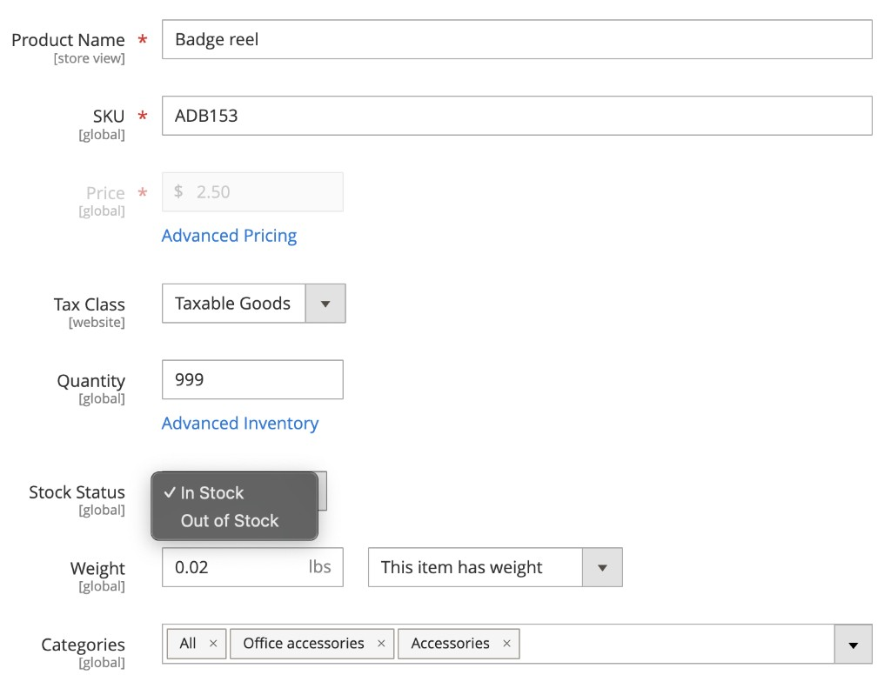

# In-stock notification extension tutorial

This tutorial guides you through building an in-stock notification extension for [!DNL Adobe Commerce as a Cloud Service] using [!DNL Adobe App Builder] and AI-assisted development tools. The extension lets shoppers subscribe to out-of-stock products and receive a notification when the product is back in stock.

You build two parts:

- **App Builder extension** — A REST API for managing out-of-stock subscriptions (create, read, delete) with event-driven and scheduled back-in-stock detection.
- **Storefront integration** — A subscription form on the product detail page (PDP) that appears only when the selected product or variant is out of stock.

>[!NOTE]
>
>AI agents are non-deterministic. The prompts, questions, and outputs in this tutorial are examples. Your agent may produce different questions, requirements, or architecture proposals. Use the examples in this tutorial to steer the agent toward a similar outcome.

Before you begin, complete the [prerequisites](./tutorial-prerequisites.md). This tutorial uses the **integration starter kit**. Verify that you have already cloned it and completed the setup steps described on the prerequisites page.

## Verify prerequisites

Verify that the following prerequisites are installed:

```bash
# Check Node.js version (should be 22.x.x)
node --version

# Check npm version (should be 9.0.0 or higher)
npm --version

# Check Git installation
git --version

# Check Bash shell installation
bash --version
```

If any of the preceding commands do not return the expected results, refer to the [prerequisites](./tutorial-prerequisites.md) for guidance.

Additionally, verify the following:

- You have an [!DNL Adobe Commerce as a Cloud Service] instance with product data. See [Commerce Cloud Service instances](https://experienceleague.adobe.com/en/docs/commerce/cloud-service/overview){target="_blank"}.
- You have a storefront project connected to your [!DNL Commerce] instance. If you do not have one, follow the steps in [Create a storefront](https://experienceleague.adobe.com/developer/commerce/storefront/get-started/create-storefront/){target="_blank"}.
- The `aem` CLI is installed:

  ```bash
  npm install -g @adobe/aem-cli
  ```

## Extension development

This section guides you through developing an in-stock notification extension for [!DNL Adobe Commerce as a Cloud Service] using AI-assisted development tools. The extension provides a REST API for subscription management and detects when products come back in stock through Commerce events and a scheduled check.

1. Navigate to the MCP settings in your coding agent.

   For example, in Cursor, go to **[!UICONTROL Cursor]** > **[!UICONTROL Settings]** > **[!UICONTROL Cursor Settings]** > **[!UICONTROL Tools & MCP]**. Verify that the `commerce-extensibility` toolset is enabled without errors. If you see errors, toggle the toolset off and on.

   >[!NOTE]
   >
   >When working with AI-assisted development tools, expect natural variations in the code and responses generated by the agent.
   >If you encounter any issues with your code, ask the agent to help you debug it.

1. If you have any documentation added to Cursor's context, disable it.

    Navigate to **[!UICONTROL Cursor]** > **[!UICONTROL Settings]** > **[!UICONTROL Cursor Settings]** > **[!UICONTROL Indexing & Docs]** and delete any documentation listed.

### Step 1: Provide the initial prompt

Prompt the AI agent to begin the implementation. Telling the agent to stop and ask questions helps you steer the implementation early.

Enter the following prompt in the agent's chat window:

```shell-session
Implement an Adobe Commerce as a Cloud Service extension to handle out-of-stock notifications for products.

The service should provide REST API endpoints for basic create, read, update, and delete (CRUD) operations on out-of-stock notifications, allowing storefronts to manage notifications for specific product SKUs.

Back-in-stock is detected by an inventory or product event or a scheduled action that checks Commerce API and then calls the REST API to send the notification.

STOP and ask me any clarifying questions you have about the requirements before you do any work.
```

>[!TIP]
>
>Telling the agent to STOP and ask questions before proceeding helps you steer the implementation early in the process. This process ensures that key assumptions and missing requirements are identified early and is required to initiate the guided workflow in this tutorial.

### Step 2: Answer the agent's questions

The agent returns with a series of questions it needs before it can start forming a solution. The following example shows typical questions and answers. Your agent may ask different questions, but the topics are generally the same.

**Example agent questions:**

1. **REST API — host and consumers** — Should the CRUD REST API be part of this App Builder app (for example, web actions on Adobe I/O Runtime) that storefronts call? Who will call it (EDS Storefront, custom/headless storefront, or both)? Do you need CORS, public (unauthenticated) access, or will callers use API keys, OAuth, or Commerce tokens?
1. **Data model** — What should one "notification" represent? Customer identifier (email only, or also customer ID)? Product identifier (SKU only, or SKU + store view)? Can the same customer subscribe to the same SKU multiple times, or should subscriptions be deduplicated?
1. **Back-in-stock detection — event vs scheduled** — Do you want event-driven detection (react to an inventory/product event from Commerce), scheduled detection (a scheduled action that periodically checks stock), or both? What should "send the notification" mean (call an external webhook, send email, or log it)?
1. **Back-in-stock — Commerce source** — Do you have a preferred event name, or should the design use whatever inventory/stock-updated event Commerce provides? For scheduled checks, which API should be used to get stock status by SKU?
1. **Persistence and multi-tenancy** — Is `aio-lib-state` the right place to persist subscriptions, or do you have an external store? Should the design assume multi-tenant or single-tenant?
1. **CRUD semantics and lifecycle** — Should "delete" mean cancel subscription? Do you need "update"? After a back-in-stock notification is sent, should the subscription be automatically removed or marked as notified?
1. **Non-functional** — Any rate limits or max subscriptions to enforce? Any compliance needs (double opt-in, consent flag)?

**Example answers:**

```shell-session
1. The CRUD REST API should be part of thie App Builder app. It will be called by the EDS Storefront. For this implementation there is no need for API keys or security tokens.
2. For this initial implementation the customer identifier will be the email, product is identified by SKU, customer emails should not be able to subscribe to the same SKU multiple times.
3. Implement both. For now instead of sending the notification, log it so I can audit in the adobe developer console.
4. Research and use what the best event to use that commerce already provides. Research the simplest way to get the stock status by SKU.
5. Use the aio-lib-state. Single tenant for now
6. Delete means cancel subscription. Skip Update, it does not apply for this service. After subscription is sent, it should be marked as notified or removed so it won't send again until the user subscribes again.
7. No limits. Implement minimal compliance requirements.
```

>[!NOTE]
>
>Your agent may ask different questions. Use these answers as guidance for steering the agent toward the same functional outcome: a REST API with email and SKU subscriptions, event-driven and scheduled back-in-stock detection, `aio-lib-state` persistence, and log-based notifications.

### Step 3: Review requirements and architecture

The agent generates requirements and architecture documents for you to review. Verify that the requirements match the answers you provided and that the architecture covers:

- A REST API action for subscription CRUD (create, read, delete)
- An event-driven back-in-stock handler triggered by Commerce inventory events
- A scheduled check-stock action as a fallback
- Persistence using `aio-lib-state`

>[!NOTE]
>
>AI agents are non-deterministic and their behaviors differ depending on the model and IDE. You may get a different set of questions that produce a different set of requirements and architecture. If so, try to steer the agent in a direction such that the implementation closely matches what is presented in this tutorial before proceeding.

### Step 4: Select an implementation plan

The agent gives you the option to create a detailed implementation plan, or to complete a direct implementation.

- If you want a reviewable plan that you can execute in phases with more control, select the first option.
- If you want the agent to do the full implementation with minimal intervention, select the second option.

### Step 5: Deploy, onboard, and subscribe to events

After the agent completes the implementation, it provides next steps. Deploy the app, onboard the Commerce instance, and subscribe to events using the following commands:

1. Deploy the extension:

   ```bash
   aio app deploy
   ```

1. Run the onboarding script to register the event provider with Commerce:

   ```bash
   npm run onboard
   ```

1. Subscribe to Commerce events:

   ```bash
   npm run commerce-event-subscribe
   ```

1. Validate the event subscription by navigating to your Commerce instance and opening **[!UICONTROL System]** > **[!UICONTROL Event Subscriptions]**. You should see a table of event records.

   {width="600" zoomable="yes"}

   {width="600" zoomable="yes"}

### Step 6: Test the extension

Ask the agent to provide testing steps. Since this is an API service, you can request command-line instructions:

```shell-session
Give me step by step instructions on how I can test some of these in the command line
```

Follow the steps the agent provides. The following examples show typical test commands.

**Subscribe to a SKU:**

```bash
API_URL="https://<your-runtime-url>/api/v1/web/notify-out-of-stock/api"; curl -X POST "$API_URL" \
  -H "Content-Type: application/json" \
  -d '{"email":"test@example.com","sku":"ADB153"}'
```

The response should look similar to:

```json
{
  "createdAt": "2026-03-06T22:11:00.308Z",
  "email": "test@example.com",
  "id": "b3353bf5-1007-4b10-989d-430892dd4a66",
  "sku": "ADB153"
}
```

**List all subscriptions:**

```bash
curl -X GET "$API_URL"
```

The response should return a list of all active subscriptions:

```json
{
  "subscriptions": [
    {
      "createdAt": "2026-03-06T22:11:00.308Z",
      "email": "test@example.com",
      "id": "b3353bf5-1007-4b10-989d-430892dd4a66",
      "sku": "ADB153"
    }
  ]
}
```

**Test the back-in-stock flow:**

1. Go to your Commerce instance and edit a product that you have created a subscription for.
1. Set the product stock status to **[!UICONTROL Out of Stock]**.
1. Wait about one minute and toggle the stock status back to **[!UICONTROL In Stock]**.
   
   {width="600" zoomable="yes"}

1. Wait about five minutes for the event to trigger and send to your service.
1. Open the [!DNL Adobe Developer Console] and navigate to the App Builder logs section.

   {width="600" zoomable="yes"}

1. Look for log entries that confirm the event was processed and the correct email and SKU subscription pair was identified.

   {width="600" zoomable="yes"}

>[!TIP]
>
>You can ask the agent what to look for in the logs to verify the notification action was successfully logged. You can also copy and paste the log entries to have the agent do the verification.

After the back-in-stock event processes, requesting the list of subscriptions should return one fewer entry, because the notified subscription is removed.

### Create the service contract

Now that the service implementation is complete, ask the agent to create a service contract for the storefront work:

```shell-session
Create an API service contract for the Out of Stock notification service and its endpoints. The service contract should be clear and detailed enough for a frontend developer to implement the storefront UI integration without needing to ask additional questions about the API. Name this file OUT_OF_STOCK_NOTIFICATION_CONTRACT.md
```

Copy this file into your storefront project so the storefront agent can reference it.

## Connect to the storefront

This section guides you through implementing the storefront portion of the in-stock notification extension using [!DNL Edge Delivery Services] and AI-assisted development tools. You add a subscription form to the product detail page (PDP) that appears only when the selected product or variant is out of stock.

>[!NOTE]
>
>The prompts provided are starting points. Although you can use them without modification, consider having a natural conversation with the agent.
>
>When working with AI-assisted development tools, there are always natural variations in the code and responses generated by the agent.
>
>If you encounter any issues with your code, ask the agent to help you debug it.

### Storefront prerequisites

Before starting the storefront integration, verify you have the following:

- A storefront project connected to your [!DNL Commerce] instance
- Commerce storefront AI tools [installed using the CLI](./tutorial-prerequisites.md#install-the-storefront-ai-tools)
- The `OUT_OF_STOCK_NOTIFICATION_CONTRACT.md` file copied into your storefront project

### Step 1: Validate the environment

Open your `config.json` file and verify that the values for `commerce-core-endpoint` and `commerce-endpoint` point to your [!DNL Adobe Commerce as a Cloud Service] GraphQL endpoint.

```json
"commerce-core-endpoint": "https://na1-sandbox.api.commerce.adobe.com/<your-instance-id>/graphql",
"commerce-endpoint": "https://na1-sandbox.api.commerce.adobe.com/<your-instance-id>/graphql",
```

### Step 2: Provide the initial prompt

With the service contract already in your project, prompt the agent to create the UI in the product details page. Use **Plan** mode if available in your agent, to prevent the agent from proceeding without a plan.

```shell-session
Analyze @OUT_OF_STOCK_NOTIFICATION_CONTRACT.md and add a form for subscribing to a notification for when a product is back in stock. This form should show up in the product details page underneath the add to cart and wishlist button. It should only show up when a product is out of stock. 

Use the project manager skill to plan this implementation.
```

>[!TIP]
>
>Specifically requesting to use the project manager skill triggers the phased workflow that helps you steer the implementation early in the process and gives the agent the opportunity to present you with details and requirements you may not have thought to provide in the original prompt.

### Step 3: Answer planning questions

The agent returns with a series of questions it needs before it can start forming a solution. The following example shows typical questions and answers. Your agent may ask different questions, but the topics are generally the same.

**Example agent questions:**

1. **API base URL** — How should the storefront get the notify-out-of-stock API base URL? Options may include a config block (for example, a table with `out-of-stock-api-base-url`), global placeholders or environment variables, or another approach.
1. **Copy** — Should the implementation use placeholders for success and error messages (for example, for localization), or use static English for this implementation?
1. **After successful subscribe** — Should the form hide and show only "You're subscribed" (A), keep the form visible but disabled with a success message above it (B), or another behavior (C)?
1. **Configurable products** — Should the form visibility be based on the selected variant's `inStock` value, so the form shows when the chosen variant is out of stock?

**Example answers:**

```shell-session
1. Global placeholder with baseurl value of `https://<your-runtime-url>/api/v1/web/notify-out-of-stock/api`
2. Use placeholders with static English fallback
3. B
4. Use selected variant's inStock value
```

>[!NOTE]
>
>Replace `<your-runtime-url>` with the actual [!DNL Adobe I/O Runtime] URL from your App Builder deployment.
>
>Your agent may ask different questions. Use these answers as guidance:
>
>- Use a global placeholder for the API base URL so that it can be changed without code modifications.
>- Use placeholders for user-facing copy with static English as the fallback.
>- After a successful subscription, keep the form visible but disabled with a success message above it.
>- For configurable products, use the selected variant's `inStock` value to control form visibility.

### Step 4: Review requirements and architecture

The agent updates the requirements document for you to review. Verify that:

- The form appears only when the product or selected variant is out of stock.
- The form is placed below the add-to-cart and wishlist buttons on the PDP.
- The API integration uses the base URL from a global placeholder.
- Success and error states are handled according to the contract (201, 409, 400, 503/500).

>[!NOTE]
>
>AI agents are non-deterministic and their behaviors differ depending on the model and IDE. You may get a different set of questions that produce a different set of requirements and architecture. If so, try to steer the agent in a direction such that the implementation closely matches what is presented in this tutorial before proceeding.

During **Phase 2 (Architectural Planning)**, the agent researches documentation and your codebase before proposing an architecture. Expect the agent to:

- Search [!DNL Commerce] documentation for PDP drop-in containers, slots, and event payloads.
- Scan your `blocks` directory and `scripts/initializers/` folder for existing PDP-related code.
- Explore TypeScript definitions for available containers and slot context shapes.

The agent then presents architecture options. Review the plan and instruct the agent to proceed.

### Step 5: Select an implementation plan

The agent gives you the option to create a detailed implementation plan, or to complete a direct implementation.

- If you want a reviewable plan that you can execute in phases with more control, select the first option.
- If you want the agent to do the full implementation with minimal intervention, select the second option.

During **Phase 4 (Implementation)**, the agent generates code based on the chosen architecture. Depending on the approach, the agent uses several specialized skills:

- **Content modeling:** If a new block is needed, the agent designs an author-friendly content structure.
- **Block development:** The agent creates block files following [!DNL Edge Delivery Services] conventions, including JavaScript decoration functions, scoped CSS styles, ARIA labels for accessibility, and loading and error state handling.
- **Drop-in customization:** If the architecture uses slot customization, the agent imports the correct container, uses a verified slot near the product title, and subscribes to product data events for the current SKU.

Watch the code being generated and ask questions or redirect the agent as needed.

### Step 6: Start the server and test

After the agent completes the implementation, start the development server and test the form.

1. Start the local development server:

   ```bash
   npm run start
   ```

1. In a browser, navigate to an out-of-stock product page. For example:

   ```shell-session
   http://localhost:3000/products/<out-of-stock-product-slug>/<sku>
   ```

1. Verify that the subscription form appears below the add-to-cart and wishlist buttons.

You can do manual testing or ask the agent to use its browser capabilities to test for you:

```shell-session
Run complete browser testing. Use the following out of stock product 'http://localhost:3000/products/<out-of-stock-product-slug>/<sku>'
```

{width="600" zoomable="yes"}

### Step 7: Clean up

After you skip or complete testing, the agent prompts you to proceed to the final **Cleanup** phase. Upon confirmation, the agent archives all documentation artifacts created during implementation.

## Troubleshooting

Use the following tips if you encounter issues during the tutorial:

- **API errors:** Use the CLI to send requests to the API directly to verify behaviors. For example, use `curl` to test each endpoint independently.
- **Agent errors:** Copy and paste error messages to an agent chat session to help you debug issues. The agent can diagnose common problems such as missing environment variables or misconfigured actions.
- **Event pipeline:** If back-in-stock events do not trigger, verify that you have completed the onboarding and event subscription steps. Check that `workspace.json` is in the correct location and that the Commerce Events module is enabled.
- **Stock status payload:** Commerce may send `is_in_stock` as a string (`"1"`) instead of a boolean (`true`). If the back-in-stock handler is not triggering, ask the agent to check the consumer code for strict type comparisons and update it to handle both formats.

## Tutorial recap

Here is a summary of the topics covered in this tutorial:

- **Extension development:** Describing new functionality to an AI agent and generating a working REST API with CRUD operations using [!DNL App Builder].
- **Event-driven architecture:** Configuring Commerce events and a scheduled action to detect when products come back in stock.
- **Local testing and deployment:** Testing the API with `curl` and deploying using the [!DNL Adobe I/O CLI].
- **Service contracts:** Creating API contracts that bridge backend extensions and storefront implementations.
- **Phased storefront integration:** Working through requirements, architecture, and implementation using AI-assisted skills.
- **Drop-in integration:** Adding a subscription form to the PDP using [!DNL Adobe Commerce] drop-in containers and slots.

## Next steps

Use the following suggestions to extend your in-stock notification service:

- **Send real notifications:** Replace the log-based notification with an email service such as [!DNL Adobe Campaign] or a third-party provider.
- **Add a subscription management page:** Create a storefront page where shoppers can view and cancel their active subscriptions.
- **Support multi-tenant deployments:** Extend the state management to support multiple Commerce tenants in a single App Builder app.
- **Add rate limiting:** Implement rate limits on the subscription API to prevent abuse.
