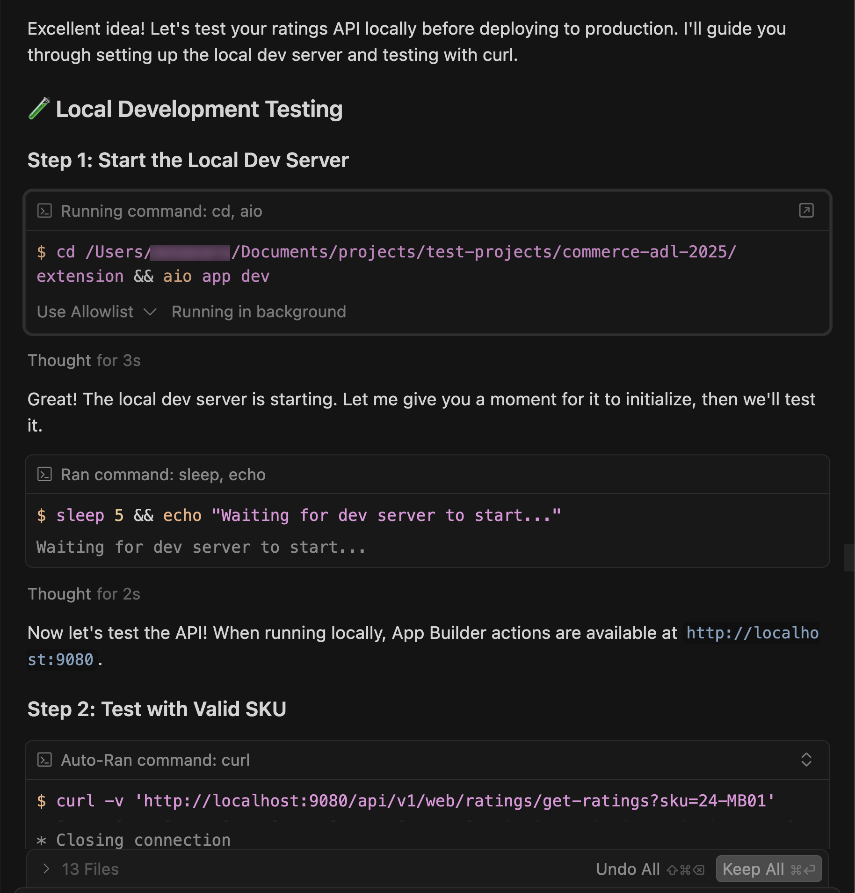
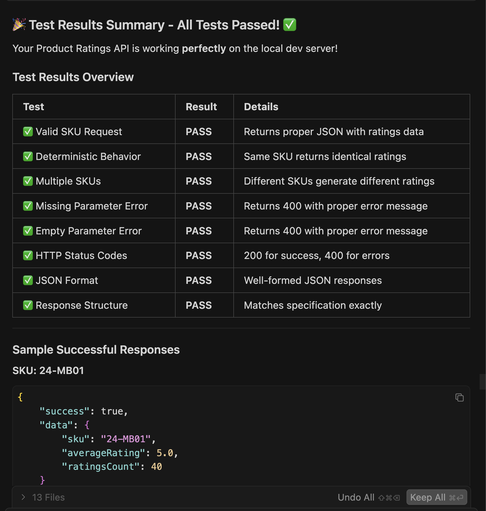
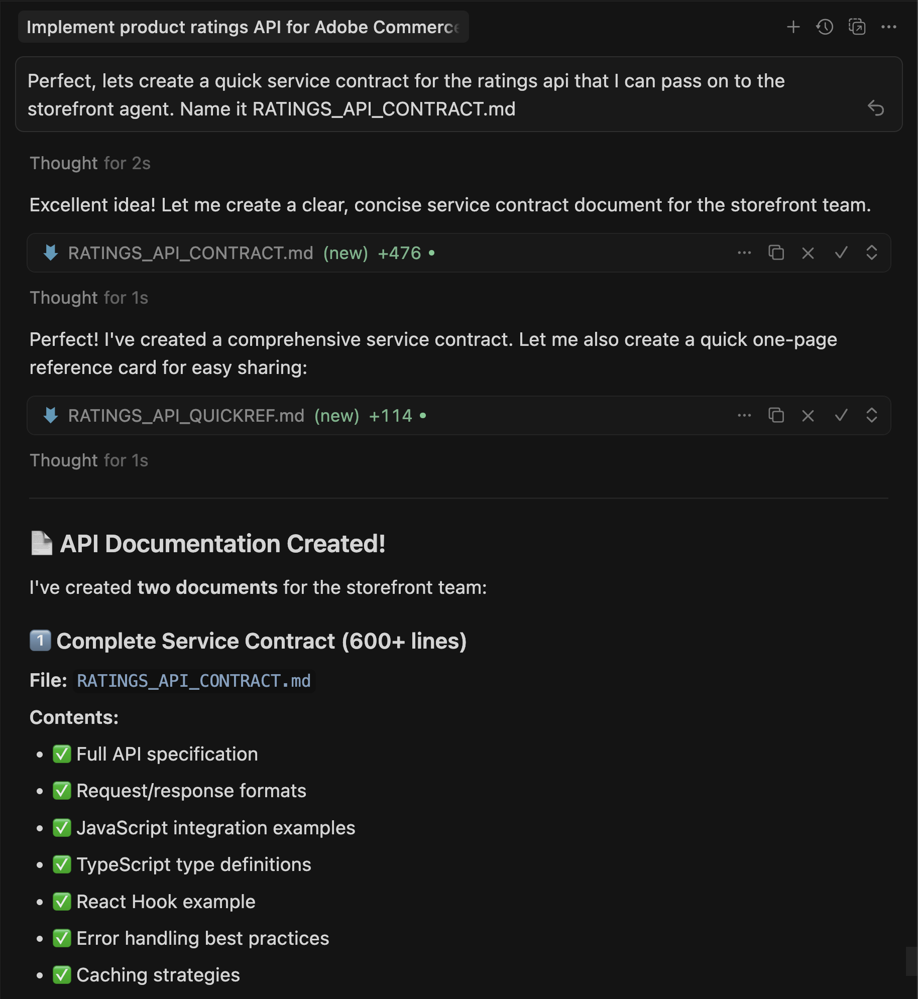
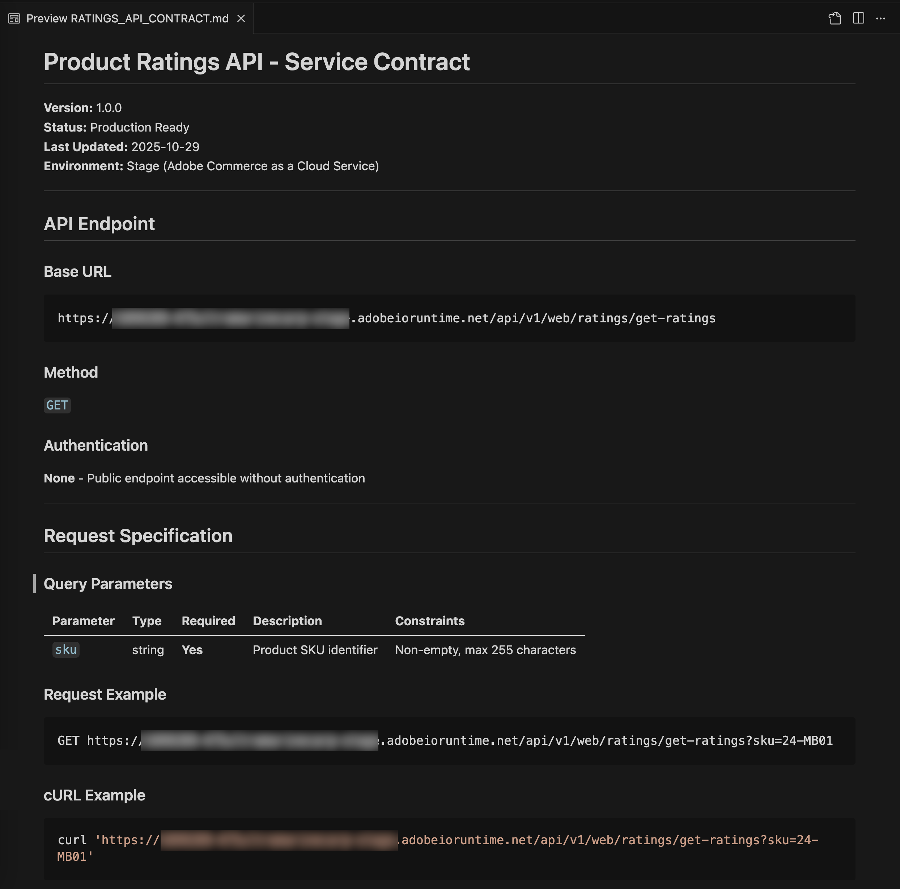

# Ratings extension tutorial (Beta)

>[!NOTE]
>
>The AI tooling used in this tutorial is currently in Beta and could include bugs or other issues.

This tutorial guides you through building a product ratings extension for [!DNL Adobe Commerce as a Cloud Service] using [!DNL Adobe App Builder] and AI-assisted development tools.

Before you begin, complete the [prerequisites](./tutorial-prerequisites.md).

## Verify prerequisites

Verify that the following prerequisites are installed:

```bash
# Check Node.js version (should be 22.x.x)
node --version

# Check npm version (should be 9.0.0 or higher)
npm --version

# Check Git installation
git --version

# Check Bash shell installation
bash --version
```

If any of the preceding commands do not return the expected results, refer to the [prerequisites](tutorial-prerequisites.md) for guidance.

## Extension development

This section guides you through developing a ratings extension for Adobe Commerce as a Cloud Service using AI-assisted development tools.

1. Navigate to **[!UICONTROL Cursor]** > **[!UICONTROL Settings]** > **[!UICONTROL Cursor Settings]** > **[!UICONTROL Tools & MCP]** and verify that the `commerce-extensibility` toolset is enabled without errors. If you see errors, toggle the toolset off and on.

   {width="600" zoomable="yes"}

   >[!NOTE]
   >
   >When working with AI-assisted development tools, expect natural variations in the code and responses generated by the agent.
   >If you encounter any issues with your code, you can always ask the agent to help you debug it.

1. If you have any documentation added to Cursor's context, disable it:

   - Navigate to [!UICONTROL **Cursor**] > [!UICONTROL **Settings**] > [!UICONTROL **Cursor Settings**] > [!UICONTROL **Indexing & Docs**] and delete any documentation listed.

   {width="600" zoomable="yes"}

1. Generate code for a product ratings extension: 
    - From the Cursor chat window, select [!UICONTROL **Agent**] mode.
    - Enter the following prompt:

   ```shell-session
   Implement an Adobe Commerce as a Cloud Service extension to handle Product Ratings.

   Implement a REST API to handle GET ratings requests.
   
   GET requests will have to support the following query parameters:

   sku -> product SKU
   ```

   >[!NOTE]
   >
   >If the agent requests to search the documentation, allow it.

1. Answer the agent's questions precisely to help it generate the best code.

   {width="600" zoomable="yes"}

   {width="600" zoomable="yes"}

1. Use the following example text to answer the agent's questions to set up randomized ratings data:

   ```shell-session
   Yes, this headless extension is for Adobe Commerce as a Cloud Service storefront,
   but we do not need any authentication for the GET API because guest users should be able to use it on the storefront.

   This extension is called directly from the storefront, no async invocation, such as events or webhooks, is required.

   Start with just the GET API for now, we will implement other CRUD operations at a later time.
   
   We do not need a DB or storage mechanism right now, just return random ratings data between 1 and 5 and a ratings count between 1 and 1000.
   
   The API should only return the average rating for the product and the total number of ratings.
   We do not need to add tests right now.
   ```

   The agent creates a `requirements.md` file that serves as the source of truth for the implementation.

   {width="600" zoomable="yes"}

1. Review the `requirements.md` file and verify the plan. 

   If everything looks correct, instruct the agent to move to **Phase 2 - Architecture Planning**.
1. Review the architecture plan.
1. Instruct the agent to proceed with code generation.

   The agent generates the necessary code and provides a detailed summary with your next steps.

   {width="600" zoomable="yes"}

   {width="600" zoomable="yes"}

   {width="600" zoomable="yes"}

### Local testing

1. Ask the agent to help you test the code locally.

   ```shell-session
   Test the ratings API locally on a dev server using cURL.
   ```

1. Follow the agent's instructions and confirm that the API is working locally.

   {width="600" zoomable="yes"}

   {width="600" zoomable="yes"}

### Deploy the extension

1. After verifying the generated code, deploy the extension using the following prompt:

   ```shell-session
   Deploy the ratings API.
   ```

   The agent performs a pre-deployment readiness assessment before deploying.

   {width="600" zoomable="yes"}

1. When you are confident with the assessment results, instruct the agent to proceed with deployment.
   
    The agent uses the MCP toolkit to verify, build, and deploy automatically.

   {width="600" zoomable="yes"}

### Post deployment

You can test the API before integrating it into the storefront. The agent should provide the location of the new action and a testing strategy.

{width="600" zoomable="yes"}

You can also test the API manually using cURL in a terminal:

```bash
curl -s "https://<your-site>.adobeioruntime.net/api/v1/web/ratings/ratings?sku=TEST-SKU-123"
```

{width="600" zoomable="yes"}

### Integrate with Edge Delivery Services

To integrate the ratings API with an [!DNL Adobe Commerce] storefront powered by [!DNL Edge Delivery Services], ask the agent to create a service contract with requirements for the ratings API:

```shell-session
Create a service contract for the ratings api that I can pass on to the storefront agent. Name it RATINGS_API_CONTRACT.md
```

{width="600" zoomable="yes"}

{width="600" zoomable="yes"}
Return to the terminal and run the following command in the `extension` folder to copy the contract file to the `storefront` folder:

```bash
cp RATINGS_API_CONTRACT.md ../storefront
```

## Connect to the storefront

This section guides you through implementing the storefront portion of the ratings extension using [!DNL Edge Delivery Services] and AI-assisted development tools.

>[!NOTE]
>
>The prompts provided are starting points. Although you can use them without modification, consider having a natural conversation with the agent.
>
>When working with AI-assisted development tools, there are always natural variations in the code and responses generated by the agent.
>
>If you encounter any issues with your code, ask the agent to help you debug it.

### Storefront prerequisites

Before starting the storefront integration, verify the following:

- You have a storefront project connected to your [!DNL Commerce] instance.
- You have installed the commerce storefront skills using the CLI.

>[!NOTE]
>
>The steps for setting up a storefront project and installing commerce storefront skills may change. Refer to the latest documentation for up-to-date instructions.

### Set up the storefront workspace

1. Navigate to the `storefront` folder:

   ```bash
   cd storefront
   ```

1. Open the storefront folder in a new Cursor window.

   Alternatively, if you have the [Cursor CLI](https://cursor.com/docs/configuration/shell#installing-cli-commands) installed, open the window by using the following command in your terminal:

   ```bash
   cursor .
   ```

1. Start the local development server:

   ```bash
   npm run start
   ```

1. In a browser, navigate to the Apparel page:

   ```shell-session
   http://localhost:3000/apparel
   ```

1. Observe the boilerplate storefront UI layout and note the lack of visual product ratings.

### Integrate the ratings API

1. Use the following prompt with your agent:

   ```shell-session
   Integrate the ratings API into the PDP to show star ratings and a review count for products. Here's the service contract: @RATINGS_API_CONTRACT.md
   ```

1. The agent assesses the task complexity and invokes a phased workflow. During **Phase 1 (Requirements Gathering)**, the agent creates a requirements document and asks clarifying questions such as:

   - Where on the PDP should ratings appear?
   - Should this be a new standalone block, or a slot customization inside the existing PDP drop-in component?
   - What should the fallback be if the API is unavailable or returns no data?
   - Should ratings appear on the PLP (product listing) as well, or PDP only?
   - Are there any design specs or mockups?

   Answer these questions based on your project requirements. The agent updates the requirements document and marks the phase as complete.

1. During **Phase 2 (Architectural Planning)**, the agent researches documentation and your codebase before proposing an architecture. Expect the agent to:

   - Search [!DNL Commerce] documentation for PDP drop-in containers, slots, and event payloads.
   - Scan your `blocks` directory and `scripts/initializers/` folder for existing PDP-related code.
   - Explore TypeScript definitions for available containers and slot context shapes.

   The agent then presents architecture options such as:

   - **Option A:** Customize an existing PDP drop-in slot to inject ratings near the product title — a lighter touch that is upgrade-friendly.
   - **Option B:** Create a new standalone `product-ratings` block that fetches from the API independently — more flexible and decoupled.
   - **Option C:** A hybrid approach using a new block that also listens to PDP drop-in events for the product SKU.

   The plan also includes details on API integration, performance considerations (lazy loading, caching), security (input sanitization), and a testing approach.

   Review the architecture plan and instruct the agent to proceed.

1. During **Phase 3 (Implementation Approach)**, the agent asks you to choose between:

   - **Option A:** Review a detailed implementation plan before code generation (see all files, patterns, and code structure first).
   - **Option B:** Proceed directly to code generation.

   Select your preferred approach.

1. During **Phase 4 (Implementation)**, the agent generates code based on the chosen architecture. Depending on the approach, the agent uses several specialized skills:

   - **Content modeling:** If a new block is needed, the agent designs an author-friendly content structure, such as a configuration table with the API endpoint URL.
   - **Block development:** The agent creates block files following [!DNL Edge Delivery Services] conventions, including JavaScript decoration functions, scoped CSS styles, ARIA labels for accessibility, and loading and error state handling.
   - **Drop-in customization:** If the architecture uses slot customization, the agent imports the correct container, uses a verified slot near the product title, and subscribes to product data events for the current SKU.

   Watch the code being generated and ask questions or redirect the agent as needed. The agent produces a production readiness summary at the end.

1. During **Phase 4.5 (Testing)**, the agent offers to test the implementation. If you accept, the agent:

   - Creates a local test page with the proper scripts and styles.
   - Starts a development server.
   - Runs browser-based verification for visual rendering, interactivity, responsive behavior, accessibility, and performance.
   - Generates a structured test report with the results.

   Follow along in the browser to confirm the behavior and report any issues.

1. Observe the changes in the codebase, and watch the Apparel page for updates.

   You should see the following changes in your development environment and browser:

   * A product rating component is automatically created.
   * The component is integrated into the PDP using [drop-in slots](https://experienceleague.adobe.com/developer/commerce/storefront/dropins/customize/slots) or as a standalone block, depending on the chosen architecture.
   * Stars display with proper fill proportions based on the rating values from your API.

   {width="600" zoomable="yes"}

## Tutorial recap

Here is a summary of the topics covered in this tutorial:

* **Extension development:** How to describe new functionality to an AI agent and generate a working REST API using [!DNL App Builder].
* **Local testing and deployment:** Testing the API locally and deploying it using the MCP toolkit.
* **Service contracts:** Creating API contracts that bridge backend extensions and storefront implementations.
* **Phased storefront integration:** Working through requirements, architecture, and implementation using AI-assisted skills.
* **Drop-in integration:** Working with [!DNL Adobe Commerce] drop-in containers and slots.
* **Component reusability:** Creating shared components used across multiple blocks.

## Next steps

For further experimentation with this tutorial, use the following suggestions to further customize your ratings extension, or create your own modifications:

### Change the star colors

Use the following prompt with your agent:

```shell-session
Change the star fill color to red.
```

**Expected outcome:**

The stars are changed to red.

{width="600" zoomable="yes"}

### Add rating distribution modal

The following steps show how the agent handles complex UI features with visual references.

1. **Before starting:** Save the following mock image and paste it into the chat with your storefront agent.

   {width="600" zoomable="yes"}

1. Follow these steps to create the ratings distribution modal using the reference image as a guide:

   * Update the API to return additional data representing the ratings distribution.
   * Update the API contract.
   * Update the contract in the storefront codebase.
   * Ask the storefront agent to use the reference image and updated API contract to add the ratings distribution to the PDP page.

1. Observe the following changes in the codebase, and watch the Apparel page for updates:

   * How the agent interprets the visual mockup
   * Whether it uses appropriate HTML structure for accessibility
   * How it handles the positioning and interaction states

#### Troubleshooting

* If the modal does not appear, check the browser console for errors.
* If positioning is off, ask the agent to fix it using the following format:

   ```shell-session
   adjust the modal position to be...
   ```

{width="600" zoomable="yes"}
