# Shipping method extension tutorial

This tutorial guides you through building a shipping method extension for [!DNL Adobe Commerce as a Cloud Service] using [!DNL Adobe App Builder], the [checkout starter kit](https://developer.adobe.com/commerce/extensibility/starter-kit/checkout/){target="_blank"}, and AI-assisted development tools.

The extension adds a configurable shipping method at checkout where the rates come from an external mock shipping rates service. Merchants configure the service URL, API key, and warehouse (ship-from) address in the Admin UI, and at checkout the extension requests rates from that service and displays the returned options to the customer.

Before you begin, complete the [prerequisites](./tutorial-prerequisites.md).

{{tutorial-verify-prerequisites}}

## Create the mock shipping rates API

After completing the [prerequisites](./tutorial-prerequisites.md), create the mock shipping rates API, so you have the service URL and API key ready when you configure the extension in the [!DNL Commerce Admin]. The extension calls an external shipping rates API. For this tutorial you use a mock API allowing you to run the flow without a real carrier account. You will create the mock API using [Pipedream](https://pipedream.com) (free account required). The mock API uses a request/response contract that is similar to typical real shipping rates APIs, so connecting this extension to a real provider later should be straightforward.

**Time:** It should take about **5–10 minutes** to create the mock API.

### Create a workflow and HTTP trigger

1. Go to [pipedream.com](https://pipedream.com) and sign up or log in.
1. Click **New workflow** (or **Add workflow**).
1. For the trigger, select **HTTP / Webhook**.
1. In the trigger configuration, set **HTTP Response** to **Return a custom response from your workflow**. This allows the Code step to send the mock JSON response.
1. Pipedream displays a unique **HTTP endpoint URL**, such as `https://123456.m.pipedream.net`.
1. **Copy this URL** anduse it as the **Service URL** in the extension configuration.

   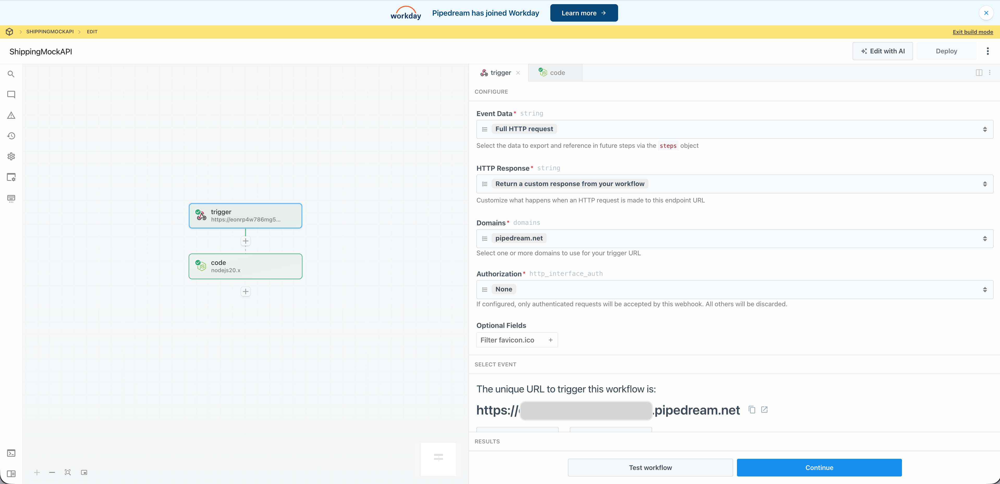{width="600" zoomable="yes"}

You do not need to configure **Authorization** on the trigger; the mock API validates the `API-Key` header in the Code step.

### Add the Code step

1. Click the **+** icon to add a step.
1. Choose **Run Node.js code** (Code step).
1. **Replace** the default code with the following JavaScript.
1. Click **Save** or **Deploy**.

   ```javascript
   export default defineComponent({
   async run({ steps, $ }) {
      const event = steps.trigger.event;
      const body = event.body ?? {};
      const headers = event.headers ?? {};
      const apiKey = headers["api-key"] ?? body.api_key ?? "";

      if (!apiKey || String(apiKey).trim() === "") {
         await $.respond({
         immediate: true,
         status: 401,
         headers: { "Content-Type": "application/json" },
         body: { error: "Missing or invalid API-Key header" },
         });
         return;
      }

      const shipment = body.shipment;
      if (!shipment || typeof shipment !== "object") {
         await $.respond({
         immediate: true,
         status: 400,
         headers: { "Content-Type": "application/json" },
         body: { error: "Missing or invalid shipment" },
         });
         return;
      }

      const rates = [
         {
         service_code: "mock_standard",
         service_name: "Mock Standard",
         carrier_friendly_name: "Mock Carrier",
         shipping_amount: { amount: 5.99 },
         shipment_cost: 5.99,
         cost: 5.99,
         },
         {
         service_code: "mock_express",
         service_name: "Mock Express",
         carrier_friendly_name: "Mock Carrier",
         shipping_amount: { amount: 12.99 },
         shipment_cost: 12.99,
         cost: 12.99,
         },
      ];

      await $.respond({
         immediate: true,
         status: 200,
         headers: { "Content-Type": "application/json" },
         body: { rates },
      });
   },
   });
   ```

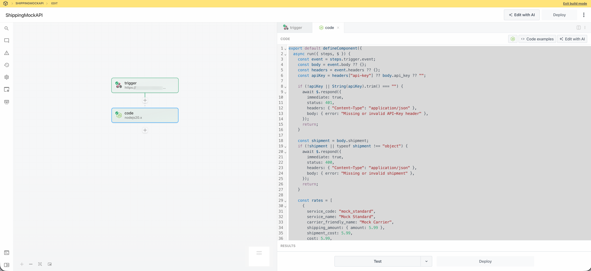{width="600" zoomable="yes"}

The mock returns two rate options (Mock Standard and Mock Express) for any valid request that includes a non-empty `API-Key` header and a `shipment` object. Note your Pipedream workflow URL and your API key (for example, `tutorial-key`) for configuring the extension in the [!DNL Admin UI] during the tutorial.

## Extension development

This section guides you through developing a shipping method extension for [!DNL Adobe Commerce as a Cloud Service] using the [checkout starter kit](https://developer.adobe.com/commerce/extensibility/starter-kit/checkout/){target="_blank"} and AI-assisted development tools.

1. Navigate to the MCP settings in your coding agent. For example, in Cursor, go to **[!UICONTROL Cursor]** > **[!UICONTROL Settings]** > **[!UICONTROL Cursor Settings]** > **[!UICONTROL Tools & MCP]**. Verify that the `commerce-extensibility` toolset is enabled without errors. If you see errors, toggle the toolset off and on.

   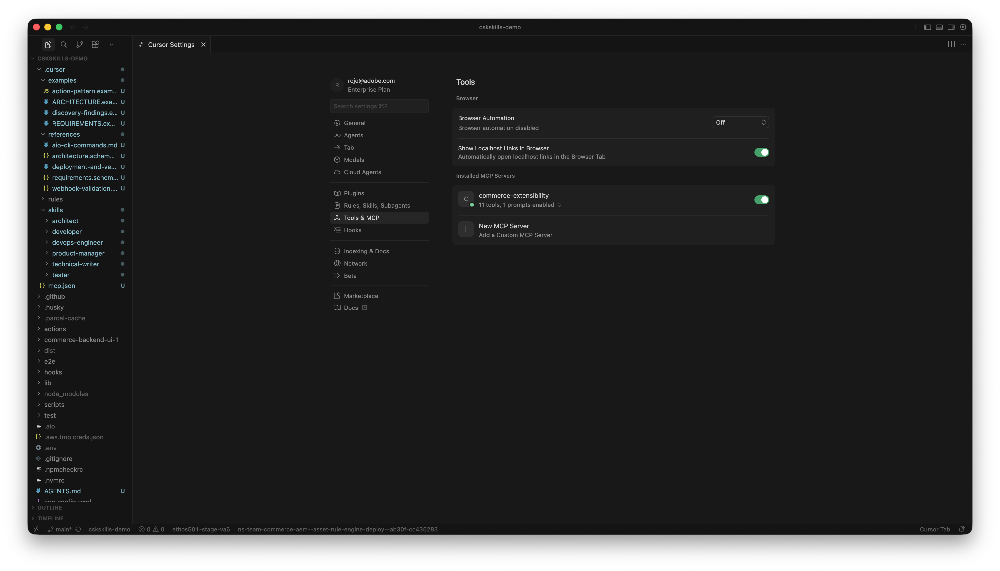{width="600" zoomable="yes"}

   >[!NOTE]
   >
   >When working with AI-assisted development tools, expect natural variations in the code and responses generated by the agent.
   >
   >If you encounter any issues with your code, you can always ask the agent to help you debug it.

1. If you have any documentation added to Cursor's context, disable it:

   - Navigate to [!UICONTROL **Cursor**] > [!UICONTROL **Settings**] > [!UICONTROL **Cursor Settings**] > [!UICONTROL **Indexing & Docs**] and delete any documentation listed.

   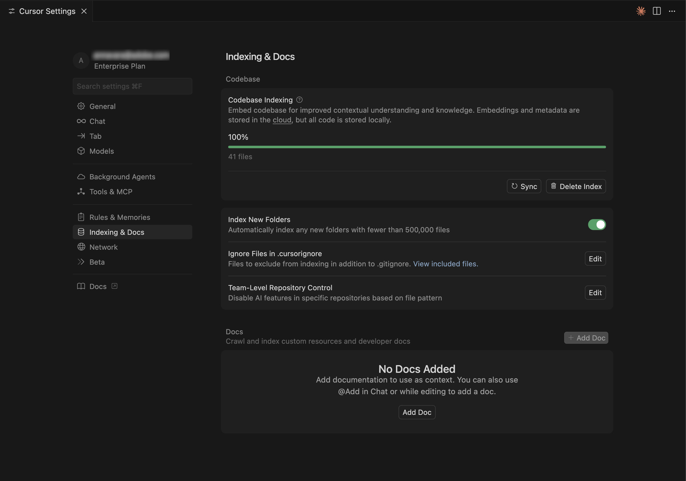{width="600" zoomable="yes"}

1. Give the agent access to the mock rates API specification, so it can implement the client correctly. Download the [mock rates API specification file](../assets/mock-rates-api-spec.zip), open it, and add the `.md` file to your project (for example `docs/mock-rates-api-spec.md`), then reference that file in your prompt.

1. Generate the shipping method extension:

   - From the agent's chat window, select [!UICONTROL **Agent**] mode.
   - Enter the following prompt:

   ```shell-session
   Build an Adobe Commerce extension that adds a shipping method at checkout. The rates come from an external mock shipping rates service: the merchant configures the service's URL and API key in Admin, and at checkout the extension asks that service for rates and shows the returned options to the customer.

   External service (mock shipping rates API):
   - The service endpoint URL is configurable by the merchant (for example https://123456.m.pipedream.net).
   - The API uses POST to the base URL, Content-Type: application/json, and API-Key header for authentication. Request body: { "shipment": { "ship_to", "ship_from", "packages" }, "rate_options": { "carrier_ids": [] } }. Response: 200 with { "rates": [ { "service_code", "service_name", "shipping_amount" or "shipment_cost" or "cost", ... } ] }.

   The merchant must be able to configure the following in the Adobe Commerce Admin UI. Use the Adobe Commerce Admin UI SDK (or equivalent App Builder extensibility for the Admin) to add a configuration screen where the merchant can set:
   - The service URL (where the extension sends rate requests).
   - An API key the service expects (any non-empty value for the mock). The API key is sensitive data: it must be stored securely and must never appear in logs, error messages, or in the UI in full (e.g. mask in the UI).
   - The warehouse (ship-from) address: name, phone, street, city, state, postal code, country. This is the origin used when requesting rates.
   ```

   >[!NOTE]
   >
   >If the agent requests to search the documentation, allow it.

   {width="600" zoomable="yes"}

1. Answer the agent's questions precisely to help it generate the best code. If the agent asks which kit or template to use, direct it to the [checkout starter kit](https://developer.adobe.com/commerce/extensibility/starter-kit/checkout/){target="_blank"} with the shipping domain and Admin UI extension so that both the shipping webhook and the merchant configuration screen are implemented.

   The agent may create a `requirements.md` (or equivalent) file that serves as the source of truth for the implementation.

1. Review the `requirements.md` (or equivalent) file and verify the plan. If everything looks correct, instruct the agent to move to architecture planning (or **Phase 2**). Confirm that:

   - A **shipping-methods** action (or equivalent) handles the Commerce webhook and calls the external rates API.
   - A **shipping-config** (or equivalent) action supports GET (read config, API key masked) and SET (save service URL, API key, warehouse address), with config stored securely, for example in Runtime State.
   - The Admin UI includes a **Mock Shipping** (or similar) tab with fields for Service URL, API key (password/masked), and warehouse address.

   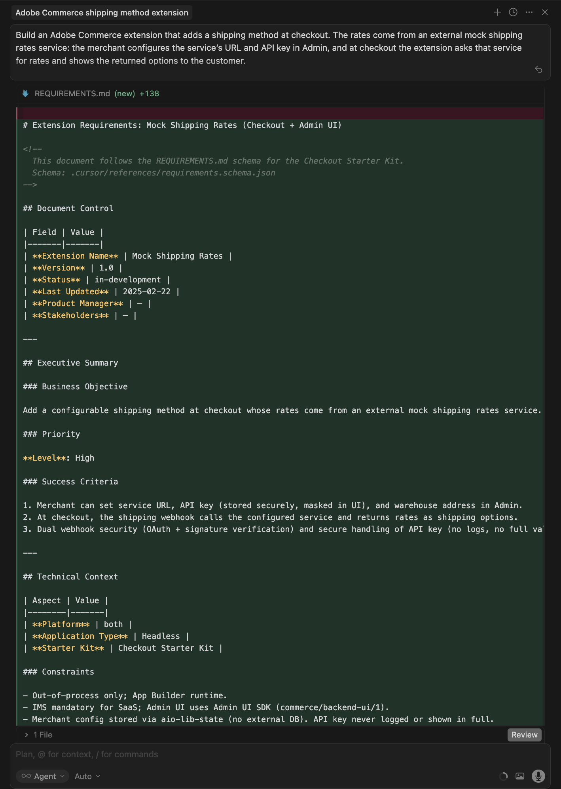{width="600" zoomable="yes"}

1. Review the architecture plan when the agent provides it.

   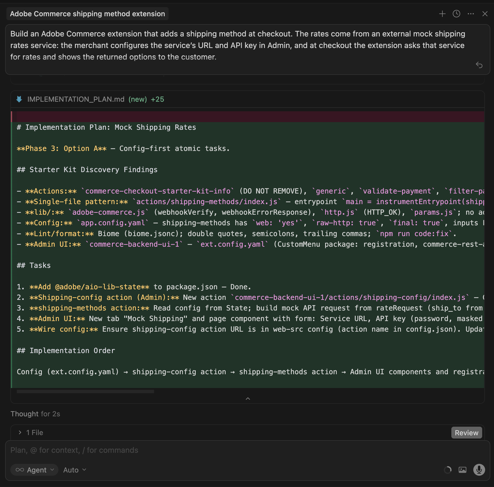{width="600" zoomable="yes"}

1. Instruct the agent to proceed with code generation. The agent should add a **MOCK** carrier to the shipping carriers configuration allowing Commerce to accept the returned methods, and use the webhook method `plugin.magento.out_of_process_shipping_methods.api.shipping_rate_repository.get_rates` (webhook type **after**, required **Optional**).

   The agent generates the necessary code and provides a detailed summary with your next steps (including installing dependencies, registering the MOCK carrier, configuring the Commerce webhook, and deploying).

   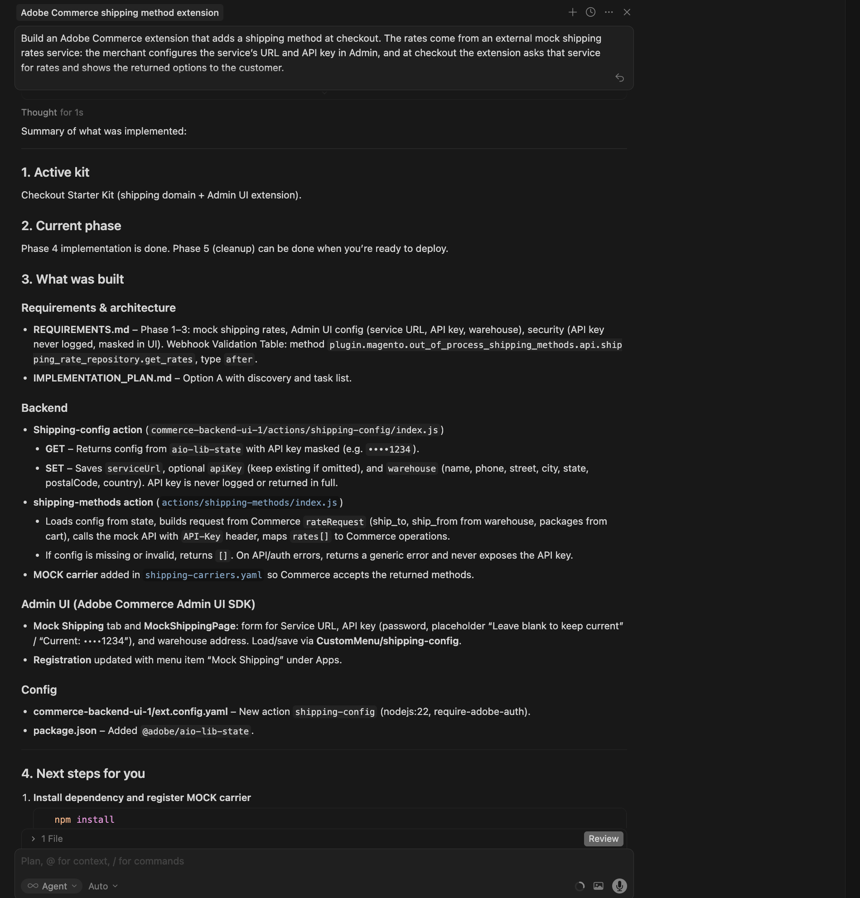{width="600" zoomable="yes"}

   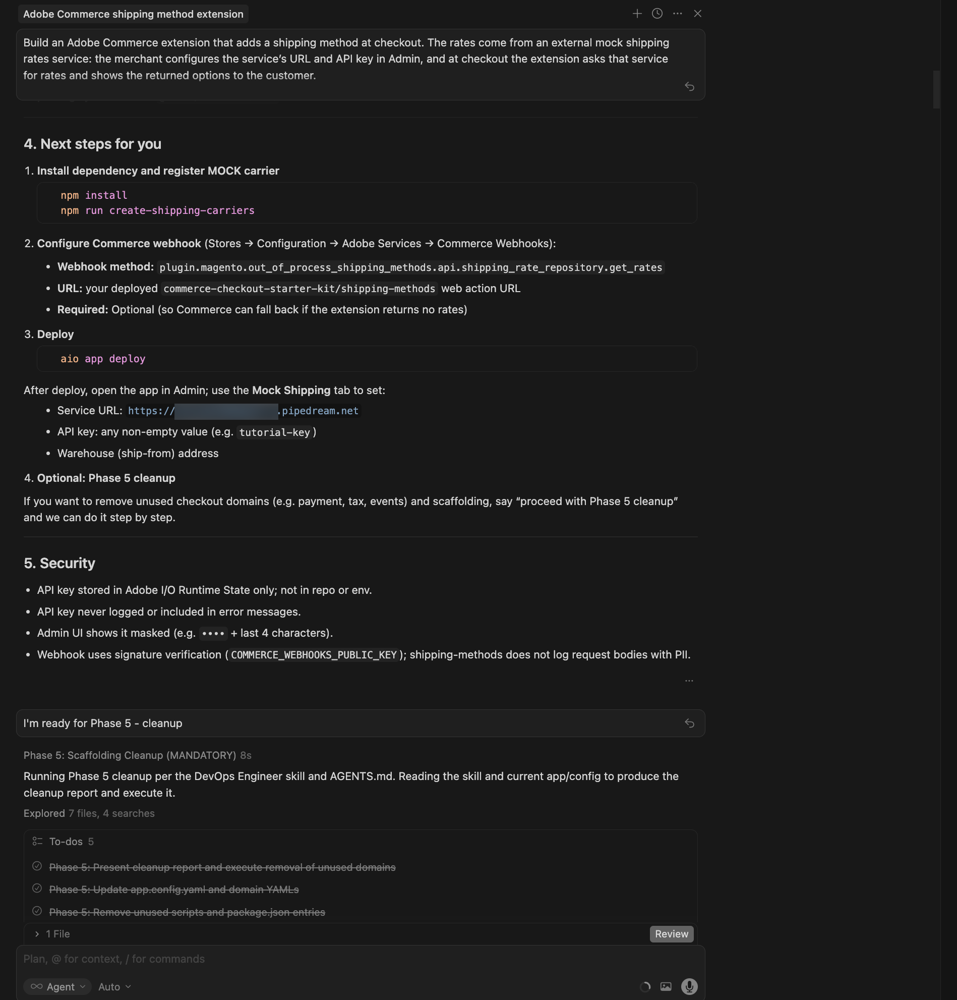{width="600" zoomable="yes"}

### Cleanup before deploy

Before deploying, remove code that the application does not need. The checkout starter kit may include unused domains (for example payment, tax, or events) and scaffolding. Have the agent remove them and keep only the shipping and [!DNL Admin UI] parts by using a prompt such as:

   ```shell-session
   Proceed with Phase 5 cleanup.
   ```

   The agent produces a cleanup report, removes unused actions, config, and scripts, and updates the project. Complete this step before you deploy.

   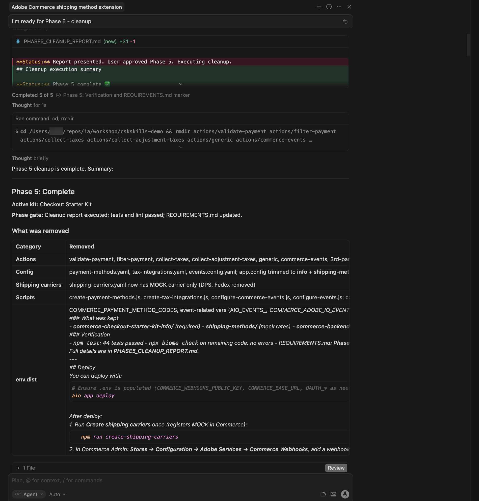{width="600" zoomable="yes"}

### Deploy the extension

1. After verifying the generated code, deploy the extension using the following prompt:

   ```shell-session
   Deploy the app.
   ```

   The agent performs a pre-deployment readiness assessment (for example checking `.env` for `COMMERCE_WEBHOOKS_PUBLIC_KEY`, `COMMERCE_BASE_URL`, and OAuth/IMS variables if the Admin UI or Commerce API is used).

   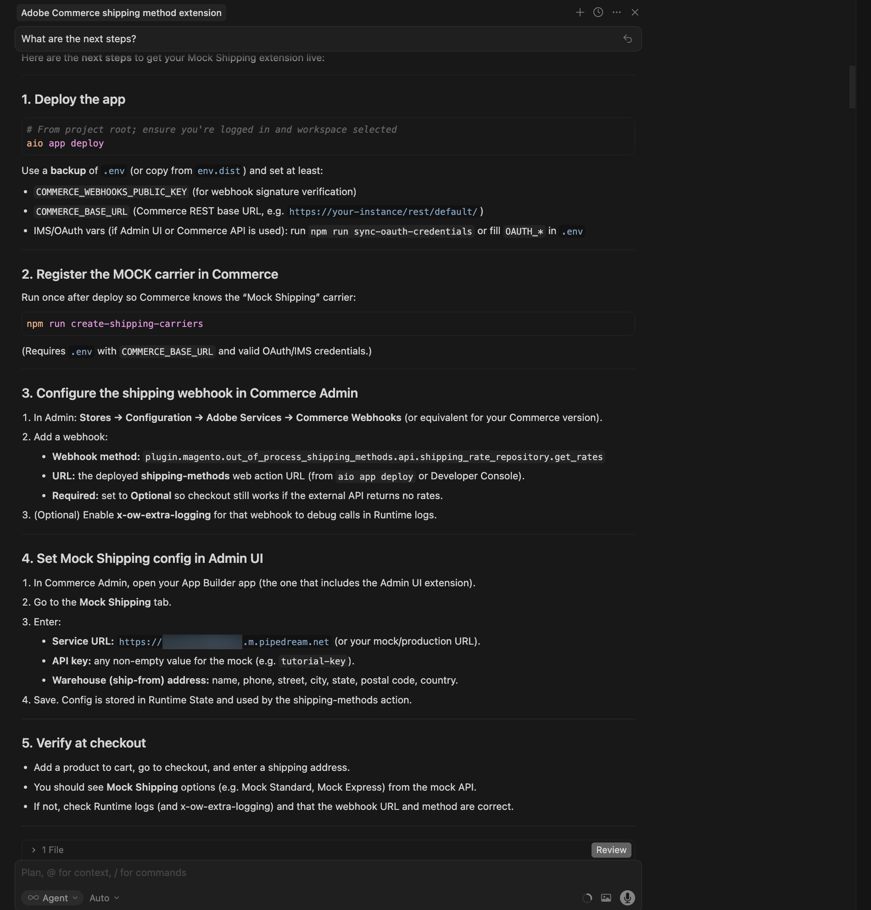{width="600" zoomable="yes"}

1. When you are confident with the assessment results, instruct the agent to proceed with deployment. The agent uses the MCP toolkit to verify, build, and deploy automatically.

   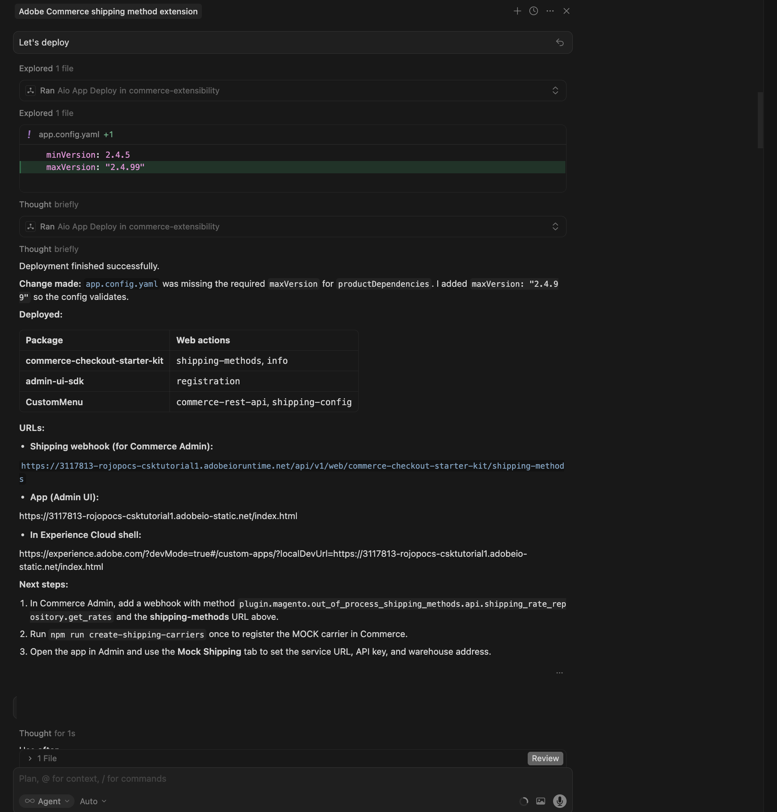{width="600" zoomable="yes"}

### Post deployment

After deployment, complete the following steps to register the MOCK carrier, configure the webhook and [!DNL Admin UI], and verify the extension at checkout.

1. **Register the MOCK carrier in Commerce** (run once after deploy):

   ```bash
   npm run create-shipping-carriers
   ```

   Ensure your `.env` has `COMMERCE_BASE_URL` and a valid OAuth/IMS credentials, so the script can register the carrier.

1. **Configure the shipping webhook in [!DNL Commerce Admin]:**

   - Go to **Stores** > **Configuration** > **Adobe Services** > **Commerce Webhooks**.
   - Add a webhook:
     - **Webhook method:** `plugin.magento.out_of_process_shipping_methods.api.shipping_rate_repository.get_rates`
     - **Webhook type:** **after**
     - **URL:** the deployed **shipping-methods** web action URL (from the deploy output or the [!DNL Adobe Developer Console]).
     - **Required:** **Optional** - This allows checkout to still work if the external API returns no rates.

   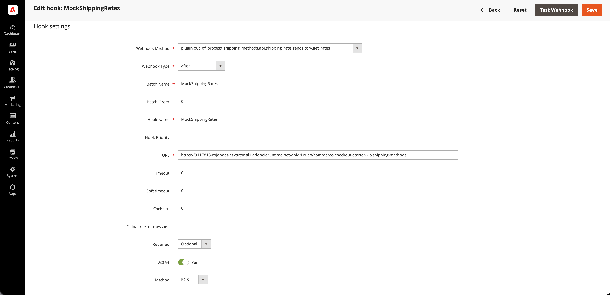{width="600" zoomable="yes"}

1. **Configure the [!DNL Admin UI SDK] extension:**

   - In [!DNL Commerce Admin], go to **Stores** > **Settings** > **Configuration**.
   - Open **Adobe Services** > **Admin UI SDK**.
   - Set **Enable Admin UI SDK** to **Yes** and click **Save Config** if it is not already enabled.
   - Click **Configure extensions**, choose the workspace your app is deployed to, then click **Apply**. You can also select the **Custom** option and enter the workspace name.
   - Select your [!DNL App Builder] app in the list and save. If the app does not appear, click **Refresh registrations** and try again.

   {width="600" zoomable="yes"}

1. **Configure the Mock Shipping method in the Adobe Commerce Admin UI:**
   - In [!DNL Commerce Admin], open **Apps** and select your app.
   - Open the **Mock Shipping** tab (or equivalent).
   - Enter the following details:
     - **Service URL:** the Pipedream workflow URL you copied (for example `https://123456.m.pipedream.net`).
     - **API key:** any non-empty value for the mock, for example `tutorial-key`.
     - **Warehouse (ship-from) address:** name, phone, street, city, state, postal code, country.
   - Click **Save**. The configuration is stored in the Runtime State and is used by the shipping-methods action.

   {width="600" zoomable="yes"}

1. **Verify at checkout:** Add a product to the cart, go to checkout, and enter a shipping address. You should see the mock shipping options, for example **Mock Standard** and **Mock Express**.

   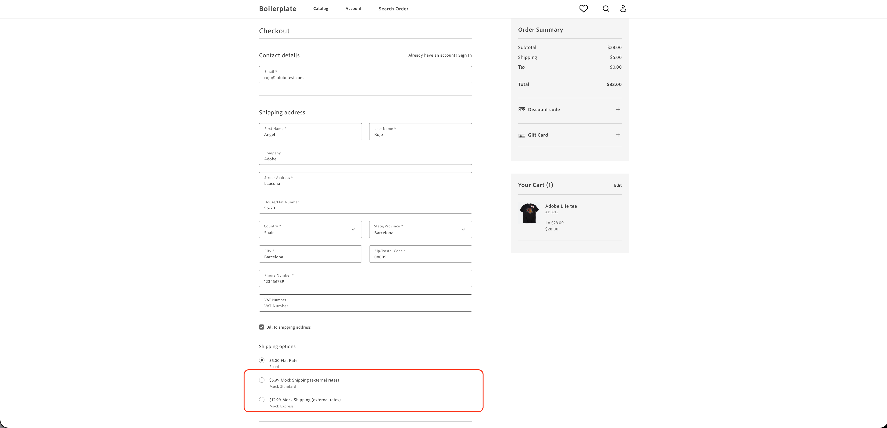{width="600" zoomable="yes"}

### Troubleshooting

- **Config not saving in the Admin UI:** If you see "Response is not valid 'message/http'" or values not updating after saving, check the runtime activation logs for the config action, using a command similar to the following:
  
  ```bash
  aio app logs --action CustomMenu/shipping-config --limit 20
  ```
  
  Common causes include the gateway expecting a specific response format (for example a string body and `Content-Type: application/json`) or the state library requiring string values—ensure the action stores config as a string and parses it when reading, and that the shipping-methods action uses the same parsing. Review the agent chat or logs for the exact cause and fix.

- **"The response must contain at least one operation"** (in webhook logs): Commerce requires the shipping webhook to return at least one operation. Ask the agent to ensure the shipping-methods action never returns an empty operations array (for example by returning a fallback rate when the external API returns no rates).

- **No shipping rates at checkout:** Confirm the webhook URL and method are correct, the MOCK carrier is registered (`npm run create-shipping-carriers`), and the Mock Shipping config is set in the [!DNL Admin UI]. Check runtime logs for the shipping-methods action for API or validation errors, ensure the action returns at least one operation, so [!DNL Commerce] does not show "The response must contain at least one operation."

### Tutorial recap

Here is a summary of the topics covered in this tutorial:

- **Prerequisites and setup:** Verifying tools and creating the mock shipping rates API.
- **Agent-driven development:** Using the commerce-extensibility toolset to generate requirements, an implementation plan, and code for the shipping webhook and Admin UI.
- **Phase 5 cleanup:** Removing unused checkout starter kit domains and scaffolding before deploying.
- **Deployment:** Pre-deployment assessment and MCP toolkit deploy.
- **Post-deployment configuration:** Registering the MOCK carrier, configuring the [!DNL Commerce] webhook, enabling the [!DNL Admin UI SDK] extension, and setting Mock Shipping (service URL, API key, warehouse) in the [!DNL Admin UI].
- **Verification:** Confirming mock shipping options appear at checkout.

### Next steps

For further experimentation with this tutorial, consider the following:

- Automate post-deploy setup with a hook that registers the MOCK carrier in [!DNL Commerce] and configures the shipping webhook after each deployment.
- Point the extension at a real shipping rates API by changing the Service URL and API key in the [!DNL Admin UI].
- Extend the [!DNL Admin UI] to show carrier status or test connectivity to the rates service.
