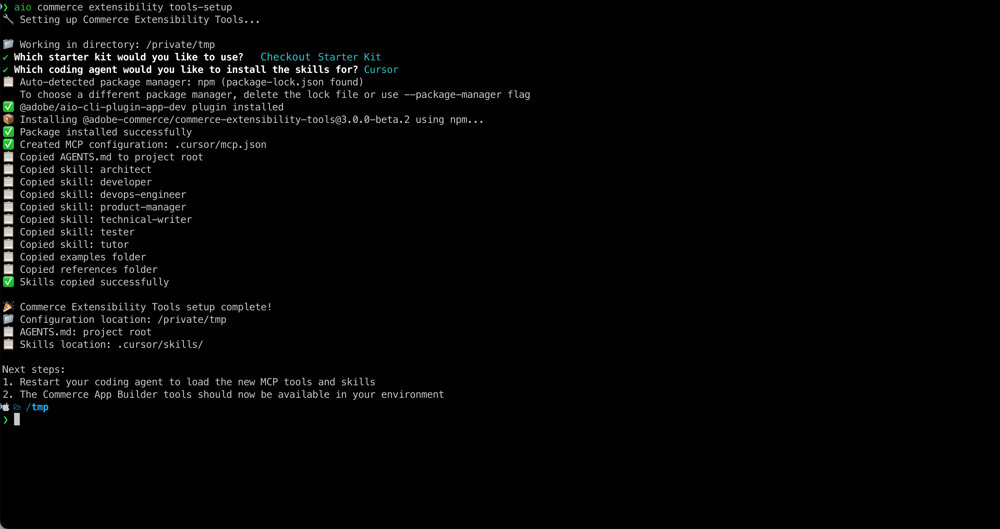

# Shipping method extension tutorial prerequisites (Beta)

>[!NOTE]
>
>The AI tooling used in this tutorial is currently in Beta and could include bugs or other issues.

This page lists the prerequisites and setup steps for the [shipping method extension tutorial](./shipping-method-extension.md).

## Adobe Commerce as a Cloud Service prerequisites

* Install the [!DNL Adobe I/O CLI]

   ```bash
   npm install -g @adobe/aio-cli
   ```

* Install the [Adobe I/O CLI Commerce](https://github.com/adobe-commerce/aio-cli-plugin-commerce), [Adobe I/O CLI Runtime](https://github.com/adobe-commerce/aio-cli-plugin-runtime), and [App Builder CLI](https://github.com/adobe-commerce/aio-cli-plugin-app-dev) plugins:

   ```bash
   aio plugins:install https://github.com/adobe-commerce/aio-cli-plugin-commerce @adobe/aio-cli-plugin-app-dev @adobe/aio-cli-plugin-runtime
   ```

* Download an AI-assisted IDE, such as [Cursor](https://cursor.com/download) (recommended), other IDEs, such as Claude Code, Gemini CLI, or Copilot are also supported, but could require modifications to the prompts and other steps in the tutorial.

### Adobe Developer Console prerequisites

1. Navigate to the [Adobe Developer Console](https://developer.adobe.com/console){target="_blank"}.
1. Log in using your email and password.

#### Create a new project

1. Navigate to [Adobe Developer Console](https://developer.adobe.com/).
1. Click [!UICONTROL **Create project from a template**].
1. Select the [!UICONTROL **App Builder**] template.
1. Enter a [!UICONTROL **Project Title**] and [!UICONTROL **App Name**].
1. Ensure the **[!UICONTROL Include Runtime]** checkbox is marked.

   {width="600" zoomable="yes"}

1. Click [!UICONTROL **Save**].

#### Add APIs to the workspace

1. Click the [!UICONTROL **Stage**] workspace and then repeat the following steps for each API.

   {width="600" zoomable="yes"}

1. Click [!UICONTROL **Add Service**] and select [!UICONTROL **API**].

1. Select one of the following APIs. You will need to repeat this process for each API listed below:

   * [!UICONTROL **Adobe Services**] filter:
      * [!UICONTROL **I/O Management API**]
      * [!UICONTROL **I/O Events**] API
   * [!UICONTROL **Experience Cloud**] filter:
      * [!UICONTROL **Adobe I/O Events for Adobe Commerce**] API

1. Click [!UICONTROL **Next**].

1. Click[!UICONTROL **Save configured API**].

1. Repeat the previous steps until all APIs are added to the workspace.

   {width="600" zoomable="yes"}

### Configure the Adobe I/O CLI

1. Clear any existing configuration:

   ```bash
   aio config clear
   ```

   Log in using the [!DNL Adobe I/O CLI]:

   ```bash
   aio auth login -f
   ```

1. Select your organization, project, and workspace, using each of the following commands:

   ```bash
   aio console org select
   ```

   ```bash
   aio console project select
   ```

   ```bash
   aio console workspace select
   ```

   {width="600" zoomable="yes"}

### Clone the Checkout Starter Kit

Clone the Commerce Checkout Starter Kit repository and prepare your project:

```bash
git clone https://github.com/adobe/commerce-checkout-starter-kit.git extension
cd extension
```

{width="600" zoomable="yes"}

### Connect local workspace to remote workspace

Link your local project to the remote workspace. From the project root (the `extension` folder), run:

```bash
aio app use --merge
```

When prompted, choose the option that uses the organization, project, and workspace you selected when configuring the Adobe I/O CLI. This writes the workspace configuration into your app so that deploy and local development use that workspace.

{width="600" zoomable="yes"}

### Install extensibility AI tools

The setup creates the MCP configuration (`.cursor/mcp.json`), the skills directory (`.cursor/skills/`), and adds `AGENTS.md` to the project root. You will be prompted to choose a starter kit, coding agent, and package manager.

1. Set up the AI-assisted development tools in the `extension` folder:

   ```bash
   cd extension
   ```

   ```bash
   aio commerce extensibility tools-setup
   ```

1. When prompted, select the following:
   * **Which starter kit would you like to use?** — **Checkout Starter Kit**
   * **Which coding agent would you like to install the skills for?** — **Cursor**
   * **Which package manager would you like to use?** — **npm** (or your preferred manager)

1. After the setup completes, restart Cursor (or your coding agent) so it loads the new MCP tools and skills. The Commerce App Builder tools should then be available in your environment.

   >[!NOTE]
   >
   >If you see a warning that no skills were found for the checkout starter kit, something went wrong—often because the setup was run in a folder other than where the kit was cloned. Run `aio commerce extensibility tools-setup` from the `extension` folder (the Checkout Starter Kit project root) and select **Checkout Starter Kit** when prompted.

   {width="600" zoomable="yes"}

## Create the mock shipping rates API

The extension calls an external shipping rates API. For this tutorial you use a **mock** API so you can run the flow without a real carrier account. You will create the mock using [Pipedream](https://pipedream.com) (free account required). The mock uses a request/response contract that is close enough to typical real shipping rates APIs, so connecting this extension to a real provider later should be straightforward.

**Time:** about 5–10 minutes.

### Step 1: Create a workflow and HTTP trigger

1. Go to [pipedream.com](https://pipedream.com) and sign up or log in.
1. Click **New workflow** (or **Add workflow**).
1. For the trigger, select **HTTP / Webhook**.
1. In the trigger configuration, set **HTTP Response** to **Return a custom response from your workflow**. This allows the Code step to send the mock JSON response.
1. Pipedream shows a unique **HTTP endpoint URL** (for example, `https://xxxxx.m.pipedream.net`).
1. **Copy this URL** — you will use it as the **Service URL** in the extension configuration.

   {width="600" zoomable="yes"}

You do not need to configure **Authorization** on the trigger; the mock validates the `API-Key` header in the Code step.

### Step 2: Add the Code step

1. Click **+** to add a step.
1. Choose **Run Node.js code** (Code step).
1. **Replace** the default code with the following block (copy from `export default` through the closing `});`).
1. Click **Save** or **Deploy**.

```javascript
export default defineComponent({
  async run({ steps, $ }) {
    const event = steps.trigger.event;
    const body = event.body ?? {};
    const headers = event.headers ?? {};
    const apiKey = headers["api-key"] ?? body.api_key ?? "";

    if (!apiKey || String(apiKey).trim() === "") {
      await $.respond({
        immediate: true,
        status: 401,
        headers: { "Content-Type": "application/json" },
        body: { error: "Missing or invalid API-Key header" },
      });
      return;
    }

    const shipment = body.shipment;
    if (!shipment || typeof shipment !== "object") {
      await $.respond({
        immediate: true,
        status: 400,
        headers: { "Content-Type": "application/json" },
        body: { error: "Missing or invalid shipment" },
      });
      return;
    }

    const rates = [
      {
        service_code: "mock_standard",
        service_name: "Mock Standard",
        carrier_friendly_name: "Mock Carrier",
        shipping_amount: { amount: 5.99 },
        shipment_cost: 5.99,
        cost: 5.99,
      },
      {
        service_code: "mock_express",
        service_name: "Mock Express",
        carrier_friendly_name: "Mock Carrier",
        shipping_amount: { amount: 12.99 },
        shipment_cost: 12.99,
        cost: 12.99,
      },
    ];

    await $.respond({
      immediate: true,
      status: 200,
      headers: { "Content-Type": "application/json" },
      body: { rates },
    });
  },
});
```

{width="600" zoomable="yes"}

The mock returns two rate options (Mock Standard and Mock Express) for any valid request that includes a non-empty `API-Key` header and a `shipment` object. Keep the Pipedream workflow URL and your chosen API key (for example, `tutorial-key`) handy for when you configure the extension in the Admin UI during the tutorial.
