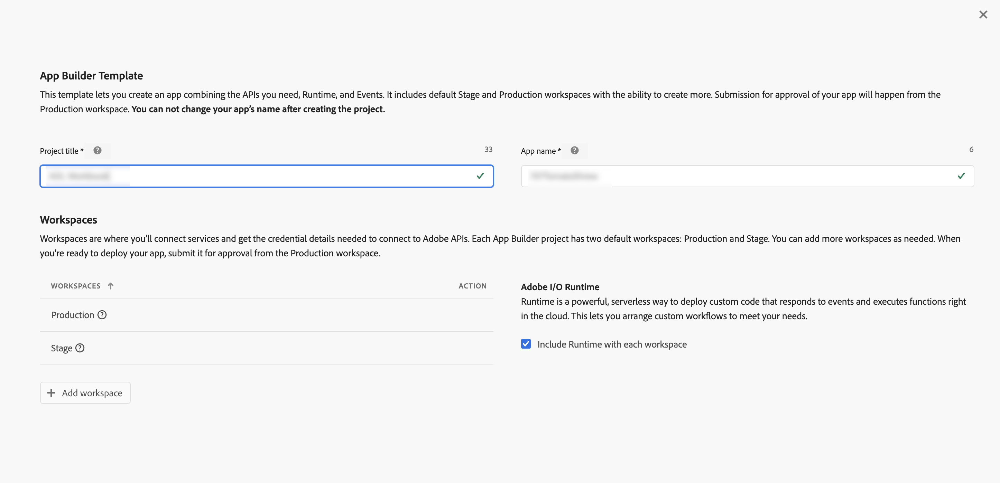
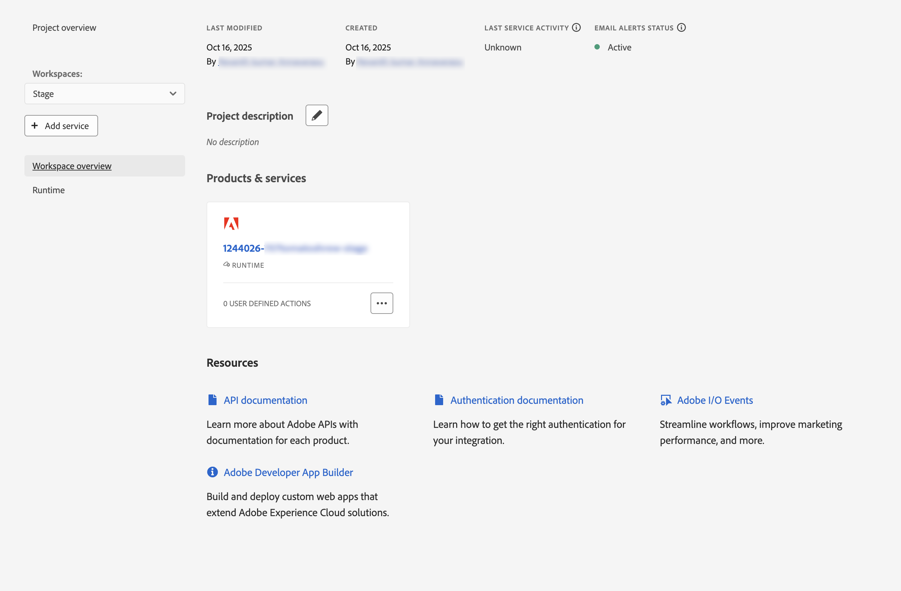
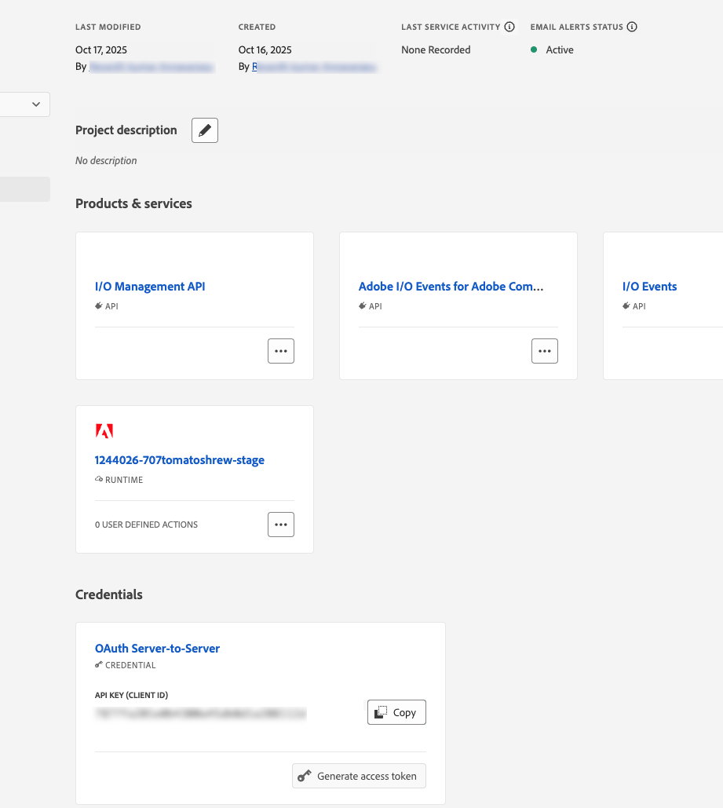
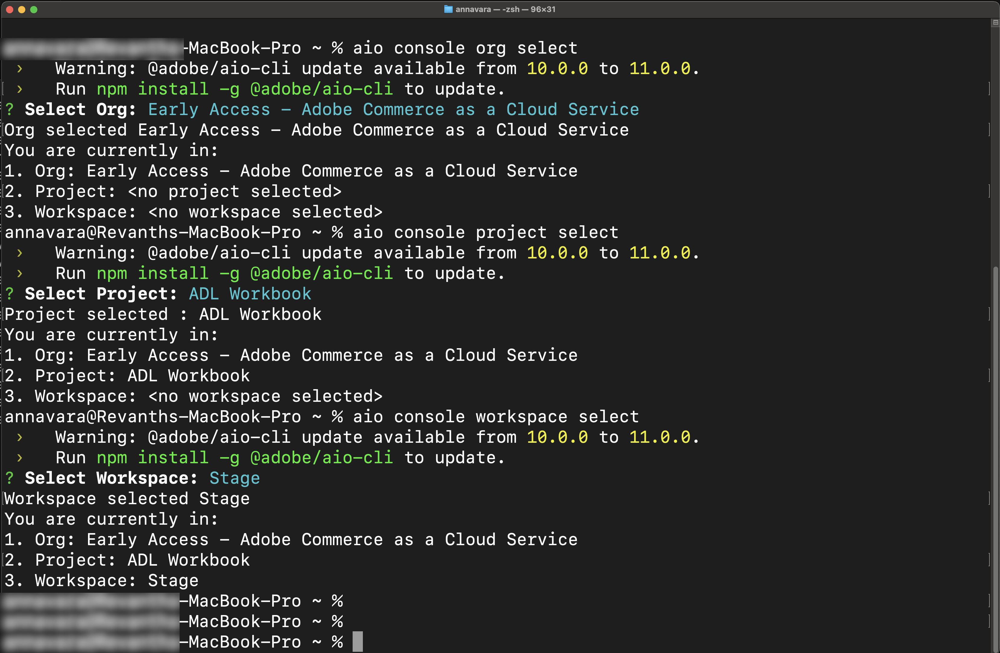
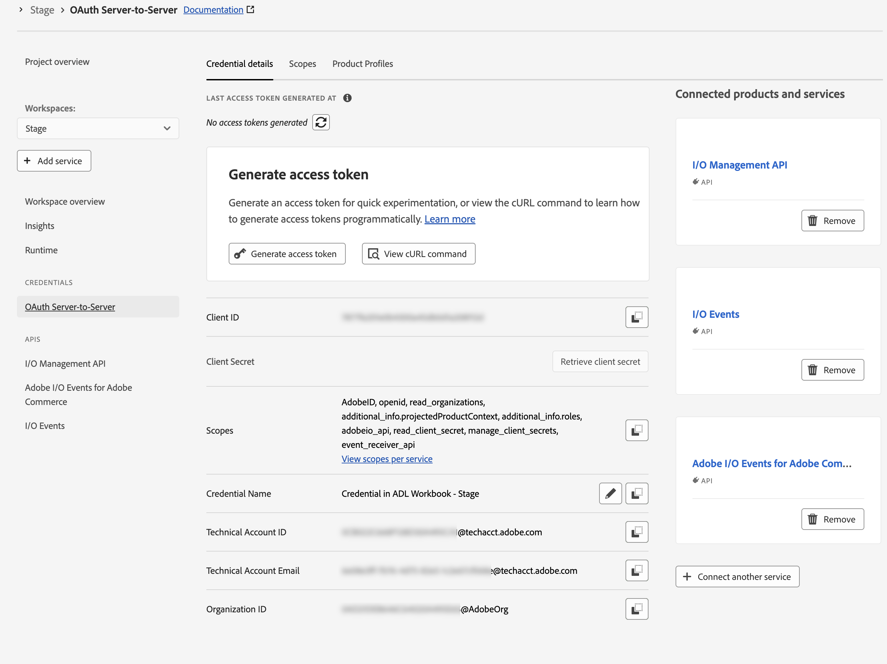
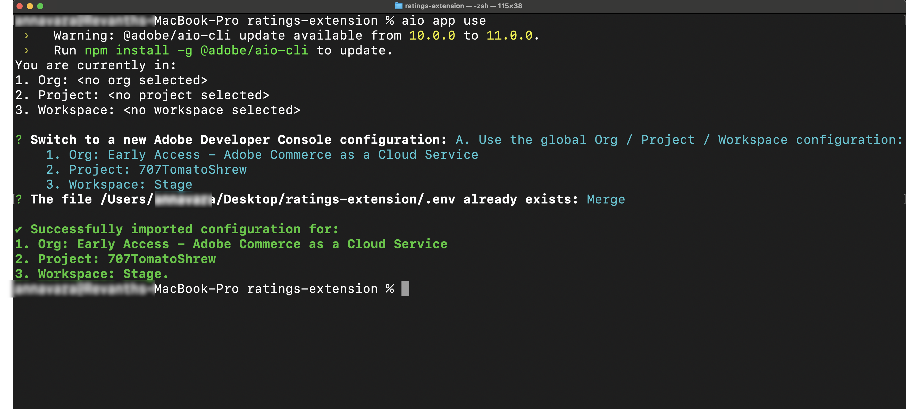
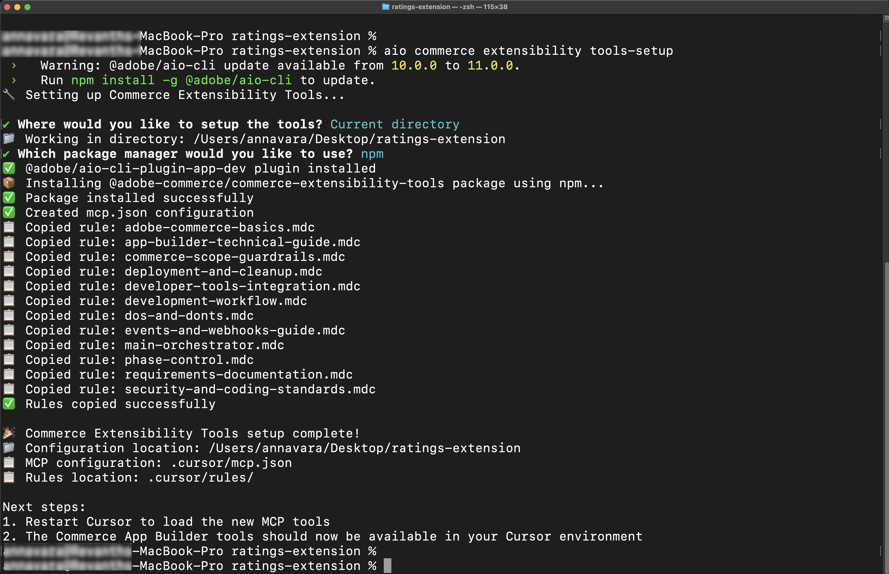
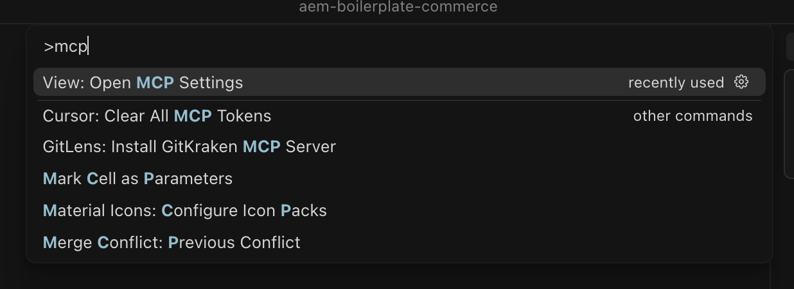
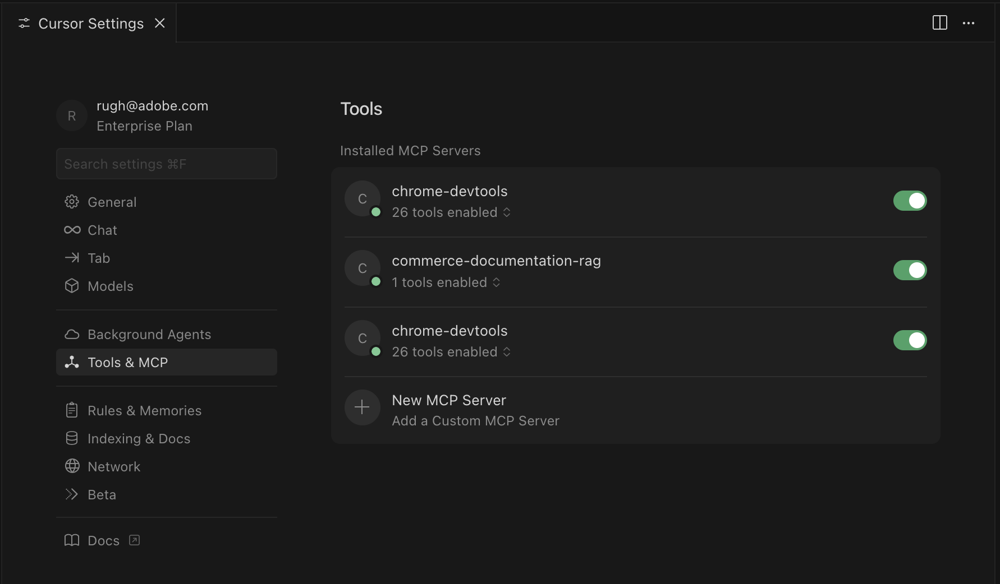
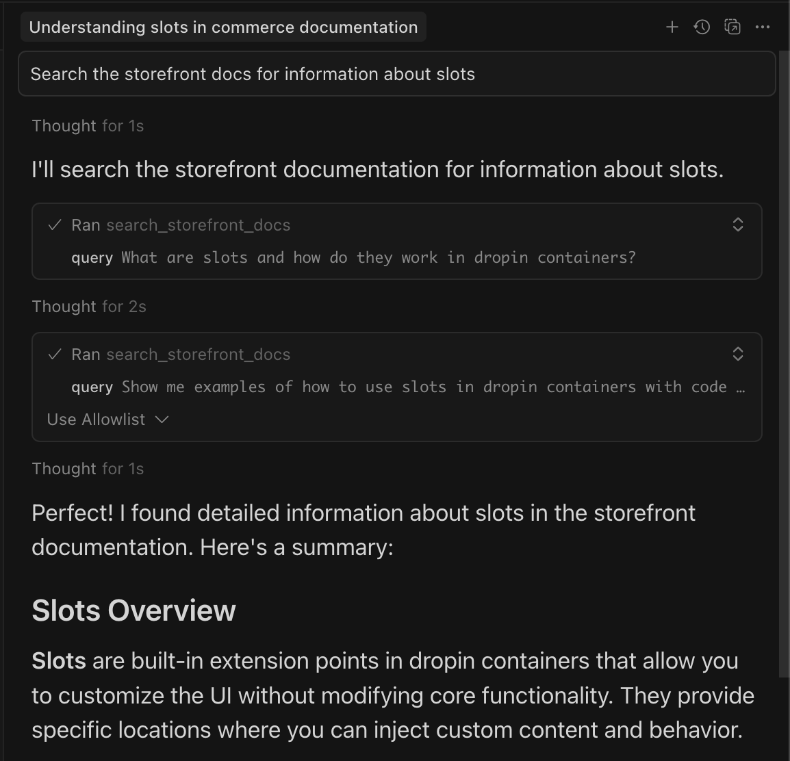

# Ratings extension tutorial prerequisites (Beta)

>[!NOTE]
>
>The AI tooling used in this tutorial is currently in Beta and could include bugs or other issues.

This page lists the prerequisites and setup steps for [!DNL Adobe Commerce as a Cloud Service] tutorials, such as the [ratings extension tutorial](./ratings-extension.md).

## Adobe Commerce as a Cloud Service prerequisites

* Install the [!DNL Adobe I/O CLI]

   ```bash
   npm install -g @adobe/aio-cli
   ```

* Install the [Adobe I/O CLI Commerce](https://github.com/adobe-commerce/aio-cli-plugin-commerce), [Adobe I/O CLI Runtime](https://github.com/adobe/aio-cli-plugin-runtime), and [App Builder CLI](https://github.com/adobe/aio-cli-plugin-app-dev) plugins:

   ```bash
   aio plugins:install https://github.com/adobe-commerce/aio-cli-plugin-commerce @adobe/aio-cli-plugin-app-dev @adobe/aio-cli-plugin-runtime
   ```

* Download an AI-assisted IDE, such as [Cursor](https://cursor.com/download) (recommended), other IDEs, such as Claude Code, Gemini CLI, or Copilot are also supported, but could require modifications to the prompts and other steps in the tutorial.

### Adobe Developer Console prerequisites

1. Navigate to the [Adobe Developer Console](https://developer.adobe.com/console){target="_blank"}.
1. Log in using your email and password.

#### Create a new project

1. Navigate to [Adobe Developer Console](https://developer.adobe.com/).
1. Click [!UICONTROL **Create project from a template**].
1. Select the [!UICONTROL **App Builder**] template.
1. Enter a [!UICONTROL **Project Title**] and [!UICONTROL **App Name**].
1. Ensure the **[!UICONTROL Include Runtime]** checkbox is marked.

   {width="600" zoomable="yes"}

1. Click [!UICONTROL **Save**].

#### Add APIs to the workspace

1. Click the [!UICONTROL **Stage**] workspace and then repeat the following steps for each API.

   {width="600" zoomable="yes"}

1. Click [!UICONTROL **Add Service**] and select [!UICONTROL **API**].

1. Select one of the following APIs. You will need to repeat this process for each API listed below:

   * [!UICONTROL **Adobe Services**] filter:
      * [!UICONTROL **I/O Management API**]
      * [!UICONTROL **I/O Events**] API
   * [!UICONTROL **Experience Cloud**] filter:
      * [!UICONTROL **Adobe I/O Events for Adobe Commerce**] API

1. Click [!UICONTROL **Next**].

1. Click[!UICONTROL **Save configured API**].

1. Repeat the previous steps until all APIs are added to the workspace.

   {width="600" zoomable="yes"}

### Configure the Adobe I/O CLI

1. Clear any existing configuration:

   ```bash
   aio config clear
   ```

   Log in using the [!DNL Adobe I/O CLI]:

   ```bash
   aio auth login -f
   ```

1. Select your organization, project, and workspace, using each of the following commands:

   ```bash
   aio console org select
   ```

   ```bash
   aio console project select
   ```

   ```bash
   aio console workspace select
   ```

   {width="600" zoomable="yes"}

### Clone the integration starter kit

Clone the Commerce integration starter kit repository and prepare your project:

```bash
git clone https://github.com/adobe/commerce-integration-starter-kit.git extension
cd extension
```

{width="600" zoomable="yes"}

### Create an .env file

Create your environment configuration file:

```bash
cp env.dist .env
```

Open the `.env` file in a text editor and add the following OAuth credentials:

```shell-session
OAUTH_CLIENT_ID=
OAUTH_CLIENT_SECRET=
OAUTH_TECHNICAL_ACCOUNT_ID=
OAUTH_TECHNICAL_ACCOUNT_EMAIL=
OAUTH_ORG_ID=
```

You can copy these values from the **[!UICONTROL Credential details]** page in [Developer Console](https://developer.adobe.com/) by clicking the **[!UICONTROL OAuth Server-to-Server]** tab on your workspace.

{width="600" zoomable="yes"}

#### Add the Commerce configuration

Add the following Commerce instance details to your `.env` file:

```shell-session
COMMERCE_BASE_URL=
COMMERCE_GRAPHQL_ENDPOINT=
```

To find these values:

1. Navigate to [Commerce Cloud Service instances](https://experience.adobe.com/#/@commerce/commerce/cloud-service/instances).
1. Click the information icon next to your instance.
1. Copy the REST endpoint as `COMMERCE_BASE_URL`.
1. Copy the GraphQL endpoint as `COMMERCE_GRAPHQL_ENDPOINT`.

#### Set event prefix

Set a temporary value for the event prefix:

```shell-session
EVENT_PREFIX=test
```

### Download workspace configuration

Run the following command to download the workspace configuration file:

```bash
aio console workspace download workspace.json
```

Copy the workspace configuration file to the `scripts` directory:

```bash
cp workspace.json scripts/
```

### Connect local workspace to remote workspace

Link your local project to the remote workspace:

```bash
aio app use workspace.json -m
```

{width="600" zoomable="yes"}

### Install extensibility AI tools

Update the Cursor rules file and MCP configuration to include the `commerce-extensibility-tools` package.

1. Set up the AI-assisted development tools in the `extension` folder using the following commands:

   ```bash
   cd extension
   ```

   ```bash
   aio commerce extensibility tools-setup
   ```

   {width="600" zoomable="yes"}
<!--
## Storefront prerequisites

The following items are required to complete the [storefront](./ratings-extension.md#connect-to-the-storefront) section of [this tutorial](./ratings-extension.md) and see the product ratings in your store.

* Install [!DNL Node.js] (version `22.x.x`) and npm (`9.0.0` or higher). Verify your installation:

   ```bash
   node --version
   npm --version
   ```

* Install [Git](https://git-scm.com) (Optional) - Required only if [cloning the repository directly](#option-a-clone-the-repository-recommended)(recommended), not needed if you [download the zip file](#option-b-download-the-zip-file). Verify your installation:

  ```bash
  git --version
  ```

* Bash shell
  * macOS/Linux: No installation required
  * Windows: Use [Git Bash](https://git-scm.com/install) or [Windows Subsystem for Linux (WSL)](https://learn.microsoft.com/en-us/windows/wsl/install)

* [Google Chrome](https://www.google.com/chrome/) - Required for testing the storefront

### Get the project files

You can obtain the project files using one of the following methods:

#### Option A: Clone the repository (recommended)

If you have [!DNL Git] installed, open your terminal and clone the repository:

```bash
git clone --branch agentic-dev https://github.com/hlxsites/aem-boilerplate-commerce.git storefront
cd storefront
```

#### Option B: Download the zip file

If you do not have [!DNL Git] installed:

1. Download the project zip file from: [https://github.com/hlxsites/aem-boilerplate-commerce/archive/refs/heads/agentic-dev.zip](https://github.com/hlxsites/aem-boilerplate-commerce/archive/refs/heads/agentic-dev.zip)
1. Extract the zip file to a folder on your machine.
1. Open your terminal and navigate into the unzipped folder:

   ```bash
   cd path/to/aem-boilerplate-commerce-agentic-dev
   ```

### Install root dependencies

Install the main project dependencies:

```bash
npm install
```

This will install all the necessary packages for the storefront application.

### Install MCP server dependencies

Navigate to the MCP server directory and install its dependencies:

```bash
cd mcp-server
npm install
cd ..
```

### Configure environment variables

The MCP server requires certain environment variables to connect to the RAG service.

Create an `.env` file in the `mcp-server` directory:

```bash
cd mcp-server
cp env.example .env
```

Edit the `.env` file and add the following values:

```env
RAG_MODE=worker
WORKER_RAG_URL=
```

### Enable MCP in Cursor

The Model Context Protocol (MCP) server provides AI agents with access to [!DNL Adobe Commerce] Storefront documentation.

#### Open Cursor MCP settings

{width="600" zoomable="yes"}

1. Open [!DNL Cursor].
1. Navigate to **[!UICONTROL Cursor]** > **[!UICONTROL Settings]** > **[!UICONTROL Cursor Settings]** > **[!UICONTROL Tools & MCP]**.

#### Enable and configure MCP features

The project includes an MCP configuration file at `.cursor/mcp.json`. This file should already be configured to use the local MCP server.

Verify the MCP configuration:

1. Ensure the "commerce-documentation-rag" server is listed and enabled

The configuration should look similar to this:

{width="600" zoomable="yes"}

>[!NOTE]
>
>The `start-mcp.sh` script will automatically load the environment variables from your `.env` file in the `mcp-server` directory.

#### Restart Cursor

After enabling MCP and configuring the server:

1. Quit [!DNL Cursor] completely.
1. Reopen [!DNL Cursor] and open the `aem-boilerplate-commerce` project.

#### Verify MCP connection

Check that the MCP server is running correctly:

1. Open a new chat in [!DNL Cursor].
1. Look for an indicator showing the MCP server is connected. This indicator is typically located in the chat interface.
1. Try entering a prompt like the following:

   ```shell-session
   Search the storefront docs for information about slots
   ```

If the MCP server is working, you should see relevant documentation results.

{width="600" zoomable="yes"}

If this works, you are ready to continue with the [tutorial](./ratings-extension.md).
 -->
