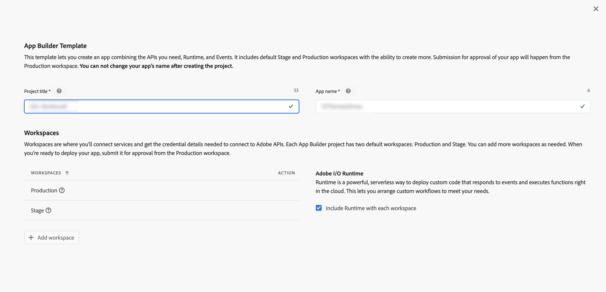
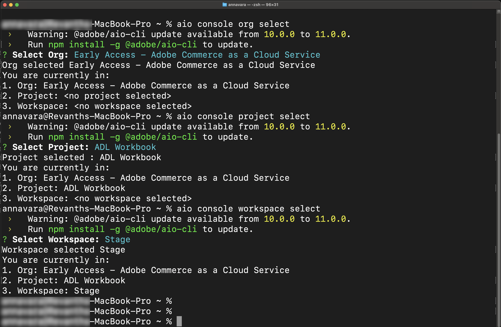
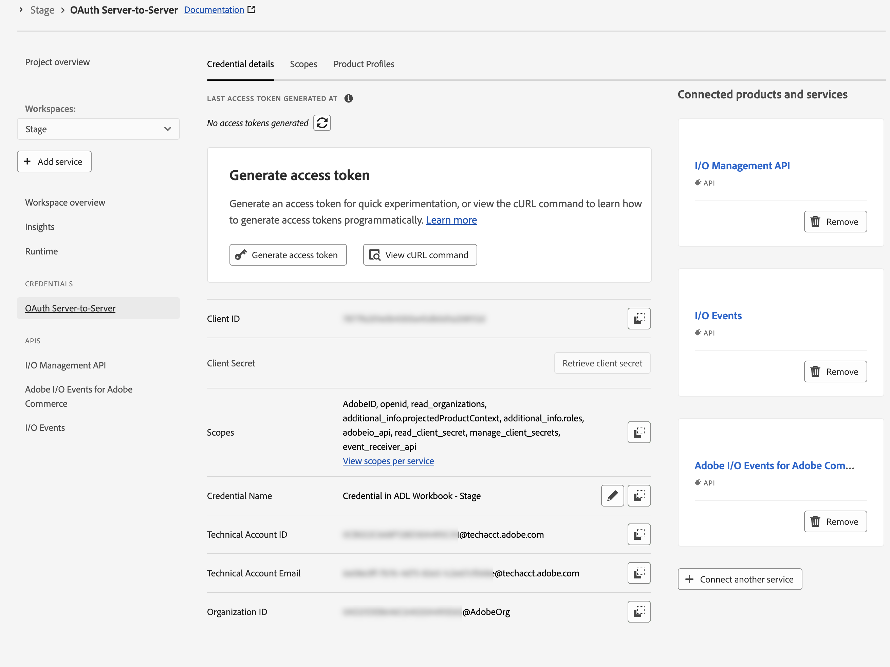

# Tutorial prerequisites

This page lists the prerequisites and setup steps for [!DNL Adobe Commerce as a Cloud Service] tutorials, such as the [ratings extension tutorial](./ratings-extension.md) and the [shipping method extension tutorial](./shipping-method-extension.md).

## General prerequisites

The following tools are required for both extension and storefront development in this tutorial.

* [!DNL Node.js] (version `22.x.x`) and npm (`9.0.0` or higher): Verify your installation using the following command:

   ```bash
   node --version
   npm --version
   ```

* Install [Git](https://git-scm.com) - Verify your installation:

  ```bash
  git --version
  ```

* Bash shell
  * macOS/Linux: No installation required
  * Windows: Use [Git Bash](https://git-scm.com/install) or [Windows Subsystem for Linux (WSL)](https://learn.microsoft.com/en-us/windows/wsl/install)

* Download an AI-assisted IDE, such as [Cursor](https://cursor.com/download) (recommended). Other IDEs, such as Claude Code, Gemini CLI, or Copilot are also supported, but could require modifications to the prompts and other steps in the tutorial.

## [!DNL Adobe Commerce as a Cloud Service] prerequisites

* Install the [!DNL Adobe I/O CLI]

   ```bash
   npm install -g @adobe/aio-cli
   ```

* Install the [Adobe I/O CLI Commerce](https://github.com/adobe-commerce/aio-cli-plugin-commerce), [Adobe I/O CLI Runtime](https://github.com/adobe/aio-cli-plugin-runtime), and [App Builder CLI](https://github.com/adobe/aio-cli-plugin-app-dev) plugins:

   ```bash
   aio plugins:install https://github.com/adobe-commerce/aio-cli-plugin-commerce @adobe/aio-cli-plugin-app-dev @adobe/aio-cli-plugin-runtime
   ```

After installing the [!DNL Adobe I/O CLI] and the required plugins, set up your extensibility workspace. Adobe recommends using the automated setup for the fastest experience.

* **[Automated setup](#automated-setup) (Recommended)** — Run a single command to configure your workspace automatically.
* **[Manual setup](#manual-setup)** — Follow step-by-step instructions to configure each component individually.

### Automated setup (Recommended) {#automated-setup}

>[!TIP]
>
>If you encounter issues with the automated setup, follow the [manual setup](#manual-setup) steps below.

The `app-setup` command automates the workspace setup process, including creating an [!DNL Adobe Developer Console] project, adding the required APIs, configuring the [!DNL Adobe I/O CLI], cloning the starter kit, connecting your local workspace, and installing the extensibility AI tools.

The `app-setup` command guides you through the following steps:

* Selecting or creating an [!DNL Adobe Developer Console] project with the required APIs
* Configuring the [!DNL Adobe I/O CLI] with your organization, project, and workspace
* Cloning the appropriate starter kit and setting up the project
* Configuring the environment and connecting the local workspace to the remote workspace
* Installing the Commerce extensibility tools and coding agent skills

Run the following command and follow the interactive prompts:

```bash
aio commerce extensibility app-setup
```

After the command completes, navigate to your project directory and restart your coding agent to load the new MCP tools and skills. If your tutorial requires a storefront, rerun the command and select the [!DNL AEM Boilerplate Commerce] starter kit.

The following example installation shows the interactive prompts and output for the checkout starter kit.

+++Example installation (checkout starter kit)

```shell-session
aio commerce extensibility app-setup

🚀 Adobe Commerce Extensibility App Setup

✔ Logged in
📁 Working directory: /Users/username/projects/my-commerce-project

✔ Which starter kit would you like to use? Checkout Starter Kit
✔ Enter a name for your project directory: my-extension
✔ Which coding agent would you like to install the skills for? Cursor

📦 Cloning Checkout Starter Kit...
   ✔ Repository cloned
   Using npm (package-lock.json found)
   ✔ Dependencies installed

📋 Current Adobe I/O Console configuration:
   Org: My Organization (1234567)
   Project: My Commerce Project (1234567890123456789)
   Workspace: Stage (9876543210987654321)
✔ Do you want to continue with this configuration? (Answer "No" to select a different org/project/workspace)
No

🔧 Selecting Adobe I/O Console org, project, and workspace...

? Select Org: My Organization
Org selected My Organization
You are currently in:
1. Org: My Organization
2. Project: <no project selected>
3. Workspace: <no workspace selected>

? Select Project: My Commerce Project
Project selected : My Commerce Project
You are currently in:
1. Org: My Organization
2. Project: My Commerce Project
3. Workspace: <no workspace selected>

? Select Workspace: Stage
Workspace selected Stage
You are currently in:
1. Org: My Organization
2. Project: My Commerce Project
3. Workspace: Stage

✅ Console configured:
   Org: My Organization
   Project: My Commerce Project
   Workspace: Stage

🔐 Configuring workspace credentials and services...
   ✔ Workspace configuration loaded
   ✔ OAuth server-to-server credentials already configured
   ✔ All required services available in organization
   ✔ Subscribed to: Adobe Commerce as a Cloud Service

📋 Configuring Checkout Starter Kit...
   Creating .env from env.dist...
✔ Select tenant (type to search) My Commerce Instance:
https://<region>.api.commerce.adobe.com/<tenant-id>/graphql
   ✔ Commerce instance configured
✔ Enter the event prefix for your workspace: my-prefix
   ✔ Workspace IDs configured
   ✔ OAuth credentials configured
   ✔ Checkout Starter Kit configured

🔧 Installing Commerce Extensibility tools and agent skills...
   ✔ Commerce Extensibility tools installed

🎉 App setup complete!

📁 Project directory: /Users/username/projects/my-commerce-project/my-extension

Next steps:
   1. cd into your project directory
   2. Restart your coding agent to load the Commerce Extensibility tools and skills
```

+++

### Manual setup {#manual-setup}

The following sections describe how to manually set up each component of your extensibility workspace. Follow these steps if you prefer manual configuration, or if you encounter issues with the [automated setup](#automated-setup).

### Adobe Developer Console prerequisites

Set up a project in the Adobe Developer Console with the required APIs and credentials.

1. Navigate to the [Adobe Developer Console](https://developer.adobe.com/console){target="_blank"}.
1. Log in using your email and password.

#### Create a new project

Create an App Builder project in the Adobe Developer Console to host your extension.

1. Navigate to [Adobe Developer Console](https://developer.adobe.com/).
1. Click **[!UICONTROL Create project from a template]**.
1. Select the **[!UICONTROL App Builder]** template.
1. Enter a **[!UICONTROL Project Title]** and **[!UICONTROL App Name]**.
1. Ensure the **[!UICONTROL Include Runtime]** checkbox is marked.

   {width="600" zoomable="yes"}

1. Click **[!UICONTROL Save]**.

#### Add APIs to the workspace

Add the required APIs to your Stage workspace for event management and Commerce integration.

1. Click the **[!UICONTROL Stage]** workspace and then repeat the following steps for each API.

   {width="600" zoomable="yes"}

1. Click **[!UICONTROL Add Service]** and select **[!UICONTROL API]**.

1. Select one of the following APIs. Repeat this process for each API listed below:

   * **[!UICONTROL Adobe Services]** filter:
      * **[!UICONTROL I/O Management API]**
      * **[!UICONTROL I/O Events]** API
   * **[!UICONTROL Experience Cloud]** filter:
      * **[!UICONTROL Adobe I/O Events for Adobe Commerce]** API

1. Click **[!UICONTROL Next]**.

1. Click **[!UICONTROL Save configured API]**.

1. Repeat the previous steps until you add all APIs to the workspace.

   {width="600" zoomable="yes"}

### Configure the Adobe I/O CLI

Connect the [!DNL Adobe I/O CLI] to your organization, project, and workspace.

1. Clear any existing configuration:

   ```bash
   aio config clear
   ```

1. Log in using the [!DNL Adobe I/O CLI]:

   ```bash
   aio auth login -f
   ```

1. Select your organization, project, and workspace using each of the following commands:

   ```bash
   aio console org select
   ```

   ```bash
   aio console project select
   ```

   ```bash
   aio console workspace select
   ```

   {width="600" zoomable="yes"}

### Clone the starter kits

Clone one of the following Commerce starter kit repositories for the extension you are building and prepare your project:

Integration starter kit:

```bash
git clone https://github.com/adobe/commerce-integration-starter-kit.git extension
cd extension
```

Checkout starter kit:

```bash
git clone https://github.com/adobe/commerce-checkout-starter-kit.git extension
cd extension
```

>[!BEGINTABS]

>[!TAB Integration starter kit]

### Create an .env file

Create your environment configuration file:

```bash
cp env.dist .env
```

Open the `.env` file in a text editor and add the following OAuth credentials:

```bash
OAUTH_CLIENT_ID=
OAUTH_CLIENT_SECRET=
OAUTH_TECHNICAL_ACCOUNT_ID=
OAUTH_TECHNICAL_ACCOUNT_EMAIL=
OAUTH_ORG_ID=
```

Copy these values from the **[!UICONTROL Credential details]** page in [Developer Console](https://developer.adobe.com/) by clicking the **[!UICONTROL OAuth Server-to-Server]** tab on your workspace.

{width="600" zoomable="yes"}

#### Add the Commerce configuration

Add the following Commerce instance details to your `.env` file:

```bash
COMMERCE_BASE_URL=
COMMERCE_GRAPHQL_ENDPOINT=
```

To find these values:

1. Navigate to [Commerce Cloud Service instances](https://experience.adobe.com/#/@commerce/commerce/cloud-service/instances).
1. Click the information icon next to your instance.
1. Copy the REST endpoint as `COMMERCE_BASE_URL`.
1. Copy the GraphQL endpoint as `COMMERCE_GRAPHQL_ENDPOINT`.

#### Set the event prefix

Set a temporary value for the event prefix:

```bash
EVENT_PREFIX=test
```

### Download the workspace configuration

Run the following command to download the workspace configuration file:

```bash
aio console workspace download workspace.json
```

Copy the workspace configuration file to the `scripts` directory:

```bash
cp workspace.json scripts/
```

### Connect the local workspace to the remote workspace

Link your local project to the remote workspace:

```bash
aio app use workspace.json -m
```

{width="600" zoomable="yes"}

>[!TAB Checkout starter kit]

### Connect local workspace to remote workspace

Link your local project to the remote workspace. From the project root (the `extension` folder), run:

```bash
aio app use --merge
```

When prompted, choose the option that uses the organization, project, and workspace you selected when configuring the Adobe I/O CLI. This writes the workspace configuration into your app so that deploy and local development use that workspace.

{width="600" zoomable="yes"}

>[!ENDTABS]

### Install the extensibility AI tools

This process creates the MCP configuration (`.<agent>/mcp.json`), the skills directory (`.<agent>/skills/`), and adds `AGENTS.md` to the project root. You will be prompted to choose a starter kit, coding agent, and package manager.


1. Set up the AI-assisted development tools in the `extension` folder using the following commands:

   ```bash
   cd extension
   ```

   ```bash
   aio commerce extensibility tools-setup
   ```

   {width="600" zoomable="yes"}

1. After the setup completes, restart your coding agent to allow it to load the new MCP tools and skills. The Commerce App Builder tools are now available in your environment.

   >[!NOTE]
   >
   >If you see a warning that no skills were found for the starter kit, something went wrong—often because the setup was run in a folder other than where the starter kit was cloned. Run `aio commerce extensibility tools-setup` from the `extension` folder (the starter kit project root) and select the appropriate starter kit when prompted.

   {width="600" zoomable="yes"}

## Storefront manual setup

This section describes how to manually configure your storefront for the [Ratings extension tutorial](./ratings-extension.md) and other storefront tutorials.

To automatically configure your storefront, run the `app-setup` command described in the [Automated setup](#automated-setup) section and select the [!DNL AEM Boilerplate Commerce] starter kit.

### Prerequisites

The following items are required to complete the [storefront](./ratings-extension.md#connect-to-the-storefront) section of the [Ratings extension tutorial](./ratings-extension.md) and display product ratings in your store.

* [Google Chrome](https://www.google.com/chrome/) - Required for testing the storefront

* A storefront project connected to your [!DNL Commerce] instance. If you do not have a storefront project, follow the steps in [Create a storefront](https://experienceleague.adobe.com/developer/commerce/storefront/get-started/create-storefront/){target="_blank"}, including the [Link repo to commerce data](https://experienceleague.adobe.com/developer/commerce/storefront/get-started/create-storefront/#link-repo-to-commerce-data){target="_blank"} section.

### Clone the storefront repository

Open your terminal and clone the repository:

```bash
git clone https://github.com/hlxsites/aem-boilerplate-commerce.git storefront
cd storefront
```

### Install the dependencies

Install the project dependencies:

```bash
npm install
```

### Install the storefront AI tools

Set up the AI-assisted development tools in the `storefront` folder.

Run the following command from the root of your boilerplate project. The command installs the `@adobe-commerce/commerce-extensibility-tools` package as a dev dependency, copies the skill files into your agent's skills directory, and configures MCP (Model Context Protocol) so your agent can access Commerce documentation search tools.

```bash
aio commerce extensibility tools-setup
```

The command walks you through two prompts:

1. **Select a starter kit** — Choose **AEM Boilerplate Commerce**.

1. **Select your coding agent** — Choose your agent from the list of supported agents.
