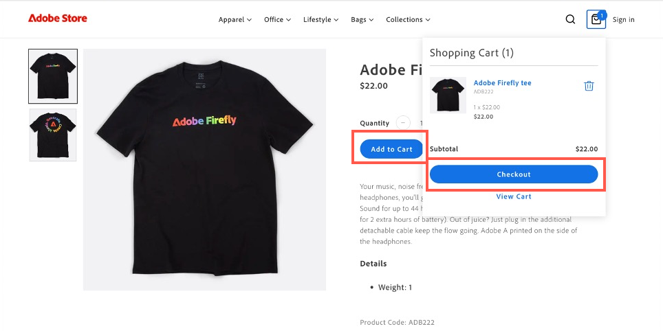
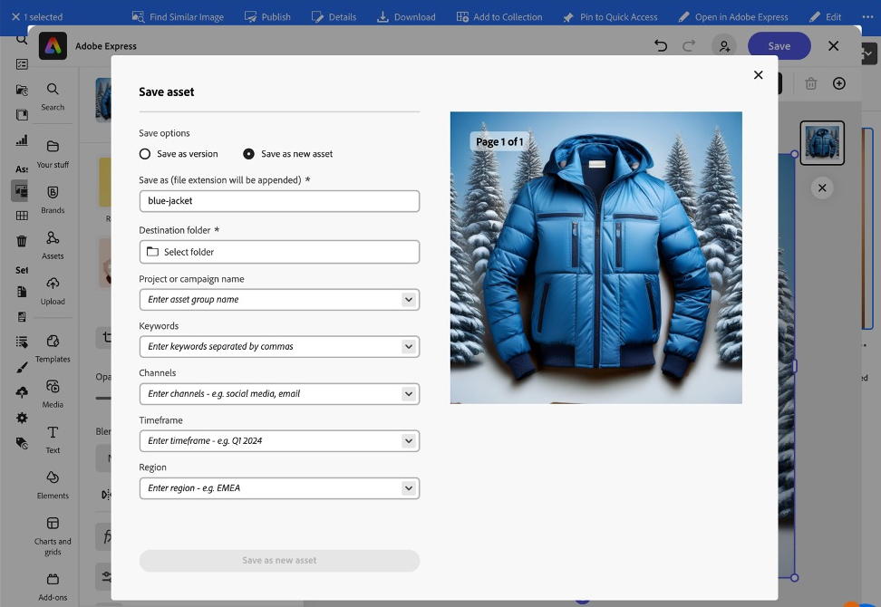

# Use cases

{{accs-early-access}}

The following use cases demonstrate core functionality and business scenarios supported by [!DNL Adobe Commerce as a Cloud Service], allowing you to accelerate development and launch high-impact experiences.

If you encounter any issues, check the [Troubleshooting](#troubleshooting) section for guidance.

## Prerequisites

Before attempting any of these use cases, you must complete the following prerequisites:

1. [Create your Cloud Service instance](./getting-started.md#create-an-instance) using the following options:
   1. Select [!UICONTROL **Sandbox**] in the [!UICONTROL **Enviornment**] dropdown.
   1. Select [!UICONTROL **Adobe Store**] in the [!UICONTROL **Test data**] dropdown.
1. [Log in to your Adobe Experience Cloud account](https://experience.adobe.com)
1. [Set up your Cloud Service storefront](./storefront.md) using the following options:
   1. Select [!UICONTROL `adobe-commerce/adobe-demo-store`] for the template.
   1. Select [!UICONTROL **Pick an available instance (Mesh -> SaaS)**] for the connection method.

## Checkout workflow

This workflow demonstrates the checkout process for a customer purchasing a product from your storefront and how you, as an administrator, can confirm the order.

### Enable payment services

1. In the Commerce Admin, navigate to [!UICONTROL **Settings**] > [!UICONTROL **Payment Methods**].

1. In the [!UICONTROL **General Configuration**] section, enter your `Payment Services Sandbox ID` and `Payment Services Sandbox Key`. You can get these IDs by following the steps described in [Sandbox onboarding](../payment-services/sandbox.md#sandbox-onboarding)

1. Set the [!UICONTROL **Enable**] dropdown to [!UICONTROL **Yes**].

1. Click [!UICONTROL **Save Config**].

### Purchase a product

1. Go to the [storefront](./storefront.md) you created in the prerequisites. 

1. Find and select a product. Make any necessary customization selections. Then click [!UICONTROL **Add to cart**].

   {width="600" zoomable="yes"}

1. Select the cart icon to view your cart. 

   {width="600" zoomable="yes"}

1. Click [!UICONTROL **Checkout**].

   {width="600" zoomable="yes"}

1. Enter the required contact details and shipping information. You can use fictional information for this order.

1. To checkout, select [!UICONTROL **Check / Money Order**]. If you want to use a credit card, use one of the [test cards provided by Paypal](https://developer.paypal.com/tools/sandbox/card-testing/#link-teststaticcardnumbers). You can use these with any future expiration date and any CVC.

   {width="600" zoomable="yes"}

   {width="600" zoomable="yes"}

1. Click [!UICONTROL **Place Order**].

### Confirm the order

1. Open the Commerce Admin: `<your store URL>/admin`.

1. Log in using your Adobe ID.

1. Navigate to [!UICONTROL **Sales**] > [!UICONTROL **Orders**].

   {width="600" zoomable="yes"}

1. Look for the order you placed and confirm the details.

   {width="600" zoomable="yes"}

## Update storefront content

Create, edit, and publish content directly onto the storefront.

1. Open the [storefront](./storefront.md) you created in the prerequisites.

1. Open Storefront Builder. By navigating to `https://da.live/#/<GitHub User Name>/<Repository Name>/main/da/index.md`.

1. Open the [!UICONTROL **Index**] page.

1. Below the Carousel block, enter a new title by editing the "Welcome to the Adobe Store Demo" line.

1. Click the send icon and click [!UICONTROL **Preview**].

1. Review the preview page and click [!UICONTROL **Publish**].

1. Refresh the storefront page and confirm that your changes are now live.

## Contextual expermentation

Adobe Commerce's contextual experimentation feature allows you to create and manage experiments on your storefront to test different content and configurations.

### Prerequisites

* Install the [AEM Sidekick extension](https://www.aem.live/docs/sidekick)

1. In Storefront Builder, select your index page and click [!UICONTROL **Copy**].
  
1. Create an [!UICONTROL **experiments**] folder under the main folder, by clicking the [!UICONTROL **New**] button and selecting [!UICONTROL **Folder**].

1. Create a folder named **1234** in the [!UICONTROL **experiments**] folder.

1. Paste the two copies of the index page into the **1234** folder.

1. Open each page and rename them "homev1" and "homev2". These are your [challengers](https://www.aem.live/docs/experimentation#create-your-challenger-page).

1. Modify each page to include different content. For example, change the hero image or the text. You need to be able to identify the differences between each page.

1. Publish each of your challenger pages.

1. Open your control page, the original index page.

1. Add a new block with the title [!UICONTROL **metadata**].

1. Add the following information to the rows of the metadata block

     * Title - Adobe Commerce
     * Description - A web store
     * Experiment - 1234
     * Experiment Variants
       * `https://<your-site>.aem.live/experiments/1234/indexv1`
       * `https://<your-site>.aem.live/experiments/1234/indexv2`

    {width="600" zoomable="yes"}

1. Open an incognito or private browsing window and navigate to your main page.

1. Close the private browsing window and repeat the previous step. Each time you open the page, you will see a random variant that you created.

## Enhance storefront content

With AEM Assets, Adobe Express, and Firefly, you can now quickly make changes to images that appear in your storefront with a simple, self-driven workflow.

### Prerequisites

* Requires access to AEM Assets, Adobe Express, and Adobe Firefly.

### Cusomize the background of an image

Consider a scenario where you want to quickly modify the background of a product image. The combination of Adobe Commerce, AEM Assets, and Adobe Express allows you to make this change in a few simple steps.

1. Open the [storefront](./storefront.md) you created in the prerequisites and navigate to an item you want to change. Note the items SKU or Product Code.

1. Open [!UICONTROL AEM Assets], by selecting it in the [Adobe Experience Cloud](https://experience.adobe.com/#/home).

   {width="600" zoomable="yes"}
 
1. Click [!UICONTROL Assets].

   {width="600" zoomable="yes"}

1. Search for the item by **SKU** or **Product Code**.

1. Select the item you want to edit and click [!UICONTROL **Open in Adobe Express**].

   {width="600" zoomable="yes"}

1. In the [!UICONTROL **Image**] panel, select [!UICONTROL **Insert object**].

   {width="600" zoomable="yes"}

1. In the text box, describe the image you want to add. For example, "snowy pine trees".

   {width="600" zoomable="yes"}

1. Adjust the [!UICONTROL Brush size] and draw where you want to add the generated image. For this example, draw around the existing object to select the background.

1. Click [!UICONTROL **Generate**] to view the results.

1. Choose from the different results, by selecting the desired option and clicking [!UICONTROL **Keep**].

1. Click [!UICONTROL **Your Stuff**] to return to the image editor.

1. Click [!UICONTROL **Save**] to specify the image type. 

1. Click [!UICONTROL **Save**] again to save the changes.

1. In the [!UICONTROL **Save asset**] dialog, select the Commerce [!UICONTROL **Destination folder**].

   {width="600" zoomable="yes"}

1. Click [!UICONTROL **Save as new asset**] to save the image.

#### Add the image to Commerce AEM Assets

1. From the [Navigation Panel](https://experienceleague.adobe.com/en/docs/experience-manager-cloud-service/content/sites/authoring/basic-handling#navigation-panel) of AEM as a Cloud Service, select **Assets** > **Files** > **Commerce** and click on the asset you created in the previous section.

   {width="600" zoomable="yes"}

1. Click [!UICONTROL **Properties**]. 

   {width="600" zoomable="yes"}

1. Select the [!UICONTROL **Commerce**] tab.

   {width="600" zoomable="yes"}

1. Ensure that the [!UICONTROL **Does it exist in Adobe Commerce?**] field is set to [!UICONTROL **Yes**].

1. Click [!UICONTROL **Add**] and enter the product SKU you want to add the asset to.

   {width="600" zoomable="yes"}

1. Select the position for the asset and the asset type. 

1. Select the [!UICONTROL **Basic**] tab and change the [!UICONTROL **Review Status**] tab to [!UICONTROL **Approved**].

   {width="600" zoomable="yes"}

1. Click [!UICONTROL **Save & Close**].

#### Confirm the image in Commerce

1. In the Adobe Commerce [!UICONTROL **Admin**], navigate to [!UICONTROL **Catalog**] > [!UICONTROL **Products**].

1. Select the product you added the image to in the previous section.

1. Expand the [!UICONTROL **Images and Videos**] section.

   {width="600" zoomable="yes"}

1. Confirm that your image is now available in the list of images.

1. Return to your storefront and navigate to the page for the modified product.

1. Confirm that the new image appears.

   {width="600" zoomable="yes"}

## Generate Variations

Adobe Commerce's Generate Variations leverages Generative AI to automate high-quality content generation, fine-tune messaging, and seamlessly publish assets to your storefront.

### Generate text

1. Open your storefront site using the [Universal Editor](https://experienceleague.adobe.com/en/docs/experience-manager-cloud-service/content/implementing/developing/universal-editor/introduction).

1. Select the block of text you want to edit.

1. In the [!UICONTROL **Properties**] panel, click [!UICONTROL **Generate Variations**].

1. Click the [!UICONTROL **Generate**] button.

1. Select or customize the generated text.

1. Click [!UICONTROL **Publish**] to update your storefront.

### Generate content and images

1. Open [Generate Variations](https://experienceleague.adobe.com/en/docs/experience-manager-cloud-service/content/generative-ai/generate-variations) 

1. Select the [!UICONTROL **Hero Banner**] template.

1. In the [!UICONTROL **Explain user interaction**] textbox, enter: "Experience for Adobe employees and partners to buy Adobe-branded gear!".

1. In the [!UICONTROL **URL for domain knowledge**], enter **www.adobestore.com**.

1. Click [!UICONTROL **Generate**].

1. Select a content variation and click [!UICONTROL **Generate Image**].

1. From the [!UICONTROL **Image size**] dropdown, select [!UICONTROL **Widescreen (16:9)**].

1. From the [!UICONTROL **Content type**] dropdown, select [!UICONTROL **Photo**].

1. For the [!UICONTROL **Style**] reference image, select the existing Adobe store banner.

1. Select the generated image that you want to use and click [!UICONTROL **Save**].

1. Repeat this process with other reference images to generate more variations.

## Troubleshooting

Use the following suggestions to resolve any issues you face when attempting these tutorials.

* If you need guidance on commands or flags:
  1. Run `aio --help` to see all available commands and flags.
  1. For specific commands, use the `--help` flag. For example:
     * `aio console --help`
     * `aio commerce –help`
 
* If you encounter invalid login issues:
  1. Run `aio config clear `.
  1. Run `aio auth login –-force `.
  1. Login in your browser.
  1. Select your profile.
  1. Switch back to the terminal to continue.

* If your `init` command fails:
  1. Run `aio api-mesh delete`.
  1. Re-run `aio commerce init`.

* If you selected the wrong org, project, or workspace before running the `init` command:
  1. Run `aio console org select`.
  1. Run `aio console project select`.
  1. Run `aio console workspace select`.

* If you have an invalid tenant selection:
  1. Cancel the current CLI execution by pressing **Ctrl-C**.
  1. Run `aio commerce init`.

* If you encounter an invalid API Mesh installation:
   * Run `aio api-mesh update mesh-config.json`.
