# Ratings extension lab

This lab guides you through building a product ratings extension for [!DNL Adobe Commerce as a Cloud Service] using [!DNL Adobe App Builder] and AI-assisted development tools.

## Verify prerequisites

Verify the following prerequisites are installed:

```bash
# Check Node.js version (should be 22.14.0 or higher)
node --version

# Check npm version (should be 11.6.0 or higher)
npm --version

# Check Git
git --version

# Check Bash
bash --version
```

## Run the setup script

If the [prerequisites](#verify-prerequisites) are installed, download and run the setup script. Alternatively, you can manually setup the script by following the [lab prerequisites](workbook-prerequisites.md) steps.

1. Clone the repository that contains the setup script:

   ```bash
   git clone https://github.com/adobe-commerce/commerce-adl-2025.git
   ```

1. Navigate into the repository:

   ```bash
   cd commerce-adl-2025
   ```

1. Run the setup script:

   ```bash
   bash adl-setup.sh
   ```

   While the script is running, you will be prompted to enter your username and password, which will be provided during the lab. Your username will reflect your location and seat number. For example, if you are in San Jose, CA, seat 123, your username will be `sjc-adl-123`.

   Additionally, you should select the project that corresponds to your seat number and the **stage** workspace.

## Install AI tools

Set up the AI-assisted development tools:

```bash
aio commerce extensibility tools-setup
```

{width="600" zoomable="yes"}

## Open Cursor

>[!NOTE]
>
>When working with AI-assisted development tools, there will be natural variations in the code and responses generated by the agent.

Open the [!DNL Cursor] application or run the following command in your terminal:

```bash
cursor .
```

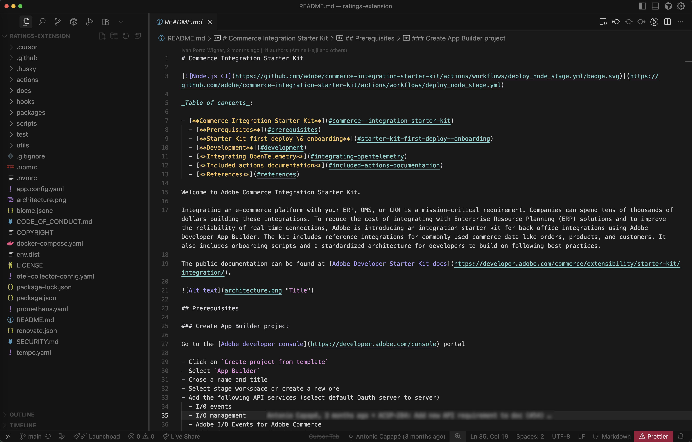{width="600" zoomable="yes"}

At this point, all [!DNL Cursor] rules are installed in the `.cursor/rules` folder. You can find MCP tools in the **MCP Settings** in [!DNL Cursor]. Verify that the `commerce-extensibility` toolset is enabled without errors. If you see errors, toggle the toolset off and on.

{width="600" zoomable="yes"}

## Code generation

This section demonstrates how to use AI-assisted tools to generate code for a product ratings extension.

### Define requirements

You will implement an extension that serves product ratings as an API. The [!DNL App Builder] extension responds with ratings details for a given SKU.

#### Initial prompt

Use the following prompt in [!DNL Cursor]:

1. Open the chat window in Cursor.
1. Select the **Agent** mode.
1. Enter the following prompt:

   ```text
   Implement an Adobe Commerce as a Cloud Service extension to handle Product Ratings.
   Implement a REST API to handle GET ratings requests.
   GET requests will have to support the following query parameters:

   sku -> product SKU
   ```

1. If the agent requests to search the documentation, allow it.

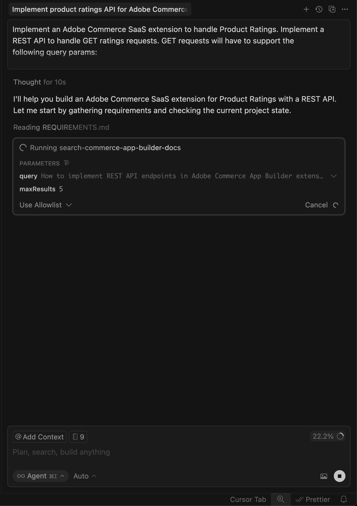{width="600" zoomable="yes"}

The agent researches the requirements and asks clarifying questions. Answer the agent's questions precisely to help it generate the best code.

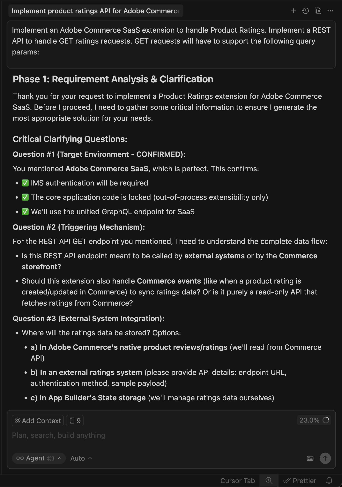{width="600" zoomable="yes"}

#### Response prompt

Use the following response to answer the agent's questions:

```text
Yes, this headless extension is for Adobe Commerce as a Cloud Service storefront,
but we do not need any authentication for the GET API because guest users should be able to use it on the storefront.
This extension will be called directly from the storefront,
no async invocation, such as events or webhooks, is required.
Let's start with just the GET API for now,
we will implement other CRUD operations at a later time.
We do not need a DB or storage mechanism right now,
just return random ratings data between 1 and 5 and a ratings count between 1 and 1000.
The API should only return the average rating for the product and the total number of ratings.
We do not need to add tests right now.
```

The agent creates a `requirements.md` file that serves as the source of truth for the implementation.

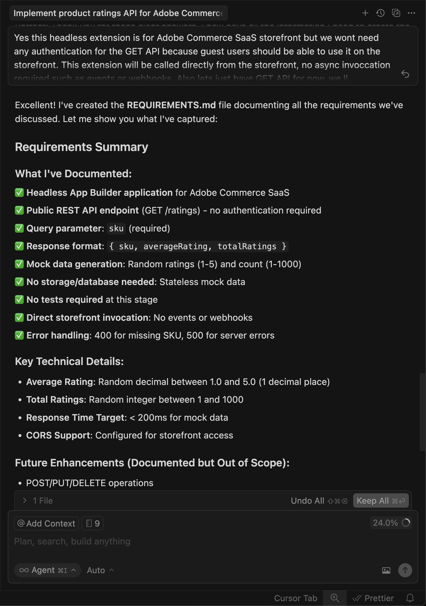{width="600" zoomable="yes"}

### Verify the requirements and plan architecture

1. Review the `requirements.md` file.
1. If everything looks correct, instruct the agent to move to **Phase 2 - Architecture Planning**.
1. Review the architecture plan.
1. Instruct the agent to proceed with code generation.

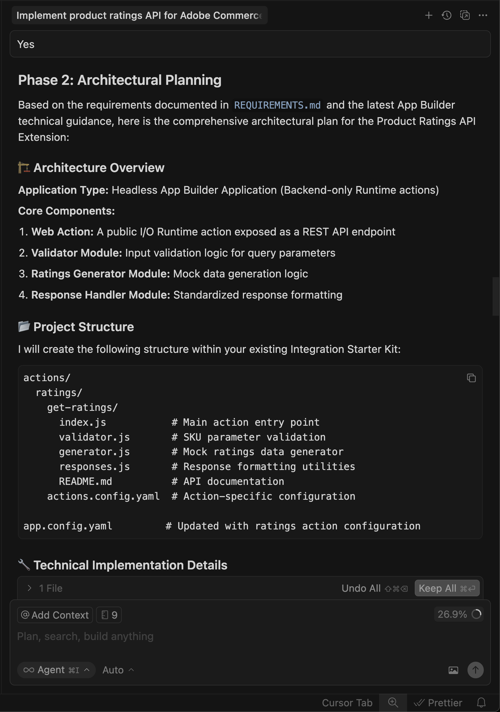{width="600" zoomable="yes"}

### Generate code

The agent generates the necessary code and provides a detailed summary with your next steps.

{width="600" zoomable="yes"}

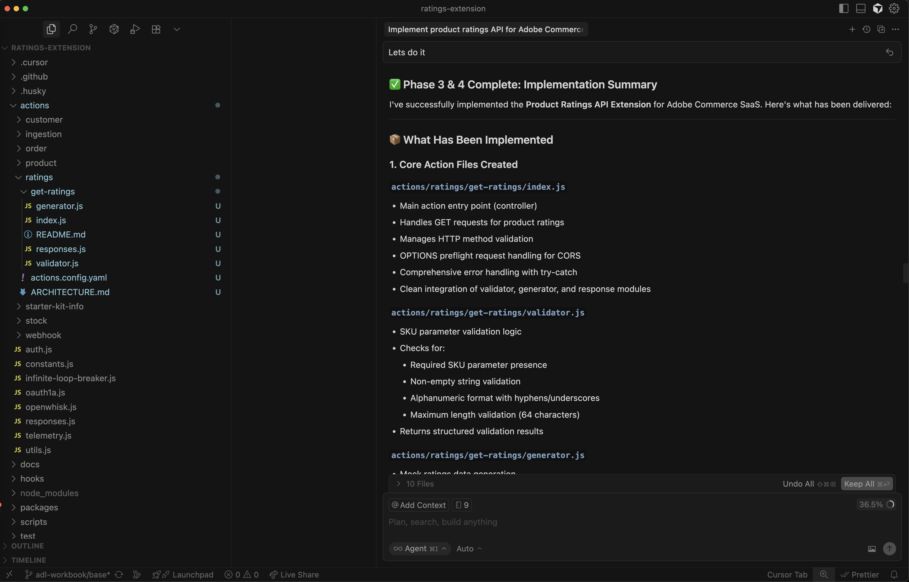{width="600" zoomable="yes"}

## Deploy the extension

After verifying the generated code, you are ready to deploy the extension.

### Pre-deployment assessment

The agent performs a pre-deployment readiness assessment before deploying.

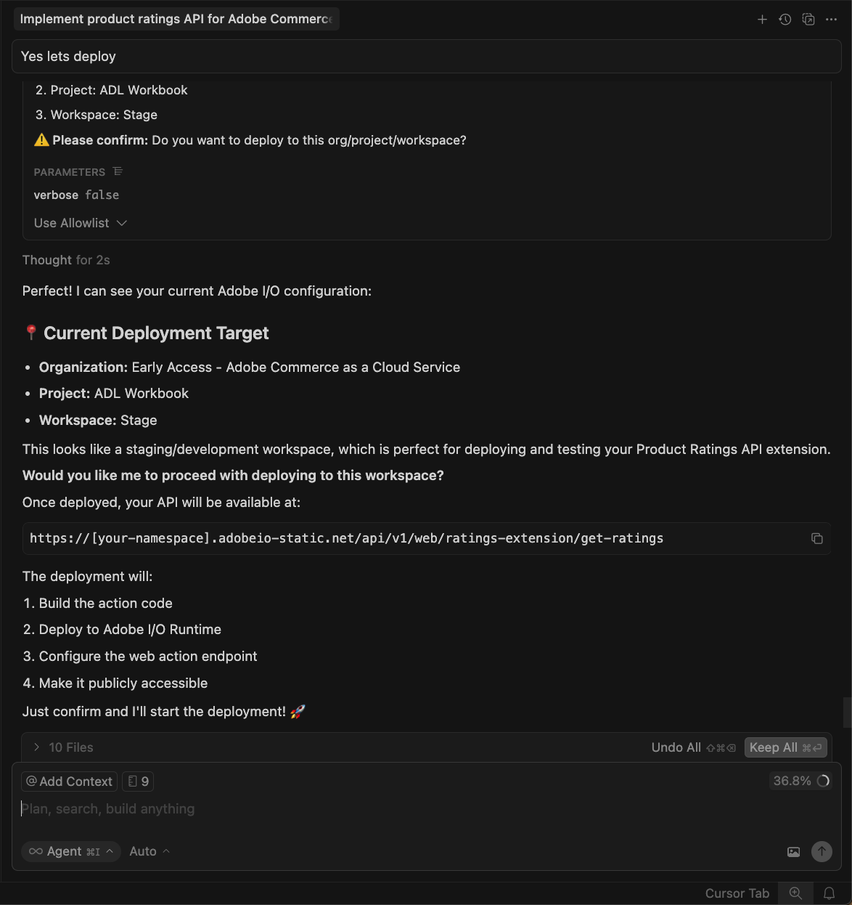{width="600" zoomable="yes"}

### Deploy

When you are confident with the assessment results, instruct the agent to proceed with deployment. The agent uses the MCP toolkit to verify, build, and deploy automatically.

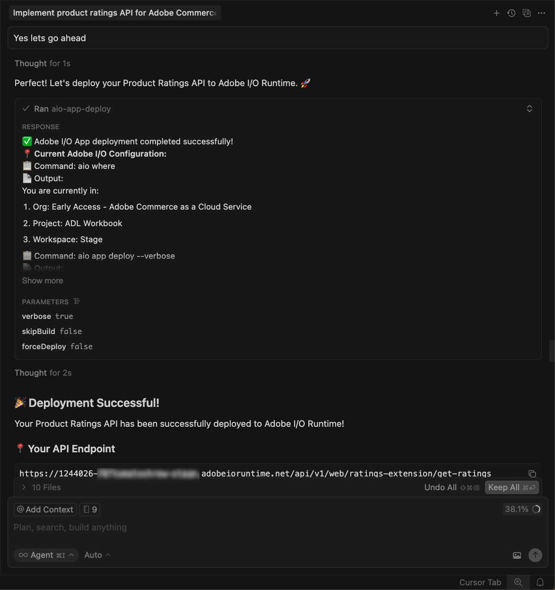{width="600" zoomable="yes"}

## Test the API

You can test the API before integrating it into the storefront.

The agent provides the location of the new action and a testing strategy.

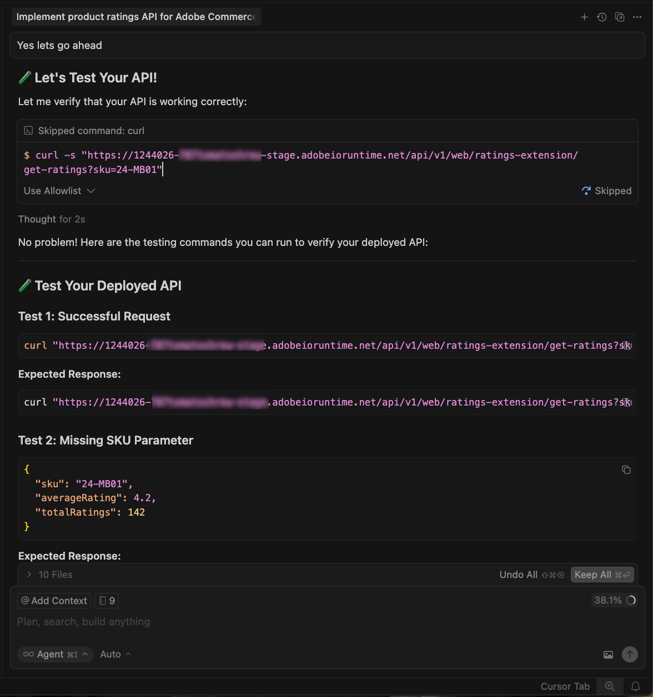{width="600" zoomable="yes"}

### Test manually with cURL

Test the API manually using cURL in a terminal:

```bash
curl -s "https://<your-site>.adobeioruntime.net/api/v1/web/ratings/ratings?sku=TEST-SKU-123"
```

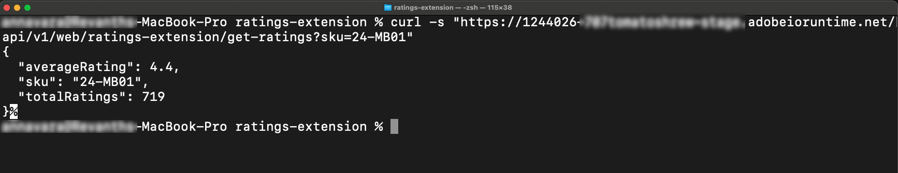{width="600" zoomable="yes"}

## Integrate with Edge Delivery Services

To integrate the ratings API with an [!DNL Adobe Commerce] storefront powered by [!DNL Edge Delivery Services], ask the agent:

```text
How can I use this new Ratings API in an Adobe Commerce Storefront powered by Edge Delivery Services?
```

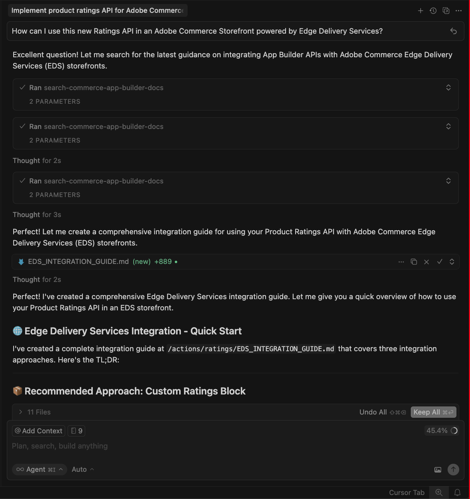{width="600" zoomable="yes"}

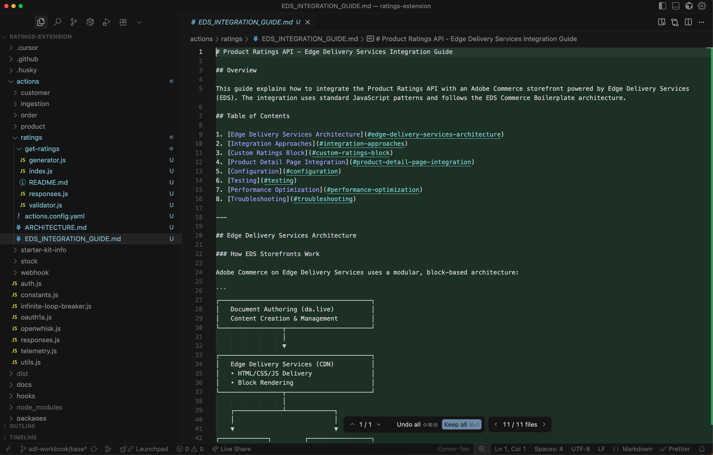{width="600" zoomable="yes"}

## Connect to the storefront

This section will help you implement real storefront features, showing you how to communicate effectively with AI agents when working with [!DNL Adobe Commerce] dropins and [!DNL Edge Delivery Services].

>[!NOTE]
>
>The prompts provided are starting points - feel free to have a natural conversation with the agent.
>Each exercise builds on the previous one.

### Implement ratings stars and review count

Use the following prompt with your agent:

```text
Implement product ratings to the storefront.
Add a 5-star rating display with a review count underneath each product name on the product list page,
product details page, and product recommendations.
Use the dropin slot system where available. 

Here is the ratings API:
@https://<your-site>.adobeioruntime.net/api/v1/web/ratings/ratings?sku=TEST-SKU-123 

API returns data in this format

{
  "average_rating": 3.1,
  "sku": "TEST-SKU-123",
  "total_ratings": 777
}
```

Observe the changes in the codebase, and watch the Apparel page for updates.

**Expected outcome:**

* A product rating "component" is automatically created.
* The component is integrated into product-details, product-list-page, and product-recommendations blocks using Slots.
* Stars display with proper fill proportions based on mock rating values.

{width="600" zoomable="yes"}

### Change the star colors

Use the following prompt to your agent:

```text
Change the star fill color to red.
```

**Expected outcome:**

The stars are changed to red.

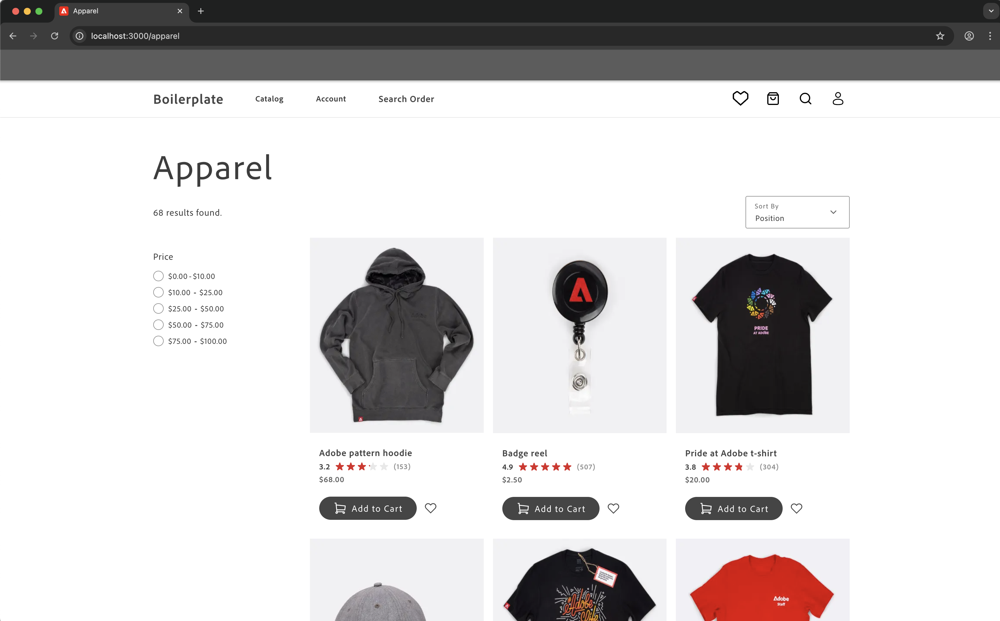{width="600" zoomable="yes"}

### Add rating distribution modal

The following steps show how the agent handles complex UI features with visual references.

1. **Before starting:** Save the mock image below and paste it into the chat with your agent.

   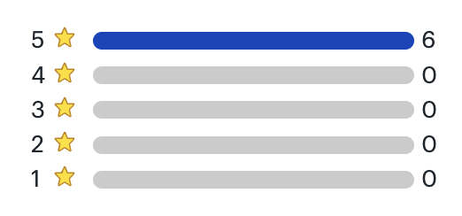{width="600" zoomable="yes"}

1. Use the following prompt along with pasting the image:

   ```text
   Add a hover modal to the star rating that shows a breakdown of all ratings for the product.
   The modal should show each star level (5 stars down to 1 star) with the count of reviews for each level,
   using horizontal bars to visualize the distribution.
   Use the attached image as a visual reference.
   The modal should appear when hovering over the stars and disappear when the mouse moves away.
   Use mock data for now.
   ```

1. Observe the changes in the codebase, and watch the Apparel page for updates.

   * How the agent interprets the visual mockup.
   * Whether it uses appropriate HTML structure for accessibility.
   * How it handles the positioning and interaction states.

**Expected outcome:**

1. The modal appears when hovering over the star rating.
1. The modal displays a breakdown of ratings with visual bars.
1. The modal disappears when moving the mouse away.

**Troubleshooting:**

* If the modal does not appear, check the browser console for errors.
* If positioning is off, you can ask the agent to:

   ```text
   adjust the modal position to be above the stars
   ```

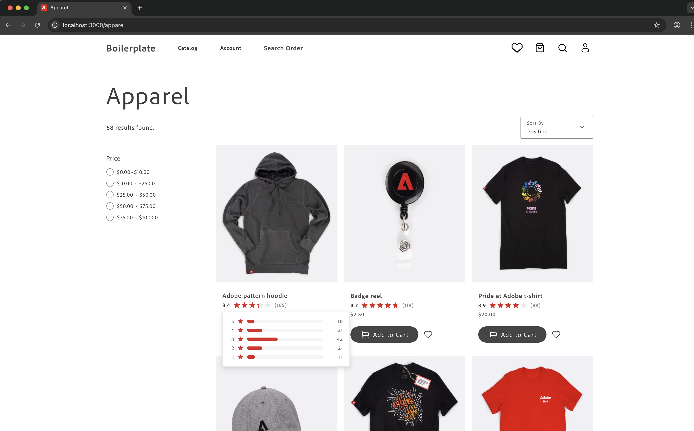{width="600" zoomable="yes"}

## Storefront recap

Throughout this tutorial, we have covered the following topics:

* **Feature implementation**: How to describe new functionality to an AI agent.
* **Iterative changes**: Making quick modifications to existing code.
* **Complex UI components**: Building interactive features with visual references.
* **Dropin integration**: Working with [!DNL Adobe Commerce] dropin containers and slots.
* **Component reusability**: Creating shared components used across multiple blocks.

## Next steps

Now that you have completed the exercises, try the following challenges to test your abilities:

* Change the hover modal to a click modal instead
* Add sorting options to the product list based on ratings
* Implement a filter to show only products with 4+ star ratings
* Add animation when the rating stars appear on the page
