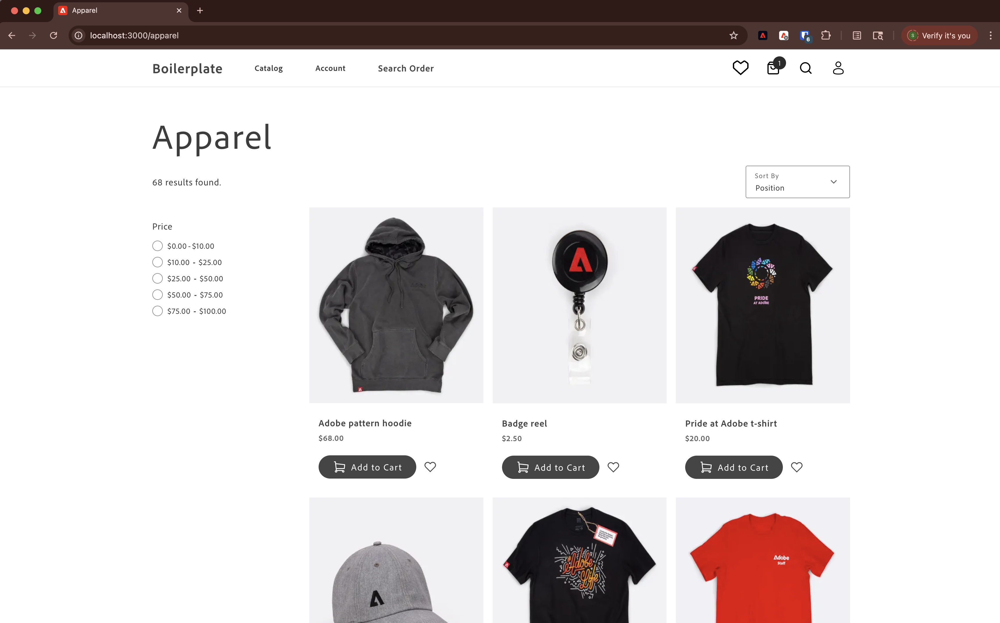
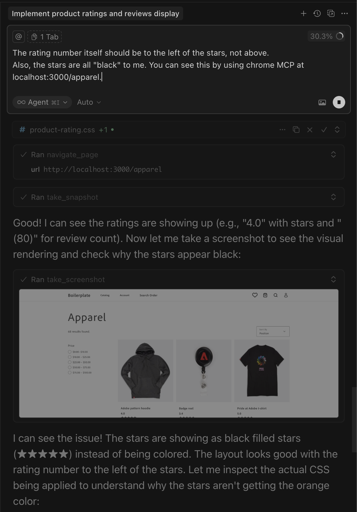

# Ratings extension tutorial

This tutorial guides you through building a product ratings extension for [!DNL Adobe Commerce as a Cloud Service] using [!DNL Adobe App Builder] and AI-assisted development tools.

## Prerequisites

Before you begin, complete the following prerequisites:

* Install the [!DNL Adobe I/O CLI]

   ```bash
   npm install -g @adobe/aio-cli
   ```

* Install the Commerce plugin

  ```bash
  aio plugins:install https://github.com/adobe-commerce/aio-cli-plugin-commerce
  ```

* Download an AI-assisted IDE, such as [!DNL Cursor](https://cursor.com/download)(recommended), other IDEs, such as Claude Code, Gemini CLI, or Copilot are also supported, but could require modifications to the prompts and other steps in this tutorial.

### Create a new project on Adobe Developer Console

1. Navigate to [!DNL Adobe Developer Console](https://developer.adobe.com/).
1. Click [!UICONTROL **Create project from a template**].
1. Select the [!UICONTROL **App Builder**] template.
1. Enter a [!UICONTROL **Project Title**] and [!UICONTROL **App Name**].
1. Ensure the **[!UICONTROL Include Runtime]** checkbox is marked.

   {width="600" zoomable="yes"}

1. Click **Save**.

### Add APIs to the workspace

1. Click the [!UICONTROL **Stage**] workspace and add then repeat the following steps for each API.

   {width="600" zoomable="yes"}

1. Click [!UICONTROL **Add Service**] and select [!UICONTROL **API**].

1. Select the [!UICONTROL **Adobe Services**] filter and select one of the following APIs:

   * [!UICONTROL **I/O Management API**]
   * [!UICONTROL **I/O Events**]

1. Select the [!UICONTROL **Experience Cloud**] filter and select one of the following APIs:

   * [!UICONTROL **Adobe I/O Events for Adobe Commerce**]

1. Click [!UICONTROL **Next**].

1. Click[!UICONTROL **Save configured API**].

1. Repeat the previous steps until all APIs are added to the workspace.

   {width="600" zoomable="yes"}

### Download workspace configuration

1. On the [!UICONTROL **Workspace overview**] tab, click the [!UICONTROL **Download all**] button.
1. Save the file as `workspace.json` on your desktop.

### Configure the AIO CLI

1. Clear the existing configuration:

   ```bash
   aio config clear
   ```

   Log in using the AIO CLI:

   ```bash
   aio auth login
   ```

1. Select your organization, project, and workspace, using each of the following commands:

   ```bash
   aio console org select
   ```

   ```bash
   aio console project select
   ```

   ```bash
   aio console workspace select
   ```

   {width="600" zoomable="yes"}

### Storefront prerequisites

The following items are required to complete the [storefront](#connect-to-the-storefront) section of this tutorial and see the product ratings in your store.

* Install [!DNL Node.js] (`22.14.0` or higher) and npm (`11.6.0` or higher). Verify your installation:

   ```bash
   node --version
   npm --version
   ```

* Install [Git](https://git-scm.com) (Optional) - Required only if [cloning the repository directly](#option-a-clone-the-repository-recommended)(recommended), not needed if you [download the zip file](#option-b-download-the-zip-file). Verify your installation:

  ```bash
  git --version
  ```

* Bash shell
  * macOS/Linux: No installation required
  * Windows: Use [!DNL Git Bash](https://git-scm.com/install) or [!DNL Windows Subsystem for Linux (WSL)](https://learn.microsoft.com/en-us/windows/wsl/install).

* [!DNL Google Chrome](https://www.google.com/chrome/) - Required for testing the storefront

## Clone integration starter kit

Clone the Commerce integration starter kit repository and prepare your project:

```bash
git clone https://github.com/adobe/commerce-integration-starter-kit.git
mv commerce-integration-starter-kit ratings-extension
cd ratings-extension
```

{width="600" zoomable="yes"}

## Create and update .env file

1. Create your environment configuration file:

   ```bash
   cp env.dist .env
   ```

1. Open the `.env` file in a text editor and add the following OAuth credentials:

   ```text
   OAUTH_CLIENT_ID=
   OAUTH_CLIENT_SECRET=
   OAUTH_TECHNICAL_ACCOUNT_ID=
   OAUTH_TECHNICAL_ACCOUNT_EMAIL=
   OAUTH_ORG_ID=
   ```

   You can copy these values from the **[!UICONTROL Credential details]** page in the [!DNL Developer Console](https://developer.adobe.com/) by clicking the **[!UICONTROL OAuth Server-to-Server]** tab on your workspace.

{width="600" zoomable="yes"}

### Add the Commerce configuration

Add the following Commerce instance details to your `.env` file:

```text
COMMERCE_BASE_URL=
COMMERCE_GRAPHQL_ENDPOINT=
```

To find these values:

1. Go to [Commerce Cloud Service instances](https://experience.adobe.com/#/@commerce/commerce/cloud-service/instances).
1. Click the information icon next to your assigned seat.
1. Copy the REST endpoint as `COMMERCE_BASE_URL`.
1. Copy the GraphQL Endpoint as `COMMERCE_GRAPHQL_ENDPOINT`.

### Set event prefix

Set a temporary value for the event prefix:

```text
EVENT_PREFIX=test
```

## Connect local workspace to remote workspace

Link your local project to the remote workspace:

```bash
aio app use
```

{width="600" zoomable="yes"}

## Install AI Tools

Set up the AI-assisted development tools:

```bash
aio commerce extensibility tools-setup
```

{width="600" zoomable="yes"}

## Open Cursor

>[!NOTE]
>
>When working with AI-assisted development tools, there will be natural variations in the code and responses generated by the agent.

Open the [!DNL Cursor] application or run the following command in your terminal:

```bash
cursor .
```

{width="600" zoomable="yes"}

At this point, all [!DNL Cursor] rules are installed in the `.cursor/rules` folder. You can find MCP tools in the **MCP Settings** in [!DNL Cursor]. Verify that the `commerce-extensibility` toolset is enabled without errors. If you see errors, toggle the toolset off and on.

{width="600" zoomable="yes"}

## Code generation

This section demonstrates how to use AI-assisted tools to generate code for a product ratings extension.

### Define requirements

You will implement an extension that serves product ratings as an API. The [!DNL App Builder] extension responds with ratings details for a given SKU.

#### Initial prompt

Use the following prompt in [!DNL Cursor]:

1. Open the chat window in Cursor.
1. Select the **Agent** mode.
1. Enter the following prompt:

   ```text
   Implement an Adobe Commerce as a Cloud Service extension to handle Product Ratings. Implement a REST API to handle GET ratings requests. GET requests will have to support the following query parameters:

   sku -> product SKU
   ```

1. If the agent requests to search the documentation, allow it.

{width="600" zoomable="yes"}

The agent researches the requirements and asks clarifying questions. Answer the agent's questions precisely to help it generate the best code.

{width="600" zoomable="yes"}

#### Response prompt

Use the following response to answer the agent's questions:

```text
Yes, this headless extension is for Adobe Commerce as a Cloud Service storefront, but we do not need any authentication for the GET API because guest users should be able to use it on the storefront. This extension will be called directly from the storefront, no async invocation, such as events or webhooks, is required. Let's start with just the GET API for now, we will implement other CRUD operations at a later time. We do not need a DB or storage mechanism right now, just return random ratings data between 1 and 5 and a ratings count between 1 and 1000. The API should only return the average rating for the product and the total number of ratings. We do not need to add tests right now.
```

The agent creates a `REQUIREMENTS.md` file that serves as the source of truth for the implementation.

{width="600" zoomable="yes"}

### Verify the requirements and plan architecture

1. Review the `REQUIREMENTS.md` file.
1. If everything looks correct, instruct the agent to move to **Phase 2 - Architecture Planning**.
1. Review the architecture plan.
1. Instruct the agent to proceed with code generation.

{width="600" zoomable="yes"}

### Generate code

The agent generates the necessary code and provides a detailed summary with your next steps.

{width="600" zoomable="yes"}

{width="600" zoomable="yes"}

## Deploy the extension

After verifying the generated code, you are ready to deploy the extension.

### Pre-deployment assessment

The agent performs a pre-deployment readiness assessment before deploying.

{width="600" zoomable="yes"}

### Deploy

When you are confident with the assessment results, instruct the agent to proceed with deployment. The agent uses the MCP toolkit to verify, build, and deploy automatically.

{width="600" zoomable="yes"}

## Test the API

You can test the API before integrating it into the storefront.

The agent provides the location of the new action and a testing strategy.

{width="600" zoomable="yes"}

### Test manually with cURL

Test the API manually using cURL in a terminal:

```bash
curl -s "https://<app-name>.adobeioruntime.net/api/v1/web/ratings-extension/get-ratings?sku=24-MB01"
```

{width="600" zoomable="yes"}

## Integrate with Edge Delivery Services

To integrate the ratings API with an [!DNL Adobe Commerce] storefront powered by [!DNL Edge Delivery Services], ask the agent:

```text
How can I use this new Ratings API in an Adobe Commerce Storefront powered by Edge Delivery Services?
```

{width="600" zoomable="yes"}

{width="600" zoomable="yes"}

## Connect to the storefront

Follow these steps to work with your ratings extension in the storefront.

## Verify your setup

Verify all prerequisites are installed:

```bash
# Check Node.js version (should be 22.14.0 or higher)
node --version

# Check npm version (should be 11.6.0 or higher)
npm --version

# Check Git (optional, skip if using zip file)
git --version

# Check Bash
bash --version
```

### Get the project files

You can obtain the project files in one of two ways:

#### Option A: Clone the repository (recommended)

If you have [!DNL Git] installed, open your terminal and clone the repository:

```bash
git clone https://github.com/hlxsites/aem-boilerplate-commerce.git --branch agentic-dev
cd aem-boilerplate-commerce
```

#### Option B: Download the zip file

If you don't have [!DNL Git] installed:

1. Download the project zip file from: [https://github.com/hlxsites/aem-boilerplate-commerce/archive/refs/heads/agentic-dev.zip](https://github.com/hlxsites/aem-boilerplate-commerce/archive/refs/heads/agentic-dev.zip)
1. Extract the zip file to a folder on your machine.
1. Open your terminal and navigate into the unzipped folder:

   ```bash
   cd path/to/aem-boilerplate-commerce-agentic-dev
   ```

### Install root dependencies

Install the main project dependencies:

```bash
npm install
```

This will install all the necessary packages for the storefront application.

### Install MCP server dependencies

Navigate to the MCP server directory and install its dependencies:

```bash
cd mcp-server
npm install
cd ..
```

### Configure environment variables

The MCP server requires certain environment variables to connect to the RAG service.

Create a `.env` file in the `mcp-server` directory:

```bash
cd mcp-server
cp env.example .env
```

Edit the `.env` file and add the following values (we'll provide the actual URL during the lab):

```env
RAG_MODE=worker
WORKER_RAG_URL=<provided-during-lab>
```

>[!NOTE]
>
>The actual value for `WORKER_RAG_URL` will be provided by the lab facilitator at the start of the session.

### Enable MCP in Cursor

The Model Context Protocol (MCP) server provides AI agents with access to [!DNL Adobe Commerce] Storefront documentation.

#### Open Cursor MCP settings

{width="600" zoomable="yes"}

1. Open [!DNL Cursor]
1. Go to **[!UICONTROL Cursor]** > **[!UICONTROL Settings]** > **[!UICONTROL Cursor Settings]** > **[!UICONTROL Tools & MCP]**

#### Enable and configure MCP features

The project includes an MCP configuration file at `.cursor/mcp.json`. This file should already be configured to use the local MCP server.

Verify the MCP configuration:

1. Ensure the "commerce-documentation-rag" server is listed and enabled

The configuration should look similar to this:

{width="600" zoomable="yes"}

>[!NOTE]
>
>The `start-mcp.sh` script will automatically load the environment variables from your `.env` file in the `mcp-server` directory.

#### Restart Cursor

After enabling MCP and configuring the server:

1. Quit [!DNL Cursor] completely
1. Reopen [!DNL Cursor] and open the `aem-boilerplate-commerce` project

#### Verify MCP connection

Check that the MCP server is running correctly:

1. Open a new chat in [!DNL Cursor]
1. Look for an indicator showing the MCP server is connected (usually in the chat interface)
1. Try asking a question like: "Search the storefront docs for information about slots"

If the MCP server is working, you should see relevant documentation results.

{width="600" zoomable="yes"}

### Start the development server

Start the local development server:

```bash
npm run start
```

The development server will start at `http://localhost:3000`.

Navigate to the apparel page at `http://localhost:3000/apparel`.

{width="600" zoomable="yes"}

## Hands-On Exercises

This section will help you implement real storefront features, showing you how to communicate effectively with AI agents when working with [!DNL Adobe Commerce] dropins and [!DNL Edge Delivery Services].

>[!NOTE]
>
>The prompts provided are starting points - feel free to have a natural conversation with the agent.
>Each exercise builds on the previous one.
>
>If the agent seems stuck, you can reference the [Chrome MCP](#what-is-chrome-mcp) for visual validation.

### What is Chrome MCP?

The [!DNL Chrome] MCP (Model Context Protocol) allows the AI agent to interact with your browser to validate changes visually. If needed, you can prompt the agent to "use Chrome MCP to verify the changes" or "take a screenshot of the page".

{width="600" zoomable="yes"}

### Implement ratings stars and review count

Use the following prompt with your agent:

```text
I want to add product ratings to the storefront. Add a 5-star rating display with a review count underneath each product name on the product list page, product details page, and product recommendations. Use the dropin slot system where available. For now, use mock data - we woll fetch real ratings later from an endpoint like "/ratings?sku={sku}" that returns {rating: number, count: number}. The stars should be filled proportionally to the rating value (for example, 4.5 stars would show 4 full stars and 1 half star).
```

Observe the changes in the codebase, and watch the Apparel page for updates.

**Expected outcome:**

* A product rating "component" is automatically created.
* The component is integrated into product-details, product-list-page, and product-recommendations blocks using Slots.
* Stars display with proper fill proportions based on mock rating values.

{width="600" zoomable="yes"}

### Change the star colors

Use the following prompt to your agent:

```text
Change the star fill color to red.
```

**Expected outcome:**

The stars are changed to red.

{width="600" zoomable="yes"}

### Add rating distribution modal

The following steps show how the agent handles complex UI features with visual references.

1. **Before starting:** Save the mock image below and paste it into the chat with your agent.


1. Use the following prompt along with pasting the image:

```text
Add a hover modal to the star rating that shows a breakdown of all ratings for the product. The modal should show each star level (5 stars down to 1 star) with the count of reviews for each level, using horizontal bars to visualize the distribution. Use the attached image as a visual reference. The modal should appear when hovering over the stars and disappear when the mouse moves away. Use mock data for now.
```

1. Observe the changes in the codebase, and watch the Apparel page for updates.

* How the agent interprets the visual mockup.
* Whether it uses appropriate HTML structure for accessibility.
* How it handles the positioning and interaction states.

**Expected Outcome:**

1. The modal appears when hovering over the star rating.
1. The modal displays a breakdown of ratings with visual bars.
1. The modal disappears when moving the mouse away.

**Troubleshooting:**

* If the modal does not appear, check the browser console for errors.
* If positioning is off, you can ask the agent to:

   ```text
   adjust the modal position to be above the stars
   ```

{width="600" zoomable="yes"}

## Storefront recap

Throughout this tutorial, we have covered the following topics:

* **Feature implementation**: How to describe new functionality to an AI agent.
* **Iterative changes**: Making quick modifications to existing code.
* **Complex UI components**: Building interactive features with visual references.
* **Dropin integration**: Working with [!DNL Adobe Commerce] dropin containers and slots.
* **Component reusability**: Creating shared components used across multiple blocks.

## Next Steps

Now that you have completed the exercises, try the following challenges to test your abilities:

* Change the hover modal to a click modal instead
* Add sorting options to the product list based on ratings
* Implement a filter to show only products with 4+ star ratings
* Add animation when the rating stars appear on the page
