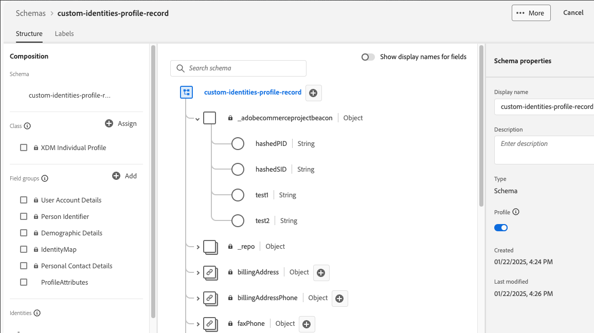

# Add Custom Attributes to Profiles

Custom profile attributes allow you to enhance customer profile identification in Experience Platform by using additional identifiers beyond the default `customerId` and `emailId`. This enables more precise customer matching and improved data integration between your Commerce platform and Experience Platform.

>[!NOTE]
>
>Learn how you can [add custom attributes](custom-attributes.md) to orders.

## Benefits

- Use multiple identifiers for better customer matching.
- Map custom fields to identity attributes based on your business needs.
- Reduce duplicate profiles and improve customer data accuracy.
- Enable more targeted customer experiences.

## Prerequisites

Before implementing custom identity attributes, make sure you:

- [Install the Data Connection extension](install.md)
- [Connect to Adobe Experience Platform](connect-data.md)
- [Send customer profile data](connect-data.md#send-customer-profile-data)

## Step 1: Configure Experience Platform schema

1. Log in to Adobe Experience Platform and select your Commerce schema.
1. [Add custom identity fields](https://experienceleague.adobe.com/en/docs/experience-platform/xdm/ui/resources/schemas?lang=en#custom-fields-for-standard-groups) at the root level:
   - `hashedPID` (String) - Primary identity hash
   - `hashedSID` (String) - Secondary identity hash
   - `primaryID` (String) - Primary identity field name
   - `secondaryID` (String) - Secondary identity field name



>[!NOTE]
>
>You can customize the exact field names based on your requirements. The example uses `hashedPID` and `hashedSID` as the identity fields.

## Step 2: Create processor classes

Create the following PHP processor classes in your custom module:

### AddressCustomHashedId class

This processor hashes `parent_id` and `entity_id` for customer addresses.

```php
<?php declare(strict_types=1);

namespace Magento\AepCustomerCustomAttributes\Event;
use Magento\AdobeCommerceEventsClient\Event\Event;
use Magento\AdobeCommerceEventsClient\Event\Processor\EventDataProcessorInterface;

class AddressCustomHashedId implements EventDataProcessorInterface
{
    public function process(Event $event, array $eventData): array
    {
        $pid = $eventData['parent_id'] ?? '';
        $sid = $eventData['entity_id'] ?? '';

        $eventData['profileAttributes']['hashedPID'] = hash('sha256', (string)$pid);
        $eventData['profileAttributes']['hashedSID'] = hash('sha256', (string)$sid);
        return $eventData;
    }
}
```

### AddressCustomId class

This processor sets the primary and secondary ID field names for address events.

```php
<?php declare(strict_types=1);

namespace Magento\AepCustomerCustomAttributes\Event;
use Magento\AdobeCommerceEventsClient\Event\Event;
use Magento\AdobeCommerceEventsClient\Event\Processor\EventDataProcessorInterface;

class AddressCustomId implements EventDataProcessorInterface
{
    public function process(Event $event, array $eventData): array
    {
        $eventData['profileAttributes']['primaryID'] = 'hashedPID';
        $eventData['profileAttributes']['secondaryID'] = 'hashedSID';

        // Ensure both IDs are present, otherwise, Commerce will default primary to customerId and secondary to emailId
        if (empty($eventData['profileAttributes']['primaryID']) || empty($eventData['profileAttributes']['secondaryID'])) {
            $eventData['profileAttributes']['primaryID'] = $eventData['customerId'] ?? '';
            $eventData['profileAttributes']['secondaryID'] = $eventData['email'] ?? '';
        }

        return $eventData;
    }
}
```

### CustomHashedId class

This processor hashes `entity_id` and `email` for customer profiles.

```php
<?php declare(strict_types=1);

namespace Magento\AepCustomerCustomAttributes\Event;
use Magento\AdobeCommerceEventsClient\Event\Event;
use Magento\AdobeCommerceEventsClient\Event\Processor\EventDataProcessorInterface;

class CustomHashedId implements EventDataProcessorInterface
{
    public function process(Event $event, array $eventData): array
    {
        $pid = $eventData['entity_id'] ?? '';
        $sid = $eventData['email'] ?? '';

        $eventData['profileAttributes']['hashedPID'] = hash('sha256', (string)$pid);
        $eventData['profileAttributes']['hashedSID'] = hash('sha256', (string)$sid);
        return $eventData;
    }
}
```

### CustomId class

This processor sets the primary and secondary ID field names for profile events.

```php
<?php declare(strict_types=1);

namespace Magento\AepCustomerCustomAttributes\Event;
use Magento\AdobeCommerceEventsClient\Event\Event;
use Magento\AdobeCommerceEventsClient\Event\Processor\EventDataProcessorInterface;

class CustomId implements EventDataProcessorInterface
{
    public function process(Event $event, array $eventData): array
    {
        $eventData['profileAttributes']['primaryID'] = 'hashedPID';
        $eventData['profileAttributes']['secondaryID'] = 'hashedSID';

        // Ensure both IDs are present, otherwise, Commerce will default primary to customerId and secondary to emailId
        if (empty($eventData['profileAttributes']['primaryID']) || empty($eventData['profileAttributes']['secondaryID'])) {
            $eventData['profileAttributes']['primaryID'] = $eventData['customerId'] ?? '';
            $eventData['profileAttributes']['secondaryID'] = $eventData['email'] ?? '';
        }

        return $eventData;
    }
}
```

>[!NOTE]
>Make sure that both `primaryID` and `secondaryID` are sent in the event data. If either is missing, Commerce defaults to:
>
>- primaryID = customerId
>- secondaryID = emailId

## Data format examples

The following examples demonstrate the expected JSON structure for custom identity attributes in both profile attributes and complete customer profile data formats.

### Profile attributes format

```json
{
  "profileAttributes": {
    "hashedPID": "d80eae6e96d148b3b2abbbc6760077b66c4ea071f847dab573d507a32c4d99a5",
    "hashedSID": "fa7359e288ce3104bd4317a4fb75f08c4a5feec472de2e415b8260fb3567ebe6",
    "warehousecode": "1256",
    "method": "ina2354",
    "source": "commerce",
    "primaryID": "hashedPID",
    "secondaryID": "hashedSID"
  }
}
```

### Complete customer profile structure

```json
{
  "id": 137,
  "entity_id": "137",
  "created_at": "2025-02-10 20:10:30",
  "updated_at": "2022-02-10 20:10:31",
  "email": "customer@example.com",
  "firstname": "John",
  "lastname": "Doe",
  "dob": "2007-10-01 00:00:00",
  "profileAttributes": {
    "hashedPID": "d80eae6e96d148b3b2abbbc6760077b66c4ea071f847dab573d507a32c4d99a5",
    "hashedSID": "fa7359e288ce3104bd4317a4fb75f08c4a5feec472de2e415b8260fb3567ebe6",
    "primaryID": "137",
    "secondaryID": "customer@example.com"
  },
  "_metadata": {
    "commerceEdition": "Adobe Commerce",
    "commerceVersion": "2.4.6",
    "eventsClientVersion": "1.9.0",
    "storeId": "1",
    "websiteId": "1",
    "storeGroupId": "1",
    "websiteCode": "base",
    "storeCode": "default",
    "storeViewCode": "main_website_store"
  }
}
```

## Troubleshooting

### Missing primaryID or secondaryID

- **Symptom:** Data defaults to customerId/emailId instead of custom values.
- **Solution:** Ensure both `primaryID` and `secondaryID` are set in the `profileAttributes` object.

### Invalid hash values

- **Symptom:** Hash values are empty or malformed.
- **Solution:** Verify the source fields (`parent_id`, `entity_id`, `email`) contain valid data before hashing.

### Processors not executing

- **Symptom:** Custom attributes do not appear in event data.
- **Solution:** Check that processors are properly registered in `events.xml` and the module is enabled.

### Experience Platform schema mismatch

- **Symptom:** Data does not appear in Experience Platform or schema validation errors.
- **Solution:** Ensure that the Experience Platform schema includes the custom identity fields with correct data types.
