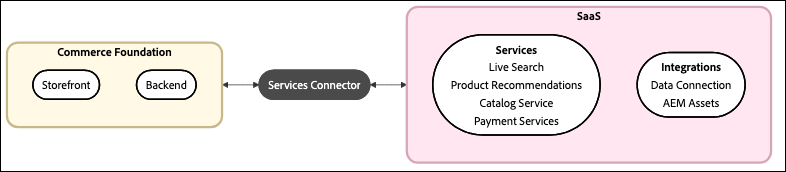

# Adobe Commerce Services Guides

Adobe Commerce Services deliver powerful capabilities that extend your storefront, streamline integrations, and optimize data management.

## How does Commerce connect to services?

All Commerce services connect to your Commerce instance through the [Commerce Services connector](saas.md).

When the Commerce Services connector is configured, you have access to the following features:

- [Storefront services](#storefront-services) - AI-powered features for product discovery, recommendations, and payments
- [Integration services](#integration-services) - Connections to Adobe Experience Platform, AEM Assets, and other Adobe solutions

These services help you increase conversions, deliver personalized experiences, and make better use of your commerce data across the Adobe ecosystem.

>[!NOTE]
>
>Adobe recommends upgrading to the latest supported version of all Commerce services. See the [release notes](release-notes-all.md).

In addition to these features, there are tools that let you monitor the flow of data from your Commerce instance to the SaaS platform. These tools can automatically synchronize the data and help you optimize performance. Learn more about the available [data tools](#data-tools).

## Available services

>[!BEGINTABS]

>[!TAB Storefront services]

Storefront services are a group of AI-powered features that optimize product discovery, personalize customer interactions, and streamline payment processing to increase engagement and conversions. With storefront services, you can enhance the shopping experience and drive business growth.

<table style="table-layout:fixed">
<tr style="border: 0;">
   <td valign="top">
      
      

         <a href="../catalog-service/overview.md">
         <strong>Catalog Service</strong>
         </a>
      

      

         <em>Give your customers an optimized product experience while boosting performance, improving scalability, and increasing conversions.</em>
      

   </td>
   <td valign="top">
      
      

         <a href="../live-search/overview.md">
         <strong>[!DNL Live Search]</strong>
         </a>
      

      

         <em>Implement this AI-powered search tool that delivers smarter, faster, and more relevant results for B2C shoppers.</em>
      

   </td>
   <td valign="top">
      
      

         <a href="../product-recommendations/overview.md">
         <strong>Product Recommendations</strong>
         </a>
      

      

         <em>Add AI-fueled recommendations based on shopper behavior, popular trends, product similarity, and more.</em>
      

   </td>
   <td valign="top">
      
      

         <a href="../payment-services/guide-overview.md">
         <strong>Payment Services</strong>
         </a>
      

      

         <em>Drive customer satisfaction with diverse payment methods, including interest-free installments, and streamlined views of payment processing, orders, and invoices.</em>
      

   </td>
</tr>
</table>

>[!TAB Integration services]

Integration services refer to features that connect your Commerce instance to other products or services within Adobe.

<table style="table-layout:fixed">
<tr style="border: 0;">
   <td valign="top">
      
      

         <a href="../data-connection/overview.md">
         <strong>[!DNL Data Connection]</strong>
         </a>
      

      

         <em>Leverage the connection between Adobe Commerce and the Adobe Experience Platform edge to use Commerce data for other Adobe Experience Cloud products, such as Adobe Analytics and Adobe Target.</em>
      

   </td>
   <td valign="top">
      
      

          <a href="../aem-assets-integration/overview.md">
         <strong>AEM Assets integration</strong>
         </a>
      

      

         <em>Simplify digital asset management using a system that integrates with Adobe Experience Manager for managing rich media content.</em>
      

   </td>
</tr>
</table>

>[!TAB Data tools]

Data tools help you manage and optimize the flow of information between your Commerce instance and connected services. These tools ensure efficient data synchronization, monitor sync operations, and improve performance by offloading resource-intensive processes.

<table style="table-layout:fixed">
<tr style="border: 0;">
   <td valign="top">
       
      

         <a href="../data-export/overview.md">
         <strong>[!DNL SaaS Data Export]</strong>
         </a>
      

      

         <em>Automatically sync catalog, order, and inventory data from Adobe Commerce to connected services. Use Commerce CLI commands or the <strong>Data Management Dashboard</strong> to manage sync processing.</em>
      

   </td>
   <td valign="top">
      
      

          <a href="../price-index/price-indexing.md">
         <strong>SaaS Price Indexer</strong>
         </a>
      

      

         <em>Optimize site performance by offloading resource-intensive tasks—like indexation and price calculation—from the Commerce application to Adobe's Cloud infrastructure.</em>
      

   </td>
   <td valign="top">
      
      

          <a href="https://experienceleague.adobe.com/en/docs/commerce-admin/systems/data-transfer/data-sync/data-dashboard" target="_blank">
         <strong>Data Management Dashboard</strong>
         </a>
      

      

         <em>Easily track Commerce data sync and trigger resynchronization from a unified dashboard in the Commerce Admin. Get valuable insights about data availability for timely display to your shoppers.</em>
      

   </td>
</table>

>[!NOTE]
>
>The Data Management Dashboard is available at no additional cost to Commerce merchants using Product Recommendations v6.0.0, Live Search v4.1.0, or Catalog Service v1.17 with an active license. Merchants using earlier service versions can use [Catalog Sync](../landing/catalog-sync.md) to manage and track data synchronization.

>[!ENDTABS]

## What problems can Commerce Services solve?

Whether you are looking to scale your business, improve customer experiences, or make data-driven decisions, Adobe Commerce Services provide solutions for common Commerce challenges:

| Problem | Challenge | Solution |
|---------|-----------|----------|
| Improve product discovery and conversion | Shoppers can't find what they're looking for, leading to high bounce rates and lost sales. | Use [Live Search](../live-search/overview.md) and [Product Recommendations](../product-recommendations/overview.md) to deliver AI-powered search with typo tolerance, instant "search as you type" results, dynamic faceting, and personalized product recommendations based on real-time shopper behavior. |
| Create omnichannel personalized experiences | Your commerce data is siloed, preventing you from delivering personalized experiences across channels. | Use [Data Connection](../data-connection/overview.md) to send behavioral, transactional, and profile data to Adobe Experience Platform. Build sophisticated customer segments, create abandoned cart campaigns, target lookalike audiences, and analyze seasonal trends across your entire customer journey. |
| Streamline digital asset management | Managing product images and rich media across multiple systems is time-consuming and error-prone. | The [AEM Assets Integration](../aem-assets-integration/overview.md) provides centralized asset management by connecting Adobe Commerce to an Adobe Experience Manager Assets project, simplifying workflows and ensuring consistent brand experiences across all touchpoints. |
| Optimize payment processing | Limited payment options and poor payment experiences are hurting customer satisfaction and conversion. | [Payment Services](../payment-services/guide-overview.md) offers multiple payment methods, including interest-free installments, with a unified dashboard for managing payments, orders, and invoices. |
| Manage data synchronization at scale | Resource-intensive indexing is slowing down your site, and you can't easily track data synchronization issues. | [SaaS Data Export](../data-export/overview.md), [SaaS Price Indexer](../price-index/price-indexing.md), and the [Data Management Dashboard](https://experienceleague.adobe.com/en/docs/commerce-admin/systems/data-transfer/data-sync/data-dashboard) automatically sync catalog, order, and inventory data, offload price calculations to Adobe's cloud infrastructure, and provide real-time visibility into synchronization status. |
| Win back lost customers and reduce returns | High customer churn and product return rates are impacting profitability. | Combine [Data Connection](../data-connection/overview.md) with Adobe Journey Optimizer and Real-Time CDP to identify return patterns, create win-back campaigns, segment customers by behavior, and send personalized re-engagement campaigns across email and SMS. |
| Make data-driven merchandising decisions | You're not sure which products to promote or when to run promotions. | [Live Search](../live-search/overview.md) provides search performance insights and merchandising tools to access key metrics, analyze search terms, and use intelligent merchandising rules to boost or bury products based on real customer behavior and business goals. |
| Maintain compliance with sensitive data | You need to handle sensitive customer data while maintaining HIPAA compliance. | [Data Connection](../data-connection/overview.md) is HIPAA-ready, allowing you to share back-office data with Experience Platform while maintaining compliance and systematically handling privacy requests. |

{{$include /help/_includes/templated/whats-new.md}}

<!-- Last updated from includes: 2025-09-26 20:42:12 -->
