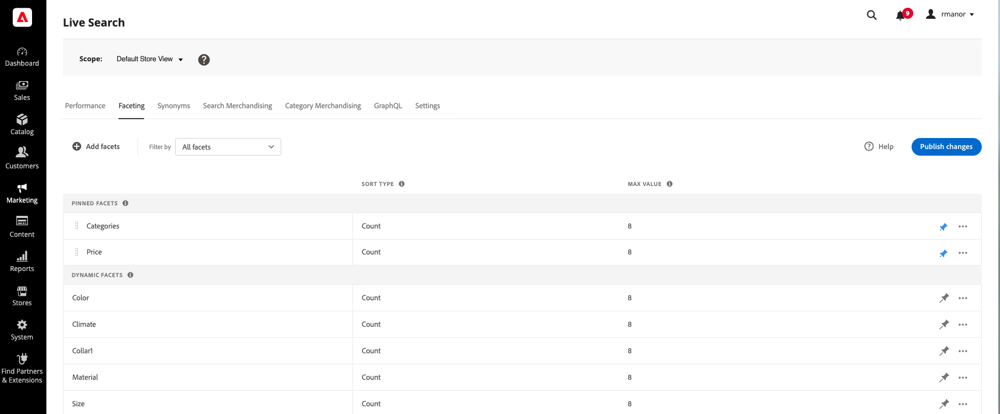

# Faceting Workspace

The *Faceting* workspace lists all facets that are currently available and provides access to the tools you need to set up and manage facets. Pinned facets appear first in the list of existing facets, followed by dynamic facets. The list can be filtered to show all facets, or only those that are pinned or dynamic.

## Set the scope

If your Adobe Commerce installation includes multiple store views, set **Scope** to the [store view](https://experienceleague.adobe.com/docs/commerce-admin/start/setup/websites-stores-views.html#scope-settings) where your facet settings apply.

## Filter the list

1. Click the **Filter by** control.
1. Choose one of the following options:

   * All filters
   * Pinned
   * Dynamic

## Add a facet

1. Click **Add facets**. 
1. See [Add Facets](facets-add.md) for detailed instructions.

## Column descriptions

| Column | Description |
|--- |--- |
| (first column) | Lists pinned and dynamic facets by the [label](facets-type.md) that is visible to the shopper. |
| Sort type | The [sorting order](facets-type.md) of facet values. Facets are sorted alphabetically for all [!DNL Commerce] storefronts. For [headless] implementations, facets can be sorted either alphabetically or by count. Options: Alphabetical, Count (headless only) |
| Max value | The number of facet values that are available in the storefront as filters, with a maximum of 10. |

## Controls

| Control | Description |
|--- |--- |
| Add facets| Opens the [facet editor](facets-add.md). |
| Filter by | Determines the [type of facets](facets-type.md) that appear in the list. Options: All, Pinned, Dynamic |
