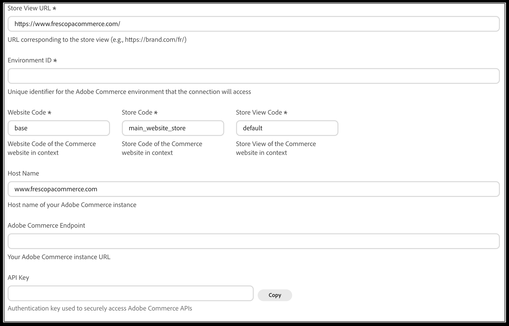

# Connect [!DNL Adobe Commerce] to [!DNL Adobe LLM Optimizer]

Use this task-based guide after your organization has access to [!DNL Adobe LLM Optimizer]. The goal is to make your [!DNL Adobe Commerce] catalog available to LLM Optimizer and to confirm that tenant and environment context is correct before you review opportunities or deploy catalog updates.

>[!NOTE]
>
>This guide does not replace LLM Optimizer product documentation for the Experience Cloud UI. Use it together with in-product guidance and your Adobe account team for org-specific settings.

## Step 1. Enable required Commerce services

Work with your Commerce administrator or implementation partner to ensure that:

- Catalog data that LLM Optimizer must read is **exported or synchronized** according to your architecture (including any SaaS data exporter or connector your deployment uses).
- API access, credentials, and environment URLs (sandbox vs production) match the **tenant** you intend to use in LLM Optimizer.

If you are unsure which services apply, confirm with Adobe support or your solution architect for your Commerce edition and hosting model.

## Step 2. Configure the Commerce connection in LLM Optimizer

Configure this step **after** catalog services are available so validation succeeds on first connect.

1. In the [!DNL Adobe LLM Optimizer] UI, open **Customer Configuration**, then select the **[!UICONTROL Commerce]** tab.

    

1. Click **[!UICONTROL Add Store View]** to create a new row, or expand an existing store view entry to edit it.
1. Enter the **[!UICONTROL Store View URL]** (required). Use the storefront URL for that store view, including any locale or path prefix (for example, `https://brand.example.com/` or `https://brand.example.com/fr/`).
1. Enter the **[!UICONTROL Environment ID]** (required)—the identifier for the Adobe Commerce environment LLM Optimizer should connect to.
1. Enter **[!UICONTROL Website Code]**, **[!UICONTROL Store Code]**, and **[!UICONTROL Store View Code]** (required). These must match the codes configured in your Commerce Admin for the website, store, and store view you are connecting.
1. Optionally complete **[!UICONTROL Host Name]** with the hostname of your Commerce instance (for example, `www.example.com`) if the UI prompts for it separately from the URL.
1. Enter the **[!UICONTROL Adobe Commerce Endpoint]**—the base URL of your Adobe Commerce instance used for API access.
1. Enter or paste the **[!UICONTROL API Key]** used to authenticate requests to Commerce APIs. Use **[!UICONTROL Copy]** next to the field if you need to copy the key elsewhere securely.
1. Click **[!UICONTROL Save]** to store the configuration.

To remove a store view configuration for this customer, open that entry and click **[!UICONTROL Delete]**.

### Field descriptions

| Field | Description |
| --- | --- |
| Store View URL | Public URL of the store view LLM Optimizer should treat as in scope for catalog and audit workflows. |
| Environment ID | Commerce environment identifier (from your cloud or deployment documentation, or Admin where applicable). |
| Website code | Commerce **[!UICONTROL Website Code]** for the website that owns the catalog. |
| Store code | Commerce **[!UICONTROL Store Code]** for the store under that website. |
| Store view code | Commerce **[!UICONTROL Store View Code]** for the store view (for example, `default`). |
| Host name | Hostname of the Commerce storefront or instance when the form asks for it in addition to other URLs. |
| Adobe Commerce Endpoint | Instance URL LLM Optimizer uses to reach Commerce APIs. |
| API key | Secret key for API authentication; treat like any production credential. |

After you save, wait for any **initial sync** or validation job LLM Optimizer shows to finish before you rely on catalog or audit results for that store view.

## Step 3. Validate catalog access

Confirm that LLM Optimizer can see your catalog:

- **Spot-check** categories or sample SKUs that you know exist in Commerce.
- Resolve **authentication or scope** errors before you rely on opportunities or deploy actions in production.

## Step 4. Confirm tenant and environment readiness

- Verify that connected **sandbox** projects are not mixed with **production** Commerce data unless intentional.
- Align **user roles** in Experience Cloud and Commerce so the people who approve deploy actions have the right permissions on both sides.

## Next steps

- [Use LLM Optimizer with Adobe Commerce](use-llmo-with-commerce.md) — review opportunities, deploy catalog updates, and understand override behavior.
- [Integration overview](../overview.md) — architecture and Commerce vs third-party catalogs.
