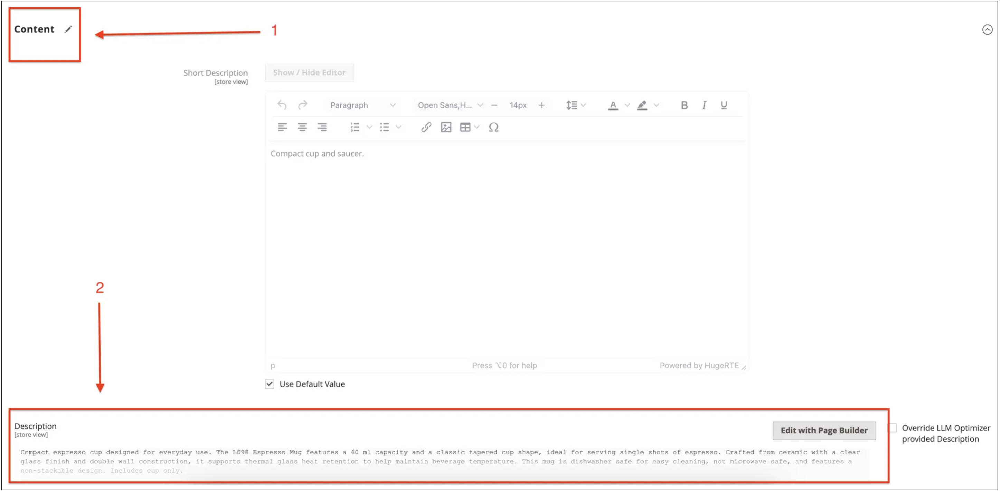

# Use [!DNL Adobe LLM Optimizer] with [!DNL Adobe Commerce]

>[!IMPORTANT]
>
>This feature is in [beta](https://experienceleague.adobe.com/en/docs/commerce-operations/release/beta).

After [connecting Commerce to LLM Optimizer](connect-to-llmo.md), you work primarily in the **[!DNL Adobe LLM Optimizer]** UI to review opportunities and push approved changes into the catalog when you are ready. This article describes the two Commerce-focused optimization types, how to use **[!UICONTROL Opportunities]**, how deploy actions behave in [!DNL Adobe Commerce], and how external updates interact with LLM Optimizer suggestions. For a broader picture of the integration, see the [integration overview](../overview.md).

## Understand Commerce optimizations in LLM Optimizer {#understand-optimizations}

For Commerce-backed catalogs, LLM Optimizer offers **[!UICONTROL Product Detail Page Enrichment]** and **[!UICONTROL Product Catalog Enrichment]**.

| Focus | What it is for |
| --- | --- |
| **[!UICONTROL Product Detail Page Enrichment]** (PDP enrichment) | Suggestions that improve how a product page reads for AI-driven discovery, without replacing your storefront layout. |
| **[!UICONTROL Product Catalog Enrichment]** | Suggested **product name** and **product description** updates for specific products that you can review, edit if needed, and apply to your Commerce catalog. |

Use **[!UICONTROL Opportunities]** to open the list of products or URLs and work through suggestions for the type you selected.

## Navigate Commerce opportunities {#navigate-commerce-opportunities}

**To open Commerce-related opportunities:**

1. In the left rail, click **[!UICONTROL Opportunities]**.
1. Click **[!UICONTROL Commerce Opportunity]** to show optimization types that target your [!DNL Adobe Commerce] catalog.
1. Select **[!UICONTROL Product Catalog Enrichment]** or **[!UICONTROL Product Detail Page Enrichment]**, depending on what you want to work on.

### Review and deploy PDP enrichment {#review-deploy-pdp}

PDP enrichment is for teams that want clearer product page messaging in AI-driven discovery while keeping the storefront experience your merchandisers designed.

**To review and deploy PDP enrichment:**

1. Open **[!UICONTROL Product Detail Page Enrichment]** from **[!UICONTROL Opportunities]**.
1. In the **[!UICONTROL URLs with Suggestions]** table, select **[!UICONTROL Current Suggestions]**.
1. For a URL or SKU, click **[!UICONTROL Preview]**. The proposed update appears beside the table.
1. Optional: Click **[!UICONTROL Copy]** to paste the content into an external editor, or click **[!UICONTROL Edit suggestion]** to edit in place.
1. Once reviewed and approved, select the row for the URL or SKU to update, then click **[!UICONTROL Deploy optimizations]**, and confirm.

After deployment, open the live product page and confirm it still matches what your team expects.

### Review and deploy product catalog enrichment {#review-deploy-catalog}

Catalog enrichment is for teams that want to tighten product names and long descriptions directly in Commerce, with suggestions you can review before anything is saved.

**To review and deploy product catalog enrichment:**

1. Open **[!UICONTROL Product Catalog Enrichment]** from **[!UICONTROL Opportunities]**.
1. In the **[!UICONTROL URLs with Suggestions]** table, select **[!UICONTROL Current Suggestions]**.
1. Click the expand control for the URL or SKU row to show the proposed **Product Name** and **Product Description** updates.
1. Optional: Click the edit icon to adjust the proposed name or description before you deploy.
1. Once reviewed and approved, select the row for the URL or SKU to update, then click **[!UICONTROL Deploy optimizations]**, and confirm.

Approved name and description changes are saved to your [!DNL Adobe Commerce] catalog like other product updates.

>[!IMPORTANT]
>
>Treat deploy as a production catalog change. Use your normal change-control, staging, and QA practices. Deploy only after merchandising and SEO stakeholders agree on the final copy.

## Verify updates in the Commerce Admin {#verify-in-admin}

**To verify deployed catalog enrichment:**

1. Log in to the [!DNL Adobe Commerce] **Admin**.
1. Go to **[!UICONTROL Catalog]** > **[!UICONTROL Products]**.
1. Use filters and the **store view** selector as needed (for example, **[!UICONTROL Default Store View]**), then search for the **SKU**.
1. Open the product in edit mode.

   The product form shows the enriched **product name**.

   

1. Optional: Select **[!UICONTROL Override LLM Optimizer provided Product Name]** if you want to keep a manually entered name instead.

  Manual overrides affect how opportunities stay in sync with the catalog; see [Manual override in the Admin](#manual-override-in-the-admin).

1. Expand the **[!UICONTROL Content]** section and locate the **description** field.

   The enriched description appears when you deployed description changes.

   

1. Optional: Select **[!UICONTROL Override LLM Optimizer provided Description]** if you want to keep a manually entered description instead.

## Verify updates on the storefront {#verify-storefront}

Search for the SKU on your storefront and open the PDP. Confirm that the **name** and any regions that surface the long **description** reflect what you approved. Also confirm any downstream channels that consume the same catalog attributes, where relevant to your rollout.

<!--
## PDP enrichment rollback {#pdp-rollback}

If your project includes PDP enrichment opportunities, **rollback** behavior may support **bulk** or **per-URL** actions, depending on your LLM Optimizer release. Follow the in-product options for rollback. For **[!UICONTROL Product Catalog Enrichment]**, undoing a name or description in Commerce is effectively a new catalog edit or a follow-up opportunity, not a separate undo control in the Admin unless your team implements one.
-->

## Overrides, ingestion, and stale opportunities {#overrides-ingestion}

After LLM Optimizer updates a product's name or description, other ingestion systems, such as REST API calls,  CSV imports, PIM feeds, or similar processes may change the same fields. The following sections describe what happens in this case.

### Ingestion sends the original catalog value again

If an external process writes the original name or description (the value that existed before LLM Optimizer's deploy), Commerce continues to honor the LLM Optimizer-deployed value for that field according to the integration rules. The opportunity may not revert automatically based on that ingestion alone.

### Ingestion sends a new value

If the external process sends a new value that is not merely a repeat of the pre-LLM Optimizer text—for example, renaming "Red Shoes" to "Iconic Red Shoes"—that new catalog value is honored, and the related LLM Optimizer opportunity is typically marked as *Stale* in LLM Optimizer because the live catalog no longer matches the suggestion context.

### Manual override in the Admin {#manual-override-in-the-admin}

If you manually edit the product name or description in the [!DNL Adobe Commerce] *Admin*:

- The *Admin* value wins as the system of record for that manual change.
- The LLM Optimizer opportunity is marked *Stale*.
- In LLM Optimizer, the UI moves back toward the original state for that opportunity so you can re-baseline or accept a new suggestion if analysis runs again.

These rules help you know whether LLM Optimizer, ingestion feeds, or *Admin* edits are authoritative when multiple channels touch the same SKU.

## Best practices

- **Document system ownership** for product name and description so that PIM or feed jobs do not unintentionally conflict with LLM Optimizer expectations.
- **Coordinate with SEO and brand teams** before bulk deploying titles or descriptions.
- **Re-sync** or **re-analyze** after major catalog imports so that opportunities reflect the current catalog state.

## Related topics

- [Connect Adobe Commerce to LLM Optimizer](connect-to-llmo.md)
- [Integration overview](../overview.md)
- [Integration limits and boundaries](../boundaries-limits.md)
