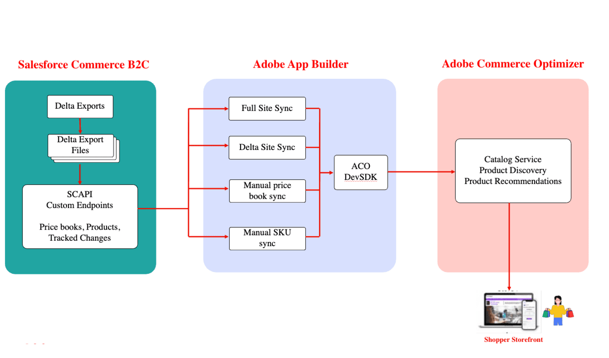

# Salesforce Commerce Connector for Adobe Commerce Optimizer

Built on Adobe App Builder technology, the [!DNL Salesforce Commerce Connector] for [!DNL Adobe Commerce Optimizer] enables seamless transfer and management of catalog data from Salesforce Commerce Cloud B2C to [!DNL Adobe Commerce Optimizer]. It bridges both platform, keeping product information, pricing, and updates in sync––without re-platforming.

Out of the box, the connector offers reliable data sync capabilities and the flexibility to customize workflows for your business needs.

## Key Capabilities

* **Catalog Data Sync**–Push product data——including variants, price books, and structures——from Salesforce B2C into Adobe Commerce Optimizer to keep storefronts and experience-driven applications up to date.
* **Price Sync*–Import and manage price data and hierarchical pricing structures directly from Salesforce B2C.
* **Supports multiple data types:** Sync products, pricing, and catalog structures to reflect complex merchandising configurations.

* **Flexible Sync Workflows**
  * **Scheduled Syncs**——Automate updates using cron job scheduling, no manual effort required.
  * **On-Demand Updates**——Instantly trigger SKU-level updates for urgent changes, corrections, or product launches.

* **Built for Extensibility**
  * Uses Salesforce cartridges for compatibility and easy adaptation to unique or advanced use cases.
  * Scales with your business——start with catalog and price sync, then extend the workflows to support additional integrations or business logic.
  * Configure and evolve workflows without rebuilding core integrations

>[!NOTE]
>
>The connector is specifically designed for Salesforce Commerce Cloud B2C. It does not support Salesforce B2B or D2C products, which are built on different technology stacks.

## Who Benefits from the Salesforce Connector?

The [!DNL Salesforce Commerce Connector] is ideal for:

* **Existing Salesforce Commerce Cloud B2C customers** enhancing storefront capabilities
* **Multi-brand organizations** requiring advanced merchandising and personalization features across multiple storefronts
* **Businesses seeking performance improvements** through Adobe's Edge Delivery Services for faster storefront experiences
* **Companies with complex pricing structures** syncing sophisticated price books and locale-specific pricing
* **AEM customers** managing product catalogs from Salesforce Commerce while using Adobe Commerce storefront with Edge Delivery Services
* **Retailers with multi-locale requirements** syncing localized product information across markets and languages

## Use Cases

The connector supports several key use cases:

### Catalog data ingestion and storefront display

This primary use case demonstrates the complete data flow from Salesforce Commerce Cloud to the Adobe Commerce storefront:

1. **Initial catalog ingestion**—Bulk load your entire Salesforce commerce catalog, including simple products with variants, price books, and pricing information.
1. **Automated delta updates**—Automatically synchronize product updates from the Salesforce Commerce catalog management UI to Adobe Commerce Optimizer.
1. **Storefront integration**—Display synchronized catalog data on your Adobe Commerce Edge Delivery Service storefront using Adobe Commerce Optimizer's storefront APIs.
1. **Real-time updates**—View updated product information (names, prices, descriptions) immediately on your storefront after making changes in Salesforce.

### Multi-Locale Product Management

Leverage Salesforce Commerce Cloud localization capabilities:

* Sync localized versions of product text fields (names, descriptions) from Salesforce Commerce Cloud for different locales.
* Map Salesforce locale concepts 1:1 with Adobe Commerce Optimizer locales.
* Support multiple product ingestion cycles for different localizations.
* Maintain consistency across global product catalogs.

## Architecture and components

Built on [Adobe App Builder](https://developer.adobe.com/app-builder/), the Salesforce Commerce Connector provides a robust integration layer between your SFCC instance and Adobe Commerce Optimizer. The connector operates through a series of sync actions that transfer your catalog data, price books, and product information.

1. **Data Extraction**—The connector authenticates with your Salesforce Commerce instance and extracts catalog data using custom cartridge APIs.
1. **Data Transformation**—The connector transforms product data to match the Adobe Commerce Optimizer data model and schema requirements.
1. **Data Ingestion**—The connector securely transmits transformed data to Adobe Commerce Optimizer using the ACO TypeScript SDK.
1. **Storefront Integration**—Synchronized data becomes available through Adobe Commerce Optimizer's APIs for storefront experiences.

The following diagram illustrates the high-level data flow for the integration:

{zoomable="yes"}

### Key Components

The [!DNL Commerce Optimizer Salesforce Commerce Connector] consists of several key components:

* **ACO SFCC Starter Kit App Builder application**-Provides serverless functions that handle data sync between SFCC and Adobe Commerce Optimizer.
* **Custom SFCC Cartridge** - Required cartridge that extends your Salesforce Commerce Cloud instance with APIs needed for data extraction.
* **Sync Engine** - Automated processes for full and delta data sync.
* **Management UI** - Web interface for monitoring sync status and managing connector operations.

### Sync Process

The connector supports multiple sync modes:

#### Full Site Sync

Performs a comprehensive sync of all products, price books, and prices for your configured Salesforce Commerce Cloud site and locales. This includes:

* Product metadata and attributes
* Catalog structure and categories
* Price books and pricing information
* Multi-locale product data

#### Delta Sync

Retrieves and syncs only changes made in Salesforce product and price data since the last sync, ensuring efficient and timely updates. Delta sync runs automatically on a scheduled basis (default: hourly) to maintain data freshness.

#### Targeted Sync Options

* **Price Book Sync**–Syncs price book information only.
* **Metadata Sync**–Updates product metadata and attribute definitions.
* **Specific Product Sync**–Syncs individual products by SKU.

## Important considerations

When planning your implementation, consider these key factors:

### Data Mapping and Attributes

* **Searchable attributes**—Salesforce Commerce Cloud sets searchable attributes through the UI, which the API does not expose. Use the [metadata APIs](https://developer.adobe.com/commerce/services/optimizer/data-ingestion/#metadata) to manually configure these searchable attributes in Adobe Commerce Optimizer.
* **Attribute mapping**—Plan the mapping of Salesforce Commerce product attributes to Adobe Commerce Optimizer metadata based on your business requirements.
* **Default searchable fields**—The connector automatically makes core attributes (name, description, ID) searchable by default.

### Sync Scope

* **Site selection**—Salesforce Commerce Cloud has a concept of sites that catalogs attach to. During full sync, select which Salesforce site to sync.
* **Locale management**—Each Salesforce Commerce locale results in a separate product ingestion cycle in Adobe Commerce Optimizer.
* **Data volume**—Consider catalog size and sync frequency when planning implementation.

## Monitoring and management

Once installed and configured, the [!DNL Commerce Optimizer Salesforce Commerce Connector] provides comprehensive monitoring and management capabilities:

{width="700" zoomable="yes"}

* **Sync Status Tracking**—Monitor the status and timestamps of all sync operations.
* **Connectivity Validation**—Test connections to both Salesforce Commerce Cloud and Adobe Commerce Optimizer.
* **Product Data Validation**—Verify that synchronized product data appears correctly in the storefront.
* **Error Logging and Troubleshooting**—Access detailed logs for diagnosing and resolving sync issues.
* **State Management**—Track sync progress and prevent conflicts with built-in state management.

## Source code and development resources

The [!DNL Commerce Optimizer Salesforce Commerce Connector] is open source and available for customization. Key repositories include:

* **[ACO SFCC Starter Kit](https://github.com/adobe-commerce/aco-sfcc-starter-kit)** - Main connector application and documentation.
* **[ACO SFCC Cartridges](https://github.com/adobe-commerce/aco-sfcc-cartridges)** - Required SFCC cartridge for API integration.
* **[ACO TypeScript SDK](https://github.com/adobe-commerce/aco-ts-sdk)** - SDK for Adobe Commerce Optimizer integration.

These repositories provide complete source code, detailed documentation, and examples for implementing and customizing the connector.

## Next Steps

Ready to integrate your Salesforce Commerce Cloud data with Adobe Commerce Optimizer? Start by reviewing the detailed implementation guide in the [ACO SFCC Starter Kit repository](https://github.com/adobe-commerce/aco-sfcc-starter-kit) and ensure you have the necessary prerequisites in place.
