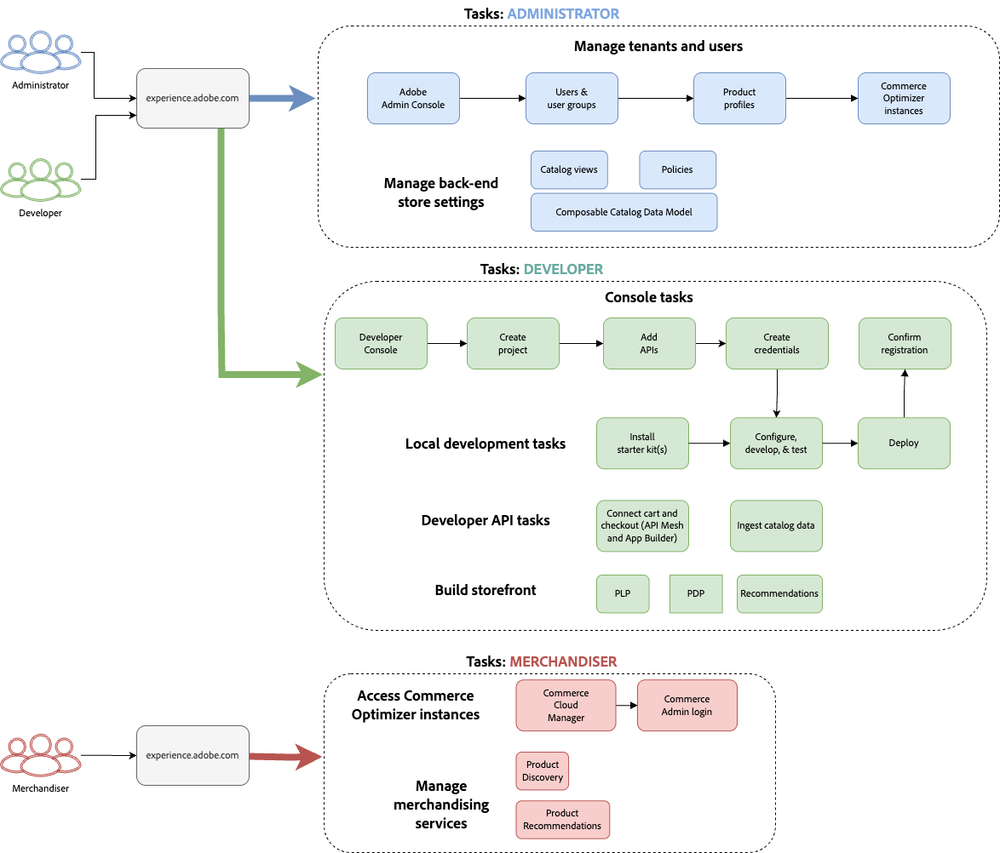

# Get Started

This guide walks you through setting up [!DNL Adobe Commerce Optimizer] from start to finish. While this guide covers all roles, see the [developer documentation](https://developer.adobe.com/commerce/services/composable-catalog/) for detailed developer-specific content.

## Prerequisites

Before you begin, ensure you have:

- **Adobe Experience Cloud account** with [!DNL Adobe Commerce Optimizer] entitlements
- **Organization admin access** to create instances and manage users
- **GitHub account** (for loading sample data and storefront development)
- **Basic understanding** of e-commerce concepts

## Quick Start guide

Follow these essential steps to get your [!DNL Adobe Commerce Optimizer] environment running:

### Step 1. Create an instance

1. Log in to [Adobe Experience Cloud](https://experience.adobe.com/).
2. Navigate to **Commerce** > **Commerce Cloud Manager**.
3. Click **Add Instance** > **Commerce Optimizer**.
4. Configure your instance:
   - **Name**: Enter a descriptive name
   - **Description**: Brief description of your use case
   - **Region**: Select your preferred region
   - **Environment**: Choose **Sandbox** for testing
5. Click **Add Instance**.

>[!NOTE]
>
>Sandbox instances are limited to North America region. You cannot change the region after creation.

### Step 2. Set up your environment

After creating your instance:

1. Access your instance from Commerce Cloud Manager.
1. Set up catalog views and policies using the [Catalog View guide](./setup/catalog-view.md).
1. Configure user access using the [User Management guide](./user-management.md).

### Step 3. Add sample data (Optional)

For testing and learning, follow the [Load Sample Data](#add-sample-data) instructions.

### Step 4. Explore and use Adobe Commerce Optimizer

See [Next steps](#next-steps).

## Role-Based workflows

[!DNL Adobe Commerce Optimizer] setup and management relies on three key roles. Each role has specific tasks and responsibilities:

{zoomable="yes"}

### Administrator tasks

Administrators manage instances, users, and organizational settings.

|Task|Description|Link|
|---|---|---|
|**Manage Users**|Add users, developers, and admins|[User Management](./user-management.md)|
|**Create Instances**|Set up sandbox and production environments|[Create Instance](#create-an-instance)|
|**Configure Access**|Set up catalog views and policies|[Catalog Views](./setup/catalog-view.md)|

### Developer tasks

Developers handle technical implementation and data integration, including platform architecture tasks.

|Task|Description|Link|
|---|---|---|
|**Access Developer Console**|Create projects and generate credentials|[Developer Console](https://developer.adobe.com/developer-console/docs/guides/getting-started)|
|**Ingest Catalog Data**|Import product data from existing systems|[Data Ingestion API](https://developer-stage.adobe.com/commerce/services/composable-catalog/data-ingestion/using-the-api/)|
|**Set Up Storefront**|Configure Edge Delivery Services storefront|[Storefront Setup](./storefront.md)|

### Merchandiser tasks

Merchandisers optimize and personalize the shopping experience through product discovery and recommendations. They also use shopper data and analytics to make strategic decisions about product placement, pricing, and promotions on the storefront.

|Task|Description|Link|
|---|---|---|
|**Product Discovery**|Configure search and filtering|[Merchandising Overview](./merchandising/overview.md)|
|**Recommendations**|Set up AI-powered product recommendations|[Product Recommendations](./merchandising/recommendations/overview.md)|
|**Performance Tracking**|Monitor success metrics|[Success Metrics](./manage-results/success-metrics.md)|

## Create an instance

>[!TIP]
>
>Start with a Sandbox instance for testing and development.

### Prerequisites

- Adobe Experience Cloud account with [!DNL Adobe Commerce Optimizer] entitlements
- Organization admin permissions

### Steps

1. **Log in** to your [Adobe Experience Cloud](https://experience.adobe.com/) account.

1. **Navigate to Commerce Cloud Manager:**
   - Under **Quick access**, click **Commerce**.
   - The Commerce Cloud Manager displays your available instances.

1. **Create new instance**:
   - Click **Add Instance** in the top-right corner.
   - Select **Commerce Optimizer**.

   {width="60%" align="center" zoomable="yes"}

1. **Configure instance settings**:
   - **Name**: Descriptive name (e.g., "My Company Sandbox")
   - **Description**: Brief description of purpose
   - **Region**: Select your preferred region
   - **Environment Type**: Choose **Sandbox** for testing

1. **Complete setup**:
   - Click **Add Instance**.
   - Instance appears in Cloud Manager.

1. **View instance details**:
   - Click the information icon next to your instance name.
   - Note the GraphQL endpoint, the Catalog Service endpoint for data ingestion, and the Instance ID (also known as the `tenant ID`).

   {width="60%" align="center" zoomable="yes"}

## Access an instance

1. Log in to [Adobe Experience Cloud](https://experience.adobe.com/).

1. Open Commerce Cloud Manage:
   - Under **Quick access**, click **Commerce**.
   - View your available instances.

1. Access your instance:

   Click the instance name to open the [!DNL Adobe Commerce Optimizer] application.

## Add sample data

Adobe provides a GitHub repository with sample data and tools to help you learn and test [!DNL Adobe Commerce Optimizer] features.

The sample data is based on the [Carvelo business scenario](./use-case/admin-use-case.md) and includes:

- Product catalog with automotive parts
- Multiple price books and pricing scenarios
- Catalog views and policies for different dealers
- Complete end-to-end workflow examples

### Steps

1. Access the GitHub repository:
   - Visit the [Sample Catalog Data Ingestion repository](https://github.com/adobe-commerce/aco-sample-catalog-data-ingestion)
   - Follow the setup instructions in the repository's README file.

2. Run the ingestion:
   - Use the provided scripts to load sample data into your Adobe Commerce Optimizer staging environment.
   - Verify that data appears in your [Data Sync](./setup/data-sync.md) page

3. Clean up (optional):

   Remove the sample data using the `reset.js` script included in the sample data loader source code.

## Next Steps

After completing the setup:

1. **Set up your storefront**:
   - Configure [Edge Delivery Services storefront](./storefront.md)
   - Connect to your catalog data

1. **Explore the Carvelo use case**:
   - Follow the [end-to-end workflow](./use-case/admin-use-case.md)
   - Practice with real scenarios

1. **Configure merchandising**:
   - Set up [product discovery](./merchandising/overview.md)
   - Create [recommendations](./merchandising/recommendations/overview.md)

1. **Monitor performance**:
   - Track [success metrics](./manage-results/success-metrics.md)
   - Analyze [search performance](./manage-results/search-performance.md)

## Troubleshooting

### Common issues

|Issue|Solution|
|---|---|
|**Cannot create instance**|Verify that you have [!DNL Adobe Commerce Optimizer] entitlements and admin permissions.|
|**Instance not appearing**|Check your Adobe IMS organization and refresh the page.|
|**Cannot access instance**|Ensure that you're added as a user in the Admin Console.|
|**Sample data not loading**|Verify your instance credentials and API endpoints|

### Get help

- **Documentation**: [Adobe Commerce Optimizer Guide](https://experienceleague.adobe.com/en/docs/commerce/user-guides/product-solutions)
- **Developer Resources**: [Developer Documentation](https://developer-stage.adobe.com/commerce/services/composable-catalog/)
- **Storefront Resources**: [Commerce Storefront Documentation](https://developer-stage.adobe.com/commerce/services/composable-catalog/storefront/)
- **Support**: [Adobe Commerce Support resources](https://experienceleague.adobe.com/en/docs/commerce-knowledge-base/kb/overview)
