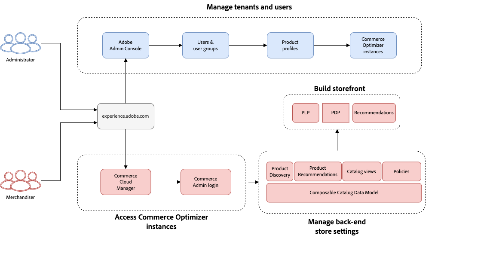
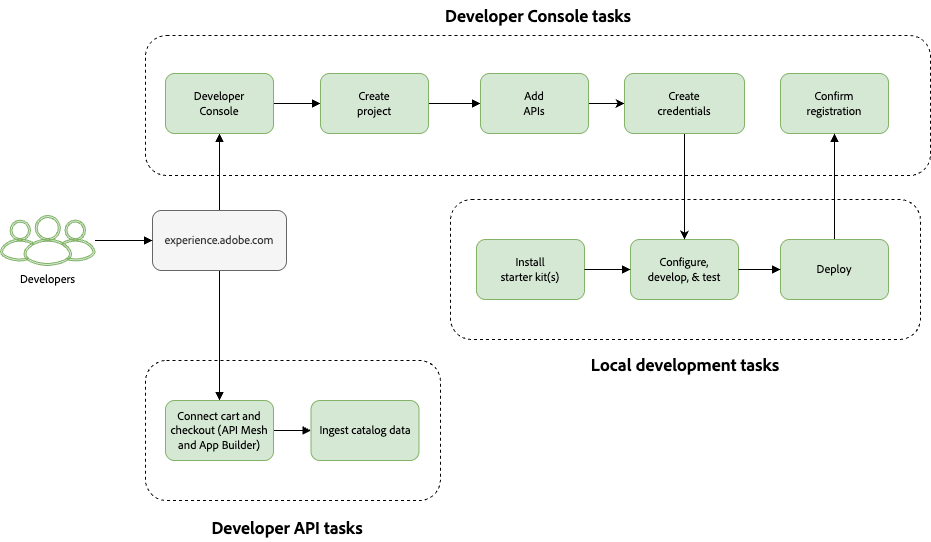

# Get Started

This article walks you through how to get up-to-speed with [!DNL Adobe Commerce Optimizer].

Successfully setting up [!DNL Adobe Commerce Optimizer] typically involves the following team members:

- Developer
- Administrator
- Merchandiser

Each team member has their own set of responsibilities as described in the following table:

|Role(s)|Task|
|---|---|
|Administrator, Developer|Use Admin Console to create admins, user groups, users, and developers​.|
|Developer|Use Developer Console to create a project, grant developers API access, and install required applications and customizations.|
|Administrator, Developer|Create a new [!DNL Adobe Commerce Optimizer] instance in the Commerce Cloud Manager.​|
|​Administrator, Developer|Set up your storefront|
|Developer|Connect to your backoffice system (cart, checkout) using API Mesh and App Builder​.|
|Developer|Ingest the catalog data from your existing commerce solution(s) using the Merchandising Services Data Ingestion API​|
|Merchandiser|Set up product discovery​.|
|Merchandiser|Set up product recommendations.|
|Merchandiser|Set up your policies and catalog views.|

>[!BEGINTABS]

>[!TAB Merchandiser and Administrator workflow]

This diagram provides a high-level overview of how merchandisers and administrators access and manage [!DNL Adobe Commerce Optimizer] instances.

>[!TAB Developer workflow]

This diagram provides a high-level overview of how developers create projects and credentials, install extensions, ingest catalog data, and perform general platform architecture tasks.

>[!ENDTABS]

## 1. Access Admin Console

**Role** Administrator or Developer

Access the [Adobe Admin Console](https://helpx.adobe.com/enterprise/admin-guide.html) to manage your Adobe Entitlements across your entire organization. See [Add users and admins](./user-management.md#add-users-and-admins) to learn how you or your organization's product admin or system admin can add users to the [!DNL Adobe Commerce Optimizer] product.

## 2. Access Developer Console

**Role** Developer

Access the [Developer Console](https://developer.adobe.com/developer-console/docs/guides/getting-started) to create a project for [!DNL Adobe Commerce Optimizer], generate access tokens, and install required applications and customizations.

## 3. Create an instance

**Role**: Administrator or Developer

[!DNL Adobe Commerce Optimizer] instances use a credit-based system. You can create multiple instances, but each instance requires a relative amount of credits. The amount of credits you have initially depends on your subscription.

1. Log in to your [Adobe Experience Cloud](https://experience.adobe.com/) account.

1. Under [!UICONTROL Quick access], click [!UICONTROL **Commerce**] to open the [!UICONTROL Commerce Cloud Manager]. 

   The [!UICONTROL Commerce Cloud Manager] displays a list of [!DNL Adobe Commerce as a Cloud Service] instances that are available in your Adobe IMS organization.

1. Click [!UICONTROL **Add Instance**] in the top-right corner of the screen.

    {width="50%" align="center" zoomable="yes"}

1. Select [!UICONTROL **Commerce as a Cloud Service**].

1. Enter a **Name** and **Description** for your instance.

1. Select the region where you want your instance hosted.

   >[!NOTE]
   >
   >Once you have created your instance, you will not be able to modify the region.
 
1. Choose the [!UICONTROL **Environment Type**] for your instance. You can choose between the following options:

   - [!UICONTROL **Sandbox**] - Ideal for design and testing purposes. You should begin your [!DNL Adobe Commerce as a Cloud Service] journey by using the sandbox environment. 
   - [!UICONTROL **Production**] - For live stores and customer-facing sites.

   >[!NOTE]
   >
   >Sandbox instances are currently limited to the North America region.

1. _(Optional)_ If you want to include sample product data for testing and learning purposes, select [!UICONTROL **Adobe Store**] from the [!UICONTROL **Test data**] dropdown.

   You can skip this option, but your storefront will not have any products if you do. You will have to [import your catalog](#5-ingest-catalog-data) to see the full storefront experience.

1. Click [!UICONTROL **Add Instance**].

## 4. Access an instance

**Role**: Administrator or Merchandiser

After you create an instance, you can access it from the [!UICONTROL Commerce Cloud Manager].

1. Log in to your [Adobe Experience Cloud](https://experience.adobe.com/) account.

1. Under [!UICONTROL Quick access], click [!UICONTROL **Commerce**] to open the [!UICONTROL Commerce Cloud Manager]. 

   The [!UICONTROL Commerce Cloud Manager] displays a list of instances that are available in your Adobe IMS organization.

1. To open the [!UICONTROL Commerce Optimizer Admin] for an instance, click the instance name.

>[!TIP]
>
>To see information about your instance, including the REST and GraphQL endpoints and the Admin URL, click the information icon next to the instance name.

## 5. Ingest catalog data

**Role**: Developer

See the [Data ingestion API](https://developer-stage.adobe.com/commerce/services/composable-catalog/data-ingestion/using-the-api/) documentation to learn how you can import catalog data into [!DNL Adobe Commerce Optimizer].

The catalog data that is ingested is visible in the [data sync](./setup/data-sync.md) page.

## 6. Setup catalog views and policies

**Role**: Merchandiser

Learn how to [define your catalog views and policies](./setup/catalog-view.md). The catalog not only contains your product data, but it also helps you define your business structure.

## 7. Setup product discovery and recommendations

**Role**: Merchandiser

Learn how to [create personalized experiences](./merchandising/overview.md) for your shoppers through product discovery and recommendations.

## 8. Set up the storefront

**Role**: Administrator or Developer

Now that you have created an instance, you are ready to proceed [setting up](./storefront.md) your Commerce Storefront powered by Edge Delivery Services.
