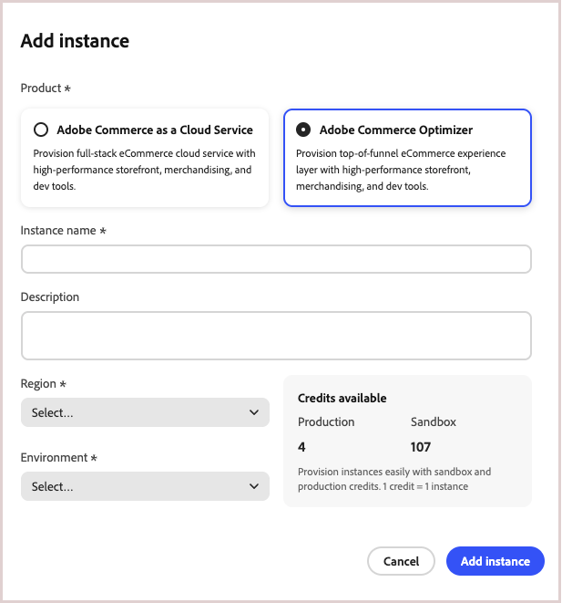
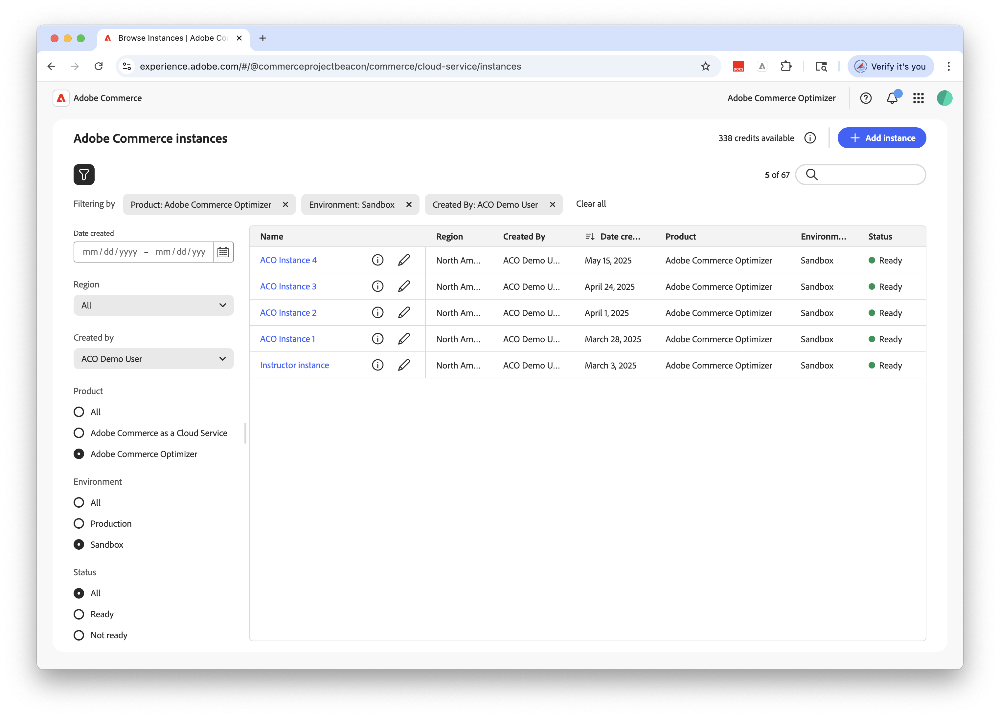

# Get Started

This guide walks you through setting up [!DNL Adobe Commerce Optimizer] from start to finish. While this guide covers all roles, see the [developer documentation](https://developer.adobe.com/commerce/services/optimizer/) for detailed developer-specific content.

## Instance types and environment isolation

Adobe Commerce Optimizer uses separate instances for different environments, such as **sandbox** and **production**. Each instance has its own instance ID and its own isolated data, including catalog views, policies, search configuration, and product recommendations.

When integrating with Adobe Commerce as a Cloud Service, third-party commerce platforms, or Edge Delivery Services storefronts, always match environments:

- Connect **sandbox Optimizer instances** to non‑production commerce and storefront environments.
- Connect **production Optimizer instances** to production commerce and storefront environments.

Mixing sandbox environments with production environments causes inconsistent catalog data, unexpected search and merchandising behavior, and unreliable metrics. Use the instance type and instance ID in Commerce Cloud Manager as your source of truth when configuring integrations.

## Prerequisites

Before you begin, ensure you have:

- **Adobe Experience Cloud account** with [!DNL Adobe Commerce Optimizer] entitlements
- **Organization admin access** to create instances and manage users
- **GitHub account** for loading sample data and storefront development
- **Basic understanding** of e-commerce concepts

## Quick start guide

Follow these essential steps to get your [!DNL Adobe Commerce Optimizer] environment running:

### Step 1. Create an Instance

1. Log in to [Adobe Experience Cloud](https://experience.adobe.com/).
1. Navigate to **Commerce** > **Commerce Cloud Manager**.
1. Click **Add Instance** > **Commerce Optimizer**.

   {width="60%" zoomable="yes"}

1. Configure instance settings:
   - **Instance Name**: Descriptive name (for example, "My Company Sandbox")
   - **Description**: Brief description of purpose
   - **Environment Type**: Start with a **Sandbox** environment for testing
   - **Region**: Select your preferred region

1. Click **Add Instance**.

   The Cloud Manager updates to include your new instance. For details on accessing and managing it, see [Manage an instance](#manage-instances).

>[!NOTE]
>
>You can only create sandbox environments in the North American region. Once an instance is created, you cannot change the region.

### Step 2. Set up your environment

After creating your instance:

1. [Manage your instance](#manage-instances) from Commerce Cloud Manager.
1. Configure user access using the [User Management Guide](./user-management.md).

### Step 3. Add sample data (Optional)

For testing and learning, follow the [Load Sample Data](#add-sample-data) instructions.

## Role-Based workflows

[!DNL Adobe Commerce Optimizer] setup and management rely on three key roles. Each role has specific tasks and responsibilities:

![Role-based workflow for [!DNL Adobe Commerce Optimizer] setup showing administrator, developer, and user tasks](./assets/high-level-workflow.png){zoomable="yes"}

### Administrator tasks

Administrators manage instances, users, and organizational settings.

|Task|Description|Link|
|---|---|---|
|**Manage Users**|Add users, developers, and admins|[User Management](./user-management.md)|
|**Create Instances**|Set up sandbox and production environments|[Create Instance](#step-1-create-an-instance)|
|**Manage Instances**|Check status, update instance name and description, and get key URLs for application and API access|[Manage Instances](#manage-instances)|
|**Configure Access**|Set up catalog views and policies|[Catalog Views](./setup/catalog-view.md)|

### Developer tasks

Developers handle technical implementation and data integration, including platform architecture tasks.

|Task|Description|Link|
|---|---|---|
|**Access Developer Console**|Create projects and generate credentials|[Developer Console](https://developer.adobe.com/developer-console/docs/guides/getting-started)|
|**Ingest Catalog Data**|Import product data from existing systems| To ingest data directly into Adobe Commerce Optimizer, see [Data Ingestion API](https://developer.adobe.com/commerce/services/optimizer/data-ingestion/){target="_blank"}.  To ingest data from Commerce on cloud or on premises environments or other third-party systems, see the [Integrations](./integrations/integrations-overview.md){target="_blank"}  topic.|
|**Set Up the Storefront**|Configure Edge Delivery Services storefront|[Storefront Setup](./storefront.md)|

### Merchandiser tasks

Merchandisers optimize and personalize the shopping experience through product discovery and recommendations. They also use shopper data and analytics to make strategic decisions about product placement, pricing, and promotions on the storefront.

|Task|Description|Link|
|---|---|---|
|**Product Discovery**|Configure search and filtering|[Merchandising Overview](./merchandising/overview.md)|
|**Search settings**|Enable semantic search and optional tuning|[Settings — Advanced search](./settings.md#advanced-search) and [Semantic search](./setup/semantic-search.md)|
|**Recommendations**|Set up AI-powered product recommendations|[Product Recommendations](./merchandising/recommendations/overview.md)|
|**Performance Tracking**|Monitor success metrics|[Success Metrics](./manage-results/success-metrics.md)|

## Manage instances

Manage instances from the Commerce Cloud Manager.

>[!NOTE]
>
>Not all [!DNL Adobe Commerce Optimizer] users have access to Cloud Manager. Access depends on the role and permissions assigned to the user account.

1. Log in to [Adobe Experience Cloud](https://experience.adobe.com/).

1. Open Commerce Cloud Manager:

   - Under **Quick access**, click **Commerce**.
   - View your available instances.

### Search and filter instances

After you log in, the dashboard shows all Commerce product instances available in the organization.
The Product column indicates which Commerce application the instance is provisioned for.

{zoomable="yes"}

Use the Filter and Search tools to quickly find specific instances by date created, region, creator, product type, environment, or status.

### Access the [!DNL Adobe Commerce Optimizer Studio] admin interface

After the app is open, easily switch between environments like sandbox and production to view data and settings for each one without returning to the Commerce Cloud Manager.

1. From the Commerce Cloud Manager, click the instance name to open [!DNL Adobe Commerce Optimizer Studio].

1. Switch between [!DNL Adobe Commerce Optimizer] instances without leaving the application.

   - Click the instance drop-down to view all Optimizer instances available in the organization.
   
     ![Instance switcher dropdown for selecting [!DNL Adobe Commerce Optimizer] environments](./assets/context-switcher.png){zoomable="yes"}

  -  Select the instance to view. 

>[!NOTE]
>
>To return to the Commerce Cloud Manager to view instance details, or manage instances, click the  (Apps) icon in the upper left corner of the Commerce Optimizer top navigation.  

### Get instance details

View the instance details by clicking the information icon next to your instance name.

![[!DNL Adobe Commerce Optimizer] instance details panel showing endpoints and instance ID](./assets/aco-instance-details.png){width="60%" zoomable="yes"}

Note the following key information:

- **GraphQL endpoint** GraphQL endpoint your storefront uses to query catalog and merchandising data from this instance using the [Merchandising Service API](https://developer.adobe.com/commerce/services/optimizer/merchandising-services/){target="_blank}
- **Catalog endpoint**  REST API endpoint you use to ingest products and prices into Adobe Commerce Optimizer from your commerce or PIM system. See  the [Data Ingestion API](https://developer.adobe.com/commerce/services/optimizer/data-ingestion/)
- **Commerce Optimizer URL** Opens the [Adobe Commerce Optimizer Studio](overview.md) admin UI to configure and manage catalog views, policies, and merchandising.
- **Instance ID**: Unique identifier (tenant ID) for this Adobe Commerce Optimizer instance, used by storefronts, APIs, and tools to connect to the correct environment.

If you are a developer, you need these details to set up your development environment and connect to the [!DNL Adobe Commerce Optimizer] APIs.

>[!NOTE]
>
>To access the instance details, you must have the necessary permissions in your Adobe IMS organization. If you do not see the instance details or cannot access the application, contact your organization administrator.

### Edit Instance Name and Description

Update the instance name and description as needed.

1. Click the **Edit** icon next to an instance name.
1. Update the **Instance name** and **Description** as needed.
1. Click **Save**.

## Add sample data

Adobe provides a GitHub repository with sample data and tools to help you learn and test [!DNL Adobe Commerce Optimizer] features.
The sample data is based on the [Carvelo business scenario](./use-case/admin-use-case.md) and includes:

- Product catalog with automotive parts
- Multiple price books and pricing scenarios
- Catalog views and policies for different dealers
- Complete end-to-end workflow examples

**Load the sample data:**

1. Access the [Sample Catalog Data Ingestion](https://github.com/adobe-commerce/aco-sample-catalog-data-ingestion) GitHub repository.

1. Follow the setup instructions in the repository's README file to complete the following tasks:

   - Set up your environment
   - Complete the data ingestion process
   - Create catalog views and policies using the sample data
   - Verify the data ingestion by checking the Catalog Service data on the [Data Sync](./setup/data-sync.md) page

## Next steps

After completing the setup:

1. Set up your storefront:
   - Configure [Edge Delivery Services storefront](./storefront.md)
   - Connect to your catalog data

1. Explore the Carvelo use case:
   - Follow the [end-to-end workflow](./use-case/admin-use-case.md)
   - Practice with real scenarios

1. Configure merchandising:
   - Set up [product discovery](./merchandising/overview.md)
   - Create [recommendations](./merchandising/recommendations/overview.md)

1. Monitor performance:
   - Track [success metrics](./manage-results/success-metrics.md)
   - Analyze [search performance](./manage-results/search-performance.md)

## Troubleshooting

### Common issues

|Issue|Solution|
|---|---|
|**Cannot create an instance**|Verify that you have [!DNL Adobe Commerce Optimizer] entitlements and admin permissions.|
|**Instance not appearing**|Check your Adobe IMS organization and refresh the page.|
|**Cannot access instance**|Ensure that you're added as a user in the Admin Console.|
|**Sample data not loading**|Verify your instance credentials and API endpoints.|

### Get help

- **Developer Resources**: [Developer documentation](https://developer.adobe.com/commerce/services/optimizer/)
- **Storefront Resources**: [Commerce storefront documentation](https://experienceleague.adobe.com/developer/commerce/storefront/)
- **Tutorials**: [Commerce Optimizer tutorials](https://experienceleague.adobe.com/en/docs/commerce-learn/tutorials/adobe-commerce-optimizer/overview)
- **Support**: [Adobe Commerce Support resources](https://experienceleague.adobe.com/en/docs/commerce-knowledge-base/kb/overview)
