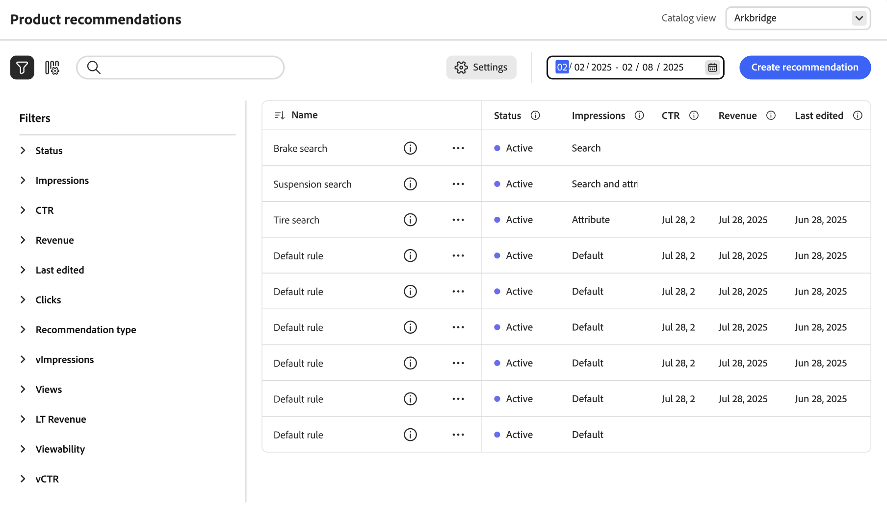

# Recommendations Performance

The *Recommendations performance* page displays a list of previously configured recommendations with metrics that help you track the success of each recommendation. The list can be configured to calculate metrics for the last day, week, or month. You can use the metrics to create actionable insights based on how frequently a recommendation unit is viewed or clicked, or to analyze how well your recommendations perform.

>[!INFO]
>
>A recommendation unit is a widget that contains the recommended product _items_.

!!!ADD WORKSPACE SCREENSHOT!!!

## Set metrics date range

1. Click the **Calendar**  control.

1. Choose one of the following:

   - Last 24 hours
   - Last 7 days
   - Last 30 days

   The calculated values in the metrics columns change to reflect the current date range.

## Show/hide columns

1. In the upper-left corner, click **Show/hide**  columns.

   The visible columns have a blue check mark.

1. In the menu, do either of the following:

   - To show a hidden column, click any column name without a check mark.
   - To hide a visible column, click any column name with a check mark.

   The table is refreshed to include only the selected columns.

   
   _Show/hide columns_

## View details

1. In the table, click the recommendation that you want to examine.

   
   _Home Page Conversion Rate Detail_

1. To change the status of the recommendation, click **Activate** or **Deactivate**.

## Create or edit recommendations

Learn how you can [create a new or edit an existing](../merchandising/recommendations/create.md) recommendation.

## Workspace Controls

|Control|Description|
|---|---|
||Determines the range of time that is used for metrics calculations. Options: 24 hours / 7 days / 30 days|
||Determines the columns that appear in the Recommendations table.|
|Create Recommendation|Opens the [Create New Recommendation](../merchandising/recommendations/create.md) page.|

## Column Descriptions

|Column|Description|
|---|---|
|Name|The name of the recommendation.|
|Page|The page where the recommendation appears.|
|Type|The recommendation type.|
|Status|The recommendation status. Options: Inactive/Active/Draft|
|Created|The date the recommendation was created.|
|Last Edited|The date the recommendation was last edited.|
|Impressions|The number of times a recommendation unit is loaded and rendered on a page. A recommendation unit that is below the fold of the browser's viewport is rendered on the page, even if it is not viewed by the shopper. In this case, the rendered unit is counted as an impression, but a view is counted only if the shopper scrolls the unit into view.|
|vImpressions|(Viewable Impressions) The number of recommendation units that register at least one view. For example, if the recommendation unit has two lines, each with two products, and the last two products are not seen by the shopper but the first two are, the activity will still count as an impression.|
|Views|The number of recommendation units that appear in the viewport of the shopper's browser. If the shopper scrolls the page up or down several times, the event fires multiple times, each time the unit is viewable.|
|Clicks|The sum of the number of times a shopper clicks an item in the recommendation unit and the number of times the shopper clicks the **Add to cart** button in the recommendation unit|
|Revenue|The revenue driven by the recommendation for the current time range.|
|Lt Revenue|(Lifetime Revenue) The lifetime revenue driven by a recommendation.|
|Viewability|The percentage of recommendation units that register for the view.|
|CTR|(Click-Through Rate) The percentage of unit impressions for the recommendation that register a click. CTR counts all impressions even if the unit does not enter the shopper's view. If the recommendation unit is not viewed, it is unlikely to get clicked. However, those unseen impressions count toward the CTR score and reduce the overall CTR percentage.|
|vCTR|(Viewable Click-Through Rate) measures clicks based only on viewable impressions (recommendations that actually appeared in the visible part of the shopper's screen), providing a more accurate gauge of shopper engagement.|
