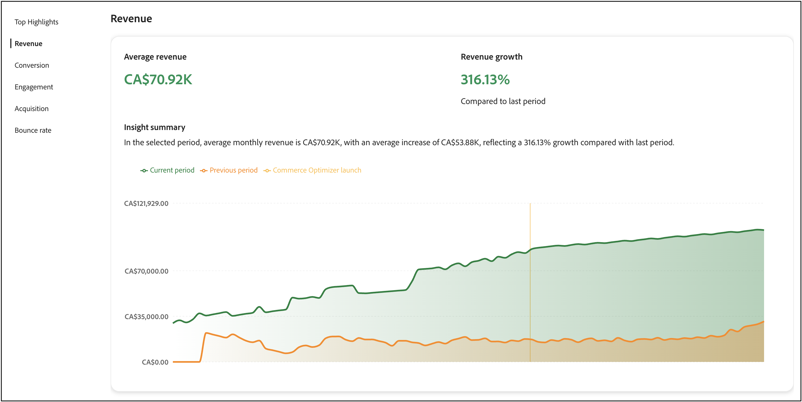

# Success metrics

This page provides an overview of the key performance metrics for your [!DNL Adobe Commerce Optimizer] store. The goal is for you to quickly understand the results of implementing [!DNL Adobe Commerce Optimizer] then help you and your team identify opportunities for growth, and highlight areas for optimization.

 
The metrics in the report are pulled from storefront event data. [Learn more](../setup/events/overview.md) about the event data collected.

## Understanding your metrics

The success metrics report delivers actionable insights into five key performance areas that directly impact your business outcomes. Each metric reveals patterns in customer behavior and store performance that help you uncover opportunities and address challenges. Leverage these insights to drive smarter decisions and to optimize your commerce experience.

**Top Highlights** summarizes key metrics from each performance area. Use this section to quickly identify your biggest opportunities for improvement.

The key performance indicators are:

- **Revenue**—Your primary financial metric showing total sales performance.
- **Conversion**—The percentage of visitors who complete purchases.
- **Engagement**—How actively users interact with your site.
- **Acquisition**—The effectiveness of your customer acquisition efforts.
- **Bounce Rate**—The percentage of visitors who leave after viewing only one page.

## Generate a report

1. From the left rail, select **Success Metrics**.
1. Under **Report Configuration** specify the **Date range**, **Catalog source**, based on your locale setting, and **Currency**.
1. Click **[!UICONTROL Apply]**.

    The **Top Highlights**, **Revenue**, **Conversion**, **Engagement**, **Acquisition**, and **Bounce rate** all update based on your report configuration.

1. Click **[!UICONTROL Export]** to save the report as a PDF.

## Success Metrics and Sites Optimizer: Working together

Success Metrics and Sites Optimizer ([Opportunities](opportunities.md)) are complementary tools that work together to help you improve your commerce site. Understanding the difference between these features helps you make better decisions and achieve measurable results.

### Key differences

|Feature|Success Metrics|Sites Optimizer (Opportunities)|
|---|---|---|
|**Purpose**|Measures performance and outcomes|Identifies issues and provides recommendations|
|**Type**|Analytical dashboard|Proactive issue detection|
|**What it shows**|Key performance indicators (Revenue, Conversion, Engagement, Acquisition, Bounce Rate)|AI-powered recommendations for problems affecting site performance|
|**Data source**|Storefront event data|Product catalogs, search logs, recommendation data|
|**Use when**|You want to track results over time|You want to identify and fix specific issues|

### How to use these features together

The most effective approach combines both tools in a continuous improvement cycle:

1. **Measure with Success Metrics**: Start by reviewing your Success Metrics dashboard to understand your current performance. Identify which KPIs need improvement (for example, low conversion rate or high bounce rate).

1. **Diagnose with Opportunities**: Navigate to the Opportunities page to discover specific issues that may be causing poor performance. Sites Optimizer scans your product catalog, search logs, and recommendation data to identify problems such as missing product data, poor search relevance, or navigation issues.

1. **Implement recommendations**: Follow the AI-driven recommendations provided in Opportunities to address detected issues. These might include fixing product data quality issues, improving SEO, or optimizing search and discovery.

1. **Track improvements**: Return to Success Metrics to monitor how the changes impact your KPIs over time. Use the date range selector to compare performance before and after implementing recommendations.

1. **Iterate and optimize**: Continue this cycle, using Opportunities to identify new issues and Success Metrics to measure the impact of your optimizations.

### Example workflow

A merchant notices their conversion rate declining in Success Metrics. Here's how they might use both features to address it:

1. **Identify the problem**: The Success Metrics dashboard shows conversion rate dropped 15% over the past month.

1. **Find the cause**: The Opportunities page reveals several issues:
   - Multiple products missing key attributes affecting search relevance
   - Popular search queries returning poor results
   - Slow page load times on category pages

1. **Take action**: The merchant prioritizes fixing the product data quality issues first, as Sites Optimizer categorizes these as high-impact opportunities affecting search and recommendations.

1. **Measure results**: After updating product attributes and implementing recommended changes, the merchant monitors Success Metrics weekly. Over the next month, conversion rate increases by 12%, and search engagement metrics improve significantly.

1. **Continue optimizing**: With conversion rate improving, the merchant shifts focus to the next priority shown in Opportunities—optimizing page load speed to reduce bounce rate.

### When to use each feature

**Use Success Metrics when you want to:**

- Track overall business performance
- Measure the impact of changes over time
- Identify which areas of your business need attention
- Share performance reports with stakeholders
- Understand customer behavior trends

**Use Sites Optimizer (Opportunities) when you want to:**

- Discover specific issues affecting performance
- Get actionable recommendations to fix problems
- Understand why certain metrics are declining
- Prioritize which optimizations to tackle first
- Leverage AI to identify issues you might miss manually

Together, these features provide a complete solution: Success Metrics tells you *what* is happening, while Sites Optimizer tells you *why* and *how to fix it*.

## Next steps and optimization strategies

Use your success metrics data to identify opportunities for improvement and implement targeted optimization strategies. The following sections provide specific, actionable guidance for each metric area.

### Revenue optimization

For revenue, your goal is to increase total sales and average order value.

#### Strategies

- **Implement AI-powered recommendations**: Use the optimizer's recommendation engine to surface relevant products that drive higher conversion rates. Deploy *Customers who viewed this also viewed* and *Bought this, bought that* recommendation types to increase cross-selling opportunities.

- **Create merchandising rules**: Boost high-margin products in search results using [merchandising rules](../merchandising/rules/overview.md). Pin best-selling items to the top of search results for high-traffic queries.

- **Optimize product discovery**: Use [intelligent facets](../merchandising/facets/overview.md) to help customers find products more efficiently, leading to higher conversion rates and increased revenue.

- **Leverage seasonal opportunities**: Create time-based merchandising rules to promote seasonal or promotional items during peak shopping periods.

### Conversion rate improvement

To improve your conversion rate, your goal is to convert more visitors into customers.

#### Strategies

- **Optimize search relevance**: Implement [synonyms](../merchandising/synonyms/overview.md) to ensure that customers find what they're looking for, even with different search terms. Use dynamic faceting to provide relevant filtering options.

- **Strategic recommendation placement**: Deploy recommendation units on high-traffic pages like product detail pages and category pages. Use *Most viewed* and *Most purchased* recommendations to build trust and urgency.

- **Improve product visibility**: Use merchandising rules to ensure best-selling and high-converting products appear prominently in search results.

- **A/B test recommendation types**: Experiment with different recommendation types and placements to find what works best for your audience.

### Engagement enhancement

To enhance engagement, your goal is to increase customer interaction and time on site.

#### Strategies

- **Diversify recommendation types**: Avoid showing the same recommendations repeatedly. Use a mix of *Recommended for you*, *Trending*, and *Recently viewed* to keep content fresh and engaging.

- **Implement intelligent search**: Use AI-driven dynamic faceting and result re-ranking to adapt search results in real-time based on shopper behavior.

- **Create personalized experiences**: Deploy "Recommended for you" units on the homepage and throughout the customer journey to provide personalized product suggestions.

- **Optimize search experience**: Use synonyms to improve search relevance and ensure customers find what they're looking for quickly.

### Acquisition growth

To acquire more growth, your goal is to attract more new customers and improve acquisition efficiency.

#### Strategies

- **Leverage search performance data**: Use the [search performance](../manage-results/search-performance.md) report to identify trending products and popular search terms. Create merchandising rules to highlight these items.

- **Optimize recommendation performance**: Monitor [recommendation performance](../manage-results/recommendation-performance.md) metrics to identify which recommendation types drive the most traffic and conversions.

- **Highlight new and promotional items**: Use merchandising rules to boost new products or promotional items in search results to attract attention from new visitors.

- **Track traffic sources**: Use event data to understand which channels bring the most valuable traffic and optimize your marketing efforts accordingly.

### Bounce rate reduction

To reduce the bounce rate, your goal is to keep visitors engaged and reduce single-page visits.

#### Strategies

- **Improve search relevance**: Use synonyms and intelligent faceting to ensure customers find relevant products quickly. Poor search results are a major cause of high bounce rates.

- **Implement recommendation units**: Deploy recommendation units on category and search results pages to provide additional product options and keep visitors engaged.

- **Optimize product discovery**: Use merchandising rules to ensure the most relevant and popular products appear first in search results.

- **Create engaging homepage experiences**: Use "Recommended for you" and "Trending" recommendation types on your homepage to immediately engage visitors with relevant content.

## Troubleshooting and optimization

### When metrics are declining

**Revenue declining**:

- Check if recommendation units are still active and performing well
- Review merchandising rules to ensure high-margin products are being promoted
- Analyze search performance to identify if popular products are still ranking well

**Conversion rate dropping**:

- Verify that search relevance is maintained (check synonyms and facets)
- Ensure recommendation units are displaying correctly
- Review merchandising rules for any conflicts or issues

**High bounce rates**:

- Check search result relevance and implement synonyms if needed
- Ensure recommendation units are loading properly
- Review product data quality and availability

**Low engagement**:

- Diversify recommendation types to prevent customer fatigue
- Implement more personalized recommendation strategies
- Optimize search experience with better facets and synonyms

## Field descriptions

### Report configuration

|Field|Description|
|---|---|
|Date range|Options include **Past 3 months**, **Past 7 days**, **Past 30 days**, **Past 6 months**, **Past 12 months**, and **Year to date**. Use shorter ranges for immediate optimization insights and longer ranges for trend analysis. |
|Country|Based on the catalog source specified for your [catalog view](../setup/catalog-view.md). Select the appropriate market for accurate performance analysis.|
|Currency|The currency specified for your catalog view. Ensure this matches your target market for accurate revenue reporting.|
|Export|Saves the report as a PDF for sharing with stakeholders or offline analysis.|

## More like this

- [Search Performance](../manage-results/search-performance.md) - Analyze search terms and optimize search relevance
- [Recommendation Performance](../manage-results/recommendation-performance.md) - Monitor and optimize recommendation effectiveness
- [Recommendations Overview](../merchandising/recommendations/overview.md) - Learn about AI-powered product recommendations
- [Merchandising Rules](../merchandising/rules/overview.md) - Boost, bury, pin, or hide products in search results
- [Facets](../merchandising/facets/overview.md) - Enhance search with intelligent filtering
- [Synonyms](../merchandising/synonyms/overview.md) - Improve search relevance and customer experience
- [Events Overview](../setup/events/overview.md) - Understand the data that powers your metrics
