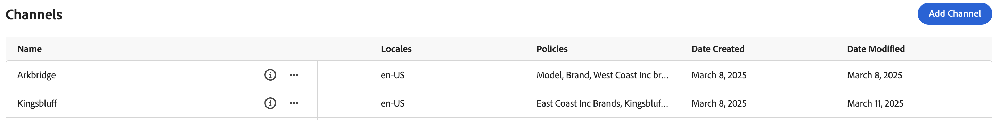

# Carvelo Use Case

>[!NOTE]
>
>This documentation describes a product in early-access development and does not reflect all functionality intended for general availability.

The following use case demonstrates how you can use [!DNL Adobe Commerce Optimizer] to organize your catalog to match retail operations using a single base catalog. It also demonstrates how to set up a storefront powered by Edge Delivery Services.

## Let's get started

In this use case, you will be working with the following:

1. [!DNL Adobe Commerce Optimizer] UI - Set up required channels and policies to manage complex catalog operational setup.

1. Commerce Storefront - Render the storefront with the catalog data set up within [!DNL Adobe Commerce Optimizer] UI and Commerce Storefront Configs.

### ‌Key takeaways

By the end of this article, you will:

- Learn the fundamentals of [!DNL Adobe Commerce Optimizer], it's unique and performant and scalable catalog data model.
- Learn how the new catalog data model ties in seamlessly with platform agnostic storefront components built by Adobe.
- Learn how to use Commerce Storefront powered by Edge Delivery to bring a unique shopping experience to your customers.

## Business scenario – Carvelo Automobile

Carvelo Automobile is a fictitious automobile conglomerate with a complex operational setup.


In this diagram, you see that Carvelo sells automobile products of three brands. Each brand is a different child company:

- Aurora (electric vehicles)
- Bolt (SUVs)
- Cruz (hybrid)

It sells these brands through three dealers:

- Arkbridge
- Kingsbluff
- Celport

These dealers belong to two different parent dealership companies:

- West Coast Inc. (Arkbridge)
- East Coast Inc. (Kingsbluff, Celport)

Each company has two pricebooks that are used to sell products at a specific price for different shoppers (base, VIP).

As you can see, this is a very complex business use case. Before [!DNL Adobe Commerce Optimizer], a merchant would have to duplicate their base catalog to support this use case. Now, with [!DNL Adobe Commerce Optimizer], a merchant can support a complex business structure using a single base catalog to syndicate data without catalog duplication, scale pricebooks (30k+ pricebooks), and deliver all of this on an Edge Delivery Services storefront.

Now that you have an overview of the business use case, here is your objective as you work through this tutorial:

>[!BEGINSHADEBOX]

Carvelo wants to sell parts across its three brands (Aurora, Bolt, and Cruz) through the different dealerships. Carvelo wants to ensure that the dealerships have access to only the correct parts and prices as per the licensing agreements.

Ultimately, Carvelo has two major goals (1) Maintain a "global" website, which has all the SKUs across all three brands. (2) Provide a path for dealerships to set up their own storefronts based on unique SKU visibility and prices for each SKU for each dealership.

>[!ENDSHADEBOX]

Now, access your [!DNL Adobe Commerce Optimizer] instance.

## 1. Access the [!DNL Adobe Commerce Optimizer] instance

After you onboard to the Early Access program, you will be given a link to an [!DNL Adobe Commerce Optimizer] instance. This instance is pre-configured with everything that you need to successfully complete the steps outlined in this tutorial, including catalog data that supports the Carvelo Automobile use case.

When you launch [!DNL Adobe Commerce Optimizer], you see the following:

![[!DNL Adobe Commerce Optimizer] UI](assets/user-interface.png)

>[!NOTE]
>
>See the [overview](./overview.md) article to learn more about the different parts that make up the [!DNL Adobe Commerce Optimizer] UI.

In the left navigation, expand the **[!UICONTROL Catalog]** section and click on **[!UICONTROL Channels]**. Notice that the Arkbridge and Kingsbluff dealerships already have channels created:



Arkbridge has the following policies:

- Brand
- Model
- West Coast Inc brands
- Arkbridge part categories

Kingsbluff has the following policies:

- Brand
- Model
- East Coast Inc brands
- Kingsbluff part categories

In the next section, you will create a channel and policies for the Celport dealership.

## 2. Create a new policy and channel

Carvelo's commerce manager needs to set up a new storefront for a dealer called *Celport* that belongs to *East Coast Inc* company. Celport will be selling brakes and suspensions for the Bolt and Cruz brands.


Using [!DNL Adobe Commerce Optimizer], the commerce manager will:

1. Create a new policy called *Celport Part Categories* for Celport to sell only brakes and suspensions.
1. Create a new channel for Celport storefront. This channel uses your newly created policy *Celport Part Category* and the existing *East Coast Inc brands* to ensure that Celport can only sell Bolt and Cruz as part of the agreement with East Coast Inc.
1. Set up Celport commerce storefront configs.

At the end of this section, Celport will be up and running ready to sell Carvelo's products.

### Create a Policy

Let's create a new policy called *Celport Part Categories* to filter the SKUs that the Celport dealer sells, which are brakes and suspension.

1. In the left navigation, expand the **[!UICONTROL Catalog]** section and click on **[!UICONTROL Policies]**.

1. Click the **[!UICONTROL Add Policy]** button.

    A new page displays for you to add the policy details.

1. Add the required details:

    **Name** = *Celport Part Categories*

1. Click the **[!UICONTROL Add Filter]** button.

    A dialog displays for you to add filter details.

1. Add the filter details:

    - **Attribute** = *part_category*
    - **Operator** = **IN**
    - **Value Source** = **STATIC**
    - **Value** = *brakes*, *suspension*

    >[!IMPORTANT]
    >
    >Make sure the attribute name that you specify exactly matches the SKU attribute name in the catalog.

    To learn more about the difference between a STATIC and TRIGGER value source, see [value source types](./policies.md#value-source-types).

1. In the **[!UICONTROL Filter details]** dialog, click the **[!UICONTROL Save]** button.

1. To enable the filter you just created, click the action dots (...) and select **Enable**.

1. Click the **[!UICONTROL Save]** blue button.

    >[!NOTE]
    >
    >If the **[!UICONTROL Save]** button is not active (blue), you might be missing the policy name. Click the pencil icon next to *New Policy* to add it.

1. Go back to the list of policies by clicking the back arrow.

    Your new *Celport Part Categories* policy appears in the list.

### Create a channel

Create a new channel for the *Celport* dealer and link the following policies: *East Coast Inc brands* and *Celport Part Categories*.

1. In the left navigation, expand the **[!UICONTROL Catalog]** section and click on **[!UICONTROL Channels]**.

    You will see existing channels: *Arkbridge*, *Kingsbluff*, and *Global*.

1. Click the **[!UICONTROL Add Channel]** button.

1. Fill in channel details:

    - **Name** = *Celport*
    - **Scopes** = *en-US* (hit enter)
    - **Policies** (use dropdown) = *East Coast Inc Brands*; *Celport Part Categories*; *Brand*; *Model*                          

1. Click the **[!UICONTROL Add]** blue button. The channel is created and listed on the list of channels page.

    >[!NOTE]
    >
    >If the **[!UICONTROL Add]** button is not blue, make sure you hit enter in the channel details for the **[!UICONTROL Scopes]** section.

1. Copy the Celport channel ID.

    Click the information icon for the Celport channel on the **Channels** page.

    

    Keep track of this ID as it will be used in the next section after you build your storefront.

With your new channel and policy created, you can configure the storefront to use the new Celport channel.

## 3. Set up the Celport commerce storefront

The final piece of this tutorial involves setting up the storefront then swapping out the channel ID with the channel ID for Celport that you copied previously.

1. Follow the steps in the [Set up your storefront](./storefront.md) article to get your initial Edge Delivery storefront created.

    When you finish creating the storefront, notice that it does not include information related to the Celport channel. In the next step, you will update the `config.json` file to add that channel.

1. In the root directory of the repository where your storefront code is located, open the `config.json` file.

   +++config.json code

   ```json
   {
    "public": {
      "default": {
      "commerce-core-endpoint": "https://www.aemshop.net/graphql",
      "commerce-endpoint": "https://na1-sandbox.api.commerce.adobe.com/Fwus6kdpvYCmeEdcCX7PZg/graphql",
      "headers": {
         "cs": {
            "ac-channel-id": "9ced53d7-35a6-40c5-830e-8288c00985ad",
            "ac-environment-id": "Fwus6kdpvYCmeEdcCX7PZg",
            "ac-price-book-id": "west_coast_inc",
            "ac-scope-locale": "en-US"
           }
         },
         "analytics": {
            "base-currency-code": "USD",
            "environment": "Production",
            "store-id": 1,
            "store-name": "ACO Demo",
            "store-url": "https://www.aemshop.net",
            "store-view-id": 1,
            "store-view-name": "Default Store View",
            "website-id": 1,
            "website-name": "Main Website"
          }
       }
      }
   }
   ```

   Notice that the channel header contains the following lines:

   - `ac-channel-id`:`"9ced53d7-35a6-40c5-830e-8288c00985ad"`
   - `ac-price-book-id`: `"west_coast_inc"`

   +++

1. Replace the `ac-channel-id` value with Celport channel ID that you copied previously.
1. Replace the `ac-price-book-id` value with `"east_coast_inc"`.

1. Save the file.

1. [Preview and publish your content](./storefront.md). UPDATE LINK TO STEP 5 WHEN PR 69 IS MERGED.

1. Launch the storefront to see the Celport-specific catalog experience that includes products and prices based on the policies you specified when you created the Celport channel.

## Where to go from here

To learn how you can use Product Discovery and Recommendations to personalize the shopping experience for your customers, see the [merchandising overview](./merch-overview.md).
