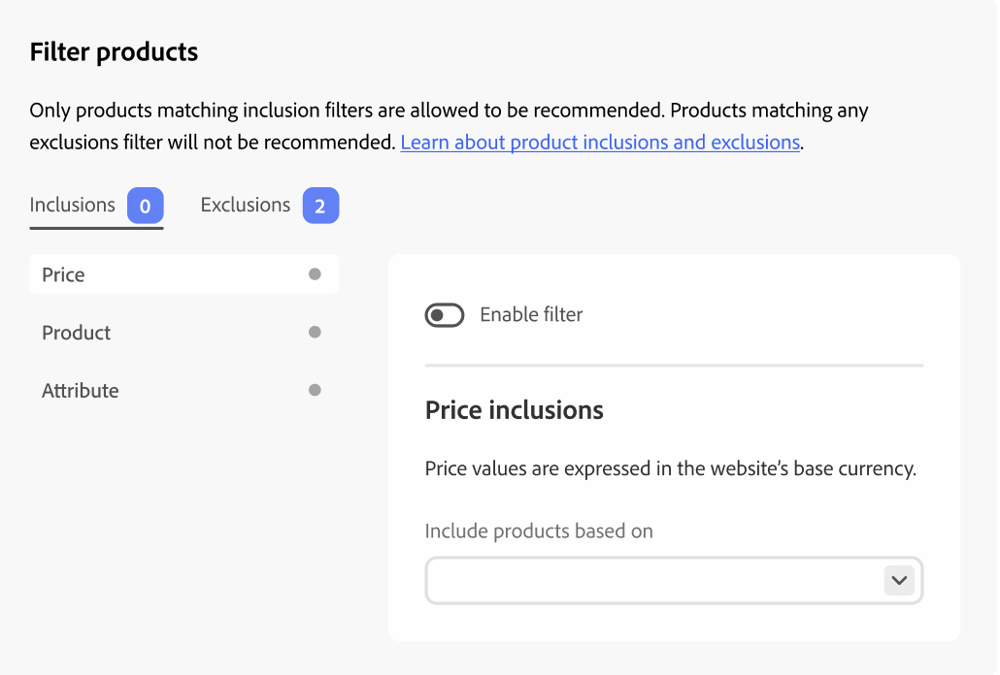

# Filter Products

[!DNL Adobe Commerce Optimizer] automatically applies non-configurable default filters to recommendation units. If you have multiple recommendation units deployed to a page, [!DNL Adobe Commerce Optimizer] filters out any products that are repeated in the units. Only the first reference to a repeated product is used, to make room for other products to be recommended. [!DNL Adobe Commerce Optimizer] also filters out any previously purchased products and those that are in the cart.

When you [create](create.md) a recommendation unit, you can define filters that control which products can be displayed in recommendations. These filters are based on a set of inclusion or exclusion conditions that you define. Only products that match all inclusion conditions appear in recommendations. Products that match any of the exclusion conditions are not recommended.

You can configure multiple filters and enable only those you want by selecting the toggle on each filter page. This allows you to create drafts of filters for future use. The number of enabled filters is displayed on each tab.

## Conditions

Conditions can be static or dynamic.

- A static condition uses existing product attributes to determine which products can appear in the unit. For example, you can specify that only in-stock products with a price greater than $25 appear in the unit.

- A dynamic condition keys off a shopper's current context, such as the currently viewed category or product. For example, when creating a product recommendation to be deployed on product detail pages, you can create a condition to recommend only products that are within a relative price range of the currently viewed product.

### Logical operators

The logical operators `AND` and `OR` are used to join multiple conditions. If using both inclusion and exclusion filters, the inclusions are evaluated first to determine all possible products that can be recommended, then products that match any exclusion filters are removed from the list.

- `AND` - Joins two inclusion-filtering conditions
- `OR` - Joins two exclusion-filtering conditions

## Types of filters

### Product

Product filters specify which specific products are eligible, or not eligible, to be displayed in recommendations. You cannot select products that are disabled or not visible individually because those products can never appear in recommendations.

>[!NOTE]
>
>Child products of a configurable product are not displayed in a recommendation unit because those child products have the visibility of _Not Visible Individually_.

### Price

A filter based on the product price uses the final price to perform the comparison. The final price includes any discounts or special pricing available to anonymous shoppers.

<!--### Attribute

You can filter products based on attribute criteria, including attribute values. Selected values use OR logic to either include or exclude products when any of the specified values are found.-->
