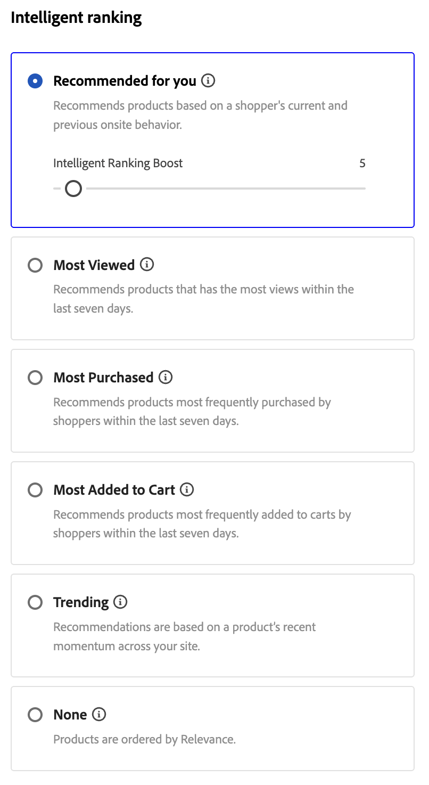

# Create and Manage Rules

To build a rule, open the rule editor, choose a **rule type** (search conditions, default listing, or category pages), then define conditions and ranking where they apply, test the results, and publish the rule.

## Create a rule {#create-a-rule}

1. In the left rail, go to _Merchandising_ > **Merchandising Rules**.
1. (Optional) Use the **Catalog view** dropdown to select the catalog view where the rule should apply. The rule you create is scoped to the selected view (or to all catalog views if **All views** is selected). See [Select catalog view](workspace.md#select-catalog-view) for how catalog view scoping works.

   >[!IMPORTANT]
   >
   >This feature is currently in beta.

1. Click **[!UICONTROL Create rule]** to launch the rule editor.

### Rule types

Each rule type has an information icon in the editor with a short explanation. Use the type that matches where shoppers should see the merchandising logic:

| Rule type | Purpose |
| --- | --- |
| **All products rule** | Default ranking and merchandising across product listings when no more specific search or category rule applies. You can only create one such rule; it cannot contain conditions. |
| **Category rule** (Beta) | Applies merchandising and ranking to one or more selected categories, controlling product order on those category pages. See [Category rules](#category-rules). |
| **Search rule** | Applies merchandising and ranking when shoppers run a search that matches the rule's query conditions. |

In the **Build your rule** section, you define the rule name, schedule, whether the rule applies to all listings or to specific search conditions, and ranking types.

1. In the **[!UICONTROL Name]** field, enter a name for the rule. All rule names must be unique.
1. In the **[!UICONTROL Description]** field, enter a description for the rule.
1. In the **[!UICONTROL Date range]** field, specify the date or range of dates you want the rule to be active.
1. In the **[!UICONTROL Rule applies to]** section, select the [rule type](#rule-types) you want to use.

>[!BEGINTABS]

>[!TAB Search rule]

A search rule applies merchandising and ranking logic when shoppers perform a search that matches the defined conditions.

The conditions are the requirements to trigger an event. A rule can have up to ten conditions and 25 events. A default rule cannot have any conditions.

**Single condition**

1. Under *Build your rule*, select the **Condition** to be met, and follow the instructions to complete the statement.

   - Search query contains - Enter the string of text that must be in the shopper's query. The Match setting determines the degree to which the shopper's query matches the catalog. Options:  Any - Any part of the shopper's query text can match the condition. All - All of the shopper's query must match the condition.
   - Search query is - Enter a string of text that exactly matches the shopper's query. For example: "yoga pants". Rules with `Search query is` and Match `All` can have only one condition.
   - Search query starts with - Enter a character or string of text that must be at the beginning of the shopper's query.
   - Search query ends with - Enter a character or string of text that must be at the end of the shopper's query.

   The results appear immediately in the *Test your rule* pane and are numbered by priority. You can use the *Results per row* slider in the upper right to change the number of products in each row.

1. To test other queries, change the query text in the *Test your rule* search box and press **Return**.
   Initially, the test pane renders the query from the Conditions search box. But now it is rendering the query from the test query box. The test pane renders only one query at a time.
1. If you like the result, update the text in the *Conditions* search box. Then, click anywhere on the page to update the results in the test pane.

**Multiple conditions**

1. To build a rule with multiple conditions, click **Add condition**.
   A rule can have up to ten conditions. The logical operator that joins two conditions is based on the current *Match* setting. By default, *Match* is `All` and the logical operator is `AND`.

1. Select the second condition and enter the required query text.

1. To change the logic of the rule, change the **Match** setting to determine how closely the shopper's search criteria must match the query condition. Set **Match** to one of the following:

   - Any - (Default) All logical operators in the rule are set to `OR` and the results appear in the test pane.
   - All - All logical operators in the rule are set to `AND` and the results appear in the test pane.

   The *Match* value determines the logical operator that is used to join multiple conditions. Changing the *Match* setting changes all logical operators in the rule. It is not possible to combine `AND` and `OR` in the same rule.

   In this example, rather than searching for "yoga pants", there are two separate queries that search for "yoga" or "pants". This rule is less specific and is triggered more often in the storefront than the other.

1. To add another condition, click **Add condition** and repeat the process.
1. Set **Intelligent ranking** and **Manual ranking** as described in the following sections. The same controls apply to category pages, with any differences called out.

>[!TAB Category rule]

>[!IMPORTANT]
>
>Category rules are in beta.

Category rules control how products are ordered on **category pages**. You combine **category rules** with **intelligent ranking** (including AI-driven signals), and **manual** actions such as pin, boost, and bury—so you can curate discovery, run promotions, and align category pages with your strategy without relying on external tools.

1. Under **Categories**, select the category or categories the rule should apply to. Selected categories appear below the control so you can confirm the scope.
1. From the list of categories that appear, you can click the three dots and select to:

   - **Delete** - Removes the category from the rule.
   - **Apply to subcategories** - Applies the rule to subcategories that do not already have an active merchandising rule defined.
   - **Preview** - Displays how the category page would appear on your storefront.

1. Set **Intelligent ranking** and **Manual ranking** as described in the following sections. The same controls apply to search rules, with any differences called out.

>[!ENDTABS]

### Intelligent ranking {#intelligent-ranking}

Intelligent ranking orders products using **behavioral signals** and, where applicable, AI. It applies to **search rules**, **all product listings** (default rules), and **category rules** (category pages). For shopper **searches**, ranking also weighs **textual relevance** to the query; **category pages** do not use query text in the same way—the editor focuses on behavioral strategies.

Store owners can set strategies such as the following. Exact labels and time windows match the rule editor and may differ slightly by rule type.

- **Most purchased** / **Most bought** — Ranks by purchase frequency per SKU in a recent window (for example, the previous 7 days for search contexts).
- **Most added to cart** — Ranks by total add-to-cart activity in a recent window (for example, the previous 7 days for search contexts).
- **Most viewed** — Ranks by views per SKU in a recent window (for example, the previous 7 days for search contexts).
- **Recommended for you** — Uses the `viewed-viewed` signal: shoppers who viewed this SKU also viewed other SKUs; supports personalized ordering on category pages where available.
- **Trending** — Emphasizes recent popularity (for search, page views over the past 72 hours for background events and 24 hours for foreground events).
- **None** — For search and default listings, products are ordered by **Relevance**. For **category rules**, uses the default merchandising order for the category when you do not choose another intelligent strategy.

Select the strategy for your rule. The **Test your rule** pane shows expected results for search-oriented rules; **category rules** use the category preview.

#### How intelligent ranking scoring works (search)

For **search results** (and the test query in the rule editor), intelligent ranking determines the final product order by combining two key factors: **textual relevance** and **behavioral signals**. Understanding how these factors interact helps you set realistic expectations for your search results.

**Scoring components:**

- **Textual relevance**: The dominant factor in scoring. This measures how well a product's name, description, and attributes match the search query. The text relevance score is unbounded (has no specific upper limit) and is influenced by factors like:

   - Frequency of occurrence of matching words.
   - Length  (in words) of product names/descriptions.

- **Behavioral signals**: A bounded boost applied on top of the text relevance score. When you select an intelligent ranking strategy like "Most viewed" or "Most purchased," products with higher behavioral signals receive a fixed boost to their scores. However, this boost has a defined limit.

**Why the most viewed product might not appear first:**

Textual relevance typically dominates ranking because its score is unbounded, while behavioral boosts are fixed. As a result, products with strong text matches often outrank those with higher engagement signals. Behavioral boosts alone may not compensate for large gaps in text relevance. Intelligent ranking addresses this by factoring in both match quality and shopper interaction, improving overall relevance. However, text match quality remains the primary driver of ranking.

**Example:**

A merchant uses the "Most viewed" intelligent ranking strategy and searches for "candle." They expect product SKU YAN-K-E-512 to appear at the top of results because it has the highest view count. However, other products rank higher:

- **Texas Candle** (1st position): Has a shorter, cleaner product name that creates a very high text relevance score. Even though it has fewer views than YAN-K-E-512, its superior text match outweighs the behavioral boost.

- **YAN-K-E-512** (lower position): Despite having the highest view percentile in the "Most viewed" behavioral data, its complex SKU-based name generates a lower text relevance score. The fixed behavioral boost is not enough to overcome this text relevance gap.

See [search rules](./best-practice.md#tips-to-optimize-search-rules) to learn how to improve product findability using rules.

#### Caveats

- Apostrophes and quotes in queries may lead to some minor issues with ranking and relevance in some languages.
- To ensure intelligent ranking works correctly for **search**, make sure that the **Search Weight** for any attributes that are used for search or filtering (facets) is `5` or less. (This guidance applies to search indexing, not to category-only merchandising flows.)

For information about setting search weights, see the [Metadata API](https://developer.adobe.com/commerce/services/reference/rest/).

### Manual ranking {#manual-ranking}

**Manual ranking** events adjust product order for **search results** (when your rule's conditions are met), for **default product listings**, and for **category page** listings. A single rule can have up to 25 events.

- **Boost** — Moves a product higher in the listing.
- **Bury** — Moves a SKU lower in the listing.
- **Pin a product** — Fixes a product at the selected position in the listing.
- **Hide a product** — Excludes a SKU from the results (search-oriented; confirm behavior for category rules in the editor).

The easiest way to pin a product is by drag and drop.

1. Click and drag a product in the Test pane. Drag and drop it at the desired position. The Product and Postion fields are automatically populated in the Events pane.

You may also click the pin icon to pin a product to its current location. Use the ellipsis context menu to "Pin to top" or "Pin to bottom".

>[!NOTE]
>
>**Search rules** — You can only pin products that appear in the search results for the configured query and rule conditions. Products must be indexed, visible, in stock, and meet all rule filters to be eligible for pinning. If a product does not appear in the preview or results for your rule, pinning it has no effect.
>
>**Default sort** — Manual positions apply when the shopper uses the default sort: **Sort by: Most Relevant** for search, or **relevance** / **position** for category listings. If the shopper changes sort; for example by name, pinned, boosted, buried, or hidden behavior may no longer match the preview.

Or events can be set manually:

1. Under *Events*, choose the **Event** to take place when the associated conditions are met.

   For example, choose `Hide a product`. Then, enter the name of the product that you want to hide. Products are suggested as you type.

1. For multiple events, choose any other events that you want to trigger when conditions are met.

### Finalizing the rule {#finalizing-the-rule}

1. Examine the results of the rule in the test pane.
1. If the rule has multiple queries, test each one that might be affected by the rule.
1. When complete, click **Save and publish**.

   The rule is added to the list in the *Rules* workspace. 

1. Although active rules go into effect immediately, you might have to wait up to 15 minutes for the cached query results in the storefront to be refreshed.

>[!NOTE]
>
>Rules and manually ranked products are applied to **search** results when the default sort order, "Sort by: Most Relevant," is selected. If a shopper changes the sort order to something like sort by name, rules and manual rankings are no longer in effect. For **category** listings, default-sort behavior is described in [Manual ranking](#manual-ranking).

## Edit, view, and delete rules {#edit-view-and-delete-rules}

Follow these instructions to update the properties of existing rules. You cannot change the catalog view (scope) of a rule after it is created; scope is set when you create the rule. See [Select catalog view](workspace.md#select-catalog-view).

### Edit rule

1. On the *Merchandising rules* workspace, find the rule in the grid that you want to edit and click **More** (...) options.
1. Click **Edit** to access the rule editor.
1. Update the conditions, operators, and events as needed.
1. Update the name, start and end date, and description fields as needed. All rule names must be unique.
1. Test the rule.
1. Publish the changes.
   The rule is added to the list in the *Rules* workspace. Although active rules go into effect immediately, it might take up to 15 minutes for cached query results in the storefront to be refreshed.

### View details

This option provides a quick way to see all the rule parameters, while staying on the *Rules* table.

1. On the *Merchandising rules* worksapce, find the rule in the grid that you want to edit and click **More** (...) options.
1. Click **View details** to view the rule parameters.
1. Choose **Edit** or **Delete**, or click the X to close the panel.

### Delete rule

1. On the *Rules* workspace, find the rule in the grid that you want to edit and click **More** (...) options.
1. Click **Delete**.

## Field descriptions {#field-descriptions}

### Conditions (if)

| Condition | Description |
|--- |--- |
| Search query contains | A character or string of text that is included in the shopper's query. The shopper's query needs to match only a single character to meet this condition. |
| Search query is | A character or string of text that exactly matches the shopper's query. Complex queries with multiple conditions cannot be composed when this condition is used. |
| Search query starts with | The shopper's query begins with this character or string of text. |
| Search query ends with | The shopper's query ends with this character or string of text. |

### Logical operators

| Operator | Description |
|--- |--- |
| OR | (Default) The logical operator `OR` compares two conditions and meets the requirements to trigger an event if at least one condition is true. |
| AND | The logical operator `AND` compares two conditions and meets the requirements to trigger an event if both conditions are true. |

### Match operators

| Operator | Description |
|--- |--- |
| Any | Changes all logical operators in the rule to `OR` and returns the set of matching products. |
| All | Changes all logical operators in the rule to `AND` and returns the set of matching products. |

### Manual ranking events

|Event |Description |
|--- |--- |
| Boost | Moves a SKU or range of SKUs higher in the listing (search or category). Each is marked with a "boosted" preview badge in the test results. |
| Bury | Moves a SKU or range of SKUs lower in the listing. Each is marked with a "buried" preview badge in the test results. |
| Pin a product | Attaches a single SKU to a specific position in the listing. The product is marked with a "pinned" preview badge in the test results. |
| Hide a product | Excludes a SKU, or range of SKUs, from the results (search-oriented; confirm for category rules in the editor). |

### Details

|Field |Description |
|--- |--- |
| Name | The name of the rule. Rule names must be unique. |
| Rule Type | **Default** (all product listings), **Query** (specific search conditions), or **Category** (category pages), depending on **Rule applies to**.|
| Start date | The start date of the rule, if scheduled. |
| End date | The end date of the rule, if scheduled. |
| Description | A brief description of the rule. |
