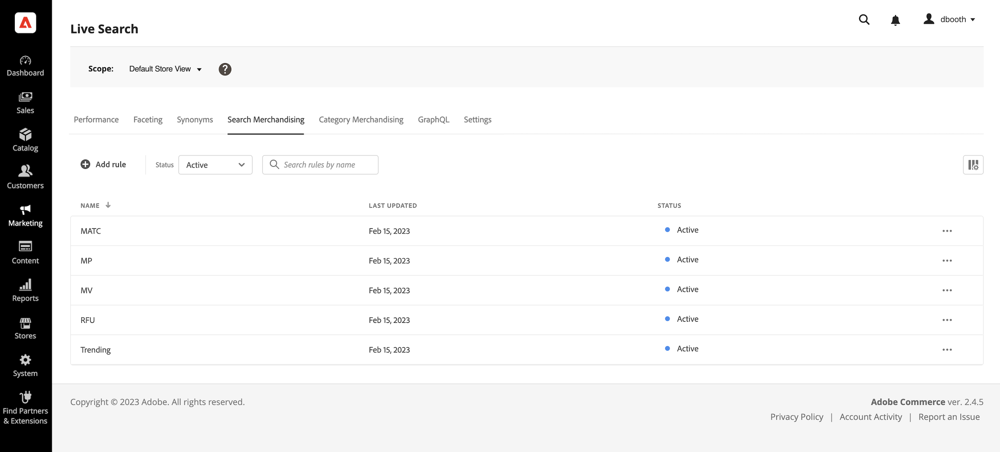

# Merchandising Rules Workspace

The *Merchandising Rules* workspace lists the current selection of rules and their status, and provides access to tools you need to create and manage rules. You can scope rules to all [catalog views](../../setup/catalog-view.md) (global) or to a single catalog view. See [Select catalog view](#select-catalog-view) for how to filter by catalog view and create rules per catalog view. From the workspace you can:

- Search for rules
- View rule details
- Activate/deactivate rules
- Delete rules
- Access the rule editor

## Show/hide columns

1. In the upper-right corner, click **Show/hide**  columns.

1. In the menu, do either of the following:

   - To show a hidden column, click any column name without a check mark.
   - To hide a visible column, click any column name with a check mark.

## Filter rules by status

1. If your store has many rules, you can filter the rules by status to shorten the list. By default, the Rules list displays all rules.

1. To list only rules with a specific status setting, set **Status** to one of the following:

   - All
   - Active
   - Inactive
   - Scheduled
   - Draft

   You also can filter by **Conditions**, **Start date**, **End date**, and **Last updated**.

## View details

The details panel shows the rule name, status, conditions and events, start and end date, description, and date last edited. Rules can be enabled, edited, and deleted from the details panel.

1. On the *Merchandising rules* workspace, find the rule in the grid that you want to view and click the () icon.

   You can do any of the following from the menu:

   - Edit Rule
   - Delete Rule
   - Enable/Disable Rule

## Column descriptions

| Column | Description |
|--- |--- |
| Name | The name of the rule. |
| Last Updated | The date that the rule was last updated. |
| Start date | The start date of a scheduled rule. |
| End date | The end date of a scheduled rule. |
| Status | The color-coded status indicates the current state of the rule. Use the Status control above the grid to filter rules by status. Values: All status  - Displays all rules regardless of status. Active (blue) - Displays only active rules. Scheduled (Orange) - displays only scheduled rules. Inactive (gray) - displays only inactive rules. |

## Controls

| Control | Description |
|--- |--- |
| Add rule | Opens the [rule editor](add.md). |
| Catalog View | Filters the table to rules that apply to the selected catalog view. Also sets the scope when you [create a rule](add.md). Options: *All Catalog Views* or a specific [catalog view](../../setup/catalog-view.md). See [Select catalog view](#select-catalog-view). |
| Status | Filters the list of rules by status. Options: All, Active, Inactive, Scheduled |
|  | Specifies the columns that visible in the grid. Options: Last updated, Start date, End date, Status |
| Search | Searches for a rule by full name or partial match. |
|  | Displays a menu of more actions that can be applied to the selected rule. Options: Edit, View details, Delete |

## Rule details

| Field | Description |
|--- |--- |
| Status | The current status of the rule. |
| Conditions | The search query that describes the conditions associated with the rule. |
| Start Date | The date the rule goes into effect, if scheduled. |
| End Date | The date the rule expires, if scheduled. |
| Description | A brief description of the rule. |
| Last updated | The date and time the rule was last updated. |
| Enabled | A control that changes the status of the rule. Options: Enabled / Disabled |

## Select catalog view

>[!IMPORTANT]
>
>This feature is currently in beta.

The **[!UICONTROL Catalog View]** selector on the Merchandising Rules page does two things:

1. **Filter the table** – Shows only rules (and their details) that apply to the selected catalog view.
1. **Set the scope for new rules** – When you [create a rule](add.md), the selected catalog view is used as the rule's scope. Options are *All Catalog Views* or a specific [catalog view](../../setup/catalog-view.md).

   - **All Catalog Views** – The rule applies to all catalog views. Search and ranking behavior is the same across every storefront that uses the catalog.
   - **Catalog view** – The rule applies only to the selected catalog view (for example, one storefront, region, dealer, or brand). Use this when different catalog views need different merchandising logic.

For details on creating a rule and setting its scope, see [Create and manage rules](add.md).

### Why create a rule per catalog view?

Create rules per catalog view when different storefronts, regions, or brands need different search and ranking behavior. Examples:

- **Dealer or distributor networks** – Each dealer has its own catalog view; you want different pinned, boosted, or buried products per dealer.
- **Multi-region** – Separate catalog views for EU, US, or other regions with region-specific merchandising rules.
- **Multi-brand** – Each brand has its own catalog view and you want brand-specific rules (for example, different default ranking or promoted products per brand).

Behavioral data that powers [intelligent ranking](add.md#intelligent-ranking) (such as most viewed, most purchased, trending) is calculated per catalog view by default. Rules that use intelligent ranking therefore reflect that catalog view's shopper behavior. When your account has a large number of catalog views, the system may aggregate behavioral data globally to maintain performance; in that case, ranking can be influenced more by high-traffic catalog views, and relevancy for lower-traffic views may be reduced. See [Limits and boundaries](../../boundaries-limits.md) for current limits.

### How to set up a rule per catalog view

1. On the *Merchandising Rules* workspace, use the **[!UICONTROL Catalog View]** dropdown to select the catalog view where the rule should apply.
1. Click **[!UICONTROL Create rule]**. The rule you create is scoped to the selected catalog view.
1. Build your rule in the [rule editor](add.md). In the editor, define conditions, events, and details. The rule applies only to search results in that catalog view.

You cannot change the catalog view (scope) of a rule after it is created. To apply similar logic to another catalog view, create a new rule and select that catalog view before creating.
