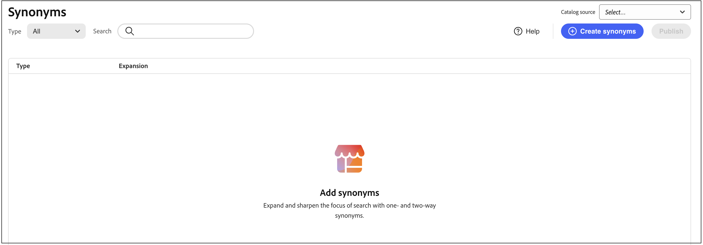
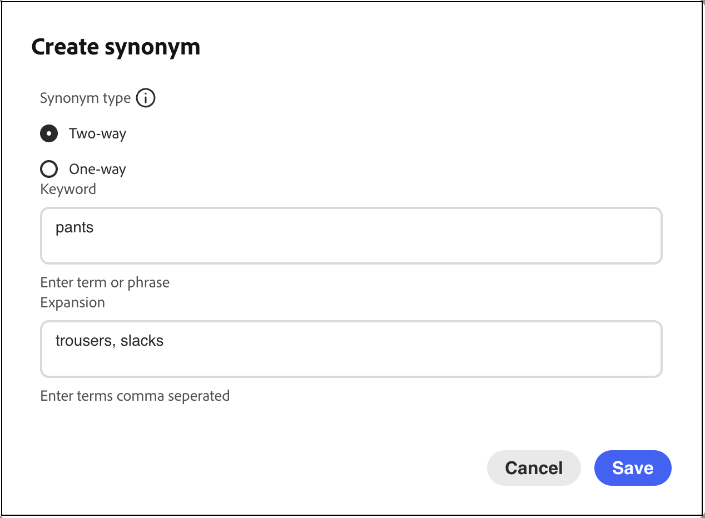
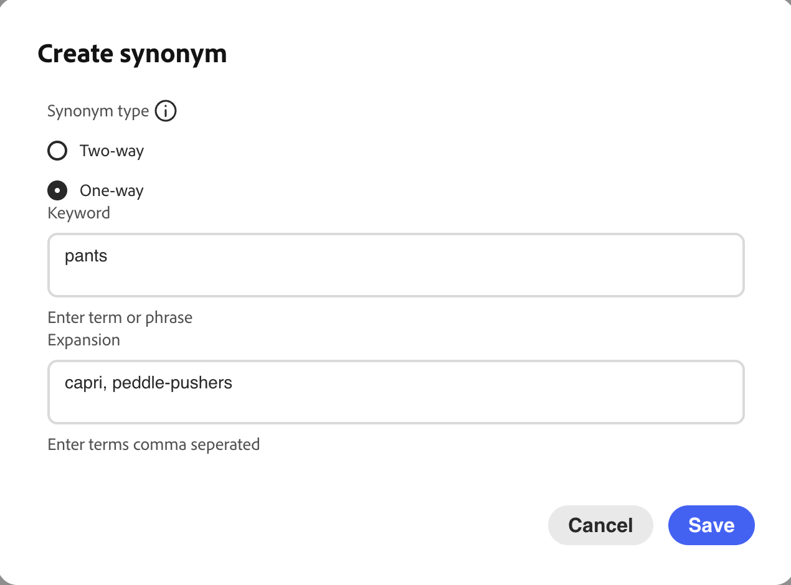

# Create Synonyms

Increase customer engagement by adding your own curated list of [!DNL Adobe Commerce Optimizer] synonyms. You can add up to 200 synonyms per store.

## Step 1: Add a synonym

1. From the left rail, go to _Merchandising_ > **Synonyms**.
1. Click the **[!UICONTROL Add synonyms]** button.

## Step 2: Define the synonym by type

Follow the instructions for the [type of synonym](type.md) that you want to create.

### Two-way synonym

1. Accept the default **Two-way** option.

   

1. Enter the **Keyword** term or phrase to be matched.
1. Enter the **Expansion** term(s) that you want to add as synonyms for the keyword. Separate multiple terms with a comma.
   In this example, the keyword to match is "pants" and the set of expansion terms are "trousers, slacks".

   

1. When complete, click **Save**.

   The set of synonyms appears in the list with a two-way arrow between each term that means the terms are interchangeable.

   

### One-way synonym

1. Click the **One-way** synonym type.

   

1. Enter the **Keyword** and **Expansion** terms. Separate multiple terms with a comma.

   

   In this example, the keyword is "pants" and the one-way expansion terms "capris, peddle-pushers" are each a subset of "pants", but with a specific meaning.

1. When complete, click **Save**.

   The set of synonyms appears in the list with a one-way arrow pointing from the expansion terms to the keyword to indicate the terms are subsets of the keyword. A plus sign separates each expansion term.

   

## Step 3: Publish changes

1. When your synonyms are complete, click **Publish**.
1. Wait for up to two hours for your updates to become available in the storefront.

## Field Descriptions

| Field | Description |
|--- |--- |
| [Type](type.md) | Determines if the synonyms have the same meaning as the keyword, or are a subset of the keyword. Options: Two-way (default) - Terms that have the same meaning as the keyword and return the same search results One-way - Terms that are a subset of the keyword. One-way synonyms return a more narrow list of specific products. |
| Keyword | A word that is commonly associated with a selection of products in your catalog. |
| Expansion | Additional terms that have the same or similar meaning as the keyword. |

## Manage Synonyms

Follow these instructions to manage existing [!DNL Adobe Commerce Optimizer] [synonyms](overview.md).

## Find synonym

To make it easy to find a synonym, you can filter the list by type and search by keyword or expansion term. These methods can be used individually or together.

1. To filter the list, set **Type** to one of the following:

   - All
   - One-way
   - Two-way

1. To search for a keyword or expansion term, enter at least three characters into the **[!UICONTROL Search]** box.

## Edit synonym

1. Find the synonym that you want to edit and click **More** (...) options.

1. Click **Edit**.
   The keyword is the first term in the list, and each term is separated by a comma. The keyword and expansion terms can be updated, but the type of the synonym cannot be changed.
1. Click the item you want to edit. Then, update the text as needed.

1. When complete, click **Save**.

## Delete synonym

1. Find the synonym that you want to delete in the list and click **More** (...) options.
1. Click **Delete**.
1. When prompted, click **Delete synonym** to confirm.

## Publish changes

To complete the process, your saved changes must be published to the storefront. It can take up to two hours for the updates to go live.

1. Click **Publish**.
1. Look for the message at the top of the page that confirms your changes have been published.
