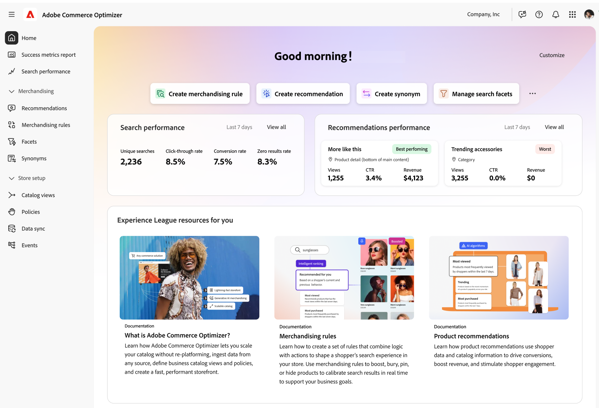

# Adobe Commerce Optimizer

Adobe Commerce Optimizer is a fast, performant storefront with a scalable catalog that allows you to optimize your existing eCommerce backend by increasing traffic and driving higher engagement and conversion.

>[!BEGINSHADEBOX]

If you would like to participate in the Adobe Commerce Optimizer early access program, send an email to: 

>[!ENDSHADEBOX]

## Architecture

The following diagram provides a high-level view of the Adobe Commerce Optimizer architecture.

- **Third-party catalog ingestion** - Ingest catalog data from any third-party source (PIM, ERP, and so on). Your catalog data is directly ingested into the merchandising services layer, which is a SaaS component called composable catalog data model (CCDM).
- **Composable catalog data model (CCDM)** - CCDM is the foundational piece of Commerce Optimizer. CCDM is a highly scalable, flexible catalog data model which unlocks multi-brand, multi-business unit, and multi-language use cases. CCDM provides building blocks that merchants can use to create and manage catalogs at scale. Within Commerce Optimizer, you can manage your catalog by creating channels, policies, and locales that best define your business goals. In addition, the merchandiser can provide personalized experiences to drive traffic and engagement using product discovery​, product recommendations​, and intelligent merchandising. Learn more about [CCDM](https://experienceleague.adobe.com/en/docs/commerce/catalog-data-model/overview).
- **Success metrics** - Provides real-time insights into the performance of your commerce initiatives. You can view before and after results of specific KPIs and evaluate the impact of changes and optimize for better results.
- **Commerce storefront powered by Edge Delivery** - With Edge delivery, you can launch your site quickly using prebuilt storefront components with integrated commerce functionality — including product listing pages, product detail pages, cart, and checkout.
- **Third-party cart and checkout** - Use API mesh and App builder to integrate with third party cart and checkout systems.

## What type of merchant benefits the most from Commerce Optimizer?

Commerce Optimizer is for:

- Merchants who want to maintain their existing backend commerce system and only transform storefront experiences.
- Businesses where a third-party system manages the cart and checkout lifecycle.
- AEM customers not currently using Adobe Commerce, seeking a simple way to manage their product catalog.

## Quick tour

When you first launch Commerce Optimizer, you see the following:

- **Home** - This is the main landing page in Commerce Optimizer. **Home** displays...
- **Preferences** - Is where you can set...
- **Merchandising** The merchandising section is where you can create personalized experiences for your shoppers through product discovery and recommendations.
    - **Product Discovery** - Enhances your site search functionality, ensuring a seamless and efficient shopper experience that maximizes conversion rates. It enables merchandisers to ensure that shoppers will get the right products at the right time.  
    - **Recommendations** - Uses artificial intelligence and machine-learning algorithms to perform a deep analysis of aggregated visitor data. This data, when combined with your catalog, results in a highly engaging, relevant, and personalized experience. Recommendations are surfaced on the storefront as units with labels, such as "Customers who viewed this product also viewed". You can create, manage, and deploy recommendations directly from Commerce Optimizer.
- **Catalog** - The catalog section is where you define your channels, policies, and locales. The catalog not only contains your product inventory, but it also helps you define your business structure.
    - **Channels** - Help you define your retail structure into meaningful business groups. For example, dealers for the automobile industry subsidiaries for multi brand conglomerates or even manufacturing locations for suppliers.
    - **Policies** - Data access filters that are housed within channels. Policies help to ensure that the right content is sent to the right destination. For example, point of sale physical stores, marketplaces, advertisement pipelines (Google, Facebook, Instagram). 
    - **Locales** - Represents the language (locale), currency, and unit of measurement for catalogs. Locale is set at a SKU level during catalog data ingestion. The mandatory scope to be added is 'locale'.
- **Data Insights** -  This sections provides valuable insights into the availability of product data for your storefront, ensuring it can be promptly displayed to your shoppers.
    - **Data Sync** - Displays an overview of the synchronization status for product data transferred from their data source (PIM, ERP, and so on) into Commerce Optimizer. Essentially, the **Data Sync** page shows the merchant the data that they have sent to Commerce Optimizer has been received and here is the product count. **Data Sync** displays the received products within Catalog Service, Product Discovery, and Recommendations.
    - **Eventing** - Displays storefront eventing data which powers Product Discovery and Recommendations. The **Eventing** page lets the merchant verify that they have implemented storefront eventing correctly and that events are being successfully captured. Merchants can use this page to identify potential problems and take steps to resolve any eventing issues. 

