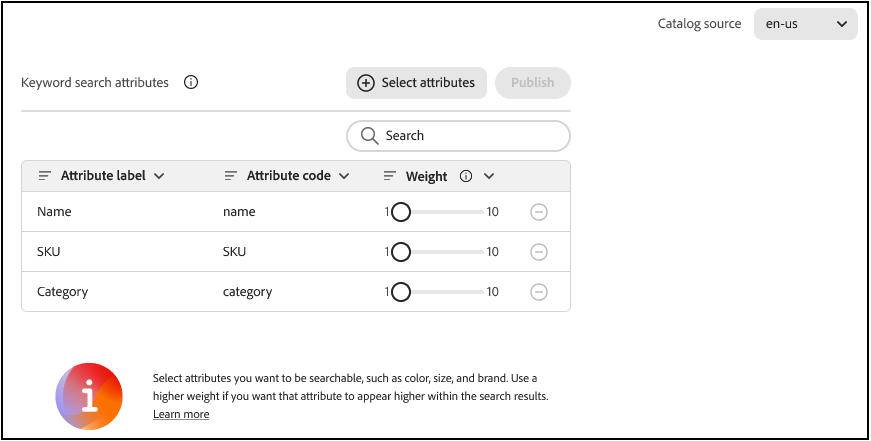
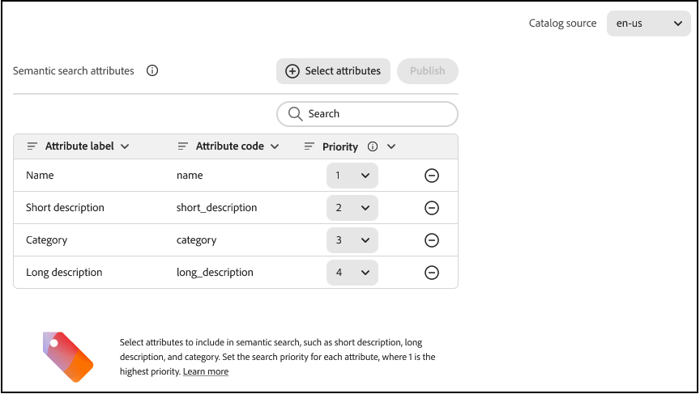

# Settings

Use the *Settings* workspace to configure search and product discovery for your storefront. The following tabs are available:

- **Faceting** — Configure price range groups and intervals used as search filters.
- **Language** — Set the catalog language used for indexing and search.
- **Keyword search** — Configure keyword-based search settings.
- **Semantic search** — Enable and configure AI-powered semantic search (attributes, priority, and related options).

>[!BEGINTABS]

>[!TAB Faceting]

You can specify the number of price range groups and how price values are distributed among them. Each price range overlaps the previous group by one. For example, five groups with an interval of 20 creates the following price ranges: 0-20, 20-40, 40-60, 60-80, and >80. If there are not enough products in the catalog to fill all defined ranges, the display of the available groups is adjusted accordingly. For example: 0-20, 60-80, >80.

1. On the **Settings** workspace, select **Price faceting**, and do the following:
   - Enter the **Number of selections**, or price groupings to be available. Up to 100 price groupings can be defined.
   - Enter the **Interval value**, or price range for each group. The maximum value is 40,000,000.
1. Click **Save**.

   It takes about 15 minutes for the updated settings to be available in the storefront.

## Field descriptions

| Field | Description |
| --- | --- |
| Number of selections | Specifies the number of price range groupings that can be used as search filters in the storefront. Default value: 8, Maximum value: 100 |
| Interval value | Specifies the price range interval for each group. For example, five selections with an interval value of 20 creates five groupings of 0-20, 20-40, 40-60, 60-80, and >80. Default value: 5, Maximum value: 40,000,000 |

>[!TAB Language]

## Language

The Language setting tells [!DNL Adobe Commerce Optimizer] which language to expect when reading the catalog and writing the index. 

Languages have different sets of rules for grammar: how words are separated, verb tenses and word forms, for example.
The Language setting ensures that the correct set of rules are applied to the indexing mechanism.

Set the Language setting to the primary language of the catalog. When changing the language of the index, it can take from 5 to 60 minutes to reflect the change on the storefront, depending on the size and complexity of the catalog.

|Language|Code|
|----|----|
|Arabic|ar|
|Armenian|hy|
|Basque|eu|
|Bengali|bn|
|Brazilian|pt-br|
|Bulgarian|bg|
|Catalan|ca|
|Chinese (Simplified)|zh-cn|
|Chinese (Traditional)|zh-tw|
|Czech|cs|
|Danish|da|
|Dutch|nl|
|English|en|
|Estonian|et|
|Finnish|fi|
|French|fr|
|Galician|gl|
|German|de|
|Greek|el|
|Hindi|hi|
|Hungarian|hu|
|Indonesian|id|
|Irish|ga|
|Italian|it|
|Japanese (Katakana)|ja|
|Korean|ko|
|Latvian|lv|
|Lithuanian|lt|
|Norwegian|no|
|Persian|fa|
|Portuguese|pt|
|Romanian|ro|
|Russian|ru|
|Sorani|ku|
|Spanish|es|
|Swedish|sv|
|Turkish|tr|
|Thai|th|

>[!TAB Keyword search]

## Keyword search attributes

Keyword search matches shopper queries to product attributes using exact text. In this section, select which attributes are searchable and set a **Weight** for each so that matches in higher-weight attributes rank higher in search results.

1. On the **Settings** workspace, select the **[!UICONTROL Keyword search]** tab.
1. Optionally, select a **[!UICONTROL Catalog source]** at the top of the page. Keyword search attributes are configured per catalog source.
1. In the **Keyword search attributes** section, a table lists the selected attributes (if any). To add attributes, select **[!UICONTROL Select attributes]**.

   The **Select attributes for keyword search** dialog appears.

1. Select the product attributes to include in keyword search by selecting the checkbox for each attribute, then click **[!UICONTROL Add selected]**.

   The dialog closes and the selected attributes appear in the **Keyword search attributes** table.

1. Set the **[!UICONTROL Weight]** for each attribute using the slider.

   Weight controls how much the attribute influences search ranking. A higher weight makes matches in that attribute appear higher in search results. For example, if **Name** has a higher weight than **SKU**, a query that matches both will rank name matches higher.

1. To remove an attribute from keyword search, select the minus icon on that row.
1. When you are finished, click **[!UICONTROL Publish]**.

   The **Publish** button is enabled only when there are unsaved changes. After publishing, updated settings are applied to the catalog; indexing may take a few minutes to reflect on the storefront.

### Field descriptions

| Field | Description |
| --- | --- |
| Attribute label | The display name of the product attribute. |
| Attribute code | The system code for the attribute. |
| Weight | Importance of this attribute in keyword search ranking. Higher values make matches in this attribute rank higher in results. Use the slider to set the weight. |

>[!TIP]
>
>Include attributes shoppers often search by, such as product name, SKU, category, color, size, and brand. Start with name and SKU, then add attributes based on how your customers search.

>[!TAB Semantic search]

## Semantic search

Semantic search uses AI to understand the meaning and intent behind a shopper's search query, not just exact keyword matches. This helps shoppers find relevant products even when they use natural language, synonyms, or descriptive phrases that don't exactly match your product catalog.

### Benefits

Enabling semantic search can improve your store's search performance in several key ways:

- **Reduced zero-results searches** - Shoppers find products even when using terms not in your catalog
- **Better natural language understanding** - Queries like "dress for beach wedding" or "leather recliner for media room" return relevant results
- **Automatic synonym handling** - No need to manually create synonyms for similar terms like "couch/sofa" or "pants/trousers"
- **Improved conversion rates** - More relevant results lead to higher search-to-cart conversion
- **Enhanced customer satisfaction** - Shoppers can search using natural expressions rather than guessing exact product terms

### How it works

Semantic search uses AI and natural language processing to understand the contextual meaning of search queries and match them to products based on semantic similarity rather than just text matching. For example:

- A search for "leather couch" returns products labeled as "leather sofa"
- "Spring dress" finds seasonal dresses even without the word "spring" in the catalog
- "Shoes for trail running" surfaces products described as "off-road sneakers"
- "Brakepad" finds products listed as "brake pad" (compound word variations)

Traditional keyword search fails when shoppers add descriptive words that don't exist in your catalog. Semantic search overcomes this limitation by understanding the overall intent of the search phrase.

### Enable semantic search

In this section, select which product attributes to use for semantic search. Learn which [attributes are recommended](#recommended-attributes-for-semantic-search) for semantic search.

>[!NOTE]
>
>Before enabling semantic search, ensure you understand the [performance impacts](#performance-impact) described below, especially if you have a large catalog.

1. On the **Settings** workspace, select the **[!UICONTROL Semantic search]** tab.
1. Optionally, select a **[!UICONTROL Catalog source]** at the top of the page. Semantic search attributes are configured per catalog source.
1. In the **Semantic search attributes** section, a table lists the selected attributes (if any). To add attributes, select **[!UICONTROL Select attributes]**.

   The **Select attributes for semantic search** dialog appears.

1. Select the product attributes to include in semantic search by selecting the checkbox for each attribute, then click **[!UICONTROL Add selected]**.

   The dialog closes and the selected attributes appear in the **Semantic search attributes** table.

1. Set the **[!UICONTROL Priority]** for each attribute.

   Priority sets the importance of each attribute in semantic search. A priority of `1` is highest; that attribute is searched first.

1. To remove an attribute from semantic  search, select the minus icon on that row.
1. When you are finished setting the priority, click the **[!UICONTROL Publish]** button.

   The **Publish** button is enabled only when there are unsaved changes. After publishing, updated settings are applied to the catalog; indexing may take a few minutes to reflect on the storefront.

### Field descriptions

| Field | Description |
| --- | --- |
| Attribute label | The display name of the product attribute. |
| Attribute code | The system code for the attribute. |
| Priority | Importance of this attribute in semantic search ranking. A priority of `1` is highest; that attribute is searched first. |

### Recommended attributes for semantic search

Not all product attributes are appropriate for semantic search. Use semantic search for descriptive text fields like:

- Product name
- Description
- Category
- Marketing attributes (for example, style, use case, occasion)

Avoid using semantic search for:

- SKU and part numbers
- UPC/EAN codes
- Identifiers and technical codes
- Numeric-only fields

>[!TIP]
>
>Start with product name and description, then add additional attributes based on how your customers search.

### Performance impact

Semantic search adds AI processing to your search operations. This includes:

**Indexing:**

- Incremental product updates process normally with minimal delay.
- Full reindex operations take longer (noticeable for catalogs with 10,000+ products).
- Reindexing happens in the background; your storefront continues using the current index with no downtime.

**Search speed:**

- Individual search queries may take slightly longer (typically 15-20% increase in response time).
- For most stores, this difference is not noticeable to shoppers.
- Example: A query taking 180ms may take 210ms with semantic search enabled.

### Best practices

**Optimize your product data:**

- Use clear, descriptive product names and descriptions.
- Include common use cases and occasions in product descriptions.
- Add relevant attributes that describe how products are used.
- Avoid overly technical jargon unless your audience expects it.

**Monitor and measure:**

- Track your zero-results search rate before and after enabling.
- Monitor search-to-cart conversion rates.
- Review common search queries to identify gaps in your catalog data.

**Start conservatively:**

- Begin with **Fallback only** mode to minimize impact.
- Test with your most common search queries.
- Expand to **Hybrid search** once you validate the results quality.

**Relationship with synonyms:**

- Semantic search reduces but does not eliminate the need for synonyms.
- Keep brand-specific or highly technical synonyms you've already created.
- Use semantic search to handle general language variations automatically.

### Troubleshooting

**Search results seem less relevant after enabling semantic search:**

1. Check which search mode is selected—try switching modes.
1. Verify which attributes are configured for semantic search.
1. Review whether SKUs or identifiers are incorrectly included in semantic search fields.
1. Consider whether your product descriptions need improvement.

**Searches for product codes return unexpected results:**

- Ensure SKU, part numbers, and product codes are NOT configured as semantic search attributes
- These should use exact keyword matching only

**Performance is slower than expected:**

- Large catalogs (50,000+ products) may experience more noticeable delays
- Consider using **Fallback only** mode for better performance
- Ensure your catalog has completed initial indexing

**Zero-results rate hasn't improved:**

- Review your most common zero-results queries
- Improve product descriptions to include more natural language terms
- Ensure semantic search is enabled for your primary descriptive attributes

<!--

### Advanced configuration

For merchants with specific technical requirements, additional configuration options are available:

**Search retrieval parameters:**

Customize how many semantic results are retrieved and evaluated:

- **Number of candidates** - How many potential matches to evaluate (default: 50, max: 500)
- **Number of results** - How many semantic results to include (default: 10, max: 100)

Higher values improve recall but increase search latency. Recommended for large catalogs where precision is critical.

**Result relevance threshold:**

Set a minimum similarity score for semantic matches:

- **Minimum similarity** - Threshold for including semantic results (default: 0.7, range: 0.0-1.0)

Higher values return only strong semantic matches. Lower values cast a wider net but may include less relevant products. The optimal threshold depends on your catalog and product data quality.

**Reranking window size:**

When using **Reranking** mode, specify how many top results to reorder:

- **Rerank window** - Number of top search results to semantically reorder (default: 100, max: 500)

Larger windows improve relevance across more results but increase processing time.

>[!NOTE]
>
>These advanced settings require careful tuning. Start with defaults and adjust based on search analytics and customer feedback.

**Technical considerations:**

- Semantic matching always attempts to return results even when relevance is low. Setting a similarity threshold helps but may still return unexpected results for very ambiguous queries.
- Product identifier searches (like "ISBN 123-xyz-def") may return seemingly random results if identifier fields are included in semantic search. Always exclude identifier fields from semantic search configuration.
- Compound queries mixing search terms with filters (like "dresses under $50") currently work best when the filter portion matches configured filterable attributes.
- Configurations are done per catalog source not catalog view.

**Info about feeds API vs semantic UI**

- Initial update of semantic search fields in attribute metadata can be performed either via UI or feeds API.
   - In case of feeds API, semantic search fields can be configured during attribute creation.
   - In case of semantic UI, attribute needs to have been created before hand.
- When attribute metadata has been updated using semantic UI, it cannot be updated from feeds API (just the semantic search fields).
 
-->

>[!ENDTABS]
