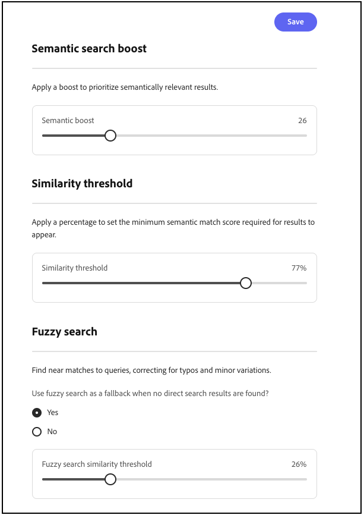

# Settings

Use the *Settings* workspace to configure search and product discovery for your storefront. The following tabs are available:

- **Price facets** — Configure price range groups and intervals used as search filters.
- **Language** — Set the catalog language used for indexing and search.
- **Advanced search** — Enable semantic search and fuzzy search, and tune semantic boost and similarity thresholds.

>[!BEGINTABS]

>[!TAB Price facets]

## Price facets {#price-facets}

You can specify the number of price range groups and how price values are distributed among them. Each price range overlaps the previous group by one. For example, when you use five groups with an interval of 20, you get price ranges such as 0-20, 20-40, 40-60, 60-80, and >80. If there are not enough products in the catalog to fill all defined ranges, the display of the available groups is adjusted accordingly. For example: 0-20, 60-80, >80.

**To configure price facets:**

1. On the **Settings** workspace, select **[!UICONTROL Facets]**.
1. In the **Price facet** section, do the following:
   - Enter the **[!UICONTROL Number of selections]**, or price groupings to be available. Up to 100 price groupings can be defined.
   - Enter the **[!UICONTROL Interval value]**, or price range for each group. The maximum value is 40,000,000.
1. Click **[!UICONTROL Save]**.

   It takes about 15 minutes for the updated settings to be available in the storefront.

### Field descriptions

| Field | Description |
| --- | --- |
| Number of selections | Specifies the number of price range groupings that can be used as search filters in the storefront. Default value: 8, Maximum value: 100 |
| Interval value | Specifies the price range interval for each group. For example, five selections with an interval value of 20 yield groupings of 0-20, 20-40, 40-60, 60-80, and >80. Default value: 5, Maximum value: 40,000,000 |

>[!TAB Language]

## Language {#language}

The Language setting tells [!DNL Adobe Commerce Optimizer] which language to expect when reading the catalog and writing the index.

Languages have different sets of rules for grammar: how words are separated, verb tenses and word forms, for example.
The Language setting ensures that the correct set of rules is applied to the indexing mechanism.

Set the Language setting to the primary language of the catalog. When you change the language of the index, it can take from 5 to 60 minutes for the change to appear on the storefront, depending on the size and complexity of the catalog.

|Language|Code|
|----|----|
|Arabic|ar|
|Armenian|hy|
|Basque|eu|
|Bengali|bn|
|Brazilian|pt-br|
|Bulgarian|bg|
|Catalan|ca|
|Chinese (Simplified)|zh-cn|
|Chinese (Traditional)|zh-tw|
|Czech|cs|
|Danish|da|
|Dutch|nl|
|English|en|
|Estonian|et|
|Finnish|fi|
|French|fr|
|Galician|gl|
|German|de|
|Greek|el|
|Hindi|hi|
|Hungarian|hu|
|Indonesian|id|
|Irish|ga|
|Italian|it|
|Japanese (Katakana)|ja|
|Korean|ko|
|Latvian|lv|
|Lithuanian|lt|
|Norwegian|no|
|Persian|fa|
|Portuguese|pt|
|Romanian|ro|
|Russian|ru|
|Sorani|ku|
|Spanish|es|
|Swedish|sv|
|Turkish|tr|
|Thai|th|

>[!TAB Advanced search]

## Advanced search {#advanced-search}

Use the **[!UICONTROL Advanced search]** tab to manage search in one place. [!DNL Adobe Commerce Optimizer] delivers a unified search experience on the storefront; you do not configure keyword search and semantic search separately for shoppers. **[!UICONTROL Enable semantic search]** is **on by default** for eligible English catalogs. Semantic search works alongside your existing configuration; [merchandising rules](./merchandising/rules/overview.md), [synonyms](./merchandising/synonyms/overview.md), [facets](./merchandising/facets/overview.md), boosts, and filters continue to apply. The system uses predefined catalog attributes automatically—you do not select or prioritize attributes in the Admin. No storefront or developer changes are required.

**To manage semantic search:**

1. On the **Settings** workspace, select the **[!UICONTROL Advanced search]** tab.
1. Under **[!UICONTROL Enable semantic search]**, confirm the control is **on**, or turn it **off** if you do not want semantic matching.
1. Click **[!UICONTROL Save]** if you change the toggle or tuning controls.

   Search results update after indexing completes. For a medium-sized catalog, indexing can take up to half an hour. For large catalogs with millions of products, it can take a few hours.

### Optional tuning

After semantic search is enabled, you can adjust the following on the same tab:

- **[!UICONTROL Semantic boost]** — Apply a boost to prioritize semantically relevant results in ranking. Raise the value when semantic matches should weigh more heavily in the result set; lower it when results feel too broad.
- **[!UICONTROL Similarity threshold]** — Set the minimum similarity score (as a percentage) for a semantic match. Lower values return more results (higher recall) but may include weaker matches. Higher values return fewer, tighter matches (higher precision).

   >[!NOTE]
   >
   > Semantic search is supported for **English** catalogs only. Selecting another language on the **[Language](#language)** tab turns off **[!UICONTROL Enable semantic search]**.

- **[!UICONTROL Fuzzy search]** — Turn **on** to find near matches for search queries, which helps correct typos and minor variations.
- **[!UICONTROL Fuzzy search similarity threshold]** — Set the minimum similarity (as a percentage) required for fuzzy matches to appear. Lower thresholds return more approximate matches; raise the threshold if fuzzy results feel too broad.

For benefits, validation guidance, best practices, troubleshooting, and limitations, see [Semantic search](setup/semantic-search.md).

### Field descriptions

| Control | Description |
| --- | --- |
| Enable semantic search | When **on**, search uses meaning and context alongside keyword matching. Predefined catalog attributes are used automatically; no attribute setup is required in the Admin. Enabled by default for [!DNL Adobe Commerce Optimizer] customers. |
| Semantic boost | Boost applied to prioritize semantically relevant results in ranking. |
| Similarity threshold | Minimum similarity score (percentage) for a semantic match. Lower values favor recall; higher values favor precision. |
| Fuzzy search | When **on**, search finds near matches for queries (for example, typos and minor variations). |
| Fuzzy search similarity threshold | Minimum similarity (percentage) fuzzy matches must meet to appear in results. |

>[!ENDTABS]
