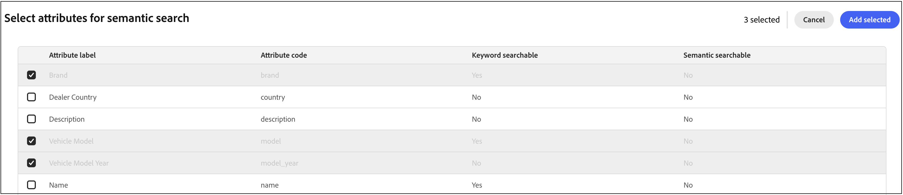

# Semantic search

Semantic search uses AI to understand the meaning and intent behind a shopper's search query, not just exact keyword matches. This helps shoppers find relevant products even when they use natural language, synonyms, or descriptive phrases that don't exactly match your product catalog.

Configure semantic search on the **[!UICONTROL Semantic search]** tab in the [*Settings*](../settings.md) workspace. Use this topic for benefits, procedures, recommended attributes, performance impact, best practices, troubleshooting, and limitations.

## Semantic search benefits

Enabling semantic search can improve your store's search performance in several key ways:

- **Reduced zero-results searches:** Shoppers find products even when they use terms that are not in your catalog.
- **Better natural language understanding:** Queries like "dress for beach wedding" or "leather recliner for media room" return relevant results.
- **Automatic synonym handling:** You do not need to manually create synonyms for similar terms like "couch/sofa" or "pants/trousers."
- **Improved conversion rates:** More relevant results lead to higher search-to-cart conversion.
- **Enhanced customer satisfaction:** Shoppers can search using natural expressions rather than guessing exact product terms.

## How semantic search works

Semantic search uses AI and natural language processing to understand the contextual meaning of search queries and match them to products based on semantic similarity rather than just text matching. For example:

- A search for "leather couch" returns products labeled as "leather sofa."
- "Spring dress" finds seasonal dresses even without the word "spring" in the catalog.
- "Shoes for trail running" surfaces products described as "off-road sneakers."
- "Brakepad" finds products listed as "brake pad" (compound word variations).

Traditional keyword search fails when shoppers add descriptive words that do not exist in your catalog. Semantic search overcomes this limitation by understanding the overall intent of the search phrase.

## Enable semantic search

In this section, you select which product attributes to use for semantic search. Learn which [attributes are recommended](#recommended-attributes-for-semantic-search) for semantic search.

### Performance impact {#performance-impact}

Semantic search adds AI processing to your search operations. For large catalogs, this can have a performance impact in the following areas:

**Indexing**

- Incremental product updates process normally with minimal delay.
- Full reindex operations take longer (noticeable for catalogs with 10,000+ products).
- Reindexing happens in the background; your storefront continues using the current index with no downtime.

**Search speed**

- Individual search queries may take slightly longer (typically 15-20% increase in response time).
- For most stores, this difference is not noticeable to shoppers.
- Example: A query that takes 180ms may take 210ms with semantic search enabled.

**To enable semantic search:**

1. On the **[!UICONTROL Settings]** workspace, select the **[!UICONTROL Semantic search]** tab.
1. In the **Semantic search attributes** section, a table lists the selected attributes (if any). To add attributes, select **[!UICONTROL Select attributes]**.

   The **Select attributes for semantic search** dialog appears.

1. Select the product attributes to include in semantic search by selecting the checkbox for each attribute, then click **[!UICONTROL Add selected]**.

   

   The dialog closes and the selected attributes appear in the **Semantic search attributes** table.

   

1. Click and drag an attribute row to a different location in the table to set the **[!UICONTROL Priority]** for each attribute.

   Priority sets the order in which text from attributes are concatenated. Since the model truncates tokens beyond a certain limit, setting a priority ensures that tokens from the most important attributes are not truncated.

1. To remove an attribute from semantic search, select the minus icon on that row.
1. When you are finished setting the priority, click the **[!UICONTROL Publish]** button.

   The **[!UICONTROL Publish]** button is enabled only when there are unsaved changes. After publishing, updated settings are applied to the catalog; indexing may take a few minutes to reflect on the storefront.

### Field descriptions

| Field | Description |
| --- | --- |
| Attribute label | The display name of the product attribute. |
| Attribute code | The system code for the attribute. |
| Priority | Importance of this attribute in semantic search ranking. A priority of `1` is highest; that attribute is searched first. |

### Recommended attributes for semantic search {#recommended-attributes-for-semantic-search}

Not all product attributes are appropriate for semantic search. Use semantic search for descriptive text fields like:

- Product name
- Description
- Category
- Marketing attributes (for example, style, use case, occasion)

Avoid using semantic search for:

- SKU and part numbers
- UPC/EAN codes
- Identifiers and technical codes
- Numeric-only fields
- Measurements and structured values such as weight or base price when they do not add descriptive text for search (only attribute values are indexed)
- Lengthy text attributes — Values from all semantic attributes are concatenated in **priority** order into one string used to generate vector embeddings. Text beyond the model's current effective length (about 256 tokens; longer input is truncated) may not be encoded reliably, so very long fields add little benefit. Token limits and the underlying model can change in a future release.

>[!TIP]
>
>Start with product name and description, then add additional attributes based on how your customers search.

## Best practices

**Optimize your product data:**

- Use clear, descriptive product names and descriptions.
- Include common use cases and occasions in product descriptions.
- Add relevant attributes that describe how products are used.
- Avoid overly technical jargon unless your audience expects it.

**Tune semantic behavior (Advanced search tab):**

- On the **[Advanced search](../settings.md#advanced-search)** tab, adjust **[!UICONTROL Semantic boost]** when you want semantically relevant products to rank higher or lower relative to other matches—increase the boost if semantic matches should carry more weight in the result set, decrease it if results feel dominated by broad semantic matches.
- Use **[!UICONTROL Similarity threshold]** to control how strict semantic matching must be before products appear: a **higher** threshold keeps stronger semantic matches and can reduce noisy or weak matches; a **lower** threshold allows more borderline matches when shoppers still need options.
- Configure **[!UICONTROL Fuzzy search]** on the same tab when you want near matches (for example, typos) as a fallback when direct search returns no results, and tune **[!UICONTROL Fuzzy search similarity threshold]** so fuzzy results stay relevant.

**Monitor and measure:**

- Track your zero-results search rate before and after enabling.
- Monitor search-to-cart conversion rates.
- Review common search queries to identify gaps in your catalog data.

**Start conservatively:**

- Test with your most common search queries.

**Relationship with synonyms:**

- Semantic search reduces but does not eliminate the need for synonyms.
- Keep brand-specific or highly technical synonyms you've already created.
- Use semantic search to handle general language variations automatically.

## Troubleshooting

Use the following table to diagnose common issues and what to try next.

| Issue | What to do |
| --- | --- |
| Search results seem less relevant after enabling semantic search | Verify which attributes are configured for semantic search. Review whether SKUs or identifiers are incorrectly included in semantic search fields. Improve product descriptions where needed. Increase the **[!UICONTROL Similarity threshold]** on primary and fuzzy (fallback) search; see [Advanced search](../settings.md#advanced-search) for control descriptions. |
| Searches for product codes return unexpected results | Do not configure SKU, part numbers, or product codes as semantic search attributes. Match product codes with exact keyword search instead of semantic search. |
| Performance is slower than expected | Expect more noticeable delays on very large catalogs (for example, 50,000+ products). Ensure that your catalog has completed initial indexing. |
| Zero-results rate hasn't improved | Review your most common zero-results queries. Improve product descriptions to include more natural language terms. Ensure that semantic search is enabled for your primary descriptive attributes. |

## Limitations {#semantic-search-limitations}

Keep the following constraints in mind when you use semantic search:

- **Catalog language:** Semantic search is available only for **English**-language catalogs.
- **Attribute limit:** You can assign up to **20** product attributes to semantic search.
- **Combined text and embeddings:** Attribute values are concatenated in priority order for embedding; input beyond the model's current effective length (about 256 tokens) is truncated, and token limits or the model may change in a future release. For guidance on long fields, see [Recommended attributes for semantic search](#recommended-attributes-for-semantic-search).
- **Data space cleanup:** If a **data space cleanup** runs on your project, existing semantic search attribute configuration is cleared. Reconfigure attributes using catalog ingestion or the **[!UICONTROL Semantic search]** tab after product metadata has resynced, and verify the configuration if it does not match what you expect after sync.
