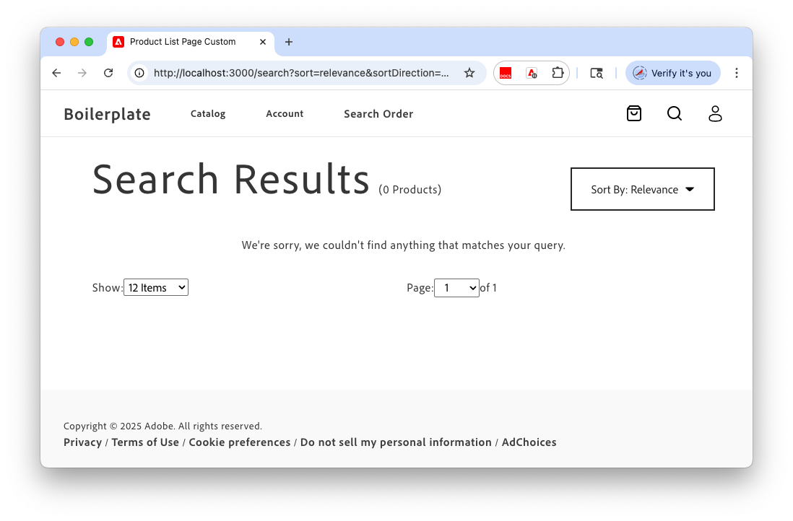

# Set up your storefront

Fast track the storefront set up process by using the Site Creator tool to set up your storefront code repository and Document Author enviroment for managing storefront content. 

## Prerequisites

* Ensure that you have a GitHub account (github.com) that can create repositories and is configured for local development.

* Learn about the concepts and workflow to develop Commerce storefronts on Adobe Edge Delivery Services by reviewing the [Overview](https://experienceleague.adobe.com/developer/commerce/storefront/get-started) in the Adobe Commerce Storefront documentation.

* Set up your development environment


### Set up your development environment

Install Node.js and the Sidekick browser extension required to develop and test your [!DNL Adobe Commerce Optimizer] storefront on Edge Delivery Services.

#### Install Node.js

Install Node Version Manager (NVM) and the required Node.js version (22.13.1 LTS).

1. Install Node Version Manager (NVM).

    ```bash
    curl -ohttps://raw.githubusercontent.com/nvm-sh/nvm/v0.40.1/install.sh | bash
    ```

1. Install Node.js and NPM. For more information, see [Node.js](https://nodejs.org/en/).

    ```bash
    nvm install 22
    ```

    ```bash
    npm install -g npm
    ```

1. Install the 
1. Verify the installation.

   ```bash
   npm -v
   ```

>[!TIP]
>
>Additional resources for extending and customizing your [!DNL Adobe Commerce Optimizer] solution are available through [App Builder for Adobe Commerce](https://experienceleague.adobe.com/en/docs/commerce-learn/tutorials/adobe-developer-app-builder/introduction-to-app-builder) and [API Mesh for Adobe Developer App Builder](https://experienceleague.adobe.com/en/docs/commerce-learn/tutorials/adobe-developer-app-builder/api-mesh/getting-started-api-mesh). For access and usage information, contact your Adobe account representative.

#### Install Sidekick

Install the Sidekick browser extension to edit, preview, and publish content to the storefront. See [Sidekick installation instructions](https://www.aem.live/docs/sidekick#installation).


### Workflow overview

1. **[Create your site](#step-1-create-your-site)**
1. **[Preview demo site](#step-7-preview-demo-site)**–Connect to your storefront site to view the sample content and data from the [!DNL Adobe Commerce Optimizer] demo instance.
1. **[Develop in your local environment](#step-8-develop-in-your-local-environment)**–Install the required dependencies. Start the local development server, and update the storefront configuration to connect to the [!DNL Adobe Commerce Optimizer] instance that Adobe provisioned for you.
1. **[Next steps](#next-steps)**–Learn more about managing and displaying content and data in the storefront.

## Set up your storefront

Use the site creator tool to create a new site with the following resources:

* **Site** links to the storefront landing page with the boilerplate content.
* **Code** links to the repository with the storefront boilerplate code source files
* **Content** links to the Document Author environment where you can manage site content
* **Commerce Config** links to the `config.json` file where you can customize configuration settings that determine what content displays in the storefront.

Before you begin, make sure you have the following information: 

* Name of the GitHub organization to host the repository for the storefront boilerplate code
* The [Catalog Service endpoint](get-started.md#manage-an-instance) for your Adobe Commerce Optimizer instance

## Step 1: Create your storefront project

1. Open the [Site Creator tool](https://da.live/app/adobe-commerce/storefront-tools/tools/site-creator/site-creator)

   ![[!DNL Site Creator tool]](./assets/storefront-setup-site-creator.png){width="700" zoomable="yes"}

1. Complete the form:

   * Select **[!UICONTROL Create New Site (Code & Content)]**.
   * Enter your **[!UICONTROL GitHub Organization User Name]**.
   * Specify a **[!UICONTROL Site Name]**——this will be the name of the storefront code repository.
   * In the **[!UICONTROL Commerce GraphQL endpoint]** field, enter the Catalog endpoint for your Adobe Commerce Optimizer instance.
  
1. Create the repository with the storefront boilerplate code: Click **[!UICONTROL Create Site]**.

   When the repository is created, the Site Creator updates and prompts you to install the Code Sync app.

   ![[!DNL Install Code Sync app]](./assets/storefront-setup-site-creator.png){width="700" zoomable="yes"}

   >[!IMPORTANT]
   >
   >You must install the Code Sync app and register your repository before you can continue to complete the setup process. The site creation fails if you don't complete this step correctly.

1. Install the Code Sync app: Click **[!UICONTROL Install AEM Code Sync App]** to open the Code Sync installer in a new tab.
   
   * Select your GitHub organization, then click **[!UICONTROL Configure]**
   * In the Code Sync interface, select **[!UICONTROL Only select repositories]**.
   * Click the **[!UICONTROL Select respositories]** menu, choose the storefront code repository you created.
   * Click **[!UICONTROL Save]** to register your repository.

1. On the tab where the Site Creator is open, click **Continue** to add the boilerplate content to the Document Author environment.

   The Site Creator copies the storefront boilerplate content to the Document Author environment. This step takes a minute or two.

1. In the Site Details section, copy the links for your storefront project, so you can use them later.

   ![[!DNL Storefront setup complete]](./assets/storefront-setup-complete.png){width="700" zoomable="yes"}

1. Follow the steps to secure your site.

The rest of this tutorial provides the initial steps to preview your site and develop in a local environment.
For more detailed information, see the _[Adobe Commerce Storefront](https://experienceleague.adobe.com/developer/commerce/storefront/)_ documentation.

## Step 2: Add sample data

Adobe provides a GitHub repository with sample data and tools to help you learn and test Adobe Commerce Optimizer features.

The sample data is based on the [Carvelo business scenario](./use-case/admin-use-case.md) and includes:

* Product catalog with automotive parts
* Multiple price books and pricing scenarios
* Catalog views and policies for different dealers
* Complete end-to-end workflow examples

You can check to see if the sample data has already been loaded by visiting the Data Sync page. 


If the product count is 0, follow the steps to load the sample data.

**Load the sample data:**

1. Access the [Sample Catalog Data Ingestion](https://github.com/adobe-commerce/aco-sample-catalog-data-ingestion) GitHub repository.

1. Follow the setup instructions in the repository's README file to complete the following tasks:

   * Set up your environment
   * Complete the data ingestion process
   * Create catalog views and policies using the sample data 
   * Verify the data ingestion by checking the Catalog Service data on the [Data Sync](./setup/data-sync.md) page

## Step 3: Update the storefront configuration file

When you use the Site Creator tool, the system creates a default storefront configuration file (`config.json`) that is
connected to your Adobe Commerce Optimizer instance.

+++Example of default configuration file

Your repository is named `aco-storefront` and your organization is `early-adopter`, the updated URL should look like this:

```json
{
  "public": {
    "default": {
      "commerce-core-endpoint": "https://na1-sandbox.api.commerce.adobe.com/{{instance ID}}/graphql",
      "commerce-endpoint": "https://na1-sandbox.api.commerce.adobe.com/{{instance ID}}/graphql",
      "headers": {
        "all": {
          "Store": "default"
        },
        "cs": {
          "AC-View-ID": "YOUR_HEADER_VALUE",
          "AC-Price-Book-ID": "YOUR_HEADER_VALUE",
          "AC-Source-Locale": "YOUR_HEADER_VALUE"
        }
      },
      "analytics": {
        "base-currency-code": "USD",
        "environment": "Testing",
        "environment-id": "Fwus6kdpvYCmeEdcCX7PZg",
        "store-code": "YOUR_STORE_CODE",
        "store-id": "YOUR_STORE_ID",
        "store-name": "YOUR_STORE_NAME",
        "store-url": "YOUR_STORE_URL",
        "store-view-code": "YOUR_STORE_VIEW_CODE",
        "store-view-id": "YOUR_STORE_VIEW_ID",
        "store-view-name": "YOUR_STORE_VIEW_NAME",
        "website-code": "YOUR_WEBSITE_CODE",
        "website-id": "YOUR_WEBSITE_ID",
        "website-name": "YOUR_WEBSITE_NAME"
      },
      "plugins": {
        "picker": {
          "rootCategory": "2"
        }
      }
    }
  }
}
```

+++


## Step 4: Preview demo site

Verify that both the sample content and the data from the Adobe Commerce Optimizer demo instance are displayed correctly.

* **Sample content** is served from the content folder in the Document Author environment. It includes the page layouts, banners, and labels for your site.
* **Sample data** is served from the [!DNL Adobe Commerce Optimizer] demo instance. Data includes product data with product attributes, images, product descriptions, and prices populated based on the header values specified in the storefront configuration file, `config.json`.

### Connect to your site to view sample content and data

1. View your site by navigating to `https://main--{SITE}--{ORG}.aem.live`.

   Replace `{ORG}` and `{SITE}` with the organization and name for your boilerplate repository.

   ![[!DNL ACO storefront site with boilerplate]](./assets/aco-storefront-site-boilerplate.png){width="700" zoomable="yes"}

   If the page returns a 404, verify the following in the config.json

   * The mountpoint in your `fstab.yaml` file points to the correct content URL: `https://content.da.live/{ORG}/{SITE}/`
   * The GitHub storefront code repository is registered with the [Code Sync app](https://github.com/apps/aem-code-sync/installations/select_target).
   * [Content has published tDocument Author environment using the demo content clone tool](#step-6%3A-add-content-documents-for-your-storefront).


1. View the sample catalog data coming from the Commerce Optimizer default instance.

   1. In the storefront header, click the magnifying glass to search for `tires`.

      ![[!DNL View product list page]](./assets/storefront-site-with-aco-data.png){width="675" zoomable="yes"}

   1. Press **Enter** to view the search results page.

      ![[!DNL View search results page]](./assets/storefront-with-aco-search-results-page.png){width="675" zoomable="yes"}

      The search results page components are defined by the `search` content document. The search results data is populated based on the storefront configuration in `config.json`.

   1. View the product details page by selecting any tire product on the page.

      ![[!DNL View product details page]](./assets/storefront-with-aco-pdp-page.png){width="675" zoomable="yes"}

      The product details page components are defined by the `default` content document in the `product` folder.

### Step 8: Develop in your local environment

In this section, you update the storefront configuration from your local development environment.

* Update the storefront configuration to connect to the GraphQL endpoint for the [!DNL Adobe Commerce Optimizer] instance that Adobe provisioned for you.
* Update the header values to retrieve data from your instance.

#### Start local development

1. In your IDE, checkout your main branch, and reset it to the last commit on the remote branch.

   ```shell
   git checkout main
   git reset --hard origin/main
   ```

1. Install the required dependencies.

   ```shell
   npm install
   ```

1. Install the [AEM Command Line Interface (CLI)](https://www.aem.live/developer/cli-reference).

   ```shell
   npm install -g @adobe/aem-cli
   ```

1. Clone your boilerplate repo.

   ```shell
   git clone https://github.com/{{ORG}}/{{SITE}}
   ```

1. Start the local development server.

   ```bash
   aem up
   ```

   The first page of your boilerplate storefront should be visible in your browser at `http://localhost:3000`.

   ![[!DNL Configure github repo to pull all branches from boilerplate repo]](./assets/aco-storefront-local-dev-env.png){width="700" zoomable="yes"}


#### Update the storefront configuration

Update the storefront configuration file and preview the changes in your local development environment.

1. In your IDE, update the storefront configuration to connect to the [!DNL Adobe Commerce Optimizer] instance that Adobe has provisioned for you.

   1. Open the `config.json` file.

   1. Update the following values using the endpoint for your [!DNL Adobe Commerce Optimizer] instance:

      * **`commerce-endpoint`**–Replace the existing value with your endpoint URL.

        ```json
        "commerce-endpoint": "https://na1-sandbox.api.commerce.adobe.com/{instance ID}/graphql"
        ```

      * **`ac-environment-id`**—Replace the existing value with the instance ID from your endpoint URL.

        ```json
        "ac-environment-id": "{instanceId}"
        ```

   1. Save the file.

      If your local preview is working correctly, the updates are applied to your local storefront.

1. Check the site to see the results of the configuration change.

   1. In the browser, navigate to `http://localhost:3000` and refresh the page.

   1. In the storefront header, click the magnifying glass to search for `tires`.

      {width="675" zoomable="yes"}

   1. Press **Enter** to display the Search Results page.

      {width="675" zoomable="yes"}

      The search doesn't return any results because the header values in your storefront configuration file are based on the default instance. Now that the configuration points to the [!DNL Adobe Commerce Optimizer] instance provisioned for you, those values are invalid.

### Next steps

See the [Storefront and Catalog Administrator end-to-end use case](./use-case/admin-use-case.md) to learn more about managing and displaying content and data in the storefront.

>[!MORELIKETHIS]
>
> See the [Adobe Commerce Storefront documentation](https://experienceleague.adobe.com/developer/commerce/storefront/) to learn more about updating site content and integrating with Commerce frontend components and backend data.
