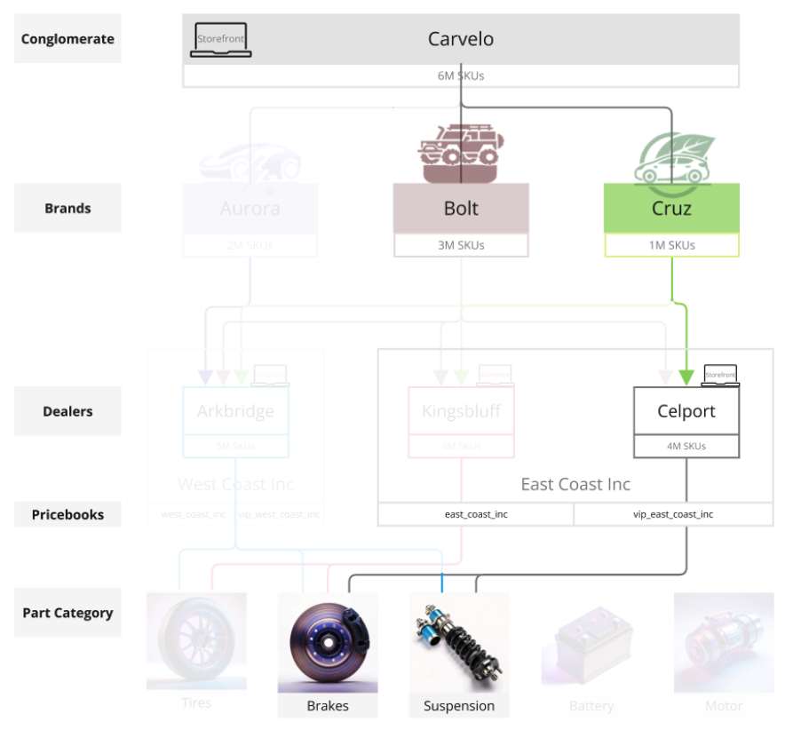
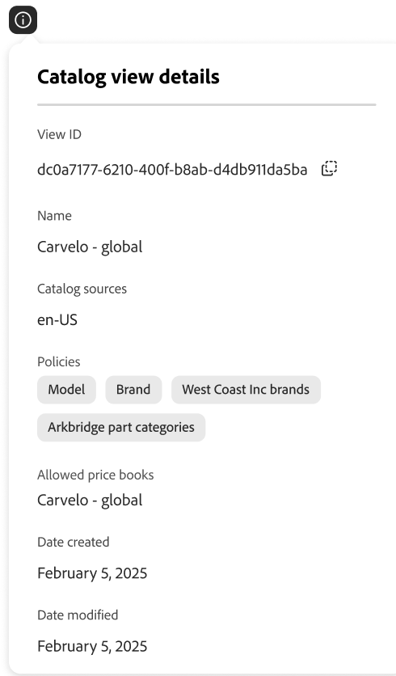

# Storefront and Catalog Administrator End-to-End Use Case

This use case is based on a fictitious automobile conglomerate called Carvelo Automobile, which has a complex operational setup. It demonstrates how to use [!DNL Adobe Commerce Optimizer] to manage a catalog that supports multiple brands, dealerships, and price books, while delivering a customized storefront experience.

## Prerequisites

This use case is designed for administrators and developers who want to learn how to set up a storefront and manage a catalog using [!DNL Adobe Commerce Optimizer]. It assumes that you have a basic understanding of [!DNL Adobe Commerce Optimizer] and its features.

**Estimated time to complete:** 45-60 minutes

### Required Setup

Before beginning this tutorial, ensure you have the following prerequisites in place:

- **Adobe Commerce Optimizer Instance**
  - Access to a test instance in Cloud Manager
  - See [Get Started](../get-started.md) for setup instructions

- **User Permissions**
  - Admin access to Adobe Admin Console
  - See [User Management](../user-management.md) for account setup
  - If you don't have access, contact your Adobe account representative.

- **Sample Data**
  - Carvelo Automobile catalog data loaded into your instance
  - Follow the instructions in the [Sample catalog data ingestion repository](https://github.com/adobe-commerce/aco-sample-catalog-data-ingestion)
  - You can delete sample data after completion using the included `reset.js` script

- **Storefront Environment**
  - Local development environment with Node.js
  - Storefront boilerplate project cloned and configured
  - See [Storefront setup](../storefront.md) for detailed instructions

## Let's get started

In this use case, you are working with the following:

1. [!DNL Adobe Commerce Optimizer] UI - Set up catalog views and policies to manage the complex catalog operational setup for the Carvelo use case.

1. Commerce Storefront - Render the storefront using the sample catalog data loaded into your [!DNL Adobe Commerce Optimizer] instance and the Commerce Storefront configuration files, `fstab.yaml` and `config.json`.

  >[!NOTE]
  >
  > Learn about storefront configuration files by reviewing the [Explore the boilerplate](https://experienceleague.adobe.com/developer/commerce/storefront/get-started/boilerplate-project/) topic in the Adobe Commerce Storefront documentation.

### ‌Key takeaways

By the end of this article, you will:

- Learn the fundamentals of [!DNL Adobe Commerce Optimizer] with its performant and scalable catalog data model.
- Learn how the catalog data model integrates with platform-agnostic storefront components built by Adobe.
- Learn how to use Adobe Commerce Optimizer catalog views and policies to create custom catalog views and data access filters, and send the data to an Adobe Commerce storefront powered by Edge Delivery.

## Business scenario – Carvelo Automobile

Carvelo Automobile is a fictitious automobile conglomerate with a complex operational setup.


In this diagram, you see that Carvelo sells automobile products of three brands. Each brand is a different child company:

- Aurora (electric vehicles)
- Bolt (SUVs)
- Cruz (hybrid)

It sells these brands through three dealers:

- Arkbridge
- Kingsbluff
- Celport

These dealers belong to two different parent dealership companies:

- West Coast Inc. (Arkbridge)
- East Coast Inc. (Kingsbluff, Celport)

Each company has two price books that are used to sell products at a specific price for different shoppers (base, VIP).

- `west_coast_inc` and `vip_west_coast_inc`
- `east_coast_inc` and `vip_east_coast_inc`

As you can see, this is a very complex business use case. With [!DNL Adobe Commerce Optimizer], a merchant can support a complex business structure using a single base catalog to syndicate data without catalog duplication, scale price books (30k+ price books), and deliver all of this data to an Edge Delivery Services storefront.

Now that you have an overview of the business use case, here is your objective as you work through this tutorial:

>[!BEGINSHADEBOX]

Carvelo wants to sell parts across its three brands (Aurora, Bolt, and Cruz) through the different dealerships (Arkbridge, Kingsbluff, and Celport). Carvelo wants to ensure that the dealerships have access to only the correct parts and prices per their respective licensing agreements.

Ultimately, Carvelo has two major goals:

1. Maintain a "global" website, which has all SKUs across all three brands.
1. Provide a path for dealerships to set up their own storefronts based on unique SKU visibility and prices for each SKU for each dealership. All while using a single base catalog, which eliminates catalog duplication.

>[!ENDSHADEBOX]

## 1. Access the [!DNL Adobe Commerce Optimizer] instance

Navigate to the URL for the Commerce Optimizer application that is pre-configured with the sample data. You can find the URL in the Commerce Cloud Manager from the instance details for your Commerce Optimizer project, or get it from your system administrator. (See [Access an instance](../get-started.md#access-an-instance).)

When you launch [!DNL Adobe Commerce Optimizer], you see the following:

![[!DNL Adobe Commerce Optimizer] UI](../assets/user-interface.png)

>[!NOTE]
>
>See the [overview](../overview.md) article to learn about key components of [!DNL Adobe Commerce Optimizer] UI.

In the left navigation, expand the _Store setup_ section and click **[!UICONTROL Catalog views]**. Notice that the Arkbridge and Kingsbluff dealerships already have catalog views created:


>[!NOTE]
>
>You can ignore the **Global** catalog view for now.

Click the info icon to review the catalog view details.

Arkbridge has the following policies:

- Brand
- Model
- West Coast Inc brands
- Arkbridge part categories

Kingsbluff has the following policies:

- Brand
- Model
- East Coast Inc brands
- Kingsbluff part categories

In the next section, you will create a catalog view and policies for the Celport dealership.

## 2. Create a policy and catalog view

Carvelo's commerce manager needs to set up a new storefront for a dealer called *Celport* that belongs to the *East Coast Inc* company. Celport will sell brakes and suspensions for the Bolt and Cruz brands.



Using [!DNL Adobe Commerce Optimizer], the commerce manager will:

1. Create a new policy called *Celport part categories* for Celport to sell only brake and suspension parts.
1. Create a new catalog view for the Celport storefront.

   This catalog view uses your newly created policy *Celport part categories* and the existing *East Coast Inc Brands* to ensure that Celport can sell only the Bolt and Cruz brands as part of the agreement with East Coast Inc. The Celport catalog view uses the `east_coast_inc` price book to support product pricing schedules that align with brand licensing agreements.
1. Update the commerce storefront configuration to use data from the Celport catalog view that you created.

At the end of this section, Celport will be up and running ready to sell Carvelo's products.

### Create a policy

Let's create a new policy called *Celport part categories* to filter the SKUs that the Celport dealer sells, which include brake and suspension parts.

1. In the left rail, expand the _Store setup_ section and click on **[!UICONTROL Policies]**.

1. Click **[!UICONTROL Create Policy]**.

    A new page displays to add the policy details.

1. Add the required details:

    **Name** = *Celport Part Categories*

1. Click **[!UICONTROL Add Filter]**.

    A dialog displays to add filter details.

1. Add the filter details:

    - **Attribute** = *part_category*
    - **Operator** = **IN**
    - **Value Source** = **STATIC**
    - **Value** = *brakes*
    - **Value** = *suspension*

    >[!IMPORTANT]
    >
    >Each attribute value must be entered separately. After entering a value, press **Enter** to add it to the filter configuration. Then, enter the next value. All values must match the SKU attribute name in the catalog exactly.

    To learn more about the difference between a STATIC and TRIGGER value source, see [value source types](../setup/policies.md#value-source-types).

1. In the **[!UICONTROL Filter details]** dialog, click **[!UICONTROL Save]**.

1. To enable the filter you just created, click the action dots (...) and select **Enable**.

1. Click **[!UICONTROL Save]**.

    >[!NOTE]
    >
    >If the **[!UICONTROL Save]** button is not active (blue), you might be missing the policy name. Click the pencil icon next to *New Policy* to add it.

1. Go back to the list of policies by clicking the back arrow.

    Your new *Celport part categories* policy appears in the list.

**To verify this step was completed correctly:**

- Policy appears in the policies list
- Policy status shows as enabled (green indicator)
- Filter details show "part_category IN (brakes, suspension)"
- Policy name is "Celport Part Categories"

### Create a catalog view

Create a new catalog view for the *Celport* dealer and link the following policies: *East Coast Inc brands* and *Celport Part Categories*.

1. In the left rail, expand the _Store setup_ section and click **[!UICONTROL Catalog views]**.

    Notice the existing catalog views: *Arkbridge*, *Kingsbluff*, and *Global*.

    

1. Click **[!UICONTROL Add catalog view]**.

1. Fill in catalog view details:

    - **Name** = *Celport*
    - **Catalog sources** = *en-US*
    - **Policies** (use dropdown) = *East Coast Inc Brands*; *Celport part categories*; *Brand*; *Model*
                            
1. Click **[!UICONTROL Add]** to create the catalog view.

    The Catalog views page updates to display the new catalog view.

    

1. Get the Celport catalog view ID.

    Click the information icon for the Celport catalog view on the **Catalog views** page.

    

    Copy and save the catalog view ID. You need this ID when you update the storefront configuration to deliver data to your new Celport catalog.

    **To verify this step was completed correctly:**
    - Catalog view name is "Celport"
    - Catalog view shows 4 associated policies
    - Catalog view ID is displayed and can be copied
    - Catalog source shows "en-US"

After you create the Celport catalog view and associated policies, the next step is to configure the storefront to use your new Celport catalog.

## 3. Update your storefront

The final piece of this tutorial involves updating the storefront that [you already created](#prerequisite) to deliver data to the new Celport catalog. In this section, you replace the catalog view ID in your storefront configuration file with the catalog view ID for Celport.

1. In your local development environment, open the folder where you cloned the GitHub repository with your storefront boilerplate configuration files.

1. In the root directory of the folder, open the `config.json` file.

   +++config.json code

   ```json
   {
    "public": {
      "default": {
      "commerce-core-endpoint": "https://www.aemshop.net/graphql",
      "commerce-endpoint": "https://na1-sandbox.api.commerce.adobe.com/Fwus6kdpvYCmeEdcCX7PZg/graphql",
      "headers": {
         "cs": {
            "ac-view-id": "9ced53d7-35a6-40c5-830e-8288c00985ad",
            "ac-price-book-id": "west_coast_inc",
            "ac-source-locale": "en-US"
           }
         },
         "analytics": {
            "base-currency-code": "USD",
            "environment": "Production",
            "store-id": 1,
            "store-name": "ACO Demo",
            "store-url": "https://www.aemshop.net",
            "store-view-id": 1,
            "store-view-name": "Default Store View",
            "website-id": 1,
            "website-name": "Main Website"
          }
       }
      }
   }
   ```

   Notice that the catalog view header includes the following values:

   - `commerce-endpoint`: `"https://na1-sandbox.api.commerce.adobe.com/Fwus6kdpvYCmeEdcCX7PZg/graphql"`
   - `ac-view-id`:`"9ced53d7-35a6-40c5-830e-8288c00985ad"`
   - `ac-price-book-id`: `"west_coast_inc"`
   - `ac-source-locale`: `"en-US"`

1. In the `commerce-endpoint` value, replace the tenant ID in the URL with the URL for your [!DNL Adobe Commerce Optimizer] instance.

   You can find the tenant ID in the URL for the Commerce Optimizer UI. For example, in the following URL, the tenant ID is `XDevkG9W6UbwgQmPn995r3`.

   ```text
   https://experience.adobe.com/#/@commerceprojectbeacon/in:XDevkG9W6UbwgQmPn995r3/commerce-optimizer-studio/catalog
   ```

1. Replace the `ac-view-id` value with Celport catalog view ID that you copied previously.

1. Replace the `ac-price-book-id` value with `"east_coast_inc"`.

   After you make these changes, your `config.json` file should look similar to the following, with the `ACO-tenant-id` and `celport-catalog-view-id` placeholders replaced with your values:

   ```json
   {
     "public": {
        "default": {
        "commerce-core-endpoint": "https://www.aemshop.net/graphql",
        "commerce-endpoint": "https://na1-sandbox.api.commerce.adobe.com/{{ACO-tenant-id}}/graphql",
        "headers": {
            "cs": {
                "ac-view-id": "{{celport-catalog-view-id}}",
                "ac-price-book-id": "east_coast_inc",
                "ac-source-locale": "en-US"
              }
            },
            "analytics": {
                "base-currency-code": "USD",
                "environment": "Production",
                "store-id": 1,
                "store-name": "ACO Demo",
                "store-url": "https://www.aemshop.net",
                "store-view-id": 1,
                "store-view-name": "Default Store View",
                "website-id": 1,
                "website-name": "Main Website"
             }
         }
     }
   }
   ```

1. Save the file.

   When you save the changes, you update the catalog configuration to use the Carvelo catalog view which has been configured to sell only brake and suspension parts.

## 4. Preview the storefront

Now that you have updated the storefront configuration to use the Celport catalog view, you can preview the storefront to see how it renders the catalog data.

1. Launch the storefront to view the Celport-specific catalog experience created by your storefront configuration.

   1. From the terminal window in your IDE, start your local storefront preview.

      ```shell
      npm start
      ```

      The browser opens to the local development preview at `http://localhost:3000`.

      If the command fails or the browser does not open, review the [instructions for local development](../storefront.md) in the Storefront setup topic.

1. In the browser, search for `brakes`, and press **Enter**.

   The storefront updates to display the product list page showing the brake parts.

   

    Click on a brake part image to view the product details with price information and note the product price information.

1. Search for `tires`, which is another part category available in the use case data on your [!DNL Adobe Commerce Optimizer] instance.

   

   Notice that no results are returned. This is because the Celport catalog view has been configured to sell only brake and suspension parts.

1. Experiment with updating your storefront configuration file (`config.json`).

   1. Change the `ac-view-id` and `ac-price-book` values.

     For example, you can change the catalog view ID to the Kingsbluff catalog view, and the price book ID to  `east_coast_inc`. You can see the parts categories available for Kingsbluff by reviewing the *Kingsbluff part categories* policy.

   1. Save the file.

      When you save the file, the local storefront preview updates automatically.

   1. Preview the changes in the browser by using the Search feature to find tire parts.

      Notice the different part types available and notice the prices assigned to the Kingsbluff catalog view.

    These experiments demonstrate the flexibility of Adobe Commerce Optimizer—you can quickly switch between different catalog views and price books to create customized shopping experiences for different audiences without duplicating your catalog data.

## Troubleshooting

If you encounter issues during this tutorial, try the following solutions:

### Policy Creation Issues

**Problem:** Save button is not active

- **Solution:** Ensure that the policy name is entered and all required fields are completed

**Problem:** Filter not working as expected

- **Solution:** Verify that the attribute name exactly matches the SKU attribute in your catalog

### Catalog View Issues

**Problem:** Catalog view not appearing in the list

- **Solution:** Verify that all associated policies are enabled and properly configured

### Storefront Configuration Issues

**Problem:** Storefront not loading

- **Solution:** Check that your tenant ID and catalog view ID are correctly entered in the config.json file

**Problem:** No products displaying

- **Solution:** Verify that the price book ID matches the one available in your Adobe Commerce Optimizer instance

**Problem:** Search returning no results

- **Solution:** Confirm that the catalog view policies allow the searched product category

For additional help, see the [Adobe Commerce Optimizer documentation](../overview.md) or contact Adobe support.

## Summary

In this tutorial, you successfully:

- Created a new policy to filter product categories for the Celport dealership
- Set up a catalog view with multiple policies to control product visibility
- Configured a storefront to use the new catalog view
- Verified the configuration by testing product visibility and pricing

## Next steps

To continue learning about Adobe Commerce Optimizer:

- Explore [merchandising features](../merchandising/overview.md) to personalize the shopping experience
- Learn about [advanced policy configurations](../setup/policies.md)
- Set up [additional catalog views](../setup/catalog-view.md) for other dealerships
- Review the [API documentation](https://developer.adobe.com/commerce/services/optimizer/) for programmatic catalog management
- Learn how to configure drop-in components for your Edge Delivery Services storefront to create custom storefront experiences for product discovery, recommendations, and other storefront capabilities. See the [Storefront documentation](https://experienceleague.adobe.com/developer/commerce/storefront/dropins/all/introduction/)
