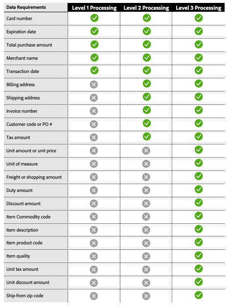

# Level 2 and level 3 processing

[!DNL Payment Services] offers advanced card processing capabilities to help merchants optimize their payment transactions and lower interchange fees. There are three levels of card processing available, each with different transaction data requirements.

## Data requirements per processing level

{width="500" zoomable="yes"}

[!DNL Payment Services] collects this data and provides detailed reporting of your payment transactions.

## Available processing levels by card network

{width="500" zoomable="yes"}

See [payment processing](https://developer.paypal.com/docs/checkout/advanced/processing/){target=_blank} in the PayPal Developer documentation for more information.

### Level 1

Level 1 is the most common, requires less information and therefore generally incurs higher interchange fees compared to transactions processed with Level 2 or Level 3 data, which are usually related to corporate and purchase credit cards.

### Level 2 and level 3

[!DNL Payment Services] merchants on Interchange Plus Plus (IC++) may qualify for Level 2/Level 3 processing if they supply additional transaction details to card networks and meet specific qualification criteria. These levels are particularly beneficial for merchants handling significant purchase or corporate card volumes, as they can result in significant cost savings. Supplying detailed Level 2 or Level 3 data can:

* Lower processing fees and optimize overall costs
* Prevent fraud, lowering processor risk
* Enhance transaction security

See [What is IC++?](https://www.paypal.com/us/brc/article/what-is-interchange-plus-plus){target=_blank} in PayPal developer documentation for more information.

## Level 2 and level 3 card payment transactions in [!DNL Payment Services]

To qualify for level 2 or level 3 processing, merchants must send the previous information, although it is the card networks who ultimately determine which level a transaction qualifies for when processing it.

See the [Payment processing FAQ](https://www.paypal.com/us/cshelp/article/ts2278?_ga=1.131773126.875104296.1712843492){target=_blank} in PayPal developer documentation for more information.

Level 2 and level 3 processing is disabled by default for [!DNL Payment Services] merchants at store level.

Level 2 and level 3 processing are available if you are already using IC++ pricing. To enable this feature you can do this via the [Command-line Interface (CLI](configure-cli.md).

>[!IMPORTANT]
>
>If you have any questions, please reach out to your [!DNL Payment Services] account manager.
