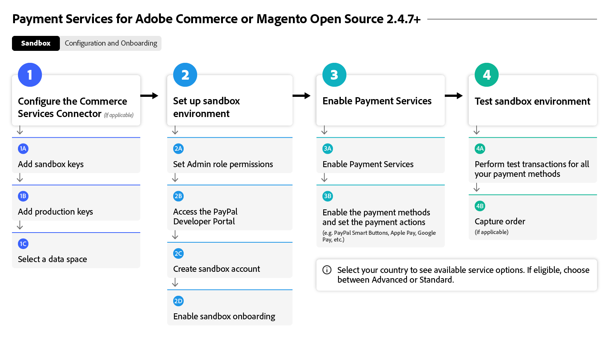

# Onboarding [!DNL Payment Services] flow

To get started using [!DNL Payment Services], you must complete a few onboarding steps. For accurate guidance, please select the Adobe Commerce option below that best aligns with your organization's instance and version.

This flow diagram shows the general process for onboarding [!DNL Payment Services] in all versions:

{width="700" zoomable="yes"}

See below for your specific Adobe Commerce version to onboard with [!DNL Payment Services].

## Help me find my instance and version

### Adobe Commerce or Magento Open Source | v2.4.7+

These flow diagrams show the general process for onboarding [!DNL Payment Services] with an Adobe Commerce or Magento Open Source newer than v2.4.7.

>[!BEGINTABS]

>[!TAB Sandbox]

This flow diagram shows the onboarding sandbox process with an Adobe Commerce or Magento Open Source newer than v2.4.7, where [!DNL Payment Services] is out-of-the-box with Adobe Commerce.

{width="700" zoomable="yes"}

**Onboarding steps for versions v2.4.7+ Part 1: Sandbox**

1. [Connect your instance](connect.md#configure-commerce-services) to Commerce Services. This connect must be completed only once per Commerce instance. [!BADGE PaaS only]{type=Informative tooltip="Applies to Adobe Commerce on Cloud projects only (Adobe-managed PaaS infrastructure)."}
1. [Set up the sandbox service](sandbox.md#enable-sandbox-testing) (or, alternatively, proceed to [enabling live payments](sandbox.md#enable-live-payments) if you've tested functionality in another environment) with a test PayPal payment processing account.
1. Test Payments in a [sandbox](sandbox.md#test-in-sandbox-environment) environment.

>[!TAB Production]

This flow diagram shows the production steps needed to enable [!DNL Payment Services].

{width="700" zoomable="yes"}

**Onboarding steps for versions v2.4.7+ Part 2: Production**

1. [Set [!DNL Payment Services] as your payment method](production.md#set-payment-services-as-payment-method), in sandbox mode, to start processing test payments.
1. [Request payments entitlement](production.md#request-payments-entitlement-from-adobe) to enable live onboarding.
1. [Complete merchant onboarding](production.md#complete-merchant-onboarding) to enable live payments for your Commerce websites.
1. [Get your [!DNL Payment Services] Merchant ID](production.md#configure-pricing-tier) and hand it to Sales to configure the correct pricing tier.
1. [Enable [!DNL Payment Services] in live mode](production.md#enable-live-payments) to begin processing live payments.
1. Test Payments, in both [sandbox](sandbox.md#test-in-sandbox-environment) and [production](production.md#test-in-production) environments.

>[!ENDTABS]

### Adobe Commerce or Magento Open Source | v2.4.0-2.4.6 [!BADGE PaaS only]{type=Informative tooltip="Applies to Adobe Commerce on Cloud projects only (Adobe-managed PaaS infrastructure)."}

These flow diagrams show the general process for onboarding [!DNL Payment Services] with Adobe Commerce or Magento Open Source versions 2.4.0 to 2.4.6. It is needed to download and install [!DNL Payment Services] to begin onboarding.

>[!BEGINTABS]

>[!TAB Sandbox]

This flow diagram shows the sandbox steps required for onboarding [!DNL Payment Services] with Adobe Commerce or Magento Open Source versions 2.4.0 to 2.4.6.

{width="700" zoomable="yes"}

**Onboarding steps for versions v2.4.0-2.4.6 Part 1: Sandbox**

1. [Install the [!DNL Payment Services] extension](install.md#get-payment-services) if necessary.
1. [Obtain API credentials](connect.md#obtain-api-credentials).
1. [Connect your instance](connect.md#configure-commerce-services) to Commerce Services. This connect must be completed only once per Commerce instance.
1. [Set up the sandbox service](sandbox.md#enable-sandbox-testing) (or, alternatively, proceed to [enabling live payments](sandbox.md#enable-live-payments) if you've tested functionality in another environment) with a test PayPal payment processing account.
1. Test Payments in a [sandbox](sandbox.md#test-in-sandbox-environment) environment.

>[!TAB Production]

This flow diagram shows the general process for enabling [!DNL Payment Services] in a production environment with Adobe Commerce or Magento Open Source versions 2.4.0 to 2.4.6.

{width="700" zoomable="yes"}

**Onboarding steps for versions v2.4.0-2.4.6 Part 2: Production**

1. [Set [!DNL Payment Services] as your payment method](production.md#set-payment-services-as-payment-method), in sandbox mode, to start processing test payments.
1. [Request payments entitlement](production.md#request-payments-entitlement-from-adobe) to enable live onboarding.
1. [Complete merchant onboarding](production.md#complete-merchant-onboarding) to enable live payments for your Commerce websites.
1. [Get your [!DNL Payment Services] Merchant ID](production.md#configure-pricing-tier) and hand it to Sales to configure the correct pricing tier.
1. [Enable [!DNL Payment Services] in live mode](production.md#enable-live-payments) to begin processing live payments.
1. Test Payments, in both [sandbox](sandbox.md#test-in-sandbox-environment) and [production](production.md#test-in-production) environments.

>[!ENDTABS]

>[!NOTE]
>
>If you do not configure your Commerce Services in the Admin (Part 1), you cannot set up sandbox or live payments.

>[!MORELIKETHIS]
>
> * [Troubleshoot [!DNL Payment Services] installation](https://experienceleague.adobe.com/docs/commerce-knowledge-base/kb/troubleshooting/payments/payservices-install.html?lang=en)
> * [PayPal sandbox account not verified](https://experienceleague.adobe.com/docs/commerce-knowledge-base/kb/troubleshooting/payments/payservices-paypal-acct.html)
> * [Delayed [!DNL Payment Services] report data](https://experienceleague.adobe.com/docs/commerce-knowledge-base/kb/troubleshooting/payments/payservices-report-info-delayed.html)
> * [Test credit card fails with PayPal when processing payments in a Sandbox environment](https://experienceleague.adobe.com/docs/commerce-knowledge-base/kb/troubleshooting/payments/payservices-cc-sandbox-failure.html?lang=en)
> * [Disable the [!DNL Payment Services] extension](https://experienceleague.adobe.com/en/docs/commerce-on-cloud/user-guide/configure-store/extensions#manage-extensions-1)