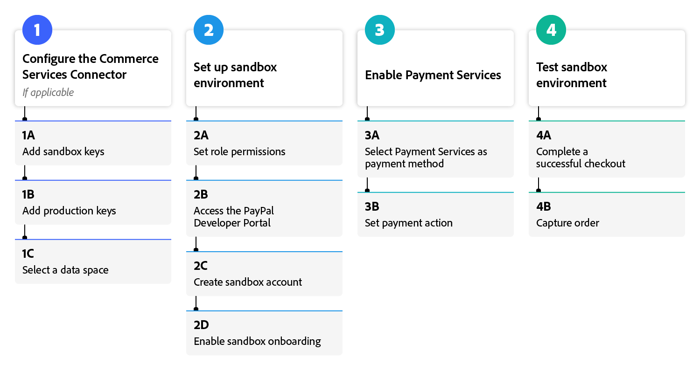

# Onboarding [!DNL Payment Services] flow

To get started using [!DNL Payment Services], you must complete a few onboarding steps. For accurate guidance, please select the Adobe Commerce option below that best aligns with your organization's instance and version.

>[!BEGINSHADEBOX]

**Help me find my instance and version**

{width="500" zoomable="yes"}

>[!ENDSHADEBOX]

## Adobe Commerce or Magento Open Source | v2.4.7+

>[!BEGINTABS]

>[!TAB Sandbox]

This flow diagram shows the general process for onboarding [!DNL Payment Services] with an Adobe Commerce or Magento Open Source newer than v2.4.7.

{width="700" zoomable="yes"}

[Learn more](https://helpx.adobe.com/legal/product-descriptions/payment-services-for-Adobe-Commerce-and-Magento-Open-Source-On-demand-Services.html) about [!DNL Payment Services].

>[!TAB Production]

This flow diagram shows the general process for onboarding [!DNL Payment Services] with an Adobe Commerce or Magento Open Source older than v2.4.7.

{width="700" zoomable="yes"}

[Learn more](https://helpx.adobe.com/legal/product-descriptions/payment-services-for-Adobe-Commerce-and-Magento-Open-Source-On-demand-Services.html) about [!DNL Payment Services].

>[!ENDTABS]

## Adobe Commerce or Magento Open Source | v2.4.0-2.4.6

>[!BEGINTABS]

>[!TAB Sandbox]

This flow diagram shows the general process for onboarding [!DNL Payment Services] with an Adobe Commerce or Magento Open Source older than v2.4.7.

{width="700" zoomable="yes"}

[Learn more](https://helpx.adobe.com/legal/product-descriptions/payment-services-for-Adobe-Commerce-and-Magento-Open-Source-On-demand-Services.html) about [!DNL Payment Services].

>[!TAB Production]

This flow diagram shows the general process for onboarding [!DNL Payment Services] with an Adobe Commerce or Magento Open Source older than v2.4.7.

{width="700" zoomable="yes"}

[Learn more](https://helpx.adobe.com/legal/product-descriptions/payment-services-for-Adobe-Commerce-and-Magento-Open-Source-On-demand-Services.html) about [!DNL Payment Services].

>[!ENDTABS]

>[!NOTE]
>
>If you do not configure your Commerce Services in the Admin (step 3), you cannot set up sandbox or live payments.
