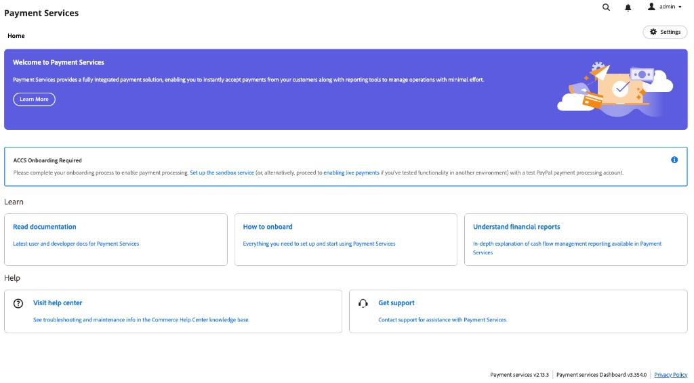

# [!DNL Payment Services] Home

[!DNL Payment Services] for Adobe Commerce and Magento Open Source provides a Home view with the information you need to set up and use the extension. The options at the top of Home depend on your deployment: Adobe Commerce on cloud or on-premises (PaaS), or [!DNL Adobe Commerce as a Cloud Service] or [!DNL Adobe Commerce Optimizer] (SaaS).

On the _Admin_ sidebar, go to **[!UICONTROL Sales]** > **[!UICONTROL [!DNL Payment Services]]**:

>[!BEGINTABS]

>[!TAB Adobe Commerce on cloud and on-premises]

{width="700" zoomable="yes"}

>[!TAB Adobe Commerce as a Cloud Service and Commerce Optimizer]

Until you complete onboarding, **[!UICONTROL Home]** will show **[!UICONTROL ACCS Onboarding Required]**. The notice links to [set up the sandbox service](sandbox.md#sandbox-onboarding) (with a test PayPal processing account) or to [enable live payments](production.md#enable-live-payments) if you already tested in another environment:

{width="700" zoomable="yes"}

After onboarding is complete (or on an already configured instance), **[!UICONTROL Home]** shows **[!UICONTROL Transactions]** with **[!UICONTROL View Report]** for the tabular report, plus the **[!UICONTROL Learn]** and **[!UICONTROL Help]** areas:

{width="700" zoomable="yes"}

>[!ENDTABS]

In this Home view, you can access _Home_, _Learn_ about [!DNL Payment Services], configure the extension _Settings_, or get _Help_. Use **[!UICONTROL View Report]** (SaaS) or the **[!UICONTROL Orders]** and **[!UICONTROL Payouts]** entry points (Adobe Commerce on cloud and on-premises) to open reporting; see [Reporting](reporting.md).

>[!NOTE]
>
>In [!DNL Adobe Commerce as a Cloud Service] and [!DNL Adobe Commerce Optimizer], the [!DNL Payment Services] **dashboard** exposes **selected** reporting only: you get the [Transactions](reporting.md) report from **[!UICONTROL Home]** (see the SaaS table below). The **[!UICONTROL Orders]** and **[!UICONTROL Payouts]** areas on Home---and their charts and linked reports---apply to Adobe Commerce on cloud and on-premises ([PaaS](#home)) only. For an overview of cash flow reports across deployments, see [Financial reporting](financial-reporting.md).

## Home

[!BADGE PaaS only]{type=Informative url="https://experienceleague.adobe.com/en/docs/commerce/user-guides/product-solutions" tooltip="Applies to Adobe Commerce on Cloud projects (Adobe-managed PaaS infrastructure) and on-premises projects only."}

| Field | Description |
|---|---|
| [!UICONTROL Orders] | These reports allow you to quickly view the payment status of your orders and identify any potential issues. |
| [!UICONTROL Payouts] | The Payouts reports show comprehensive payout information at-a-glance, allowing you full transparency into the payment amount, processed volume, and detailed reporting on the transaction level for financial reconciliation. |

[!BADGE SaaS only]{type=Positive url="https://experienceleague.adobe.com/en/docs/commerce/user-guides/product-solutions" tooltip="Applies to Adobe Commerce as a Cloud Service and Adobe Commerce Optimizer projects only (Adobe-managed SaaS infrastructure)."}

| Field | Description |
|---|---|
| [!UICONTROL Transactions] | Summarizes the Transactions report, which helps you understand the outcome of specific transactions. Click **[!UICONTROL View Report]** to open the grid of transactions (for example, order and PayPal transaction IDs, payment method, result, and response codes). See [Transactions report view](reporting.md#transactions-report-view). |

## Learn

| Field | Description |
|---|---|
| [!UICONTROL Read documentation] | See the latest user and developer docs for [!DNL Payment Services]. |
| [!UICONTROL How to onboard] | Find everything you need to set up and start using the [!DNL Payment Services] feature. |
| [!UICONTROL Understand financial reports] | In-depth explanation of cash flow management reporting in [!DNL Payment Services]. |

## Help

| Field | Description |
|---|---|
| [!UICONTROL Visit help center] | The [!DNL Adobe Commerce] Help Center has knowledge base articles about [!DNL Payment Services]. |
| [!UICONTROL Get support] | Visit the [!DNL Adobe Commerce] support portal for assistance with [!DNL Payment Services]. |

## Settings

In the Home view, click **[!UICONTROL Settings]**. See [[!DNL Payment Services] configuration](configure-admin.md) for more information.

The footer of the Payment Services area will show **Payment services** and **Payment services Dashboard** version labels—for example, when you gather details for support.
