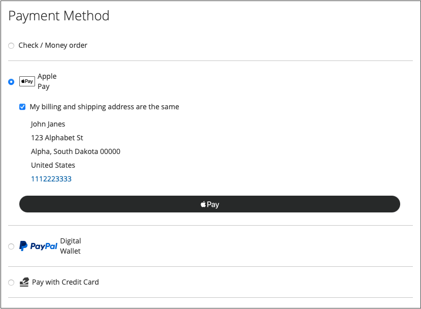

# Payment Options

With [!DNL Adobe Commerce] and [!DNL Magento Open Source] [!DNL Payment Services], you have multiple payment options available to you.

You can configure these payment options in [Home settings](payments-home.md) or [Store configuration](configure-admin.md) (recommended for legacy payment options or a multi-store setup).

There are different behaviors for each payment method depending on where you are in the checkout process:

* Product page---The product page for an item
* Mini cart---Available upon click of the cart icon when a product has been added to the carts
* Shopping cart---Available upon click of _View and edit cart_ from the mini-cart
* Checkout view---Available upon click of _Proceed to Checkout_ from mini-cart or shopping cart

>[!IMPORTANT]
>
>[!DNL Payment Services] onboarding must be completed before payments can be processed.

## Standard vs. Advanced Payments Experience

[!DNL Payment Services] provides **Advanced** (fully supported) and **Standard** (Express Checkout) payment options and onboarding flows, depending on the country in which you operate.

* **Advanced** - All available [payments options](../payment-services/payments-options.md) are available for current [fully supported countries](compatibility.md#standard-vs-advanced-payment-services-experience). During onboarding to enable live payments, select the [Advanced onboarding option](../payment-services/production.md#advanced-onboarding).

* **Standard** - A subset of payments options (Express Checkout)---PayPal credit and debit cards---is available for other available supported countries. [Credit card fields](#credit-card-fields) and [Apple Pay](#apple-pay-button) are not available for this onboarding option. During onboarding to enable live payments, select the [Standard onboarding option](../payment-services/production.md#standard-onboarding).

See [Enable [!DNL Payment Services] for production](../payment-services/production.md#complete-merchant-onboarding) for information about completing Advanced and Standard onboarding.

## [!UICONTROL Credit Card Fields]

[!UICONTROL Credit Card Fields] provide a simple and secure checkout for credit card or debit card payment methods. When a shopper checks out using credit card fields, they enter their name, billing address, and credit or debit card information to place their order. Their customer information is securely used during the purchase session to seamlessly guide them through the checkout flow.

{width="500" zoomable="yes"}

## [!UICONTROL Digital Wallets]

### [!DNL Fastlane] button

[!DNL Fastlane] offers a quick, secure, and hassle-free way to pay online. During a **Guest checkout**, you can securely store your card and shipping details for even faster purchases in the future.

* **Instant access for verified shoppers**: Recognize millions of returning customers and enable seamless payments in seconds.
* **Boost revenue**: Enhance conversion and authorization rates with more completed purchases.
* **Accelerate checkout**: Reduce friction with a secure, passwordless login experience.

When [!DNL Fastlane] is enabled, the [!UICONTROL Credit Card Fields] option is disabled by default.

>[!NOTE]
>
> In sandbox instances, Fastlane transactions do not show the shipping address in the Transaction Activity view.

See [Fastlane by PayPal](https://www.paypal.com/us/fastlane){target=_blank} topic for more information.

### [!DNL Apple Pay] button

With [!DNL Apple Pay], merchants can provide a secure, streamlined checkout experience (for up to 99 domains per merchant account), which can increase conversions.

* **Safari (macOS and iOS)** — the [!DNL Apple Pay] button autofills stored payment, contact, and shipping details directly from the customer's Apple device, both at the start of checkout (express) and on the final checkout page.
* **Chrome, Firefox, and Microsoft Edge** — shoppers can use [!DNL Apple Pay] both during **express checkout** and at the **final checkout step**. On desktop, a **QR code** is displayed so the shopper completes payment in the Apple Pay sheet on an **iPhone** (iOS 18 or later) using the Camera app to open the wallet flow.

See [What's new in Wallet and [!DNL Apple Pay]](https://developer.apple.com/videos/play/wwdc2024/10108/?time=35){target=_blank} (Apple Developer, WWDC24) for Apple's overview of this flow.

{width="500" zoomable="yes"}

When enabled, the [!DNL Apple Pay] button is visible from the product page, mini-cart, shopping cart, and checkout views. You can configure [!DNL Apple Pay] in the store configuration or the extension's Home.

Customers can **apply or remove a single cart price rule (coupon) code** during the [!DNL Apple Pay] express checkout.

>[!NOTE]
>
> The Apple Pay domain verification certificate is already included in the [!DNL Payment Services] code. Verify that the path `/.well-known/apple-developer-merchantid-domain-association` returns a 200 response code. See [PayPal developer documentation about Integrating with Apple Pay](https://developer.paypal.com/docs/checkout/apm/apple-pay/#download-and-host-sandbox-domain-association-file) for more information about the **Apple Pay Domain verification** certificate.

See [Settings](configure-admin.md#apple-pay) for more information.

#### Limitations for [!DNL Apple Pay] express

**Promotional codes in the [!DNL Apple Pay] pay sheet**

* Promotional codes entered in the [!DNL Apple Pay] pay sheet apply only to the express flow. They are not applied when [!DNL Apple Pay] is selected on the standard checkout page.
* Only **one** promotional code can be applied per [!DNL Apple Pay] pay sheet.
* There is no [!DNL Apple Pay] review page; the shopper completes the purchase directly from the pay sheet.
* If the shopper closes and reopens the [!DNL Apple Pay] pay sheet, the previously entered promotional code is not remembered — only the discount amount remains reflected in the totals.

**Non-Safari browsers**

* [!DNL Apple Pay] buttons do not render on Android devices in either the express or standard checkout flow.
* For **virtual products**, the [!DNL Apple Pay] pay sheet still prompts for a shipping address. The address is used as a best-effort estimate of the billing address to calculate totals, because Apple does not provide the billing address until the shopper authorizes the payment.

### [!DNL Google Pay] button

By integrating [!DNL Google Pay] into your checkout experience, merchants can collect saved payment, contact, and shipping information from the shopper's Google Account, offering a convenient, streamlined checkout across supported browsers and apps.

[!DNL Google Pay] is only available in certain countries or regions and on certain devices. See [[!DNL Google Pay] documentation](https://developer.paypal.com/docs/checkout/apm/google-pay/#link-googlepayintegration) for more information.

{width="500" zoomable="yes"}

When enabled, the [!DNL Google Pay] button is visible from the product page, mini-cart, shopping cart, and checkout views. See [Settings](configure-admin.md) for more information.

[!DNL Google Pay] **express** checkout can show **shipping methods in the Google Pay sheet**, support an optional **review** step (configure **[Skip Review](configure-admin.md#google-pay)**), and include a **promotional code** field during checkout.

>[!NOTE]
>
> The [!DNL Google Pay] API can only be used on websites in a secure context. See [Troubleshooting](https://developers.google.com/pay/api/web/support/troubleshooting) documentation for more information.

#### Limitations for [!DNL Google Pay] express

**Shipping in the pay sheet**

* The **shipping-in-sheet** behavior (client-side shipping callback) is available only when **[!UICONTROL Skip Review]** is set to `Yes` in [Google Pay configuration](configure-admin.md#google-pay).

**Promotional codes in the [!DNL Google Pay] pay sheet**

* Promotional codes entered in the [!DNL Google Pay] pay sheet apply only to the express flow. They are not applied when [!DNL Google Pay] is selected on the standard checkout page.
* Only **one** promotional code can be applied per [!DNL Google Pay] pay sheet, even if your store allows multiple coupons per order. (Multiple coupons remain supported in the standard cart and checkout.)
* Promotional codes cannot be applied to gift card products.
* The promotional code field is **not supported on Android devices**.
* Codes added in the [!DNL Google Pay] pay sheet can only be removed from the pay sheet — not from the Commerce cart page.
* On Adobe Commerce 2.4.4–2.4.6, the discount line in the [!DNL Google Pay] pay sheet may show no value due to a platform limitation.
* On Adobe Commerce 2.4.7, the discount value may not appear in the [!DNL Google Pay] pay sheet for some products (primarily downloadable products) due to a platform limitation in the GraphQL response.
* If an automatic [cart price rule](https://experienceleague.adobe.com/docs/commerce-admin/marketing/promotions/cart-rules/price-rules-cart.html) applies (for example, "$50 off when spending over $200"), it is combined with any code the shopper applies in the pay sheet. The totals shown in the [!DNL Google Pay] pay sheet may differ from the order summary as a result.

### [!DNL PayPal Payment Buttons]

[!DNL PayPal payment buttons], which use PayPal to complete a purchase, stores your shopper's shipping address, billing addresses, and payment details for later use. Shoppers can use any payment method previously stored or offered by PayPal.

{width="350" zoomable="yes"}

You can configure [!UICONTROL PayPal payment buttons] in the store configuration or the [!DNL Payment Services] Home.

Learn about availability of payment methods by country in PayPal's [Payment methods documentation](https://developer.paypal.com/docs/checkout/payment-methods/).

#### [!DNL PayPal] button

Customers can check out with ease and confidence using the PayPal button.

The [!DNL PayPal] button is visible from the product page, mini-cart, shopping cart, and checkout views.

#### [!DNL Venmo] button

Customers can check out using the [Venmo](https://venmo.com/) button.

The [!DNL Venmo] button is visible from the product page, mini-cart, shopping cart, and checkout views.

#### PayPal Debit or Credit card button

Customers can check out using the PayPal Debit or Credit card button.

The PayPal Debit or Credit card button is visible from the checkout page.

This option can be used to present a debit or credit card payment option to your shoppers with a PayPal-hosted button as an alternative to a credit card integration.

#### [!DNL Pay Later] button

Offer your customers short-term, interest-free payments, and other financing options so that they can buy now and pay later with the [!DNL Pay Later] button.

The [!DNL Pay Later] button is visible from the product page, mini-cart, shopping cart, and checkout views.

See information about the [Pay Later offers](https://developer.paypal.com/docs/checkout/pay-later/us/) in the PayPal Developer documentation. Use the **Country or region** dropdown to select a region of interest.

Learn how to disable or enable the [!DNL Pay Later] messaging by updating the [Settings](configure-admin.md#paypal-payment-buttons) configuration.

##### Optional. Configure Pay Later Messaging

**Configure messaging** for [Pay Later](configure-admin.md#paypal-payment-buttons) allows merchants to modify the default styles for this payment option. If you set **[!UICONTROL Display Pay Later Message]** to `Yes` in your [Settings](configure-admin.md#paypal-payment-buttons) configuration, a **[!UICONTROL Configure Messaging]** modal button is displayed so you can set the styles for the **[!UICONTROL PayPal Pay Later messaging]**.

{width="500" zoomable="yes"}

### Server-side shipping callbacks for PayPal payment buttons

PayPal, Pay Later, and Venmo payment methods use a [server-side shipping callback](https://developer.paypal.com/docs/multiparty/checkout/standard/customize/shipping-module/) that enables PayPal to communicate directly with your Commerce instance to retrieve shipping options and calculate totals in real time.

This server-side approach allows [!DNL Payment Services] to skip the order confirmation pop-up, providing a faster, streamlined purchase experience. Because shipping costs and taxes are calculated dynamically through callbacks, the buyer sees accurate totals directly in the PayPal or Venmo review page.

>[!NOTE]
>
>The callback endpoint must be publicly available and respond within 5 seconds. If the response time exceeds this limit, PayPal displays an error message in the pop-up. See [Test on local development environments](test-validate.md#test-on-local-development-environments) for information about testing these payment methods locally.

### Use only PayPal payment buttons

To quickly get your store into production mode, you can configure _only_ PayPal payment buttons (Venmo, PayPal, and so on.)---instead of also using the PayPal credit card payment option.

This allows you to:

* Provide various payment options for your customers, including Venmo and PayPal payment buttons, with the option to turn off PayPal hosted card fields and use an existing credit card provider.
* Use your existing credit card provider for credit card payments, while also using PayPal's other payment options.
* Use PayPal's payment buttons in regions where PayPal does not support credit cards as a payment option.

To **capture payments with _only_ PayPal payment buttons (_not_ the PayPal credit card payment option)**:

1. Ensure that your store is [in production mode](configure-admin.md#general-configuration).
1. [Configure the desired PayPal payment buttons](configure-admin.md#paypal-payment-buttons) in Settings.
1. Turn _Off_ the **[[!UICONTROL Show PayPal Credit and Debit card button]](configure-admin.md#paypal-payment-buttons)** option in the _[!UICONTROL Payment buttons]_ section.

To **capture payments with your existing credit card provider _and_ PayPal payment buttons**:

1. Ensure that your store is [in production mode](configure-admin.md#general-configuration).
1. [Configure the desired PayPal payment buttons](configure-admin.md#paypal-payment-buttons).
1. Turn _Off_ the **[[!UICONTROL PayPal Show Credit and Debit card button]](configure-admin.md#paypal-payment-buttons)** option in the _[!UICONTROL Payment buttons]_ section.
1. Turn _Off_ the **[[!UICONTROL Show on checkout page]](configure-admin.md#credit-card-fields)** option in the _[!UICONTROL Credit card fields]_ section and use your [existing credit card provider account](https://experienceleague.adobe.com/docs/commerce-admin/stores-sales/payments/payments.html#payments).

## Local Payment Methods

Local Payment Methods (LPMs) provide support for region-specific and local payment methods, such as bank transfers and localized payment solutions, alongside existing card-based options. Merchants can enable or disable available LPMs directly within the Commerce configuration. LPMs expand Adobe's payment capabilities, support European market needs, improve checkout localization, and help increase conversion, merchant adoption, and buyer satisfaction.

Available LPMs include:

| Payment Method | Countries | Currency |
|----------------|-----------|----------|
| Bancontact | Belgium | EUR |
| BLIK | Poland | PLN |
| eps | Austria | EUR |
| iDEAL | Netherlands | EUR |
| MyBank | Italy | EUR |
| Przelewy24 | Poland | EUR, PLN |

LPMs are displayed to customers based on their billing address and their website's base currency. A payment method appears only when both conditions match the payment method's requirements.

See [Local Payment Methods configuration](configure-admin.md#local-payment-methods) for more information.

## Express checkout buttons

To encourage a faster checkout experience, express payment options are available at the beginning of the checkout flow. Customers can complete their purchase using PayPal, PayPal Pay Later, Venmo, Apple Pay, or Google Pay.

Once enabled, express checkout buttons are displayed at the beginning of the checkout process, providing a faster path to purchase for customers who prefer digital wallet payment methods.

To enable express checkout buttons, configure each payment method individually:

* **PayPal and Pay Later**: Enable **[!UICONTROL Show buttons at start of checkout]** in [PayPal payment buttons](configure-admin.md#paypal-payment-buttons) settings.

* **Apple Pay**: Enable **[!UICONTROL Show Apple Pay at start of checkout]** in [Apple Pay](configure-admin.md#apple-pay) settings.

* **Google Pay**: Enable **[!UICONTROL Show Google Pay at start of checkout]** in [Google Pay](configure-admin.md#google-pay) settings.

>[!NOTE]
>
>Payment method availability depends on the buyer's location. For sandbox testing, use [Buyer's country](sandbox.md#buyers-country) configuration to simulate different regions. For example, Venmo is available only in the US. Pay Later is available in the US and UK.

## Checkout Options

With [!DNL Payment Services], you can configure the checkout experience for Adobe Commerce to best suit your shoppers' preferences and behaviors. Features such as credit card [vaulting](vaulting.md) and order auto-voiding ensure a seamless, hassle-free transaction for your customers.

With Adobe Commerce and Magento Open Source [!DNL Payment Services], you have multiple checkout experiences available to you. There are different behaviors for each payment method depending on where you are in the checkout process:

* Product page—--The product page for an item

* Mini cart—--Available upon click of the cart icon when a product has been added to the carts

* Shopping cart--—Available upon click of View and edit cart from the mini-cart

* Checkout view—--Available upon click of Proceed to Checkout from mini-cart or shopping cart

### Order recalculation

When a customer enters the checkout flow from the mini-cart, shopping cart, or product page, they are directed to an order review page where they can see the selected shipping address in a PayPal popup window. After the customer selects the shipping method, the order amount is recalculated appropriately and the customer can see shipping costs and taxes.

When a customer enters the checkout flow from the checkout page, the system is already aware of the shipping address and final calculated amount, and totals are appropriately represented.

Tax holidays, shipping costs, and sales tax can vary widely from location to location. After [!DNL Payment Services] receives the shipping address and rate, it quickly recalculates all applicable costs and display them appropriately during the last stages of checkout.

Learn about availability of payment methods by country in [PayPal's Payment methods](https://developer.paypal.com/docs/checkout/payment-methods/){target=_blank} documentation.
