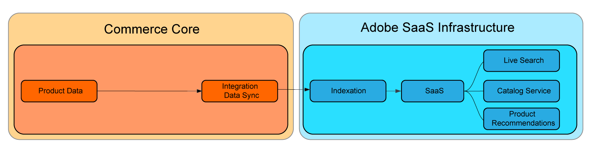

# SaaS Price Indexing

SaaS pricing indexing optimizes site performance by offloading resource-intensive tasks—like indexation and price calculation—from the Commerce application to Adobe's Cloud infrastructure. This approach enables merchants to rapidly scale resources to accelerate price indexation times and deliver price updates to the storefront and connected Commerce services more quickly.

The following diagram shows the indexing data flow to SaaS services when Commerce is using the [price indexing](https://experienceleague.adobe.com/en/docs/commerce-operations/configuration-guide/cli/manage-indexers) process included in the Commerce application:


With SaaS price indexing enabled, the data flow changes. Price indexing is performed using [Commerce SaaS data export](../data-export/sync-overview.md).



All merchants can benefit from using SaaS price indexing, but merchants that have projects with the following characteristics can realize the greatest gains:

* **Constant price changes**–Merchants that require repeated changes to their prices to meet strategic goals such as frequent promotions, seasonal discounts, or inventory markdowns.
* **Multiple websites and/or customer groups**–Merchants with shared product catalogs across multiple websites (domains/brands) and/or customer groups.
* **Many unique prices across websites or customer groups**–Merchants with extensive shared product catalogs that contain unique prices across websites or customer groups. Examples include B2B merchants that have pre-negotiated prices or brands with different pricing strategies.

## Use SaaS Price Indexing

SaaS price indexing is enabled automatically when you install Adobe Commerce Services. It supports price calculation for all built-in Adobe Commerce product types.

### Requirements

* Adobe Commerce 2.4.4+

### Prerequisites

* One of the following Commerce Services must be installed with the latest version of the Commerce extension:

  * [Catalog Service](../catalog-service/overview.md)
  * [Live Search](../live-search/overview.md)
  * [Product Recommendations](../product-recommendations/guide-overview.md)


>[!NOTE]
>
>If needed, the default price indexer in the Commerce application can be disabled using the [Catalog Adapter](catalog-adapter.md).

## Synchronize prices with SaaS price indexing

After enabling SaaS price indexing for Adobe Commerce, update prices on the Storefront and in Commerce Services by synchronizing the new feeds:

```bash
bin/magento saas:resync --feed=scopesCustomerGroup
bin/magento saas:resync --feed=scopesWebsite
bin/magento saas:resync --feed=prices
```

## Monitor data feed sync status {#monitor-sync-progress}

Use the **Data Feed Sync Status** page to track the export status of all data feeds to ensure data consistency. This page alerts you to issues that occur during the export process so that you can resolve them quickly. A "Success" status indicates that data has been exported and will be available in connected Commerce services when the data sync process completes.

For details, see [Manage synchronization](../data-export/data-sync-manage.md) in the _SaaS Data Export Guide_.

## Prices for custom product types

Price calculations are supported for custom product types such as base price, special price, group price, catalog rule price, and so on.

If you have a custom product type that uses a specific formula to calculate the final price, you can extend the behavior of the product price feed.

1. Create a plugin on the `Magento\ProductPriceDataExporter\Model\Provider\ProductPrice` class.

   ```xml
   <config xmlns:xsi="http://www.w3.org/2001/XMLSchema-instance"
           xsi:noNamespaceSchemaLocation="urn:magento:framework:ObjectManager/etc/config.xsd">
       <type name="Magento\ProductPriceDataExporter\Model\Provider\ProductPrice">
           <plugin name="custom_type_price_feed" type="YourModule\CustomProductType\Plugin\UpdatePriceFromFeed" />
       </type>
   </config>
   ```

1. Create a method with the custom formula:

   ```php
   class UpdatePriceFromFeed
   {
       /**
       * @param ProductPrice $subject
       * @param array $result
       * @param array $values
       *
       * @return array
       */
       public function afterGet(ProductPrice $subject, array $result, array $values) : array
       {
           // Override the output $result with your data for the corresponding products (see original method for details)
           return $result;
       }
   }
   ```
